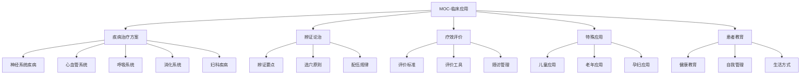
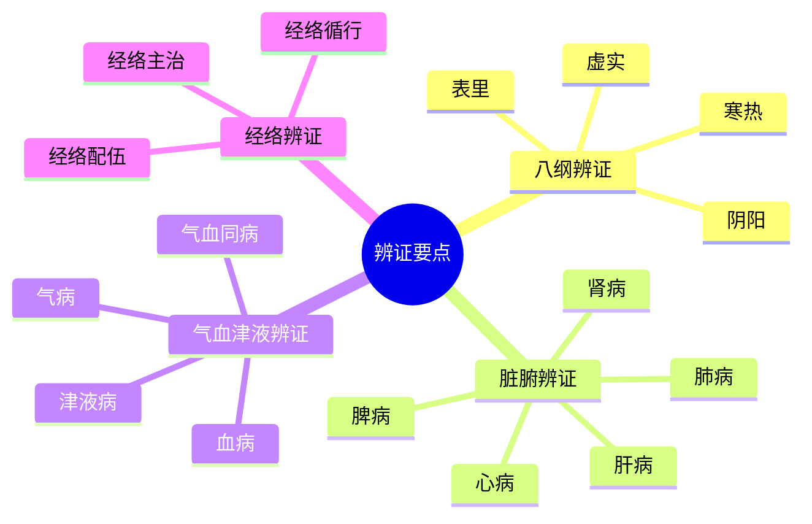
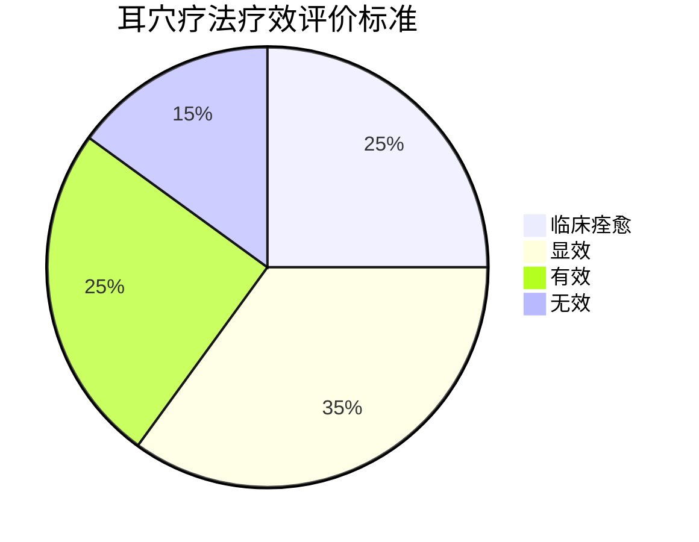
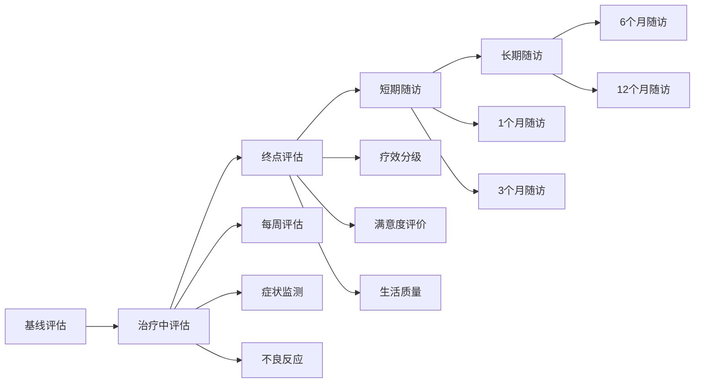
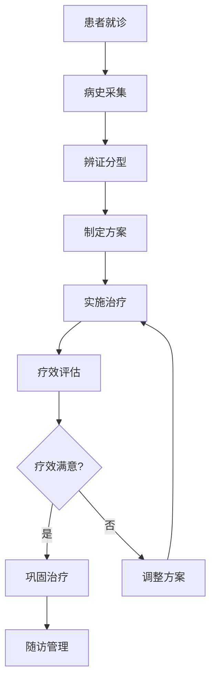

# 🗺️ MOC-临床应用

> 📍 **内容地图**：耳穴疗法临床应用与治疗方案 | 🔄 **最后更新**：2026-01-21

## 🧭 临床应用导航

## 📚 核心治疗方案

### 🧠 神经系统疾病
| 疾病 | 核心穴位 | 疗效 | 等级 |
|------|----------|------|------|
| [[失眠症耳穴治疗方案]] | 神门、心、肾、皮质下 | 85-95% | ⭐⭐⭐⭐⭐ |
| [[抑郁症耳穴治疗方案]] | 神门、心、肝、皮质下 | 75-85% | ⭐⭐⭐⭐ |
| [[焦虑症耳穴治疗方案]] | 神门、心、肾、肝 | 80-90% | ⭐⭐⭐⭐ |
| [[头痛耳穴治疗方案]] | 颞、额、枕、神门 | 75-85% | ⭐⭐⭐⭐ |
| [[癫痫耳穴治疗方案]] | 神门、心、肝、皮质下 | 60-70% | ⭐⭐⭐ |

### ❤️ 心血管系统疾病
| 疾病 | 核心穴位 | 疗效 | 等级 |
|------|----------|------|------|
| [[高血压耳穴治疗方案]] | 降压沟、心、肝、交感 | 70-80% | ⭐⭐⭐⭐ |
| [[冠心病耳穴治疗方案]] | 心、交感、皮质下 | 65-75% | ⭐⭐⭐ |
| [[心律失常耳穴治疗方案]] | 心、交感、神门 | 60-70% | ⭐⭐⭐ |
| [[低血压耳穴治疗方案]] | 升压点、心、肾上腺 | 70-80% | ⭐⭐⭐ |

### 🫁 呼吸系统疾病
| 疾病 | 核心穴位 | 疗效 | 等级 |
|------|----------|------|------|
| [[支气管哮喘耳穴治疗方案]] | 平喘、肺、肾、交感 | 75-85% | ⭐⭐⭐⭐ |
| [[慢性支气管炎耳穴治疗方案]] | 肺、气管、脾、肾 | 75-85% | ⭐⭐⭐⭐ |
| [[过敏性鼻炎耳穴治疗方案]] | 内鼻、外鼻、肺、肾上腺 | 80-90% | ⭐⭐⭐⭐ |
| [[咽炎耳穴治疗方案]] | 咽喉、肺、三焦、神门 | 75-85% | ⭐⭐⭐ |

### 🍽️ 消化系统疾病
| 疾病 | 核心穴位 | 疗效 | 等级 |
|------|----------|------|------|
| [[慢性胃炎耳穴治疗方案]] | 胃、脾、交感、神门 | 80-90% | ⭐⭐⭐⭐ |
| [[消化性溃疡耳穴治疗方案]] | 胃、十二指肠、交感、神门 | 75-85% | ⭐⭐⭐⭐ |
| [[便秘耳穴治疗方案]] | 大肠、直肠、交感、脾 | 80-90% | ⭐⭐⭐⭐ |
| [[腹泻耳穴治疗方案]] | 大肠、小肠、脾、肾 | 75-85% | ⭐⭐⭐ |

### 🤰 妇科疾病
| 疾病 | 核心穴位 | 疗效 | 等级 |
|------|----------|------|------|
| [[痛经耳穴治疗方案]] | 内生殖器、交感、肾、肝 | 90-95% | ⭐⭐⭐⭐⭐ |
| [[月经不调耳穴治疗方案]] | 内分泌、内生殖器、肾、肝 | 75-85% | ⭐⭐⭐⭐ |
| [[更年期综合征耳穴治疗方案]] | 内分泌、肾、心、神门 | 80-90% | ⭐⭐⭐⭐ |
| [[不孕症耳穴治疗方案]] | 内生殖器、肾、肝、内分泌 | 60-70% | ⭐⭐⭐ |

## 🎯 辨证论治体系

### 📋 辨证要点总览

### 🎨 选穴原则
1. **局部选穴** - 根据病变部位选择相应耳穴
2. **远端选穴** - 根据经络循行选择远端耳穴
3. **经验选穴** - 根据临床经验选择特效耳穴
4. **辨证选穴** - 根据辨证结果选择相应耳穴

### 🔄 配伍规律
- **主次配伍** - 主穴治疗核心症状，配穴改善伴随症状
- **表里配伍** - 表里经穴配合使用
- **脏腑配伍** - 根据脏腑生克关系配穴
- **阴阳配伍** - 平衡阴阳，调和机体

## 📊 疗效评价体系

### 📈 评价标准分级

### 📋 核心评价工具

#### 😴 睡眠相关评价
- **PSQI评分** - 匹兹堡睡眠质量指数
- **AIS评分** - 阿森斯失眠量表
- **ESS评分** - Epworth嗜睡量表

#### 💊 心理相关评价
- **HAMD评分** - 汉密尔顿抑郁量表
- **HAMA评分** - 汉密尔顿焦虑量表
- **SCL-90评分** - 症状自评量表

#### 🩸 疼痛相关评价
- **VAS评分** - 视觉模拟评分
- **McGill评分** - 麦吉尔疼痛问卷
- **NRS评分** - 数字等级评分

### 📅 随访管理流程

## 👥 特殊人群应用

### 👶 儿童应用指南
| 年龄特点 | 治疗特点 | 注意事项 |
|----------|----------|----------|
| **婴幼儿(0-3岁)** | 原则上不使用 | 皮肤娇嫩，难以配合 |
| **学龄前(3-6岁)** | 谨慎使用 | 必须时专业医师操作 |
| **学龄期(6-12岁)** | 可以使用 | 调整剂量，家长配合 |
| **青少年(12-18岁)** | 接近成人 | 接近成人剂量 |

**儿童常用治疗方案**：
- [[小儿遗尿耳穴治疗方案]]
- [[小儿厌食耳穴治疗方案]]
- [[小儿多动症耳穴治疗方案]]

### 👴 老年应用指南
| 生理特点 | 治疗调整 | 安全考虑 |
|----------|----------|----------|
| **皮肤脆弱** | 减少刺激强度 | 防止皮肤损伤 |
| **感觉减退** | 增强刺激强度 | 避免过度刺激 |
| **心血管功能下降** | 加强生命体征监测 | 防止心血管反应 |
| **代谢缓慢** | 延长治疗间隔 | 防止蓄积反应 |

**老年常用治疗方案**：
- [[老年失眠耳穴治疗方案]]
- [[老年高血压耳穴治疗方案]]
- [[老年骨关节病耳穴治疗方案]]

### 🤰 孕妇应用指南
| 孕期特点 | 穴位选择 | 安全要求 |
|----------|----------|----------|
| **孕早期** | 避免腹部穴位 | 防止流产 |
| **孕中期** | 相对安全 | 适度治疗 |
| **孕晚期** | 避免腰骶穴位 | 防止早产 |

**孕妇常用治疗方案**：
- [[孕吐耳穴治疗方案]]
- [[孕期失眠耳穴治疗方案]]
- [[孕期焦虑耳穴治疗方案]]

## 🎖️ 特色技术专题

### 🌟 重点疾病深度解析
1. [[失眠症治疗循证研究]] - 基于证据的深度分析
2. [[抑郁症耳穴治疗机制]] - 机制研究与临床应用
3. [[高血压耳穴长期管理]] - 慢病管理策略
4. [[疼痛综合症耳穴治疗]] - 多模式镇痛方案

### 🔬 前沿应用探索
- [[耳穴戒毒治疗]] - 戒断综合征管理
- [[耳穴减肥治疗]] - 代谢调节应用
- [[耳穴免疫调节]] - 免疫系统疾病治疗
- [[耳穴美容应用]] - 美容保健应用

### 💡 创新技术方法
- [[耳穴电针新技术]] - 电参数优化研究
- [[耳穴激光治疗]] - 激光参数标准
- [[耳穴磁疗应用]] - 磁场强度研究
- [[耳穴超声治疗]] - 超声治疗探索

## 📚 学习资源

### 📖 必读文献
1. **权威指南**
   - [[WHO耳穴治疗指南]]
   - [[国家耳穴治疗规范]]
   - [[耳穴临床应用专家共识]]

2. **核心专著**
   - 《耳穴临床应用学》
   - 《耳穴治疗学》
   - 《实用耳穴疗法》

3. **重要期刊**
   - 《中国针灸》
   - 《中医杂志》
   - 《中华中医药杂志》

### 🎥 视频教程
- [[耳穴治疗操作演示]]
- [[常见疾病治疗方案演示]]
- [[特殊人群治疗注意事项]]
- [[疗效评估标准讲解]]

### 🧪 实践工具
- [[治疗方案制定模板]]
- [[疗效评估记录表]]
- [[随访管理流程图]]
- [[患者教育材料]]

## 🎯 临床路径

### 📋 标准化流程

### 🎨 个体化策略
- **根据体质调整** - 体质辨识，个体化选穴
- **根据病程调整** - 急性期、缓解期不同策略
- **根据年龄调整** - 年龄分层，剂量调整
- **根据合并症调整** - 综合考虑，安全第一

---

## 💡 临床实践要点

### 🎯 治疗原则
- **辨证准确** - 准确辨证是疗效基础
- **选穴精当** - 精当选穴，避免穴位过多
- **手法得当** - 刺激方法得当，强度适宜
- **疗程合理** - 科学安排治疗疗程

### ⚠️ 注意事项
- **安全第一** - 严格遵守禁忌症和注意事项
- **患者教育** - 充分的患者教育提高依从性
- **疗效评价** - 客观评价疗效，及时调整方案
- **随访管理** - 长期随访，防止复发

---

> 📌 **推荐路径**：从 [[失眠症耳穴治疗方案]] 开始学习基础治疗模式，然后根据专业方向深入学习相关疾病治疗方案

🔗 **相关MOC**：[[MOC-基础知识]] | [[MOC-耳穴定位]] | [[MOC-刺激方法]] | [[MOC-安全性]]