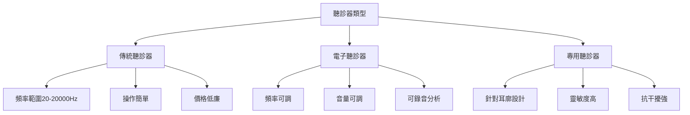
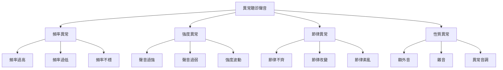
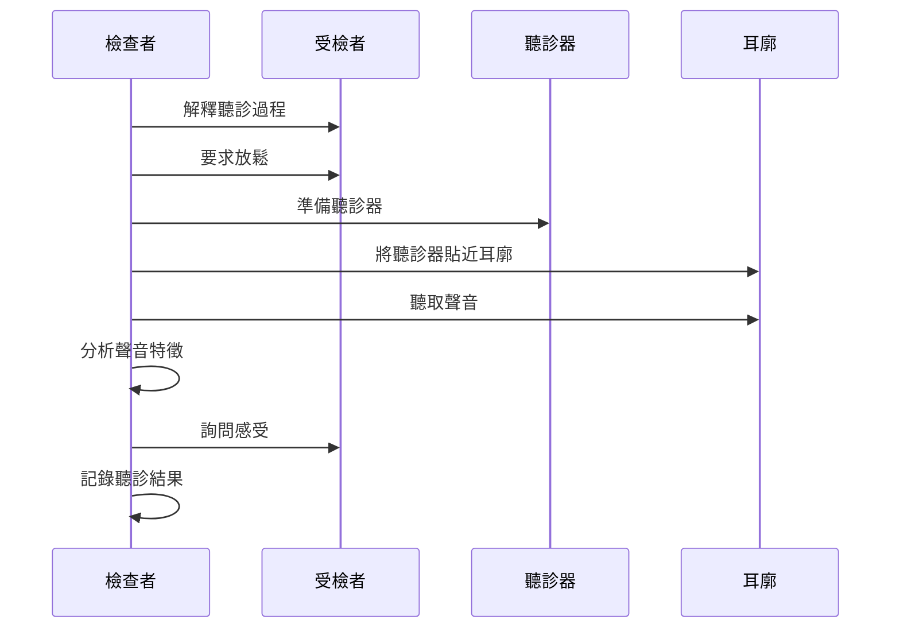
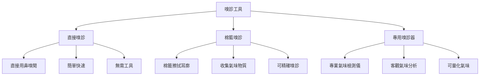
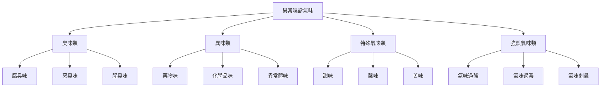
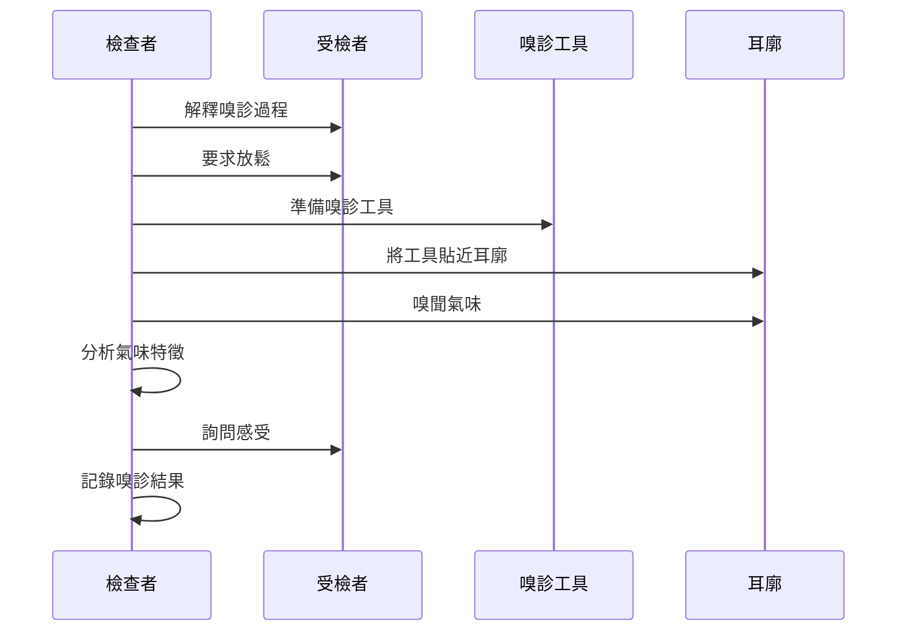
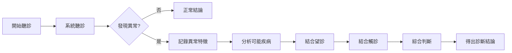
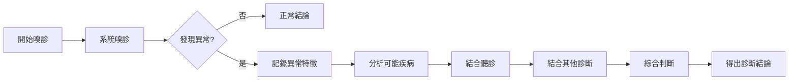
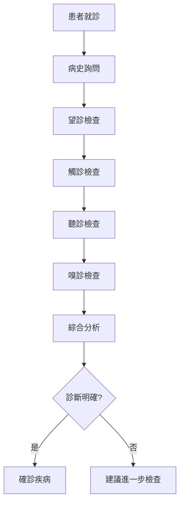
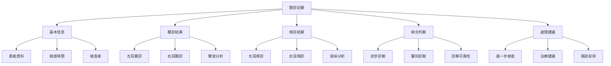

# 耳穴聞診方法

> 👂 **聽診技術** | 🌬️ **嗅診方法** | 📊 **準確性** ⭐⭐

## 📋 目錄

- [基本概念](#基本概念)
- [聽診技術](#聽診技術)
- [嗅診方法](#嗅診方法)
- [聞診結果判讀](#聞診結果判讀)
- [疾病聞診特點](#疾病聞診特點)
- [臨床應用](#臨床應用)
- [注意事項](#注意事項)

---

## 基本概念

### 🔬 定義
耳穴聞診是通過聽取耳廓相關區域發出的聲音以及嗅聞耳廓氣味來判斷相應器官或組織功能的診斷方法。包括聽診和嗅診兩個方面。

### 🎯 聞診意義
- **聲音診斷**：通過聽診耳廓區域聲音判斷疾病
- **氣味診斷**：通過嗅聞耳廓氣味判斷疾病
- **補充診斷**：與望診、觸診互相補充
- **非侵入性**：無創、安全的診斷方法

### 📊 聞診特點
| 特點 | 說明 | 優勢 |
|------|------|------|
| **非侵入性** | 無需破皮或器械刺激 | 安全、無痛苦 |
| **客觀性** | 聲音和氣味相對客觀 | 可重複驗證 |
| **快速性** | 診斷時間短 | 效率高 |
| **補充性** | 與其他診斷方法結合 | 提高準確性 |

---

## 聽診技術

### 🎧 聽診方法

#### 1. 基本聽診方法
| 方法 | 操作要點 | 適用範圍 |
|------|----------|----------|
| **直接聽診** | 耳朵直接貼近耳廓 | 快速初步判斷 |
| **間接聽診** | 使用聽診器聽診 | 精確聽診分析 |
| **對比聽診** | 左右對比聽診 | 判斷差異變化 |
| **重點聽診** | 重點部位深入聽診 | 疑似病例檢查 |

#### 2. 聽診器選擇

### 🔊 正常聽診聲音

#### 1. 正常耳廓聲音特點
| 聲音類型 | 頻率範圍 | 聲音特徵 | 臨床意義 |
|----------|----------|----------|----------|
| **心跳聲** | 60-100次/分 | 規則、有節律 | 正常心血管功能 |
| **呼吸聲** | 12-20次/分 | 柔和、連續 | 正常呼吸功能 |
| **血流聲** | 持續輕微 | 連續、均勻 | 正常血液循環 |
| **肌肉音** | 輕微顫動 | 短暫、間歇 | 正常肌肉張力 |

#### 2. 正常聲音評分標準
| 評分 | 聲音特徵 | 描述 |
|------|----------|------|
| **5分** | 完全正常 | 聲音清晰、規律、正常頻率 |
| **4分** | 基本正常 | 聲音基本清晰，偶爾有輕微變化 |
| **3分** | 輕度異常 | 聲音有輕度改變，但不明顯 |
| **2分** | 中度異常 | 聲音明顯改變，易於察覺 |
| **1分** | 重度異常 | 聲音嚴重異常，非常明顯 |

### 🎼 異常聽診聲音

#### 1. 異常聲音分類

#### 2. 常見異常聲音及其意義
| 異常聲音 | 表現特徵 | 可能疾病 | 診斷價值 |
|----------|----------|----------|----------|
| **心律不齊** | 心跳聲節律不規則 | 心律失常、心臟病 | ⭐⭐⭐⭐ |
| **心音亢進** | 心跳聲過於強烈 | 甲亢、貧血、高血壓 | ⭐⭐⭐ |
| **心音減弱** | 心跳聲過於微弱 | 心衰、心肌病 | ⭐⭐⭐⭐ |
| **呼吸音異常** | 呼吸聲粗礫、哮鳴 | 支氣管炎、哮喘、肺病 | ⭐⭐⭐⭐ |
| **血流音增強** | 血流聲明顯加強 | 動靜脈瘺、貧血 | ⭐⭐⭐ |

### 🎚️ 聽診技術要點

#### 1. 聽診環境要求
| 環境因素 | 要求標準 | 影響程度 |
|----------|----------|----------|
| **噪音水平** | < 40dB | 高 |
| **溫度** | 18-25°C | 低 |
| **濕度** | 40-60% | 低 |
| **光線** | 適度照明 | 中 |

#### 2. 聽診操作步驟

---

## 嗅診方法

### 👃 嗅診技術

#### 1. 基本嗅診方法
| 方法 | 操作要點 | 適用範圍 |
|------|----------|----------|
| **直接嗅診** | 鼻子靠近耳廓嗅聞 | 快速初步判斷 |
| **間接嗅診** | 使用棉籤擦拭後嗅聞 | 精確氣味分析 |
| **對比嗅診** | 左右對比嗅聞 | 判斷氣味差異 |
| **重點嗅診** | 重點部位深入嗅聞 | 疑似病例檢查 |

#### 2. 嗅診工具

### 🌬️ 正常嗅診氣味

#### 1. 正常耳廓氣味特點
| 氣味類型 | 氣味特徵 | 臨床意義 |
|----------|----------|----------|
| **無明顯氣味** | 無特殊氣味 | 正常健康狀態 |
| **輕微皮膚氣味** | 淡淡的皮膚氣味 | 正常皮膚狀態 |
| **耳垢氣味** | 輕微的耳垢氣味 | 正常生理現象 |
| **溫和氣味** | 不刺激、不難聞 | 正常衛生狀態 |

#### 2. 正常氣味評分標準
| 評分 | 氣味特徵 | 描述 |
|------|----------|------|
| **5分** | 完全正常 | 無明顯氣味或僅有輕微正常氣味 |
| **4分** | 基本正常 | 有輕微氣味，但在正常範圍內 |
| **3分** | 輕度異常 | 有輕度異常氣味，但不明顯 |
| **2分** | 中度異常 | 有明顯異常氣味，易於察覺 |
| **1分** | 重度異常 | 有嚴重異常氣味，非常明顯 |

### 🧪 異常嗅診氣味

#### 1. 異常氣味分類

#### 2. 常見異常氣味及其意義
| 異常氣味 | 表現特徵 | 可能疾病 | 診斷價值 |
|----------|----------|----------|----------|
| **腐臭味** | 腐爛、惡臭氣味 | 中耳炎、耳廓感染 | ⭐⭐⭐⭐⭐ |
| **藥物味** | 藥物氣味 | 用藥史、藥物中毒 | ⭐⭐⭐ |
| **甜味** | 類似水果甜味 | 糖尿病、酮症酸中毒 | ⭐⭐⭐⭐ |
| **酸味** | 酸性氣味 | 消化不良、胃酸過多 | ⭐⭐ |
| **胺臭味** | 胺類物質氣味 | 腎病、尿毒症 | ⭐⭐⭐⭐ |
| **異常體味** | 異常的體表氣味 | 代謝性疾病、遺傳病 | ⭐⭐⭐ |

### 🎯 嗅診技術要點

#### 1. 嗅診環境要求
| 環境因素 | 要求標準 | 影響程度 |
|----------|----------|----------|
| **通風情況** | 良好通風 | 高 |
| **溫度** | 18-25°C | 中 |
| **濕度** | 40-60% | 低 |
| **清潔度** | 環境清潔 | 中 |

#### 2. 嗅診操作步驟

---

## 聞診結果判讀

### 🔍 聽診結果判讀

#### 1. 聽診結果綜合評估
| 評估指標 | 權重 | 評估要點 |
|----------|------|----------|
| **頻率異常** | 30% | 頻率過高、過低或不穩定 |
| **強度異常** | 25% | 聲音過強或過弱 |
| **節律異常** | 25% | 節律不齊或改變 |
| **性質異常** | 20% | 出現額外音或雜音 |

#### 2. 聽診診斷流程

### 🧪 嗅診結果判讀

#### 1. 嗅診結果綜合評估
| 評估指標 | 權重 | 評估要點 |
|----------|------|----------|
| **氣味強度** | 30% | 氣味的濃度程度 |
| **氣味性質** | 35% | 氣味的類型和特徵 |
| **氣味持久性** | 20% | 氣味持續的時間 |
| **氣味差異** | 15% | 左右耳氣味差異 |

#### 2. 嗅診診斷流程

---

## 疾病聞診特點

### 🫀 心血管系統疾病

#### 1. 冠心病
| 聞診特點 | 表現 | 診斷意義 |
|----------|------|----------|
| **心聲異常** | 心律不齊、心音減弱 | ⭐⭐⭐⭐ |
| **呼吸音改變** | 呼吸音減弱 | ⭐⭐ |
| **無特殊氣味** | 正常氣味 | - |

#### 2. 高血壓
| 聞診特點 | 表現 | 診斷意義 |
|----------|------|----------|
| **心聲亢進** | 心音過強 | ⭐⭐⭐ |
| **血流音增強** | 血流聲明顯 | ⭐⭐⭐ |
| **無特殊氣味** | 正常氣味 | - |

### 🫁 呼吸系統疾病

#### 1. 支氣管炎
| 聞診特點 | 表現 | 診斷意義 |
|----------|------|----------|
| **呼吸音粗礫** | 呼吸聲粗糙 | ⭐⭐⭐⭐ |
| **哮鳴音** | 呼吸時哮鳴聲 | ⭐⭐⭐⭐⭐ |
| **可能有痰臭味** | 輕微異常氣味 | ⭐⭐ |

#### 2. 肺結核
| 聞診特點 | 表現 | 診斷意義 |
|----------|------|----------|
| **呼吸音減弱** | 患側呼吸音減弱 | ⭐⭐⭐⭐ |
| **可能有臭味** | 輕微異常氣味 | ⭐⭐ |
| **可能咳嗽聲** | 咳嗽聲異常 | ⭐⭐⭐ |

### 🫃 消化系統疾病

#### 1. 胃炎
| 聞診特點 | 表現 | 診斷意義 |
|----------|------|----------|
| **可能有酸味** | 輕微酸味 | ⭐⭐ |
| **正常聽診** | 無明顯異常 | - |
| **其他診斷價值低** | 主要靠其他診斷 | - |

#### 2. 肝炎
| 聞診特點 | 表現 | 診斷意義 |
|----------|------|----------|
| **可能有肝臭** | 類似肝臟氣味 | ⭐⭐⭐ |
| **正常聽診** | 無明顯異常 | - |
| **其他診斷價值低** | 主要靠其他診斷 | - |

### 🧠 神經精神疾病

#### 1. 失眠症
| 聞診特點 | 表現 | 診斷意義 |
|----------|------|----------|
| **心聲可能亢進** | 緊張時心聲過強 | ⭐⭐ |
| **正常氣味** | 無特殊氣味 | - |
| **診斷價值低** | 主要靠其他診斷 | - |

#### 2. 焦慮症
| 聞診特點 | 表現 | 診斷意義 |
|----------|------|----------|
| **心聲亢進** | 心跳過快、心聲過強 | ⭐⭐⭐ |
| **呼吸音改變** | 呼吸急促、呼吸音增強 | ⭐⭐⭐ |
| **可能有汗味** | 緊張出汗氣味 | ⭐⭐ |

### 🩸 內分泌系統疾病

#### 1. 糖尿病
| 聞診特點 | 表現 | 診斷意義 |
|----------|------|----------|
| **可能有甜味** | 水果甜味或酮味 | ⭐⭐⭐⭐ |
| **正常聽診** | 無明顯異常 | - |
| **診斷價值較高** | 氣味有提示價值 | - |

#### 2. 腎病
| 聞診特點 | 表現 | 診斷意義 |
|----------|------|----------|
| **可能有胺臭味** | 尿毒症氣味 | ⭐⭐⭐⭐ |
| **可能有鹹味** | 腎病鹹味 | ⭐⭐⭐ |
| **正常聽診** | 無明顯異常 | - |

---

## 臨床應用

### 🏥 診斷應用

#### 1. 聞診診斷流程

#### 2. 聞診準確性統計
| 疾病類型 | 聽診準確率 | 嗅診準確率 | 綜合聞診準確率 |
|----------|------------|------------|----------------|
| **心血管疾病** | 65% | 15% | 70% |
| **呼吸系統疾病** | 70% | 20% | 75% |
| **消化系統疾病** | 40% | 30% | 50% |
| **神經精神疾病** | 30% | 10% | 35% |
| **內分泌疾病** | 25% | 40% | 50% |

### 📊 療效監測

#### 1. 治療過程監測
| 監測時機 | 聽診重點 | 嗅診重點 | 判斷標準 |
|----------|----------|----------|----------|
| **治療前** | 基線聽診 | 基線嗅診 | 建立基準數據 |
| **治療中** | 定期聽診 | 定期嗅診 | 觀察變化趨勢 |
| **治療後** | 效果評估 | 效果評估 | 評價治療效果 |
| **隨訪期** | 長期監測 | 長期監測 | 監測復發情況 |

#### 2. 療效評價標準
| 評價指標 | 顯效 | 有效 | 無效 |
|----------|------|------|------|
| **聲音改善** | 完全恢復正常 | 接近正常 | 無明顯變化 |
| **氣味改善** | 完全恢復正常 | 接近正常 | 無明顯變化 |
| **頻率恢復** | 恢復正常範圍 | 接近正常 | 無明顯變化 |
| **節律恢復** | 規律正常 | 接近正常 | 無明顯變化 |

### 🔍 預防篩查

#### 1. 健康人羣篩查
| 篩查對象 | 聽診頻率 | 嗅診頻率 | 重點檢查內容 |
|----------|----------|----------|--------------|
| **中年人** | 每年1次 | 每年1次 | 心音、呼吸音 |
| **老年人** | 每年2次 | 每年1次 | 心音、異常氣味 |
| **高風險羣體** | 每3月1次 | 每6月1次 | 相關疾病聲音和氣味 |
| **健康體檢** | 常規項目 | 選檢項目 | 系統聽診 |

#### 2. 早期預警信號
| 聞診發現 | 可能疾病 | 預警等級 |
|----------|----------|----------|
| **心聲明顯異常** | 心臟疾病 | ⭐⭐⭐⭐ |
| **呼吸音明顯異常** | 肺部疾病 | ⭐⭐⭐⭐ |
| **異常甜味** | 糖尿病、酮症酸中毒 | ⭐⭐⭐⭐⭐ |
| **異常胺臭味** | 腎病、尿毒症 | ⭐⭐⭐⭐⭐ |
| **腐臭味** | 耳部感染 | ⭐⭐⭐⭐ |

---

## 注意事項

### ⚠️ 操作注意事項

#### 1. 操作安全
- **衛生規範**：保持聽診器和嗅診工具清潔
- **距離控制**：保持適當距離，避免交叉感染
- **時間控制**：單次聞診時間不超過10分鐘
- **休息間隔**：如需重複聞診，間隔至少3分鐘

#### 2. 受檢者舒適度
| 注意事項 | 說明 | 操作建議 |
|----------|------|----------|
| **姿勢舒適** | 選擇舒適的檢查體位 | 端坐位，背部有支撐 |
| **環境安靜** | 保證聽診環境安靜 | 減少環境噪音 |
| **通風良好** | 保證嗅診環境通風 | 新鮮空氣環境 |
| **心理放鬆** | 消除緊張情緒 | 檢查前溝通解釋 |

### 🚫 禁忌症

#### 1. 聽診禁忌
| 禁忌症 | 原因 | 處理建議 |
|----------|------|----------|
| **嚴重耳部感染** | 可能加重感染 | 先治療感染 |
| **耳廓潰瘍** | 可能導致惡化 | 先治療潰瘍 |
| **嚴重噪聲環境** | 影響聽診效果 | 更換安靜環境 |

#### 2. 嗅診禁忌
| 禁忌症 | 原因 | 處理建議 |
|----------|------|----------|
| **嚴重呼吸系統疾病** | 可能加重病情 | 建議其他診斷方法 |
| **過敏性體質** | 可能誘發過敏 | 注意過敏原 |
| **嚴重嘔吐傾向** | 氣味可能誘發嘔吐 | 減少嗅診時間 |

### 📝 結果記錄

#### 1. 聽診記錄內容
| 項目 | 記錄要點 | 示例 |
|------|----------|------|
| **基本信息** | 姓名、年齡、性別、日期 | 張三，男，45歲，2026-01-22 |
| **聽診部位** | 聽診的具體耳廓部位 | 左耳耳垂、右耳耳甲腔 |
| **聽診結果** | 聲音頻率、強度、節律 | 心音規律，頻率80次/分 |
| **診斷判斷** | 初步診斷或提示 | 心臟功能正常 |
| **建議** | 進一步檢查或治療建議 | 建議定期檢查 |

#### 2. 嗅診記錄內容
| 項目 | 記錄要點 | 示例 |
|------|----------|------|
| **基本信息** | 姓名、年齡、性別、日期 | 張三，男，45歲，2026-01-22 |
| **嗅診部位** | 嗅診的具體耳廓部位 | 左耳耳甲腔、右耳耳廓 |
| **嗅診結果** | 氣味類型、強度、性質 | 無異常氣味，氣味正常 |
| **診斷判斷** | 初步診斷或提示 | 無明顯疾病提示 |
| **建議** | 進一步檢查或治療建議 | 建議定期檢查 |

#### 3. 綜合記錄格式

### 🔬 誤差控制

#### 1. 可能誤差來源
| 誤差來源 | 影響程度 | 控制方法 |
|----------|----------|----------|
| **檢查者經驗** | 高 | 規範培訓，經驗累積 |
| **環境噪音** | 高 | 控制環境條件 |
| **工具精度** | 中 | 使用標準化工具 |
| **受檢者主觀感受** | 低 | 客觀評估 |

#### 2. 提高準確性方法
- **多次複查**：重要發現需重複確認
- **左右對比**：同時檢查兩側耳廓對比
- **雙人檢查**：重要病例由兩位醫師分別檢查
- **結合其他診斷**：與望診、觸診、問診結合

---

## 🔗 相關文檔

### 📚 基礎知識
- [[耳穴診斷概論]] - 耳穴診斷基本理論
- [[耳穴望診技術]] - 耳穴望診方法
- [[耳穴觸診技術]] - 耳穴觸診方法

### 🏥 臨床應用
- [[心血管疾病耳穴診斷]] - 心血管系統疾病診斷
- [[呼吸系統疾病耳穴診斷]] - 呼吸系統疾病診斷
- [[消化系統疾病耳穴診斷]] - 消化系統疾病診斷
- [[內分泌疾病耳穴診斷]] - 內分泌系統疾病診斷

### 📊 標準與規範
- [[耳穴診斷標準]] - 診斷標準規範
- [[耳穴定位標準]] - 耳穴定位標準
- [[聞診操作規範]] - 聞診技術操作規範

---

## 📝 版本信息

- **創建時間**：2026年1月22日
- **最後更新**：2026年1月22日
- **版本號**：v1.0
- **適用人群**：中醫師、臨床醫師、醫學院學生

---

> 💡 **提示**：耳穴聞診需要豐富的臨床經驗，特別是嗅診技術對氣味的判斷需要大量實踐。聞診結果應與其他診斷方法結合，提高診斷準確性。

🔗 **相關知識庫**：[[耳穴療法知識庫]] | [[耳穴診斷知識庫]] | [[OpenCode集成指南]]