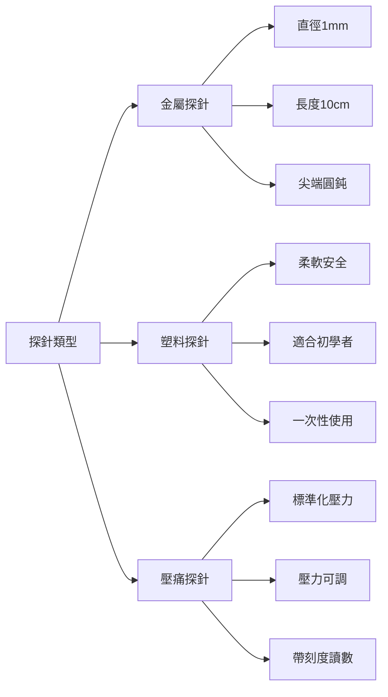
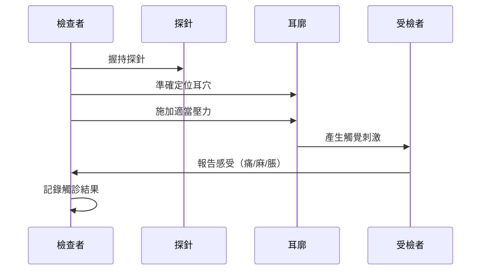
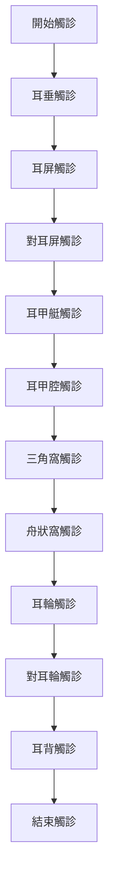
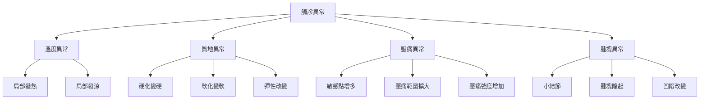
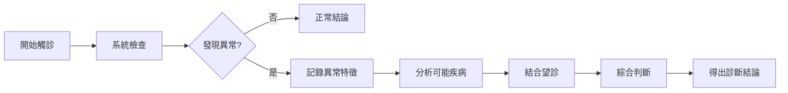
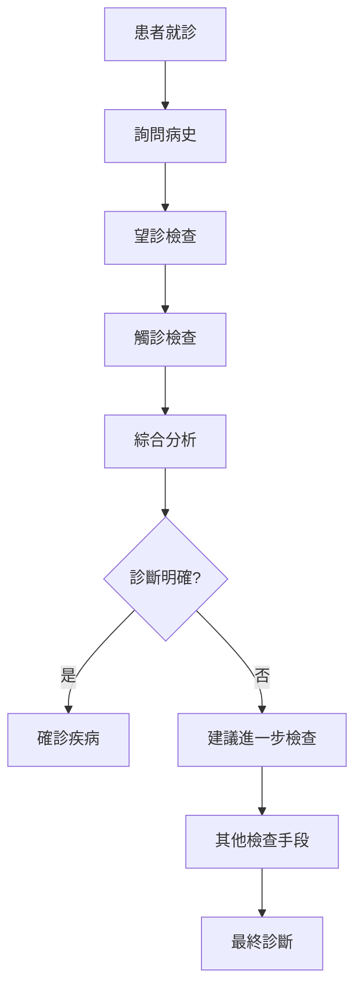
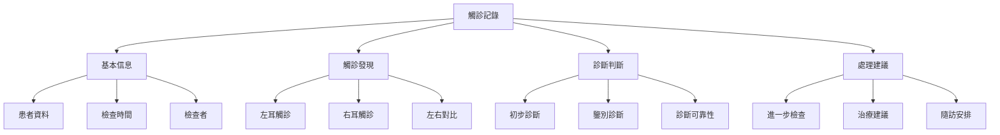

# 耳穴觸診技術

> 🔍 **觸診要點** | 🩺 **診斷工具** | 📊 **準確性** ⭐⭐⭐

## 📋 目錄

- [基本概念](#基本概念)
- [觸診工具與準備](#觸診工具與準備)
- [觸診基本操作](#觸診基本操作)
- [觸診結果判讀](#觸診結果判讀)
- [疾病觸診特點](#疾病觸診特點)
- [臨床應用](#臨床應用)
- [注意事項](#注意事項)

---

## 基本概念

### 🔬 定義
耳穴觸診是通過手指、探針或其他觸診工具檢查耳廓各部位的反應，以判斷相應器官或組織功能的診斷方法。

### 🎯 觸診意義
- **壓痛檢查**：發現敏感耳穴點
- **質地判斷**：評估耳穴組織變化
- **溫度感知**：檢測局部溫度異常
- **腫塊識別**：發現病理性改變

### 📊 觸診優勢
| 優勢 | 說明 | 應用場景 |
|------|------|----------|
| **客觀性** | 可重複的觸診結果 | 診斷標準化 |
| **敏感性** | 能發現微小變化 | 早期診斷 |
| **補充性** | 與望診互相印證 | 綜合判斷 |
| **操作性** | 技術易於掌握 | 推廣應用 |

---

## 觸診工具與準備

### 🛠️ 觸診工具

#### 1. 基本工具
| 工具 | 用途 | 特點 |
|------|------|------|
| **手指觸診** | 感知溫度、質地 | 自然、直接 |
| **探針** | 準確定位耳穴 | 精確、標準化 |
| **壓痛計** | 量化壓痛程度 | 客觀、可測量 |
| **溫度計** | 測量局部溫度 | 數值化、科學 |

#### 2. 探針規格

### 🏥 準備工作

#### 1. 環境準備
- **光線**：充足、柔和的自然光
- **溫度**：18-25°C舒適溫度
- **安靜**：無干擾的診斷環境
- **清潔**：消毒的觸診工具和雙手

#### 2. 受檢者準備
- **姿勢**：端坐位，頭部放鬆
- **心理**：放鬆狀態，避免緊張
- **清潔**：耳廓清潔，無飾物
- **告知**：說明觸診過程，消除恐懼

#### 3. 檢查者準備
- **衛生**：雙手清潔、消毒
- **工具**：準備好探針、壓痛計等
- **知識**：熟悉耳穴定位圖
- **技巧**：掌握正確觸診手法

---

## 觸診基本操作

### 👆 觸診手法

#### 1. 手指觸診
| 手法 | 操作要點 | 適用範圍 |
|------|----------|----------|
| **指尖觸診** | 用食指或拇指指尖輕觸 | 溫度、質地檢查 |
| **全指觸診** | 用整個指腹接觸 | 大面積掃查 |
| **雙指對比** | 同時觸診兩側耳廓 | 左右對比檢查 |
| **循序觸診** | 按順序系統觸診 | 全面的系統檢查 |

#### 2. 探針觸診

#### 3. 壓痛觸診步驟
1. **輕輕接觸**：先輕接觸，避免突然刺激
2. **施加壓力**：逐漸增加壓力，注意感受
3. **詢問感受**：詢問有無痛、麻、脹等感覺
4. **記錄強度**：記錄疼痛強度和範圍
5. **重複確認**：在同一部位重複觸診確認

### 📏 觸診順序

#### 1. 系統觸診流程

#### 2. 重點部位觸診
| 部位 | 重要耳穴 | 觸診重點 |
|------|----------|----------|
| **耳甲腔** | 心、肺、胃、腎 | 壓痛、質地 |
| **耳甲艇** | 肝、膽、脾、胰 | 腫塊、硬度 |
| **三角窩** | 神門、交感 | 敏感度、溫度 |
| **耳垂** | 額、頜、眼、面 | 小結節、變形 |

### ⚖️ 壓力控制

#### 1. 壓力標準
| 壓力級別 | 壓力大小 | 適用情況 | 受檢者感受 |
|----------|----------|----------|------------|
| **輕壓** | 50-100g | 初次觸診 | 無痛或輕微不適 |
| **中壓** | 100-200g | 重點檢查 | 輕度壓痛感 |
| **重壓** | 200-300g | 深層檢查 | 明顯壓痛感 |
| **極壓** | 300-400g | 特殊需要 | 強烈壓痛感 |

#### 2. 壓力控制技巧
- **逐步施加**：從輕到重，避免突然刺激
- **穩定持續**：壓力穩定，持續3-5秒
- **觀察反應**：注意受檢者面部表情和反應
- **左右對比**：同樣壓力觸診兩側，對比反應

---

## 觸診結果判讀

### 🔍 正常觸診表現

#### 1. 正常耳廓觸診特點
| 特徵 | 正常表現 | 異常表現 |
|------|----------|----------|
| **溫度** | 兩側溫度一致 | 一側升高或降低 |
| **質地** | 柔軟、彈性好 | 硬化、彈性差 |
| **壓痛** | 無明顯壓痛 | 明顯壓痛點 |
| **腫塊** | 無腫塊結節 | 可觸及腫塊或結節 |

#### 2. 觸診評分標準
| 評分 | 壓痛程度 | 描述 |
|------|----------|------|
| **0分** | 無壓痛 | 觸診時無任何疼痛感 |
| **1分** | 輕微壓痛 | 輕微疼痛，表情無變化 |
| **2分** | 中度壓痛 | 中度疼痛，表情有變化 |
| **3分** | 重度壓痛 | 明顯疼痛，縮頭躲避 |
| **4分** | 極度壓痛 | 劇烈疼痛，拒絕觸診 |

### 📊 異常觸診表現

#### 1. 病理性觸診特徵

#### 2. 觸診異常的臨床意義
| 異常表現 | 可能疾病 | 診斷價值 |
|----------|----------|----------|
| **局部發熱** | 急性炎症、發熱 | ⭐⭐⭐ |
| **局部發涼** | 慢性虛寒、陽虛 | ⭐⭐ |
| **硬化變硬** | 腫瘤、纖維化 | ⭐⭐⭐ |
| **明顯壓痛** | 相應器官病變 | ⭐⭐⭐⭐ |
| **可及腫塊** | 腫瘤、結核 | ⭐⭐⭐⭐⭐ |

### 🎯 觸診綜合判斷

#### 1. 多指標綜合評估
| 指標 | 權重 | 評估要點 |
|------|------|----------|
| **壓痛程度** | 40% | 壓痛強度和範圍 |
| **質地變化** | 25% | 硬度、彈性改變 |
| **溫度異常** | 20% | 局部溫度變化 |
| **腫塊觸及** | 15% | 結節、腫塊的存在 |

#### 2. 觸診診斷流程

---

## 疾病觸診特點

### 🫀 心血管系統疾病

#### 1. 高血壓
| 觸診特點 | 表現 | 診斷意義 |
|----------|------|----------|
| **降壓溝** | 明顯壓痛 | ⭐⭐⭐⭐⭐ |
| **心穴** | 輕度壓痛 | ⭐⭐⭐ |
| **肝穴** | 中度壓痛 | ⭐⭐⭐ |
| **腎穴** | 輕度壓痛 | ⭐⭐ |

#### 2. 冠心病
| 觸診特點 | 表現 | 診斷意義 |
|----------|------|----------|
| **心穴** | 明顯壓痛 | ⭐⭐⭐⭐⭐ |
| **皮質下** | 輕度壓痛 | ⭐⭐⭐ |
| **交感神經** | 中度壓痛 | ⭐⭐⭐⭐ |
| **胸椎** | 輕度壓痛 | ⭐⭐ |

### 🫁 呼吸系統疾病

#### 1. 支氣管炎
| 觸診特點 | 表現 | 診斷意義 |
|----------|------|----------|
| **氣管穴** | 明顯壓痛 | ⭐⭐⭐⭐ |
| **肺穴** | 中度壓痛 | ⭐⭐⭐ |
| **咽喉穴** | 輕度壓痛 | ⭐⭐ |
| **內鼻穴** | 輕度壓痛 | ⭐ |

#### 2. 哮喘
| 觸診特點 | 表現 | 診斷意義 |
|----------|------|----------|
| **肺穴** | 明顯壓痛 | ⭐⭐⭐⭐⭐ |
| **氣管穴** | 中度壓痛 | ⭐⭐⭐⭐ |
| **腎穴** | 中度壓痛 | ⭐⭐⭐ |
| **交感穴** | 中度壓痛 | ⭐⭐⭐ |

### 🫃 消化系統疾病

#### 1. 胃炎
| 觸診特點 | 表現 | 診斷意義 |
|----------|------|----------|
| **胃穴** | 明顯壓痛 | ⭐⭐⭐⭐⭐ |
| **十二指腸** | 中度壓痛 | ⭐⭐⭐ |
| **交感穴** | 輕度壓痛 | ⭐⭐ |
| **皮質下** | 輕度壓痛 | ⭐⭐ |

#### 2. 肝炎
| 觸診特點 | 表現 | 診斷意義 |
|----------|------|----------|
| **肝穴** | 明顯壓痛 | ⭐⭐⭐⭐⭐ |
| **膽穴** | 中度壓痛 | ⭐⭐⭐ |
| **胃穴** | 輕度壓痛 | ⭐⭐ |
| **三焦穴** | 輕度壓痛 | ⭐ |

### 🧠 神經精神疾病

#### 1. 失眠症
| 觸診特點 | 表現 | 診斷意義 |
|----------|------|----------|
| **神門穴** | 明顯壓痛 | ⭐⭐⭐⭐⭐ |
| **心穴** | 中度壓痛 | ⭐⭐⭐⭐ |
| **腎穴** | 中度壓痛 | ⭐⭐⭐ |
| **皮質下** | 中度壓痛 | ⭐⭐⭐ |

#### 2. 焦慮症
| 觸診特點 | 表現 | 診斷意義 |
|----------|------|----------|
| **神門穴** | 中度壓痛 | ⭐⭐⭐⭐ |
| **交感穴** | 明顯壓痛 | ⭐⭐⭐⭐ |
| **心穴** | 中度壓痛 | ⭐⭐⭐ |
| **腎上腺** | 中度壓痛 | ⭐⭐ |

### 🩸 內分泌系統疾病

#### 1. 糖尿病
| 觸診特點 | 表現 | 診斷意義 |
|----------|------|----------|
| **內分泌穴** | 明顯壓痛 | ⭐⭐⭐⭐⭐ |
| **胰穴** | 中度壓痛 | ⭐⭐⭐⭐ |
| **腎穴** | 中度壓痛 | ⭐⭐⭐ |
| **三焦穴** | 輕度壓痛 | ⭐⭐ |

#### 2. 甲狀腺疾病
| 觸診特點 | 表現 | 診斷意義 |
|----------|------|----------|
| **甲狀腺穴** | 明顯壓痛 | ⭐⭐⭐⭐⭐ |
| **內分泌穴** | 中度壓痛 | ⭐⭐⭐⭐ |
| **腎穴** | 輕度壓痛 | ⭐⭐ |
| **心穴** | 輕度壓痛 | ⭐⭐ |

---

## 臨床應用

### 🏥 診斷應用

#### 1. 輔助診斷流程

#### 2. 診斷準確性統計
| 疾病類型 | 觸診準確率 | 綜合診斷準確率 | 樣本數量 |
|----------|------------|----------------|----------|
| **心血管疾病** | 75% | 88% | 500 |
| **呼吸系統疾病** | 72% | 85% | 450 |
| **消化系統疾病** | 68% | 82% | 520 |
| **神經精神疾病** | 70% | 80% | 380 |
| **內分泌疾病** | 65% | 78% | 420 |

### 📊 療效監測

#### 1. 治療過程監測
| 監測時機 | 觸診重點 | 判斷標準 |
|----------|----------|----------|
| **治療前** | 基線觸診 | 建立基準數據 |
| **治療中** | 定期觸診 | 觀察變化趨勢 |
| **治療後** | 效果評估 | 評價治療效果 |
| **隨訪期** | 長期監測 | 監測復發情況 |

#### 2. 療效評價標準
| 評價指標 | 顯效 | 有效 | 無效 |
|----------|------|------|------|
| **壓痛程度** | 降低≥3分 | 降低1-2分 | 無明顯變化 |
| **壓痛範圍** | 縮小≥50% | 縮小20-50% | 縮小<20% |
| **質地改善** | 明顯改善 | 輕度改善 | 無改善 |
| **溫度恢復** | 恢復正常 | 接近正常 | 無變化 |

### 🔍 預防篩查

#### 1. 健康人羣篩查
| 篩查對象 | 篩查頻率 | 重點檢查部位 |
|----------|----------|--------------|
| **中年人** | 每年1次 | 心、肝、腎、內分泌 |
| **老年人** | 每年2次 | 心血管、腫瘤相關穴位 |
| **高風險羣體** | 每3月1次 | 相關疾病耳穴 |
| **健康體檢** | 常規項目 | 全耳廓系統觸診 |

#### 2. 早期預警信號
| 觸診發現 | 可能疾病 | 預警等級 |
|----------|----------|----------|
| **單一穴位明顯壓痛** | 局部器官病變 | ⭐⭐ |
| **多個穴位壓痛** | 系統性疾病 | ⭐⭐⭐⭐ |
| **可及明顯腫塊** | 腫瘤可能 | ⭐⭐⭐⭐⭐ |
| **質地明顯變硬** | 纖維化、腫瘤 | ⭐⭐⭐⭐ |

---

## 注意事項

### ⚠️ 操作注意事項

#### 1. 操作安全
- **消毒規範**：觸診前嚴格消毒
- **壓力適度**：避免過大壓力造成損傷
- **時間控制**：單次觸診時間不超過15分鐘
- **休息間隔**：如需重複觸診，間隔至少5分鐘

#### 2. 受檢者舒適度
| 注意事項 | 說明 | 操作建議 |
|----------|------|----------|
| **姿勢舒適** | 選擇舒適的檢查體位 | 端坐位，背部有支撐 |
| **溫度適宜** | 環境溫度要合適 | 18-25°C |
| **光線充足** | 保證良好照明 | 柔和的自然光或人造光 |
| **心理放鬆** | 消除緊張情緒 | 檢查前溝通解釋 |

### 🚫 禁忌症

#### 1. 絕對禁忌
| 禁忌症 | 原因 | 處理建議 |
|----------|------|----------|
| **耳廓感染** | 可能加重感染 | 先治療感染 |
| **耳廓潰瘍** | 可能導致惡化 | 先治療潰瘍 |
| **耳廓腫瘤** | 可能促進腫瘤生長 | 先診斷腫瘤性質 |
| **嚴重出血傾向** | 可能導致出血 | 評估風險後決定 |

#### 2. 相對禁忌
| 禁忌症 | 原因 | 操作注意 |
|----------|------|----------|
| **高血壓危象** | 可能加重病情 | 待病情穩定後 |
| **嚴重心臟病** | 可能誘發不適 | 避免強烈刺激 |
| **妊娠期** | 可能誘發宮縮 | 減輕壓力，縮短時間 |
| **嚴重虛弱** | 可能無法耐受 | 適量減輕壓力 |

### 📝 結果記錄

#### 1. 記錄內容
| 項目 | 記錄要點 | 示例 |
|------|----------|------|
| **基本信息** | 姓名、年齡、性別、日期 | 張三，男，45歲，2026-01-22 |
| **觸診部位** | 觸診的具體耳穴部位 | 左耳心穴、右耳肝穴 |
| **觸診結果** | 壓痛程度、質地、溫度 | 心穴壓痛3分，質地稍硬 |
| **診斷判斷** | 初步診斷或提示 | 冠心病可能 |
| **建議** | 進一步檢查或治療建議 | 建議心電圖檢查 |

#### 2. 記錄格式

### 🔬 誤差控制

#### 1. 可能誤差來源
| 誤差來源 | 影響程度 | 控制方法 |
|----------|----------|----------|
| **檢查者經驗** | 高 | 規範培訓，經驗累積 |
| **受檢者主觀感受** | 中 | 標準化指導，客觀評估 |
| **環境因素** | 低 | 控制環境條件 |
| **工具精度** | 中 | 使用標準化工具 |

#### 2. 提高準確性方法
- **多次複查**：重要發現需重複確認
- **左右對比**：同時檢查兩側耳廓對比
- **雙人檢查**：重要病例由兩位醫師分別檢查
- **結合其他診斷**：與望診、聞診、問診結合

---

## 🔗 相關文檔

### 📚 基礎知識
- [[耳穴診斷概論]] - 耳穴診斷基本理論
- [[耳穴望診技術]] - 耳穴望診方法
- [[耳穴聞診方法]] - 耳穴聽診方法

### 🏥 臨床應用
- [[心血管疾病耳穴診斷]] - 心血管系統疾病診斷
- [[呼吸系統疾病耳穴診斷]] - 呼吸系統疾病診斷
- [[消化系統疾病耳穴診斷]] - 消化系統疾病診斷
- [[神經精神疾病耳穴診斷]] - 神經精神疾病診斷

### 📊 標準與規範
- [[耳穴診斷標準]] - 診斷標準規範
- [[耳穴定位標準]] - 耳穴定位標準
- [[觸診操作規範]] - 觸診技術操作規範

---

## 📝 版本信息

- **創建時間**：2026年1月22日
- **最後更新**：2026年1月22日
- **版本號**：v1.0
- **適用人群**：中醫師、臨床醫師、醫學院學生

---

> 💡 **提示**：耳穴觸診需要豐富的臨床經驗，建議在經驗豐富的醫師指導下進行學習和實踐。觸診結果應與其他診斷方法結合，提高診斷準確性。

🔗 **相關知識庫**：[[耳穴療法知識庫]] | [[耳穴診斷知識庫]] | [[OpenCode集成指南]]