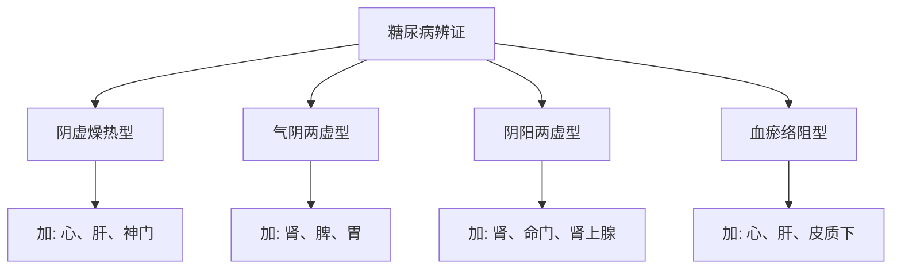
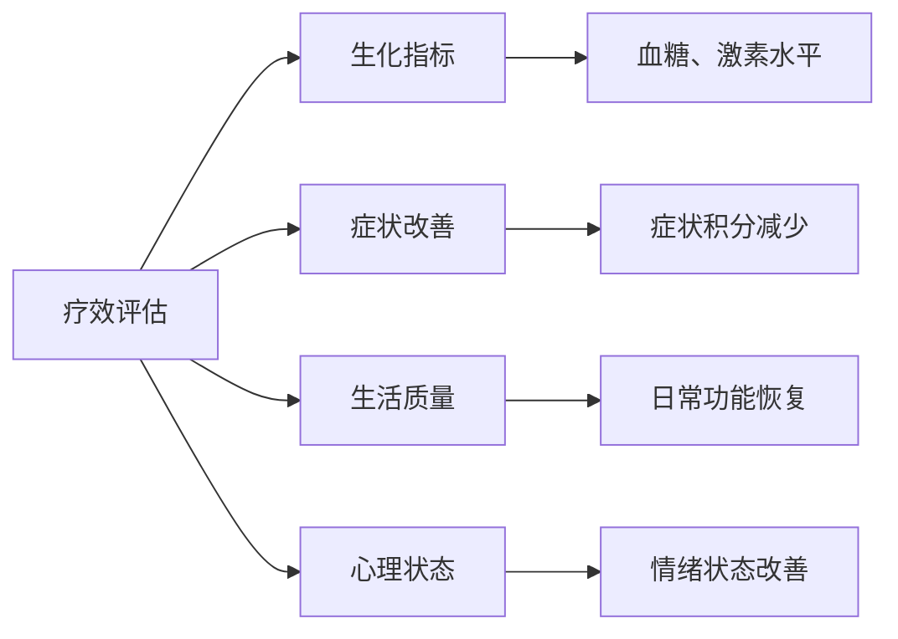

# 内分泌代谢疾病耳穴治疗方案

## 🎯 治疗概述

### 疾病范围
- 糖尿病及其并发症
- 甲状腺功能异常
- 肥胖症
- 代谢综合征
- 更年期综合征
- 肾上腺功能异常

### 治疗原则
1. **整体调节**: 恢复内分泌系统平衡
2. **辨证施治**: 根据体质和证候选择穴位
3. **分期治疗**: 急性期控制，慢性期调理
4. **综合干预**: 结合生活方式管理

---

## 📋 糖尿病耳穴治疗方案

### 基础方
```
主穴：
├── 胰（胰胆穴）- 调节胰岛素分泌
├── 肾 - 滋阴补肾
├── 脾 - 健脾益气
├── 内分泌 - 调节激素平衡
└── 交感 - 调节自主神经功能

配穴：
├── 三焦 - 通调水道
├── 肝 - 疏肝理气
├── 心 - 安神定志
└── 肾上腺 - 应激调节
```

### 辨证加减


### 治疗方案
| 期型 | 治疗频率 | 刺激方法 | 疗程 | 注意事项 |
|------|----------|----------|------|----------|
| 初期 | 每日1次 | 王不留行籽贴压 | 2-4周 | 血糖监测 |
| 稳定期 | 每周2-3次 | 按压+贴压 | 6-8周 | 饮食控制 |
| 并发症期 | 每日1次 | 电针+贴压 | 8-12周 | 综合治疗 |

---

## 📋 甲状腺疾病治疗方案

### 甲状腺功能亢进
```
主穴：
├── 颈椎 - 调节颈部气血
├── 肾上腺 - 抑制过度兴奋
├── 内分泌 - 调节甲状腺激素
├── 心 - 清心安神
└── 肝 - 平肝潜阳

配穴：
├── 神门 - 镇静安神
├── 交感 - 调节交感神经
├── 脾 - 健脾化痰
└── 胃 - 和胃降逆
```

### 甲状腺功能减退
```
主穴：
├── 肾 - 温补肾阳
├── 肾上腺 - 兴奋功能
├── 内分泌 - 促进激素分泌
├── 脾 - 健脾益气
└── 命门 - 温阳散寒

配穴：
├── 三焦 - 温阳化气
├── 肝 - 疏肝理气
├── 胃 - 温中健脾
└── 皮质下 - 调节中枢
```

---

## 📋 肥胖症治疗方案

### 辨证分型治疗

#### 脾虚湿盛型
```
主穴：
├── 脾 - 健脾祛湿
├── 胃 - 和胃消食
├── 三焦 - 通调水道
├── 内分泌 - 调节代谢
└── 大肠 - 通腑泄浊

配穴：
├── 腹 - 减少腹部脂肪
├── 饥点 - 控制食欲
├── 渴点 - 减少饮水
└── 交感 - 调节代谢
```

#### 肝郁气滞型
```
主穴：
├── 肝 - 疏肝理气
├── 胆 - 利胆疏泄
├── 内分泌 - 调节情绪相关激素
├── 神门 - 安神解郁
└── 交感 - 调节自主神经

配穴：
├── 心 - 清心安神
├── 脾 - 健脾消食
├── 胃 - 和胃降逆
└── 皮质下 - 调节情绪中枢
```

---

## 📋 更年期综合征治疗方案

### 核心治疗方案
```
主穴：
├── 肾 - 滋补肾阴肾阳
├── 内分泌 - 调节性激素水平
├── 卵巢/睾丸 - 调节性腺功能
├── 神门 - 安神定志
└── 交感 - 调节自主神经

配穴：
├── 心 - 清心除烦
├── 肝 - 疏肝解郁
├── 脾 - 健脾益气
└── 皮质下 - 调节下丘脑-垂体轴
```

### 症状针对性治疗

#### 潮热汗出
- **主穴**: 交感、神门、内分泌
- **配穴**: 心、肾、肺
- **方法**: 强刺激，每日治疗

#### 心烦失眠
- **主穴**: 神门、心、皮质下
- **配穴**: 肾、肝、脾
- **方法**: 轻刺激，晚间治疗

#### 情绪抑郁
- **主穴**: 肝、心、神门
- **配穴**: 皮质下、内分泌、交感
- **方法**: 中等刺激，配合心理疏导

---

## 📊 疗效评估标准

### 评价指标


### 评分标准
| 评价等级 | 症状改善 | 生化指标 | 生活质量 | 总体评价 |
|----------|----------|----------|----------|----------|
| 显效 | ≥70% | 恢复正常 | 显著改善 | 症状基本消失 |
| 有效 | 30-70% | 明显改善 | 部分改善 | 症状明显减轻 |
| 好转 | <30% | 轻度改善 | 轻微改善 | 症状有所减轻 |
| 无效 | 无变化 | 无改善 | 无改善 | 症状无变化 |

---

## ⚠️ 注意事项与禁忌

### 治疗注意事项
1. **血糖监测**: 糖尿病患者需密切监测血糖变化
2. **药物调整**: 不能突然停用降糖药或激素类药物
3. **个体差异**: 根据患者体质调整治疗方案
4. **综合治疗**: 配合饮食、运动、心理干预

### 禁忌情况
- 严重糖尿病并发症
- 急性甲状腺危象
- 内分泌肿瘤
- 严重心脑血管疾病
- 妊娠期特殊内分泌疾病

---

## 📈 治疗案例分享

### 案例1: 2型糖尿病
**患者**: 45岁女性，糖尿病史3年
**治疗方案**: 胰、脾、肾、内分泌为主穴
**治疗经过**: 
- 第1周: 每日治疗，配合饮食控制
- 第4周: 空腹血糖从8.7降至6.5mmol/L
- 第8周: 糖化血红蛋白从8.2%降至7.1%

### 案例2: 更年期综合征
**患者**: 51岁女性，典型更年期症状
**治疗方案**: 肾、内分泌、神门为主穴
**治疗经过**:
- 2周后: 潮热次数减少50%
- 4周后: 睡眠质量明显改善
- 8周后: 情绪状态显著好转

---

## 🔗 相关链接

- [糖尿病现代研究](./04_临床应用/常见疾病耳穴治疗方案.md)
- [更年期综合征研究](../08_实践指南/更年期保健指南.md)
- [内分泌调节机制](../01_理论基础/耳穴作用机制.md)
- [诊断技术标准](../05_诊断技术/耳穴诊断理论基础.md)

---

## 📞 联系与咨询

**内分泌专科咨询**: 每周二、四下午
**预约方式**: 电话或在线预约
**服务时间**: 周一至周五 8:00-17:00

*本文档持续更新中，最新版本日期: 2026-01-25*