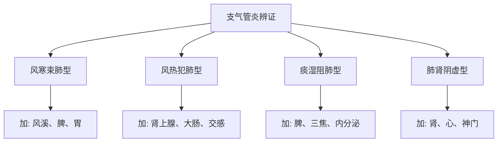
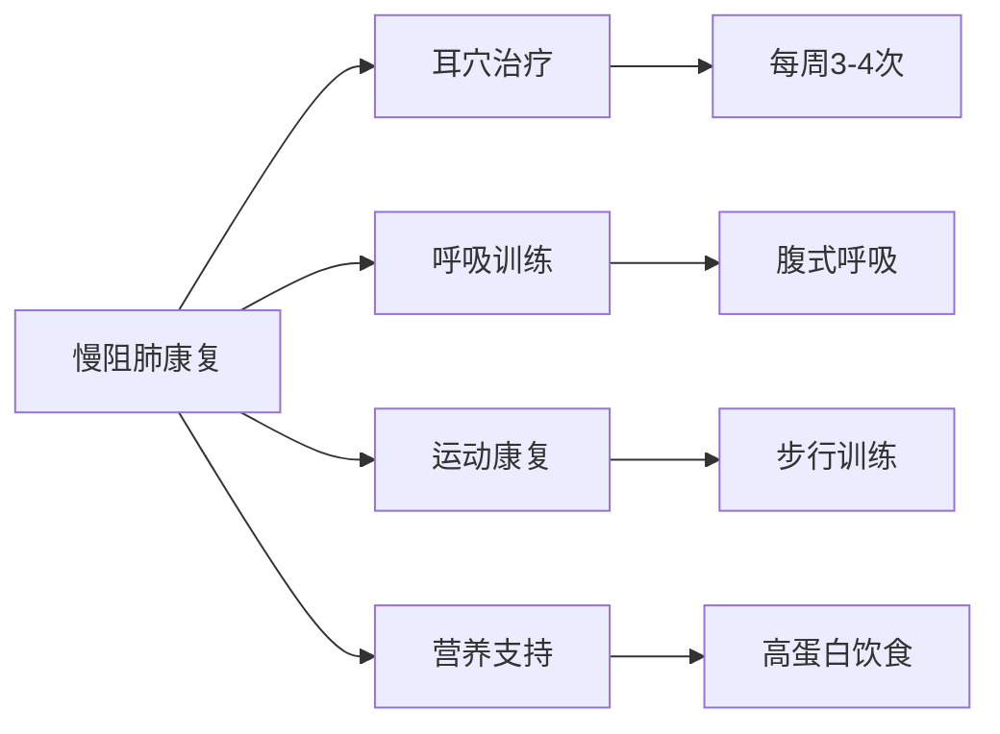

# 呼吸系统疾病耳穴治疗方案

## 🎯 治疗概述

### 疾病范围
- 急慢性支气管炎
- 支气管哮喘
- 过敏性鼻炎
- 慢阻肺（COPD）
- 上呼吸道感染
- 肺炎恢复期调理

### 治疗原则
1. **扶正祛邪**: 增强免疫力，祛除病邪
2. **标本兼治**: 缓解症状同时调理体质
3. **预防为主**: 增强抗病能力，减少复发
4. **整体调节**: 调理肺、脾、肾三脏功能

---

## 📋 支气管炎治疗方案

### 急性支气管炎
```
主穴：
├── 肺 - 宣肺止咳
├── 支气管 - 疏通气道
├── 神门 - 镇咳平喘
├── 肾上腺 - 抗炎消水肿
└── 交感 - 解除支气管痉挛

配穴：
├── 脾 - 健脾化痰
├── 胃 - 和胃降逆
├── 大肠 - 通腑泄热
└── 皮质下 - 调节呼吸中枢
```

### 慢性支气管炎
```
主穴：
├── 肺 - 补肺益气
├── 脾 - 健脾化痰
├── 肾 - 补肾纳气
├── 内分泌 - 调节免疫
└── 肾上腺 - 减轻炎症

配穴：
├── 支气管 - 扩张支气管
├── 神门 - 镇咳安神
├── 交感 - 调节自主神经
└── 三焦 - 通调水道
```

### 辨证加减


---

## 📋 支气管哮喘治疗方案

### 发作期治疗
```
急救穴位：
├── 平喘 - 快速平喘
├── 肾上腺 - 抗炎抗过敏
├── 交感 - 解除支气管痉挛
├── 神门 - 镇静安神
└── 皮质下 - 调节呼吸中枢

配穴：
├── 肺 - 宣肺平喘
├── 支气管 - 舒张气道
├── 脾 - 健脾化痰
└── 肾 - 纳气平喘
```

### 缓解期治疗
```
主穴：
├── 肺 - 补肺固表
├── 脾 - 健脾益气
├── 肾 - 补肾纳气
├── 内分泌 - 调节免疫平衡
└── 肾上腺 - 抗过敏

配穴：
├── 平喘 - 巩固疗效
├── 神门 - 稳定情绪
├── 交感 - 调节自主神经
└── 皮质下 - 调节神经内分泌
```

### 治疗方案对比
| 期型 | 治疗频率 | 刺激方法 | 疗程 | 注意事项 |
|------|----------|----------|------|----------|
| 急性发作期 | 每日2-3次 | 强刺激按压 | 即时生效 | 配合药物 |
| 慢性持续期 | 每日1次 | 贴压+按压 | 4-6周 | 避免诱因 |
| 缓解巩固期 | 每周2-3次 | 贴压为主 | 8-12周 | 增强体质 |
| 季节性预防 | 季节前1周 | 贴压预防 | 4周 | 预防为主 |

---

## 📋 过敏性鼻炎治疗方案

### 基础治疗方案
```
主穴：
├── 内鼻 - 直接对应病灶
├── 外鼻 - 调节鼻部功能
├── 肺 - 宣肺通鼻窍
├── 肾上腺 - 抗炎抗过敏
└── 内分泌 - 调节免疫平衡

配穴：
├── 风溪 - 抗过敏要穴
├── 神门 - 镇静止痒
├── 交感 - 调节血管通透性
└── 皮质下 - 调节过敏反应
```

### 季节性过敏性鼻炎
```
预防期治疗（发作前2周）：
├── 肺 - 固表卫外
├── 脾 - 健脾益气
├── 肾 - 补肾固本
├── 内分泌 - 调节免疫
└── 风溪 - 抗过敏

发作期治疗：
├── 内鼻+外鼻 - 局部治疗
├── 肾上腺 - 快速抗炎
├── 神门 - 减轻症状
└── 交感 - 减少分泌物
```

---

## 📋 慢阻肺（COPD）治疗方案

### 稳定期治疗
```
主穴：
├── 肺 - 补肺益气
├── 脾 - 健脾化痰
├── 肾 - 补肾纳气
├── 胸 - 胸部对应
└── 内分泌 - 调节全身机能

配穴：
├── 平喘 - 改善呼吸功能
├── 心 - 强心利尿
├── 神门 - 改善焦虑
└── 皮质下 - 调节呼吸中枢
```

### 康复期综合治疗


---

## 📋 上呼吸道感染治疗方案

### 普通感冒
```
主穴：
├── 肺 - 宣肺解表
├── 咽喉 - 利咽消肿
├── 内鼻 - 通鼻窍
├── 肾上腺 - 抗炎退热
└── 交感 - 调节免疫

配穴：
├── 风溪 - 祛风解表
├── 神门 - 清热安神
├── 胃 - 和胃降逆
└── 大肠 - 通腑泄热
```

### 流行性感冒
```
主穴：
├── 肺 - 清热解毒
├── 肾上腺 - 抗病毒抗炎
├── 内分泌 - 调节免疫
├── 神门 - 高热镇静
└── 交感 - 调节体温

配穴：
├── 咽喉 - 缓解咽痛
├── 内鼻 - 改善鼻塞
├── 风溪 - 增强抗病力
└── 皮质下 - 调节全身反应
```

---

## 📊 疗效评估标准

### 症状评估量表
| 症状 | 0分 | 1分 | 2分 | 3分 | 4分 |
|------|-----|-----|-----|-----|-----|
| 咳嗽 | 无 | 轻度 | 中度 | 重度 | 严重影响 |
| 咳痰 | 无 | 少量 | 中等 | 大量 | 粘稠难咳 |
| 气喘 | 无 | 活动后 | 稍动即 | 静息时 | 严重气短 |
| 鼻塞 | 无 | 轻度 | 中度 | 重度 | 完全阻塞 |

### 肺功能评估
- **FEV1**: 第一秒用力呼气量
- **FVC**: 用力肺活量
- **PEF**: 呼气峰流速
- **症状评分**: 日间症状+夜间症状

---

## ⚠️ 注意事项与禁忌

### 治疗注意事项
1. **急性期配合**: 耳穴配合药物治疗，不可单独使用
2. **刺激强度**: 根据患者体质和病情调整
3. **环境要求**: 保持空气清新，避免刺激因素
4. **疗程安排**: 急性期短期治疗，慢性期长期调理

### 禁忌情况
- 严重呼吸衰竭
- 大咯血活动期
- 严重心脏病
- 严重感染中毒
- 耳部皮肤感染

---

## 🏡 家庭自我保健

### 日常保健穴位
```
预防保健方：
├── 肺 - 增强肺功能
├── 脾 - 健脾化痰
├── 肾 - 补肾纳气
├── 内分泌 - 调节免疫
└── 神门 - 安神保健
```

### 自我按摩方法
1. **揉按法**: 每穴1-2分钟，每日2-3次
2. **贴压法**: 王不留行籽贴压，3-5天更换
3. **拍打法**: 轻柔拍打耳廓，促进血液循环
4. **搓揉法**: 搓热双耳，增强刺激效果

---

## 🔗 相关链接

- [呼吸系统解剖](../01_理论基础/耳穴解剖基础.md)
- [肺功能康复训练](../08_实践指南/呼吸功能锻炼.md)
- [过敏性疾病防治](../08_实践指南/过敏性疾病预防.md)
- [免疫调节机制](../01_理论基础/耳穴作用机制.md)

---

## 📞 联系与咨询

**呼吸专科**: 每周一至周五全天
**哮喘专病**: 每周二、四上午
**过敏专病**: 每周三、五下午
**预约电话**: 400-XXX-XXXX

*本文档持续更新中，最新版本日期: 2026-01-25*