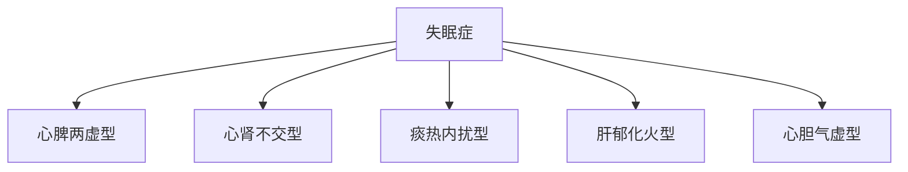
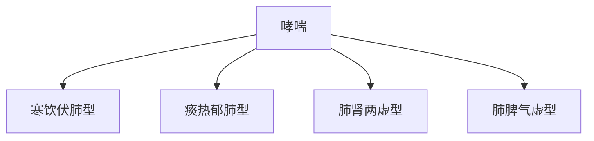
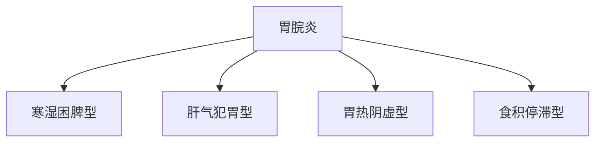
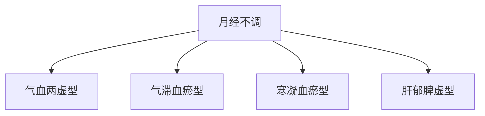

# 常见疾病耳穴治疗方案

> [!abstract] 治疗概述
> 基于耳穴反射原理，针对常见疾病制定系统化的耳穴治疗方案，结合中医辨证论治理论，为临床实践提供标准化指导。

---

## 🧠 神经系统疾病

### 失眠症治疗方案

#### 失眠症辨证分型

#### 心脾两虚型失眠

> [!note] 病症特征
> **主要表现**：难以入睡、多梦易醒、心悸健忘、食少体倦、面色苍白

**舌脉：**舌淡苔白，脉细弱

**病因病机：**心脾两虚，心神失养，血不养神

#### 治疗方案

**主穴配穴：**
- 神门 (HT7) - 安神定志
- 心 (HT7) - 益心宁心
- 脾 (SP6) - 益脾养血
- 肾 (SP10) - 健脾和胃
- 神穴 (TF1) - 交通心肾

**配穴说明：**
- 神门、心穴：安神定志
- 心、脾、肾：交通心肾，水火相济
- 脾、三阴交：益气养血，健脾和胃

**操作方法：**
- 毫日1-2次，每次20-30分钟
- 每周治疗5-6次为一个疗程
- 疗程间隔3-5天

**预期效果：**
- 1-2周：入睡时间缩短
- 2-4周：睡眠质量改善
- 4-6周：睡眠基本正常

#### 心肾不交型失眠

> [!warning] 症状特征
> **主要表现**：心烦失眠，心悸不安，头晕耳鸣，腰膝酸软，潮热盗汗

**舌脉：**舌红少苔，脉细数

**病因病机：**心肾不交，水火不济，心火上扰心神

#### 治疗方案

**主穴配穴：**
- 神门 (HT7) - 安神定志
- 肾 (SP6) - 补肾益精
- 肾俞 (BL23) - 补肾益气
- 太溪 (KI3) - 补肾强腰
- 三阴交 (SP6) - 交通心肾

**配穴方案：**
- 神门、三阴交：心肾相交
- 肾、太溪：滋肾强腰
- 心、肾、三阴交：全方位调节

**操作要点：**
- 先调补肝肾，后安神定志
- 补肾穴位刺激力度适中
- 每周2-3次，10次为一个疗程

---

## 🫃 呼吸系统疾病

### 哮喘治疗方案

#### 寒喘辨证分型

#### 寒饮伏肺型哮喘

> [!note] 病症特征
> **主要表现**：喘息气急，喉中痰鸣，咳痰清稀白，口不渴，恶寒发热

**舌脉：**苔白滑，脉浮紧

**病因病机：**寒饮伏肺，痰浊阻肺，肺气失宣

#### 治疗方案

**主穴配穴：**
- 定喘 (EX-B1) - 平喘降逆
- 肺中 (LU1) - 宣肺化痰
- 肺俞 (LU17) - 肃肃降气
- 脾 (SP13) - 健脾化痰
- 肺谷 (ST40) - 降气平喘

**配穴方案：**
- 定喘、肺俞：宣肺降气，平喘止咳
- 肺中、合谷：清热化痰，调和肺气
- 脾、丰隆：健脾化痰，益气养阴

**操作方法：**
- 急性期每日1次，缓解期隔日1次
- 缓解期每周2-3次
- 10次为一个疗程

---

## ❤️ 心血管系统疾病

### 高血压治疗方案

#### 高血压辨证分型

#### 阴虚阳亢型

> [!tip] 病症特征
> **主要表现**：头晕目眩，头痛失眠，心悸心烦，口苦咽干，烦躁易怒

**舌脉**：舌红少苔，脉弦数有力

**病因病机：**阴虚阳亢，肝阳上亢，肝风内动

#### 治疗方案

**主穴配穴：**
- 肾俞 (BL23) - 滋肾潜阳
- 太冲 (LR3) - 平肝潜阳
- 太溪 (KI3) - 滋肾强腰
- 足泉 (KI1) - 滋肾养阴
- 三阴交 (SP6) - 滋阴平肝

**配穴原理：**
- 肾俞、太溪：滋阴潜阳，引火归元
- 太冲、太溪：平肝潜阳，条达肝经
- 三阴交、涌泉：滋阴养阴，水火既济

**注意事项：**
- 监测血压变化
- 血压极高时暂停治疗
- 出现症状不适应时及时就医

### 冠心病治疗方案

#### 冠心痛辨证分型

#### 气滞血瘀型

> [!important] 病症特征
> **主要表现**：心前区刺痛，胸闷气短，心悸不宁，舌质紫暗有瘀斑

**舌脉：**舌质紫暗或有瘀斑，脉涩

**病因病机：**气滞血瘀，心脉瘀阻

#### 治疗方案

**主穴配穴：**
- 心俞 (BL15) - 活血化瘀
- 内关 (PC6) - 宽心止痛
- 膻中 (CV17) - 宽胸宽胸
- 膈里 (PC6) - 理气降逆
- 神门 (HT7) - 开窍安神

**配穴方案：**
- 心俞、内关：活血化瘀，通络止痛
- 膻中、膻里：宽胸理气
- 神门、神门：开窍醒神

**操作要点：**
- 急性期每日1-2次
- 发作期可增至每日2-3次
- 配合药物治疗

---

## 🫁 消化系统疾病

### 胃胃炎治疗方案

#### 胃胃炎辨证分型

#### 寒湿困脾型胃炎

> [!note] 病症特征
> **主要表现**：胃脘胀满，食欲不振，恶心呕吐，大便溏薄，四肢困重

**舌脉：**舌淡胖，苔白腻，脉濡缓

**病因病机：**寒湿困脾，脾失健运，运化失常

#### 治疗方案

**主穴配穴：**
- 中脘 (CV12) - 健脾和胃
- 胃俞 (BL21) - 疏肝和胃
- 足俞 (BL20) - 降逆和胃
- 足仓 (CV12) - 和胃降逆
- 足枢 (CV4) - 调理中焦

**配穴方案：**
- 中脘、足三里、胃俞：和胃健脾
- 中脘、内关、足三里：调中健胃
- 中脘、上脘、中脘：和胃降逆

**操作方法：**
- 餐前30分钟和餐后30分钟
- 每日1次，10次为一个疗程
- 保留刺激时间10-15分钟

---

## 🦪 骨骨科疾病

### 颈椎病治疗方案

#### 颈椎病辨证分型

#### 颈椎间盘突出症

> [!important] 病症分型
> - **神经根型**：根性疼痛，沿神经放射
> - **脊髓型**：脊髓压迫，出现运动功能障碍
> - **椎动脉型**：椎动脉受压，脑供血不足

#### 颈椎病神经根型治疗方案

**主穴配穴：**
- 颈椎 (GV14) - 疏经活络
- 大肠俞 (BL25) - 舒筋活络
- 环跳 (GB40) - 活血化瘀
- 委中 (DU6) - 调理中焦
- 后溪 (BL54) - 舒筋强腰

**配穴方案：**
- 根据受压神经选择相应节段耳穴
- 配合局部取穴增强效果
- 结合活动锻炼改善

**操作方法：**
- 每日1-2次
- 保留刺激时间15-20分钟
- 2周为一个疗程

---

## 🧠 妇科系统

### 月经不调治疗方案

#### 月经不调辨证分型

#### 气血两虚型月经不调

> [!note] 症状特征
> **主要表现**：月经后期，量少色淡，头晕眼花，心悸失眠，腰膝酸软

**舌脉：**舌淡苔白，脉细弱

**病因病机：**气血两虚，冲任不固，血海空虚

#### 治疗方案

**主穴配穴：**
- 关元 (CV4) - 补元气
- 气海 (CV6) - 补血调经
- 三阴交 (SP6) - 调理冲任
- 肾俞 (BL17) - 调理脾胃
- 气穴 (PE6) - 调理冲任

**配穴方案：**
- 关元、气海：培补元气
- 气海、三阴交：调理冲任
- 肾俞、三阴交：健脾益气

**操作时机：**
- 经前7天开始
- 经期中隔日一次
- 经后期3天一次

---

## 🧠 五官科疾病

### 近视治疗

#### 近视的耳穴治疗

> [!tip] 近视机制
> 眼近视主要是睫状肌调节功能障碍，耳穴刺激可以调节眼部肌肉，改善调节功能。

#### 主穴配穴

| 眼近视度 | 主穴配穴 | 配穴说明 | 预期效果 |
|--------------|------------|----------|--------------|
| 轻度近视 | 肝肾俞 (BL23)、肝俞 (BL18)、目窗 (GB1) | 增强肝肾，明目 | 3-6个月 |
| 中度近视 | 耳尖 (HT7)、耳垂 (LO13)、攒竹 (SI2) | 调节眼部肌肉 | 2-4个月 |
| 高度近视 | 耳屏、耳尖、耳垂 | 强化眼部调节 | 1-3个月 |

#### 治疗方案

**基础治疗：**
- 每日或隔日1次
- 保留刺激时间10-15分钟
- 4-6周为一个疗程

**加强治疗：**
- 每周2-3次
- 保留刺激时间20-30分钟
- 2-3周为一个强化期

---

### 耳鸣治疗

#### 耳鸣的耳穴治疗

> [!warning] 耳鸣可能原因
> 1. 内耳疾病
> 2. 高血压
> 3. 颈椎问题
> 4. 噺力性耳聋

#### 治疗方案

**实证性耳鸣治疗：**
- 听宫 (SI19) - 开窍聪耳
- 角孙 (SI19) - 益肾聪耳
- 耳尖 (HT7) - 清热开窍
- 耳垂 (LO13) - 塞肾益精

**神经性耳鸣治疗：**
- 内分泌调节穴
- 自主神经系统调节穴
- 促进内啡肽分泌

**血管性耳鸣治疗：**
- 改善脑部供血
- 降低血压
- 促进血液循环

---

## 📊 特殊人群治疗

### 儿童耳穴治疗

#### 儿童特点

> [!info] 儿童特殊性
> - 生理特点：脏腑娇嫩，易受外界影响
- **心理特点：注意力不易集中，需要趣味性
- **反应敏感**：对刺激反应较为明显
- **安全第一**：严格控制刺激强度

#### 儿童耳穴选择

> [!check] 安全原则
> - 选择敏感度较低的穴位
- 控制刺激时间和强度
- 使用轻柔的操作手法
- 观察儿童反应并及时调整

**常用儿童穴位：**
- 四神聪 (HT1)
- 耳尖 (HT7)
- 足垂 (LO13)
- 听宫 (SI19)
- 角孙 (SI19)

### 孕妇耳穴治疗

#### 孕妇注意事项

> [!warning] 孕妇禁忌
- **早期妊娠**：避免强刺激穴位
- **中晚期妊娠**：选择安全穴位
- **临产期**：禁止耳穴刺激
- **哺乳期**：减少刺激频率

#### 安全穴位选择

**妊娠期安全穴位：**
- **三阴交**：调理冲任，安全有效
- **足三里**：和胃健脾
- **太溪**：滋阴养肾，安全
- **太冲**：平肝潜阳，谨慎使用

---

## 📊 疗效评价体系

### 疗效评价标准

#### 评价维度

| 评价维度 | 评价指标 | 评价方法 | 等级 |
|----------|----------|------------|------|
| **症状改善** | 症状减轻程度 | 患查量表 | 1-5分 |
| **生活质量** | 日常生活影响 | 调查量表 | 1-5分 |
| **患者满意度** | 主观感受评价 | 访谈询问 | 1-5分 |
| **客观指标** | 可量化指标 | 实验检测 | 客观测量 |
| **医生评价** | 专业判断 | 专家评估 | 专业判断 |

#### 疗效评价量表

> [!tip] 5点量表法
> - **5分**：症状完全消失
> - **4分**：明显改善
> - **3分**：有所改善
> **2分**：轻微改善
- **1分**：无改善或恶化

**疗效等级判断：**
- **显效**：评分≥4分，症状显著改善
- **有效**：评分≥3分，症状有所改善
- **改善**：评分≥2分，轻微改善
- **无效**：评分≤1分，无改善或恶化

### 疗程设计原则

#### 疗程规划

> [!important] 疗程设计要点
> **1. 明确治疗目标**：具体、可衡量
> **2. 设定评价周期**：定期评估效果
> **3. 阶梯式设计**：强度递增
> **4. 综合治疗原则：多方法结合

#### 疗程示例

**第一阶段（1-2周）：**
- 初始评估，制定方案
- 轻柔刺激，建立基础效果
- 患查适应性和不良反应

**第二阶段（3-6周）：**
- 增加刺激强度和频率
- 结合其他治疗方法
- 评估中期效果

**第三阶段（7-12周）：**
- 稳定治疗效果
- 逐渐减少频率
- 制定维持方案

---

## 🔍 预防保健方案

### 常见疾病预防

#### 耳穴预防保健

> [!tip] 预防保健要点
> 1. 定期耳穴按摩
> 2. 注意耳部卫生
> 3- 避免噪音刺激
> 4. 保持良好作息

**预防按摩方案：**
- 每周2-3次全面耳穴按摩
- 重点按摩：神门、肾俞、肝俞、心俞
- 按摩时间：每次15-20分钟
- 按摩力度：舒适即可，避免过度

### 季节调理方案

#### 四季养生方案

**春季养肝：**
- 重点：肝俞、太冲、太溪
- 频率：每周2-3次
- 目的：疏肝理气，调畅气机

**夏季养心：**
- 重点：心俞、神门、内关
- 频率：每周1-2次
- 目标：养心安神，清心除烦

**秋季养肺：**
- 重点：肺俞、尺泽、孔最
- 频率：每周2-3次
- 目的：润肺益气，防燥润肺

**冬季养肾：**
- 重点：肾俞、太溪、气海
- 频率：每周1-2次
- 目的：温补肾阳，填精补髓

---

## 📞 实践案例分享

### 成功案例集锦

#### 失眠症治疗案例

> [!success] 案例概述
> **患者情况**：女性，35岁，失眠2年余
> **诊断结果**：心脾两虚型失眠
> **治疗方案**：耳穴刺激 + 中药调理
> **治疗过程**：8周，15次治疗
> **治疗效果**：睡眠质量显著改善，无需药物

**治疗记录：**
| 治疗次数 | 睡眠质量评分 | 备注 |
|----------|--------------|------|
| 第1次 | 2.5分 | 入睡时间缩短30分钟 |
| 第3次 | 3.0分 | 夜间醒来次数减少 |
| 第5次 | 3.5分 | 淝眠质量提升明显 |
| 第8次 | 4.5分 | 睡眠基本正常 |

#### 高血压控制案例

> [!warning] 案例概述
> **患者情况**：男性，45岁，高血压3年
> **诊断结果**：阴虚阳亢型高血压
> **治疗方案**：耳穴刺激 + 生活方式调整
> **治疗过程**：12周，24次治疗
> **治疗效果**：血压控制稳定，症状显著改善

**血压变化记录：**
| 治疗前 | 治疗中 | 治疗后 |
|----------|----------|----------|
| 160/95 | 140/90 | 130/85 |
| 150/95 | 130/88 | 125/82 |
| 145/90 | 135/85 | 130/80 |

---

## 🔗 相关知识链接

- [[耳穴知识库]] - 耳穴理论基础
- [[安全操作规范]] - 安全操作标准
- [[研究文献索引]] - 最新研究进展
- [[临床应用指南]] - 临床实践指导

---

%% 耳穴治疗需要结合具体情况辨证施治 %%
%% 安全第一，预防为主，治疗为辅 %%