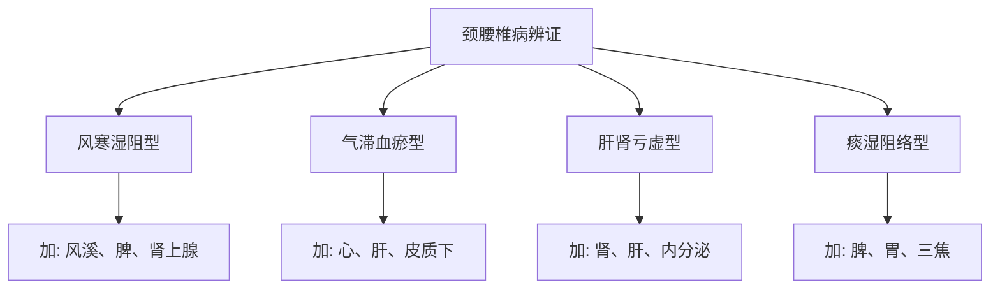
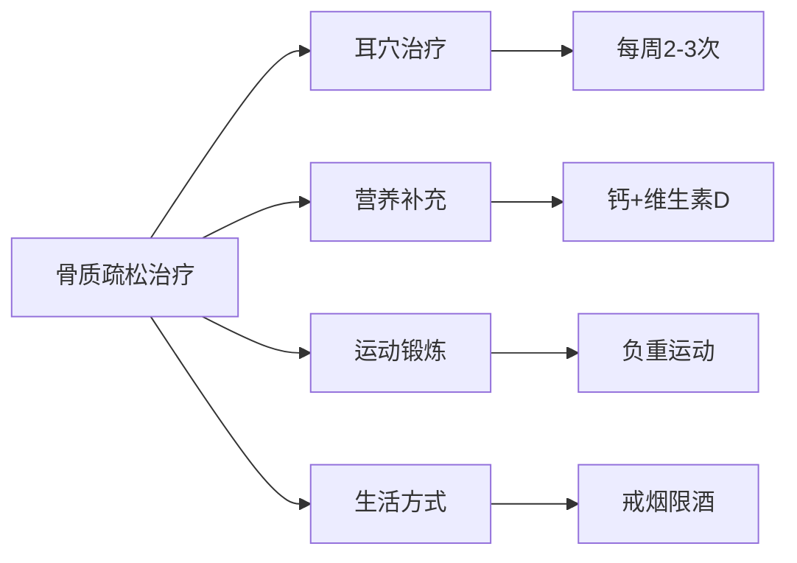

# 骨关节肌肉疾病耳穴治疗方案

## 🎯 治疗概述

### 疾病范围
- 颈椎病、腰椎间盘突出
- 肩周炎、网球肘
- 关节炎、风湿性疾病
- 肌肉拉伤、软组织损伤
- 骨质疏松症
- 运动系统慢性疼痛

### 治疗原则
1. **局部整体结合**: 既治局部病痛，又调全身机能
2. **急慢分别处理**: 急性期消炎镇痛，慢性期功能恢复
3. **动静结合**: 治疗期间配合适当运动
4. **标本兼治**: 缓解症状同时治疗病因

---

## 📋 颈腰椎疾病治疗方案

### 颈椎病基础方
```
主穴：
├── 颈椎 - 直接对应病灶
├── 肩 - 缓解肩部症状
├── 肝 - 筋之所主
├── 肾 - 骨之所主
└── 神门 - 镇痛安神

配穴：
├── 交感 - 调节血管功能
├── 皮质下 - 调节中枢镇痛
├── 肾上腺 - 抗炎镇痛
└── 脾 - 肌肉营养修复
```

### 腰椎间盘突出症
```
主穴：
├── 腰椎 - 直接对应病灶
├── 肾 - 补肾强腰
├── 臀 - 缓解臀部症状
├── 坐骨神经 - 沿经脉取穴
└── 神门 - 镇痛安神

配穴：
├── 膝 - 缓解放射痛
├── 肝 - 舒筋活络
├── 脾 - 健脾益气
└── 肾上腺 - 减轻炎症水肿
```

### 辨证加减


---

## 📋 肩关节疾病治疗方案

### 肩周炎（五十肩）
```
主穴：
├── 肩 - 直接对应病灶
├── 锁骨 - 调节锁骨周围
├── 肝 - 筋之所主
├── 脾 - 肌肉主司
└── 神门 - 镇痛安神

配穴：
├── 颈椎 - 颈肩综合症
├── 肾上腺 - 抗炎镇痛
├── 交感 - 调节血管
└── 皮质下 - 调节运动中枢
```

### 分期治疗
| 病期 | 治疗重点 | 穴位配伍 | 刺激强度 | 功能锻炼 |
|------|----------|----------|----------|----------|
| 急性期 | 消炎镇痛 | 肾上腺+交感 | 轻刺激 | 适当休息 |
| 粘连期 | 松解粘连 | 肝+脾+皮质下 | 中刺激 | 悬垂练习 |
| 恢复期 | 功能恢复 | 肾+肝+内分泌 | 重刺激 | 全面锻炼 |

---

## 📋 关节炎治疗方案

### 类风湿性关节炎
```
主穴：
├── 相应关节穴 - 对应患病关节
├── 肾上腺 - 抗炎免疫调节
├── 内分泌 - 调节免疫平衡
├── 肝 - 舒筋活血
└── 脾 - 健脾除湿

配穴：
├── 神门 - 镇痛安神
├── 交感 - 调节自主神经
├── 皮质下 - 调节免疫中枢
└── 三焦 - 通经活络
```

### 骨性关节炎
```
主穴：
├── 相应关节穴 - 直接对应
├── 肾 - 补肾壮骨
├── 肝 - 养血柔筋
├── 脾 - 健脾益气
└── 肾上腺 - 消炎镇痛

配穴：
├── 内分泌 - 调节代谢
├── 钙点 - 促进钙质代谢
├── 皮质下 - 调节中枢
└── 神门 - 改善疼痛
```

---

## 📋 软组织损伤治疗方案

### 急性软组织损伤
```
急救穴位：
├── 相应部位穴 - 对应受伤部位
├── 肾上腺 - 抗炎消肿
├── 神门 - 镇痛安神
├── 交感 - 调节血管收缩
└── 皮质下 - 调节应激反应

治疗方法：
├── 24-48小时内: 冰敷+轻刺激
├── 48小时后: 热敷+中强刺激
├── 恢复期: 配合适当运动
└── 慢性期: 综合康复治疗
```

### 慢性劳损
```
主穴：
├── 相应部位穴 - 病灶对应
├── 肾 - 滋养筋骨
├── 肝 - 舒筋活络
├── 脾 - 补益肌肉
└── 内分泌 - 促进修复

配穴：
├── 神门 - 缓解疼痛
├── 肾上腺 - 消除炎症
├── 三焦 - 通经活络
└── 皮质下 - 调节修复机能
```

---

## 📋 骨质疏松症治疗方案

### 基础治疗方案
```
主穴：
├── 肾 - 补肾壮骨
├── 肝 - 养血柔筋
├── 脾 - 健脾益气
├── 内分泌 - 调节激素
└── 钙点 - 促进钙质代谢

配穴：
├── 甲状腺 - 调节钙磷代谢
├── 肾上腺 - 调节应激
├── 皮质下 - 调节中枢
└── 腰椎 - 强化腰椎骨骼
```

### 综合干预措施


---

## 📊 疗效评估体系

### 疼痛评估
- **VAS评分**: 视觉模拟评分法
- **McGill评分**: 多维度疼痛评估
- **功能障碍**: 关节活动度测量
- **生活质量**: SF-36量表评估

### 功能评估
| 评估项目 | 评估方法 | 改善标准 | 评估时间 |
|----------|----------|----------|----------|
| 疼痛程度 | VAS评分 | 降低≥50% | 每周评估 |
| 关节活动度 | 测角器测量 | 增加≥20° | 每两周评估 |
| 功能状态 | ADL量表 | 提高1-2级 | 每月评估 |
| 心理状态 | SAS/SDS | 改善≥30% | 每月评估 |

---

## ⚠️ 注意事项与禁忌

### 治疗注意事项
1. **急性期处理**: 先控制炎症，后功能恢复
2. **刺激强度**: 根据患者体质和病情调整
3. **配合锻炼**: 治疗期间配合适当功能锻炼
4. **定期评估**: 及时调整治疗方案

### 禁忌情况
- 急性骨折未愈合
- 严重感染性疾病
- 恶性肿瘤骨转移
- 严重心脑血管疾病
- 出血性疾病

---

## 🎯 运动康复指导

### 颈椎病康复操
1. **颈部放松**: 前后左右缓慢活动
2. **肩部运动**: 耸肩、绕肩动作
3. **颈部抗阻**: 手掌抵抗头部运动
4. **拉伸运动**: 颈部侧向拉伸

### 腰椎病康复操
1. **腰背肌锻炼**: 小燕飞、五点支撑
2. **核心稳定**: 平板支撑、侧平板
3. **柔韧性**: 前屈、后伸、侧屈
4. **协调性**: 平衡训练、步态训练

---

## 🔗 相关链接

- [骨关节现代研究](../08_实践指南/运动康复指南.md)
- [疼痛管理技术](../05_诊断技术/疼痛评估方法.md)
- [骨骼肌肉解剖](../01_理论基础/耳穴解剖基础.md)
- [康复训练指导](../08_实践指南/功能锻炼指导.md)

---

## 📞 联系与咨询

**骨关节专科**: 每周一、三、五上午
**康复指导**: 每周二、四下午
**预约热线**: 400-XXX-XXXX
**在线咨询**: 官方网站预约平台

*本文档持续更新中，最新版本日期: 2026-01-25*