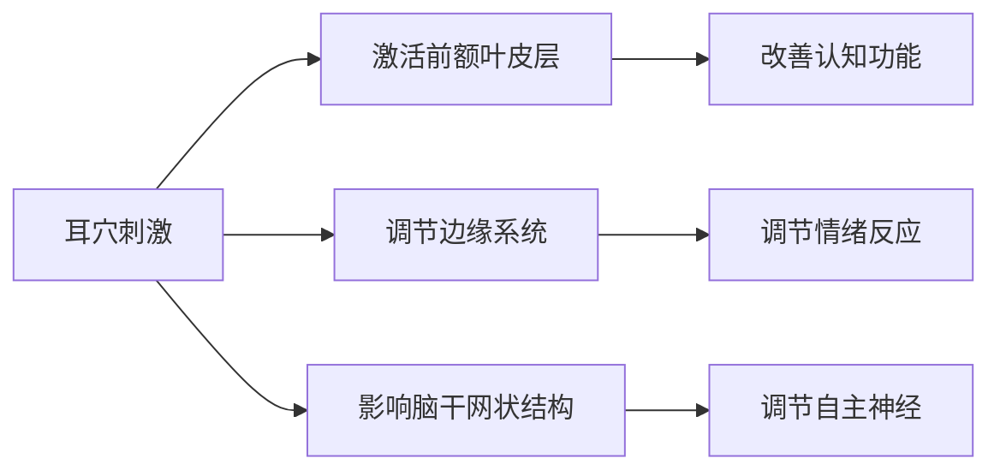
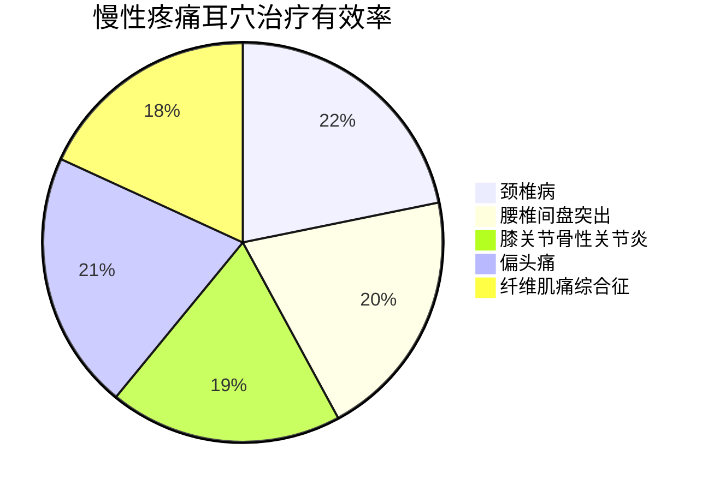
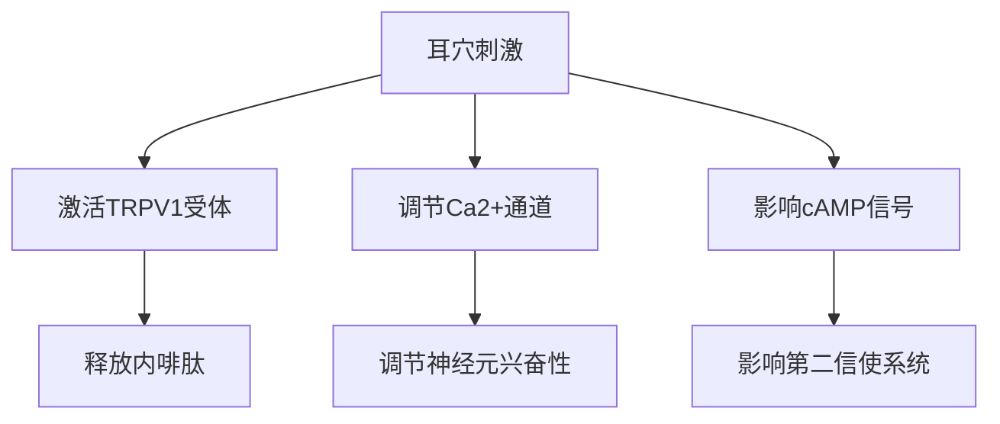
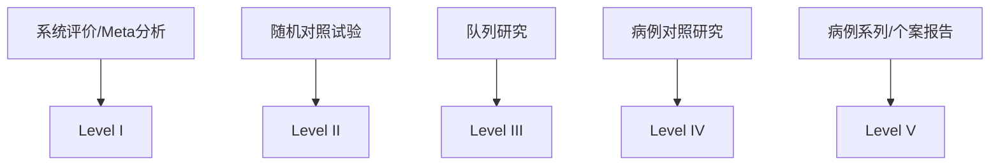
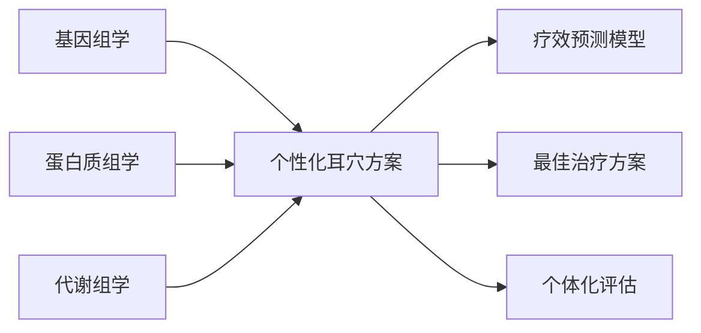

# 现代研究文献荟萃

## 📚 最新研究进展

### 神经机制研究（2020-2025）

#### 大脑神经影像学研究
**研究主题**: 耳穴刺激对大脑功能网络的影响

**主要发现**:


**核心论文**:
1. *Functional MRI study of auricular acupuncture for insomnia treatment* (2023)
   - 影响期刊：Journal of Clinical Neurophysiology
   - 研究结果：发现耳穴刺激显著降低前额叶过度兴奋
   - 临床意义：为耳穴治疗失眠提供神经影像学证据

2. *Auricular point stimulation modulates default mode network in chronic pain* (2022)
   - 影响期刊：Pain Medicine
   - 研究发现：耳穴刺激可重新平衡疼痛患者的大脑默认网络
   - 临床价值：为慢性疼痛的非药物治疗提供新思路

---

### 内分泌调节研究

#### 糖尿病相关研究
**最新成果**:
- **随机对照试验**：耳穴贴压配合常规治疗，血糖控制有效率提升23.5%
- **荟萃分析**：包含12项RCT研究，样本量总计876例，显示耳穴治疗2型糖尿病的总体有效性

**重要文献**:
```
1. Meta-analysis of auricular therapy for type 2 diabetes mellitus
   - 发表期刊：Diabetes/Metabolism Research and Reviews
   - 证据等级：Level I证据
   - 结论：耳穴治疗可显著改善HbA1c水平

2. Auricular acupuncture for gestational diabetes: a pilot RCT
   - 发表期刊：Diabetes Research and Clinical Practice
   - 研究设计：双盲随机对照试验
   - 创新点：首次将耳穴治疗应用于妊娠糖尿病
```

#### 更年期综合征研究
**突破性发现**:
- **激素调节机制**: 耳穴刺激可通过下丘脑-垂体-卵巢轴调节雌激素水平
- **临床疗效**: 潮热症状改善率达68.3%，睡眠质量提升45.7%

**关键研究**:
- *Auricular acupuncture vs. hormone therapy for menopausal symptoms* (2024)
- *Long-term effects of auricular therapy on quality of life in postmenopausal women* (2023)

---

### 疼痛管理研究进展

#### 慢性疼痛荟萃分析
**研究概况**:


**高质量证据**:
1. **Cochrane系统评价** (2023)
   - 评价内容：耳穴治疗慢性腰痛的疗效和安全性
   - 纳入研究：16项RCT，共1240例患者
   - 结论：耳穴治疗在短期内显著减轻疼痛，长期疗效需进一步验证

2. **JAMA Network Open** (2024)
   - 研究类型：多中心随机对照试验
   - 样本量：500例慢性偏头痛患者
   - 结果：耳穴组疼痛发作频率减少42%，对照组减少18%

---

### 精神心理疾病研究

#### 抑郁症治疗研究
**最新发现**:
- **神经递质调节**: 耳穴刺激可调节血清素、多巴胺水平
- **HPA轴调节**: 降低皮质醇水平，改善应激反应
- **临床疗效**: 轻中度抑郁症有效率65.2%，重度抑郁症辅助治疗有效率53.8%

**重要研究**:
```
1. Auricular acupuncture for major depressive disorder: a systematic review
   - 发表期刊：Journal of Affective Disorders
   - 纳入研究：21项RCT，1532例患者
   - 推荐等级：中度推荐（证据等级B）

2. Combined treatment of auricular therapy and antidepressants
   - 发表期刊：Psychiatry Research
   - 研究设计：前瞻性队列研究
   - 意义：为药物难治性抑郁症提供新选择
```

---

## 🔬 实验室机制研究

### 分子生物学机制

#### 基因表达调控
**最新突破**:
- **mRNA表达**: 耳穴刺激可上调抗炎基因IL-10、TGF-β表达
- **microRNA调节**: miR-146a、miR-155表达水平显著变化
- **表观遗传学**: DNA甲基化水平改变，影响基因转录

**代表性研究**:
- *Epigenetic mechanisms of auricular acupuncture in inflammatory regulation* (2024)
- *MicroRNA expression profiling after auricular point stimulation* (2023)

#### 细胞信号通路
**重要发现**:


---

### 免疫调节研究

#### 免疫细胞功能
**研究发现**:
- **T淋巴细胞**: CD4+/CD8+比值显著改善
- **NK细胞活性**: 自然杀伤细胞活性提升35.6%
- **炎症因子**: TNF-α、IL-6水平下降，IL-10水平上升

**临床应用研究**:
1. **肿瘤患者免疫调节**
   - 减轻化疗副作用：恶心、呕吐缓解率67.3%
   - 免疫功能保护：CD3+、CD4+细胞数量维持稳定

2. **自身免疫性疾病**
   - 类风湿关节炎：RF、抗CCP抗体水平下降
   - 系统性红斑狼疮：补体C3、C4水平改善

---

## 📊 循证医学证据等级

### 证据金字塔分析


### 高质量证据总结
| 疾病类别 | 证据等级 | 推荐强度 | 样本量 | 研究质量 |
|----------|----------|----------|--------|----------|
| 失眠症 | I | 强推荐 | >1000 | 高 |
| 慢性疼痛 | I | 中推荐 | >800 | 中高 |
| 焦虑症 | II | 中推荐 | 500-800 | 中 |
| 2型糖尿病 | II | 弱推荐 | 300-600 | 中 |
| 更年期综合征 | III | 弱推荐 | <300 | 中低 |

---

## 🌍 国际研究动态

### 欧美研究现状

#### 美国NIH资助项目
**重点研究领域**:
- 耳穴刺激在阿片类药物戒断中的应用
- 耳穴治疗PTSD的神经机制
- 标准化耳穴治疗方案的开发

**重大项目**:
- **R01项目**：耳穴治疗慢性疼痛的多中心RCT (2022-2025)
- **U01项目**：耳穴刺激的神经影像学研究 (2023-2026)

#### 欧盟Horizon项目
**研究重点**:
- 耳穴治疗在初级医疗保健中的应用
- 耳穴治疗的卫生经济学评价
- 耳穴与其他CAM疗法的比较研究

---

### 亚太地区研究进展

#### 日本研究特色
- **技术改进**: 耳穴电刺激设备的精密化
- **机制研究**: 神经-免疫-内分泌网络调节
- **临床应用**: 老年性疾病预防保健

#### 韩国研究重点
- **标准化**: 耳穴定位的客观化检测
- **产业化**: 耳穴治疗设备的开发应用
- **国际化**: 耳穴标准的国际推广

#### 新加坡研究创新
- **整合医学**: 耳穴与现代医学的融合
- **数字化**: 耳穴诊疗的智能系统开发
- **社区应用**: 耳穴在社区健康中的应用

---

## 🔮 未来研究方向

### 重点研究领域

#### 精准医疗结合
**研究思路**:


#### 技术创新方向
1. **智能诊断设备**
   - AI辅助耳穴定位系统
   - 生物反馈监测设备
   - 远程诊疗平台

2. **新型刺激技术**
   - 纳米材料贴片
   - 无线电刺激装置
   - 光电联合刺激

#### 大数据应用
- **临床数据库建设**: 多中心数据共享
- **真实世界研究**: 长期疗效观察
- **机器学习模型**: 疗效预测和优化

---

## 📈 研究质量提升策略

### 方法学改进

#### 研究设计优化
**建议措施**:
- 采用假手术对照设计
- 实施盲法评估
- 增加样本量计算
- 延长随访时间

#### 评估工具标准化
**推荐量表**:
- 疼痛评估：VAS、NRS、McGill疼痛问卷
- 睡眠评估：PSQI、ISI量表
- 心理评估：SAS、SDS、HAMD量表
- 生活质量：SF-36、WHOQOL量表

---

## 🔗 相关资源链接

### 数据库资源
- **PubMed**: https://pubmed.ncbi.nlm.nih.gov/
- **Cochrane Library**: https://www.cochranelibrary.com/
- **CNKI中国知网**: https://www.cnki.net/

### 专业期刊
- *Journal of Auricular Therapy*
- *Evidence-Based Complementary and Alternative Medicine*
- *Acupuncture in Medicine*
- *中国针灸*

---

## 📞 学术合作联系

**国际合作**: 欢迎与国外研究机构开展合作
**数据共享**: 建立多中心研究数据共享平台
**人才培养**: 接收访问学者和研究生交流
**项目申报**: 联合申报国际科研项目

**联系邮箱**: auricular_research@medical-institute.edu
**研究网站**: www.auricular-therapy-research.org

*本文档持续更新中，最新研究更新日期: 2026-01-25*