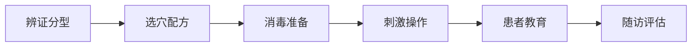

# {{title}}

> 📋 **治疗方案** | 🎯 **疾病**：{{disease}} | 📊 **疗效等级**：{{evidence-level}} | ⭐ **成功率**：{{success-rate}}

## 📖 概述

> **简要描述**：{{description}}

### 🎯 治疗目标
- {{goal-1}}
- {{goal-2}}
- {{goal-3}}

### 📊 疗效数据
- **总有效率**：{{overall-success-rate}}
- **显效率**：{{marked-effectiveness-rate}}
- **起效时间**：{{onset-time}}
- **最佳疗程**：{{optimal-treatment-duration}}

## 🔍 中医辨证分型

### 💡 辨证要点
{{syndrome-differentiation-points}}

### 📋 分型详细分析

#### {{syndrome-1}}
**临床表现**：
- {{symptom-1}}
- {{symptom-2}}
- {{symptom-3}}

**病机分析**：
{{pathogenesis-analysis-1}}

#### {{syndrome-2}}
**临床表现**：
- {{symptom-1}}
- {{symptom-2}}
- {{symptom-3}}

**病机分析**：
{{pathogenesis-analysis-2}}

## 🎯 耳穴治疗方案

### 📍 基础处方
**核心穴位**：
- [[{{acupoint-1}}]] - {{acupoint-1-function}}
- [[{{acupoint-2}}]] - {{acupoint-2-function}}
- [[{acupoint-3}}]] - {{acupoint-3-function}}
- [[{acupoint-4}}]] - {{acupoint-4-function}}

**配穴**：
- [[{acupoint-5}}]] - {{acupoint-5-function}}
- [[{acupoint-6}}]] - {{acupoint-6-function}}

### 🎨 辨证加减

#### {{syndrome-type-1}}
| 主穴 | 配穴 | 功效 | 刺激方法 |
|------|------|------|----------|
| {{main-acupoints}} | {{auxiliary-acupoints}} | {{efficacy}} | {{stimulation-method}} |

**治疗方案**：
- **主穴**：{{main-points}}
- **配穴**：{{auxiliary-points}}
- **刺激方法**：{{stimulation-technique}}
- **治疗频次**：{{treatment-frequency}}

#### {{syndrome-type-2}}
| 主穴 | 配穴 | 功效 | 刺激方法 |
|------|------|------|----------|
| {{main-acupoints}} | {{auxiliary-acupoints}} | {{efficacy}} | {{stimulation-method}} |

**治疗方案**：
- **主穴**：{{main-points}}
- **配穴**：{{auxiliary-points}}
- **刺激方法**：{{stimulation-technique}}
- **治疗频次**：{{treatment-frequency}}

## 🔧 技术操作规范

### 📋 治疗流程


### 🌟 操作要点

#### 📍 定位技术
{{location-technique-points}}

#### 🎯 刺激方法选择

##### {{method-1}}
- **适用患者**：{{applicable-patients}}
- **操作要点**：
  - {{key-point-1}}
  - {{key-point-2}}
  - {{key-point-3}}
- **参数设置**：{{parameter-settings}}

##### {{method-2}}
- **适用患者**：{{applicable-patients}}
- **操作要点**：
  - {{key-point-1}}
  - {{key-point-2}}
  - {{key-point-3}}
- **参数设置**：{{parameter-settings}}

### 📅 治疗时间安排

#### 🗓️ 疗程设计
| 阶段 | 时间 | 治疗频次 | 目标 |
|------|------|----------|------|
| **急性期** | {{acute-phase-time}} | {{acute-frequency}} | {{acute-goal}} |
| **巩固期** | {{consolidation-phase-time}} | {{consolidation-frequency}} | {{consolidation-goal}} |
| **维持期** | {{maintenance-phase-time}} | {{maintenance-frequency}} | {{maintenance-goal}} |

#### 🕐 每次治疗安排
- **治疗时间**：{{treatment-time-per-session}}
- **穴位数量**：{{number-of-acupoints}}
- **刺激强度**：{{stimulation-intensity}}
- **治疗后观察**：{{post-treatment-observation}}

## 📊 疗效评价标准

### 📈 评价指标
{{evaluation-indicators}}

#### 🎯 疗效分级
- **显效**：{{marked-effectiveness-criteria}}
- **有效**：{{effectiveness-criteria}}
- **好转**：{{improvement-criteria}}
- **无效**：{{ineffectiveness-criteria}}

### 📋 影响疗效因素
| 因素 | 影响程度 | 优化建议 |
|------|----------|----------|
| **穴位选择** | {{factor-1-impact}} | {{factor-1-optimization}} |
| **贴压技术** | {{factor-2-impact}} | {{factor-2-optimization}} |
| **按压依从性** | {{factor-3-impact}} | {{factor-3-optimization}} |
| **个体差异** | {{factor-4-impact}} | {{factor-4-optimization}} |

## ⚠️ 特殊人群处理

### 👶 儿童患者
**特点**：
{{pediatric-characteristics}}

**治疗方案**：
{{pediatric-treatment-plan}}

### 👴 老年患者
**特点**：
{{geriatric-characteristics}}

**治疗方案**：
{{geriatric-treatment-plan}}

### 🤰 孕妇患者
**特点**：
{{pregnant-characteristics}}

**治疗方案**：
{{pregnant-treatment-plan}}

## 🔄 随访管理

### 📅 随访计划
| 随访时间 | 随访内容 | 评估指标 | 处理原则 |
|----------|----------|----------|----------|
| **1周** | {{1-week-follow-up}} | {{1-week-indicators}} | {{1-week-management}} |
| **2周** | {{2-week-follow-up}} | {{2-week-indicators}} | {{2-week-management}} |
| **4周** | {{4-week-follow-up}} | {{4-week-indicators}} | {{4-week-management}} |
| **8周** | {{8-week-follow-up}} | {{8-week-indicators}} | {{8-week-management}} |
| **3个月** | {{3-month-follow-up}} | {{3-month-indicators}} | {{3-month-management}} |

### 📋 随访内容
- **症状改善**：{{symptom-improvement}}
- **功能恢复**：{{functional-recovery}}
- **不良反应**：{{adverse-reactions}}
- **生活质量**：{{quality-of-life}}

### 🎯 复发处理
- **轻度复发**：{{mild-relapse-management}}
- **中度复发**：{{moderate-relapse-management}}
- **重度复发**：{{severe-relapse-management}}

## 💡 患者教育

### 📚 健康教育内容
{{health-education-content}}

### 📋 患者指导卡
```
🌙 {{disease}} 耳穴治疗指导卡

📍 今日贴压穴位：{{today-acupoints}}
🕐 按压时间：{{pressing-time}}
⏱️ 按压方法：{{pressing-method}}
🔄 更换时间：{{replacement-time}}
⚠️ 注意事项：{{precautions}}

📞 医生联系方式：{{doctor-contact}}
```

## 📚 循证证据

### 📊 临床研究数据
- **RCT研究**：{{rct-study-data}}
- **Meta分析**：{{meta-analysis-data}}
- **系统评价**：{{systematic-review-data}}
- **安全性评价**：{{safety-evaluation-data}}

### 📖 重要参考文献
1. [[{{reference-1}}]]
2. [[{{reference-2}}]]
3. [[{{reference-3}}]]
4. [[{{reference-4}}]]

---

## 💡 核心要点总结

- 🎯 **辨证关键**：{{key-differentiation-points}}
- 📍 **穴位核心**：{{key-acupoints}}
- 🌰 **方法首选**：{{preferred-method}}
- ⏱️ **疗程安排**：{{treatment-course}}
- ⚠️ **安全注意**：{{safety-precautions}}
- 🎯 **疗效预期**：{{expected-outcomes}}

---

> 📌 **下一步建议**：{{next-step-suggestion}}

🔗 **相关方案**：{{related-treatment-plans}}

---
**📝 创建时间**：{{creation-date}} | **🔄 最后更新**：{{last-update-date}} | **🏷️ 标签**：{{tags}}