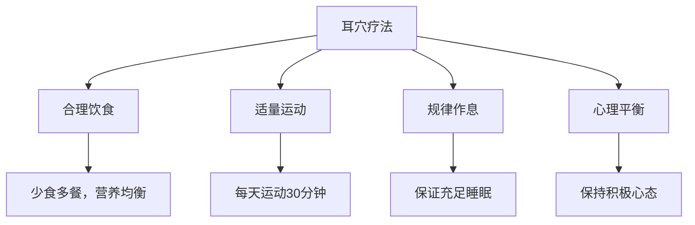

# 耳穴疗法患者教育指南

## 🌟 欢迎了解耳穴疗法

### 什么是耳穴疗法？
耳穴疗法是中医传统医学的重要组成部分，通过刺激耳朵上的特定穴位来调节全身功能。耳朵就像一个倒置的胎儿，全身的器官都在耳朵上有对应的反射区。

### 耳穴疗法的特点
- ✅ **安全无副作用**：不依赖药物，适合长期使用
- ✅ **简便易学**：可以自己在家进行日常保健
- ✅ **疗效持久**：通过调节身体自愈能力达到治疗效果
- ✅ **应用广泛**：可用于预防和治疗多种疾病

---

## 🏥 治疗前准备

### 首次就诊须知
```
治疗时间：约30-45分钟
穿着建议：舒适宽松的衣物
饮食注意：避免过饱或过饿就诊
心理准备：放松心情，配合检查
```

### 需要告知医生的情况
- 📋 正在服用的药物
- 📋 过敏史（特别是胶布过敏）
- 📋 出血性疾病
- 📋 心脏起搏器使用
- 📋 怀孕或哺乳期
- 📋 皮肤病或耳部感染

---

## 🎯 治疗过程介绍

### 第一步：诊断检查
医生会仔细检查您的耳朵，包括：
1. **望诊**：观察耳朵的颜色、形态变化
2. **触诊**：用探针寻找压痛点和阳性反应
3. **电测**：使用专业设备检测穴位电阻变化

### 第二步：穴位定位
医生会根据您的具体情况选择相应的治疗穴位：
- **主穴**：针对主要症状的核心穴位
- **配穴**：配合治疗的相关穴位
- **阿是穴**：根据检查发现的敏感点

### 第三步：实施治疗
常用治疗方法：
```
王不留行籽贴压：
├── 小小的中药种子贴在穴位上
├── 通过按压产生治疗作用
├── 一般保留3-5天
└── 患者可自行按压巩固疗效

按摩刺激：
├── 医生用专业手法刺激穴位
├── 每个穴位按摩1-2分钟
├── 感觉酸胀为宜
└── 当即见效，适合急性症状
```

---

## 🏡 家庭自我保健

### 日常按摩方法

#### 基础按摩手法
1. **揉按法**：用拇指和食指轻轻揉按穴位
2. **点压法**：用指尖垂直点压穴位
3. **搓揉法**：双手搓热后搓揉整个耳廓
4. **提拉法**：轻轻提拉耳垂和耳轮

#### 常用保健穴位
```
神门穴：安神助眠，缓解焦虑
位置：耳廓三角窝内上方

内分泌穴：调节激素，美容养颜
位置：耳甲腔屏间切迹处

胃穴：健脾和胃，助消化
位置：耳轮脚消失处

肾穴：补肾壮腰，抗衰老
位置：对耳轮下脚下方
```

### 按摩时间和频率
- **日常保健**：每天1-2次，每次5-10分钟
- **疾病治疗**：每天2-3次，每次10-15分钟
- **最佳时间**：早晨起床后和晚上睡觉前
- **持续时间**：每个疗程2-4周，休息1周后可继续

---

## 📋 常见疾病居家调理

### 失眠调理方案
```
主要穴位：
├── 神门 - 安神定志
├── 皮质下 - 调节大脑皮层
├── 心 - 清心安神
└── 肾 - 滋阴降火

操作方法：
1. 睡前30分钟开始按摩
2. 每穴按压1-2分钟
3. 感觉轻微酸胀为宜
4. 配合深呼吸放松
```

### 消化不良调理
```
主要穴位：
├── 胃 - 和胃消食
├── 脾 - 健脾益气
├── 大肠 - 通腑导滞
└── 交感 - 调节胃肠功能

操作方法：
1. 饭后30分钟进行
2. 顺时针轻柔按摩
3. 每穴1分钟左右
4. 配合腹部按摩更佳
```

### 颈肩酸痛缓解
```
主要穴位：
├── 颈椎 - 直接对应病灶
├── 肩 - 缓解肩部症状
├── 肝 - 舒筋活络
└── 肾上腺 - 消炎镇痛

操作方法：
1. 工作间隙随时进行
2. 用力按压，感觉酸胀
3. 配合颈部运动
4. 避免过度用力
```

---

## ⚠️ 注意事项

### 治疗期间注意事项
1. **保持清洁**：治疗期间保持耳部干燥清洁
2. **避免沾水**：贴压期间避免洗头时弄湿耳朵
3. **按时按压**：每天按时按压穴位，巩固疗效
4. **观察反应**：注意观察皮肤是否有过敏反应

### 禁忌情况
- ❌ **严重心脏病患者**：需医生指导下进行
- ❌ **孕妇**：避免刺激子宫、卵巢等穴位
- ❌ **出血性疾病**：血小板减少、血友病等
- ❌ **耳部感染**：耳部有湿疹、炎症或破损
- ❌ **极度疲劳**：过度疲劳或醉酒状态

### 可能出现的反应
```
正常反应：
├── 轻微酸胀感 - 正常治疗反应
├── 局部发红 - 血液循环改善
├── 短暂加重 - 治疗调整期反应
└── 身体轻松 - 治疗起效表现

异常反应：
├── 严重疼痛 - 立即停止治疗
├── 皮肤过敏 - 及时就医处理
├── 头晕恶心 - 可能是过度刺激
└── 心悸胸闷 - 立即停止并就医
```

---

## 📈 疗效评估

### 症状改善评估表
请根据您的实际情况填写：

| 症状 | 治疗前 | 第1周 | 第2周 | 第4周 |
|------|--------|--------|--------|--------|
| 主要不适 | (1-10分) | (1-10分) | (1-10分) | (1-10分) |
| 睡眠质量 | (1-10分) | (1-10分) | (1-10分) | (1-10分) |
| 精神状态 | (1-10分) | (1-10分) | (1-10分) | (1-10分) |
| 日常功能 | (1-10分) | (1-10分) | (1-10分) | (1-10分) |

*评分标准：1分=非常差，10分=非常好*

### 何时复诊
- ✅ **治疗完成**：完成一个疗程后进行评估
- ✅ **症状反复**：症状好转后再次出现
- ✅ **新的问题**：出现新的症状需要调整治疗
- ✅ **定期体检**：建议每3个月进行一次全面评估

---

## 🎯 健康生活建议

### 结合耳穴疗法的生活方式


### 推荐健康习惯
1. **饮食调理**：根据体质选择适合的食物
2. **运动锻炼**：选择适合的运动方式和强度
3. **睡眠管理**：保持规律的作息时间
4. **压力管理**：学会放松和缓解压力的方法
5. **定期检查**：定期进行健康体检和评估

---

## ❓ 常见问题解答

### Q1: 耳穴疗法疼吗？
**A**: 耳穴疗法是安全无痛的。在按压穴位时可能会感到轻微的酸胀感，这是正常的治疗反应，说明穴位得到了有效刺激。

### Q2: 治疗多久能看到效果？
**A**: 效果因人而异。急性症状如疼痛可能在治疗后立即缓解，慢性疾病通常需要2-4周才能看到明显改善。

### Q3: 可以自己在家治疗吗？
**A**: 在医生指导下，一些简单的保健方法可以在家进行。但疾病治疗建议在专业医生指导下进行。

### Q4: 耳穴疗法有副作用吗？
**A**: 耳穴疗法是一种非常安全的治疗方法，几乎没有副作用。极少数人可能出现轻微的皮肤过敏，通常在停止治疗后很快消失。

### Q5: 可以和其他治疗方法一起用吗？
**A**: 耳穴疗法可以与大多数其他治疗方法结合使用，包括西药、中药、物理治疗等。但请告知医生您正在接受的所有治疗。

---

## 📞 紧急联系方式

### 24小时咨询电话
- **急救电话**：120或999
- **院外咨询**：400-XXX-XXXX
- **在线客服**：官方网站在线咨询

### 复诊预约
- **电话预约**：周一至周五 8:00-17:00
- **微信预约**：关注官方微信公众号
- **现场预约**：门诊一楼预约中心

### 患者交流群
- **微信群**：扫描二维码加入患者交流群
- **QQ群**：XXXXXXXX
- **患者论坛**：www.ear-therapy-patients.com

---

## 🔗 更多学习资源

### 推荐阅读
- 《耳穴疗法入门指南》
- 《常见疾病耳穴调理手册》
- 《耳穴按摩保健图解》

### 视频教程
- 基础耳穴按摩手法
- 常见症状自我调理
- 耳穴定位演示

---

*感谢您信任耳穴疗法，祝您早日康复！*
*本文档更新日期：2026-01-25*