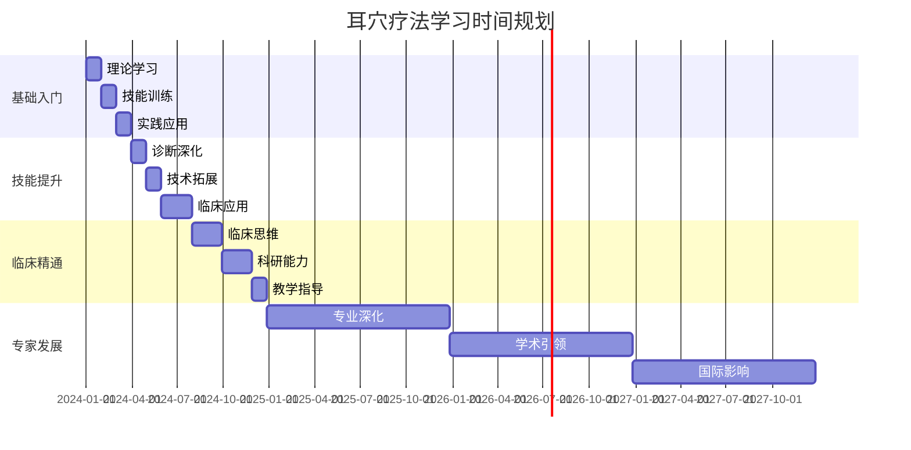
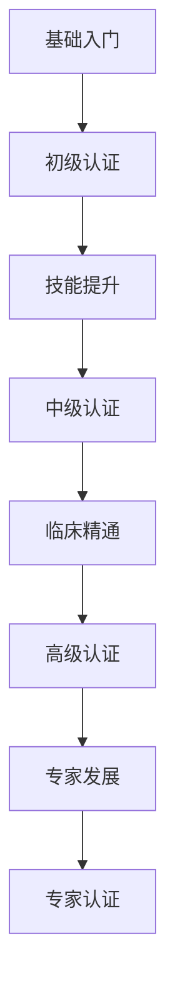

# 耳穴疗法系统学习路线图

## 🎯 学习目标总览

### 培养目标
培养具备扎实理论基础、熟练操作技能、丰富临床经验和科研创新能力的复合型耳穴专业人才。

### 能力要求
- **理论掌握**: 深入理解耳穴理论体系和作用机制
- **技能熟练**: 精准定位、规范操作、安全治疗
- **临床应用**: 独立诊断、制定方案、评估疗效
- **科研能力**: 文献检索、临床研究、学术交流
- **教学指导**: 传承技术、培养新人、推广普及

---

## 📚 分阶段学习路线

### 第一阶段：基础入门（1-3个月）

#### 🎯 学习目标
- 掌握耳穴疗法基本概念和发展历史
- 熟悉耳部解剖结构和穴位分布规律
- 了解基本操作方法和安全注意事项
- 能够进行简单的自我保健和基础治疗

#### 📋 核心学习内容

##### 理论基础模块
```
第1周：耳穴疗法概述
├── 定义与基本概念
├── 发展历史与现状
├── 理论体系特点
└── 临床应用范围

第2周：耳部解剖基础
├── 耳廓解剖结构
├── 神经血管分布
├── 胚胎发育基础
└── 反射区形成原理

第3周：耳穴定位原理
├── 耳穴分布规律
├── 国际标准定位
├── 常用穴位识别
└── 定位技巧方法
```

##### 操作技能模块
```
第4-6周：基础操作技术
├── 耳部检查方法
│   ├── 望诊技术
│   ├── 触诊技术
│   ├── 问诊技巧
│   └── 电测方法
├── 基础刺激方法
│   ├── 按压技术
│   ├── 贴压技术
│   ├── 按摩手法
│   └── 注意事项
└── 安全操作规范
    ├── 消毒隔离
    ├── 禁忌症识别
    ├── 异常反应处理
    └── 应急预案
```

##### 实践应用模块
```
第7-8周：基础临床应用
├── 常见症状处理
│   ├── 头痛头晕
│   ├── 失眠多梦
│   ├── 颈肩酸痛
│   └── 消化不良
├── 自我保健方法
│   ├── 日常按摩
│   ├── 保健穴位
│   ├── 预防保健
│   └── 生活指导
└── 案例分析学习
    ├── 典型病例
    ├── 治疗方案
    ├── 疗效观察
    └── 经验总结
```

#### 🎯 考核标准
- **理论考试**: 基础知识掌握程度（80分以上）
- **技能考核**: 基本操作规范性（85分以上）
- **实践评估**: 简单病例处理能力（合格）

---

### 第二阶段：技能提升（3-6个月）

#### 🎯 学习目标
- 精通耳穴定位和诊断技术
- 掌握多种刺激方法和治疗技巧
- 能够独立处理常见疾病
- 具备初步临床思维能力

#### 📋 核心学习内容

##### 诊断技术深化
```
第9-12周：诊断技术精进
├── 四诊合参应用
│   ├── 望诊深化
│   ├── 触诊精进
│   ├── 问诊技巧
│   └── 闻诊应用
├── 现代诊断技术
│   ├── 电测诊断
│   ├── 影像学辅助
│   ├── 实验室检查
│   └── 综合评估
└── 辨证论治体系
    ├── 中医辨证
    ├── 现代医学诊断
    ├── 个体化方案
    └── 疗效预测
```

##### 治疗技术拓展
```
第13-16周：刺激方法多样化
├── 传统刺激技术
│   ├── 毫针技术
│   ├── 三棱针放血
│   ├── 皮肤针叩刺
│   └── 灸法应用
├── 现代刺激技术
│   ├── 电针技术
│   ├── 磁疗技术
│   ├── 激光照射
│   └── 超声波治疗
└── 综合治疗方案
    ├── 多技术联合
    ├── 阶梯治疗
    ├── 个体化调整
    └── 疗程管理
```

##### 临床应用扩展
```
第17-24周：专科疾病治疗
├── 神经系统疾病
│   ├── 失眠症
│   ├── 焦虑抑郁
│   ├── 头痛偏头痛
│   └── 神经衰弱
├── 运动系统疾病
│   ├── 颈椎病
│   ├── 腰椎间盘突出
│   ├── 关节炎
│   └── 软组织损伤
├── 内分泌代谢疾病
│   ├── 糖尿病
│   ├── 甲状腺疾病
│   ├── 肥胖症
│   └── 更年期综合征
└── 其他系统疾病
    ├── 呼吸系统
    ├── 消化系统
    ├── 心血管系统
    └── 妇科疾病
```

#### 🎯 考核标准
- **理论深化**: 专科理论掌握（85分以上）
- **技能提升**: 复杂操作能力（90分以上）
- **临床能力**: 常见病独立处理（良好）

---

### 第三阶段：临床精通（6-12个月）

#### 🎯 学习目标
- 具备独立临床诊疗能力
- 掌握复杂疾病治疗方案
- 能够开展临床带教工作
- 具备科研思维和能力

#### 📋 核心学习内容

##### 临床思维培养
```
第25-36周：临床决策能力
├── 复杂病例分析
│   ├── 多系统疾病
│   ├── 难治性疾病
│   ├── 老年疾病
│   └── 特殊人群
├── 治疗方案优化
│   ├── 个体化设计
│   ├── 多技术整合
│   ├── 疗效评估
│   └── 方案调整
├── 并发症处理
│   ├── 预防措施
│   ├── 早期识别
│   ├── 应急处理
│   └── 后续管理
└── 临床路径建立
    ├── 标准化流程
    ├── 质量控制
    ├── 疗效评价
    └── 持续改进
```

##### 科研能力培养
```
第37-48周：科研方法学习
├── 文献检索能力
│   ├── 数据库使用
│   ├── 检索策略
│   ├── 文献管理
│   └── 批判性阅读
├── 临床研究设计
│   ├── 研究方案设计
│   ├── 伦理审查
│   ├── 数据收集
│   └── 统计分析
├── 论文写作技能
│   ├── 结构设计
│   ├── 写作规范
│   ├── 投稿技巧
│   └── 修改完善
└── 学术交流能力
    ├── 会议报告
    ├── 壁报制作
    ├── 同行评议
    └── 国际交流
```

##### 教学指导能力
```
第49-52周：教学技能培养
├── 理论教学能力
│   ├── 课程设计
│   ├── 教学方法
│   ├── 课件制作
│   └── 考核评价
├── 实践指导能力
│   ├── 示范教学
│   ├── 个别指导
│   ├── 技能考核
│   └── 反馈改进
├── 带教管理能力
│   ├── 学习计划制定
│   ├── 进度跟踪
│   ├── 质量控制
│   └── 效果评估
└── 传承创新能力
    ├── 经验总结
    ├── 技术改进
    ├── 理论创新
    └── 推广普及
```

#### 🎯 考核标准
- **临床能力**: 复杂疾病处理（优秀）
- **科研能力**: 独立开展研究（良好）
- **教学能力**: 能够指导新人（合格）

---

### 第四阶段：专家发展（1-3年）

#### 🎯 学习目标
- 成为耳穴领域专家型人才
- 具备学术引领能力
- 能够推动学科发展
- 具备国际交流能力

#### 📋 发展方向

##### 学术专家方向
```
专业深度发展：
├── 理论创新研究
│   ├── 作用机制深化
│   ├── 新理论构建
│   ├── 跨学科融合
│   └── 国际标准制定
├── 临床研究引领
│   ├── 多中心研究
│   ├── 循证医学研究
│   ├── 新技术开发
│   └── 疗效评价体系
├── 学术影响力建设
│   ├── 专著编写
│   ├── 期刊编委
│   ├── 学术组织任职
│   └── 国际合作
└── 学科建设贡献
    ├── 学科规划
    ├── 人才培养
    ├── 平台建设
    └── 推广普及
```

##### 临床专家方向
```
临床技能精进：
├── 专科疾病深化
│   ├── 疑难杂症处理
│   ├── 多学科协作
│   ├── 个体化治疗
│   └── 精准医疗
├── 技术创新开发
│   ├── 新技术探索
│   ├── 设备改进
│   ├── 方法优化
│   └── 标准制定
├── 临床管理能力
│   ├── 科室管理
│   ├── 质量控制
│   ├── 安全管理
│   └── 效益提升
└── 社会服务贡献
    ├── 公益服务
    ├── 健康教育
    ├── 社区推广
    └── 国际援助
```

##### 教育专家方向
```
教育事业贡献：
├── 教育体系建设
│   ├── 课程体系设计
│   ├── 教材编写
│   ├── 教学标准制定
│   └── 评估体系建立
├── 人才培养工程
│   ├── 师资队伍建设
│   ├── 学生培养模式
│   ├── 继续教育体系
│   └── 国际交流项目
├── 教学方法创新
│   ├── 现代教育技术
│   ├── 模拟教学
│   ├── 在线教育
│   └── 混合式教学
└── 教育研究成果
    ├── 教学研究
    ├── 教学改革
    ├── 成果推广
    └── 国际合作
```

---

## 📅 学习时间规划

### 总体时间安排


### 每周学习安排
```
基础阶段（每周20-25小时）：
├── 理论学习：8-10小时
├── 技能训练：6-8小时
├── 实践应用：4-6小时
└── 复习总结：2小时

提升阶段（每周25-30小时）：
├── 理论深化：8-10小时
├── 技能精进：8-10小时
├── 临床实践：6-8小时
└── 科研学习：3-4小时

精通阶段（每周30-35小时）：
├── 临床工作：15-20小时
├── 科研项目：8-10小时
├── 教学指导：5-8小时
└── 学术交流：2-3小时
```

---

## 📚 学习资源推荐

### 核心教材
1. **《耳穴疗法学》** - 理论基础教材
2. **《耳穴诊断学》** - 诊断技术专著
3. **《耳穴治疗学》** - 临床治疗指南
4. **《耳穴研究进展》** - 科研前沿动态

### 参考书籍
```
基础理论类：
├── 《中医耳穴学》
├── 《现代耳穴疗法》
├── 《国际耳穴标准》
└── 《耳穴解剖学》

临床应用类：
├── 《常见病耳穴治疗》
├── 《耳穴临床手册》
├── 《耳穴案例集》
└── 《耳穴急症处理》

科研方法类：
├── 《临床研究方法》
├── 《医学统计学》
├── 《循证医学》
└── 《论文写作指南》
```

### 在线资源
- **学术数据库**: PubMed、CNKI、万方数据库
- **专业网站**: 国际耳穴学会、中华中医药学会
- **在线课程**: MOOC平台、专业培训网站
- **学术期刊**: Journal of Auricular Therapy等

---

## 🎯 考核认证体系

### 阶段性考核


### 认证标准
| 级别 | 理论要求 | 技能要求 | 临床要求 | 科研要求 |
|------|----------|----------|----------|----------|
| 初级 | 80分以上 | 基础操作 | 简单病例 | 了解 |
| 中级 | 85分以上 | 熟练操作 | 常见疾病 | 基础 |
| 高级 | 90分以上 | 精通操作 | 复杂疾病 | 独立 |
| 专家 | 95分以上 | 创新操作 | 疑难疾病 | 引领 |

---

## 🔄 持续学习机制

### 终身学习计划
```
年度学习目标：
├── 理论更新：每年20学时
├── 技能提升：每年40学时
├── 临床研修：每年60学时
├── 科研进展：每年30学时
└── 国际交流：每年10学时
```

### 学习方法建议
1. **理论联系实际**: 边学边用，学用结合
2. **师承学习**: 跟师学习，传承经验
3. **同伴学习**: 学术交流，互相促进
4. **反思总结**: 定期总结，持续改进
5. **国际视野**: 关注国际，接轨前沿

---

## 📞 学习支持

### 导师指导
- **专业导师**: 一对一指导，个性化培养
- **临床导师**: 临床带教，实践指导
- **科研导师**: 科研指导，学术引领

### 学习平台
- **在线学习**: 网络课程，远程教育
- **面授培训**: 集中培训，技能提升
- **学术会议**: 学术交流，前沿动态
- **实践基地**: 临床实习，技能训练

### 资源支持
- **图书资料**: 专业书籍，文献资源
- **设备器材**: 教学设备，实践器材
- **经费支持**: 学习经费，科研资助
- **时间保障**: 学习时间，工作安排

---

## 🌟 成功要素

### 个人素质
- **学习兴趣**: 热爱专业，主动学习
- **毅力恒心**: 持之以恒，坚持不懈
- **创新思维**: 勇于探索，敢于创新
- **沟通能力**: 善于交流，团队合作

### 外部条件
- **导师指导**: 优秀导师，悉心指导
- **学习环境**: 良好环境，充足资源
- **实践机会**: 临床实践，技能训练
- **学术氛围**: 学术交流，科研氛围

---

*本学习路线图将根据个人情况和实际发展需要进行动态调整，确保学习效果最大化。*

**制定日期**: 2026-01-25
**版本**: V1.0
**制定人**: 耳穴教育专家委员会