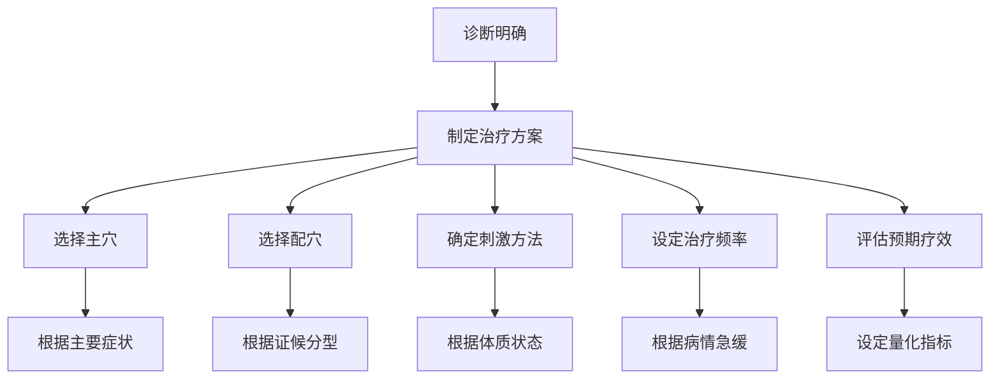
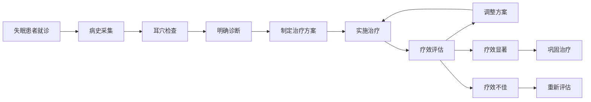

# 耳穴诊疗标准化模板

## 📋 临床诊断报告模板

### 基本信息
```
姓名：__________ 性别：____ 年龄：____ 病历号：__________
就诊日期：____年__月__日 主诉：________________________
既往史：____________________________________________
家族史：____________________________________________
```

### 耳穴检查发现
```
望诊结果：
左耳：______________________________________________
右耳：______________________________________________

触诊结果：
左耳：______________________________________________
右耳：______________________________________________

电测结果：
左耳：______________________________________________
右耳：______________________________________________
```

### 诊断结论
```
中医诊断：____________________________________________
西医诊断：____________________________________________
证候分型：____________________________________________
病情分级：□轻度 □中度 □重度 □危重
```

---

## 🎯 治疗方案设计模板

### 治疗计划


### 主穴选择标准
| 疾病类型 | 主穴选择 | 作用机制 | 配伍原则 |
|----------|----------|----------|----------|
| 神经系统 | 神门、皮质下、交感 | 调节神经功能 | 安神定志 |
| 心血管系统 | 心、肾、交感 | 调节心血管功能 | 活血化瘀 |
| 呼吸系统 | 肺、支气管、平喘 | 宣肺平喘 | 止咳化痰 |
| 消化系统 | 脾、胃、大肠 | 健脾和胃 | 消食导滞 |
| 内分泌系统 | 内分泌、肾上腺 | 调节激素平衡 | 扶正祛邪 |

### 治疗方案模板
```
患者姓名：__________ 诊断：________________________

治疗方案：
治疗目标：________________________________________
治疗周期：____周 治疗频率：每周__次

主穴配伍：
1. ____ - ____________________ - 用量：__
2. ____ - ____________________ - 用量：__
3. ____ - ____________________ - 用量：__

配穴配伍：
1. ____ - ____________________ - 用量：__
2. ____ - ____________________ - 用量：__

刺激方法：
□ 王不留行籽贴压 □ 按压刺激 □ 电针刺激
□ 磁珠贴压 □ 放血疗法 □ 其他：______

预期疗效：
□ 显效预期：____% □ 有效预期：____%
□ 起效时间：____天 □ 疗程评估：____周

注意事项：________________________________________
```

---

## 📊 疗效评估记录表

### 治疗前评估
| 评估项目 | 评分（0-10） | 具体描述 |
|----------|--------------|----------|
| 主要症状 | | |
| 次要症状 | | |
| 睡眠质量 | | |
| 精神状态 | | |
| 日常功能 | | |
| 总体评分 | | |

### 治疗过程记录
```
第____次治疗（____年__月__日）

治疗反应：
□ 无明显反应 □ 轻微反应 □ 明显反应 □ 强烈反应
反应部位：____________________________________
反应性质：□酸胀 □疼痛 □热感 □麻木 □其他

症状变化：
好转症状：____________________________________
无变化症状：__________________________________
加重症状：____________________________________

下次治疗调整：__________________________________
```

### 疗效评估表
| 评估时间 | 症状评分 | 功能评分 | 心理评分 | 总体改善 | 医生评价 |
|----------|----------|----------|----------|----------|----------|
| 治疗前 | | | | | |
| 第1周 | | | | | |
| 第2周 | | | | | |
| 第4周 | | | | | |
| 第8周 | | | | | |
| 治疗结束 | | | | | |

---

## 🏥 临床路径模板

### 疾病标准化诊疗流程

#### 失眠症诊疗路径


### 标准化操作程序
```
失眠症耳穴治疗SOP：

1. 术前准备
   □ 询问病史和用药情况
   □ 检查耳部皮肤状况
   □ 准备治疗器械和材料
   □ 患者知情同意

2. 穴位定位
   主穴：神门、皮质下、心、肾
   配穴：肝、脾、交感（根据证型）

3. 操作规范
   □ 耳部常规消毒
   □ 精准穴位定位
   □ 王不留行籽贴压
   □ 指导按压方法

4. 术后处理
   □ 记录治疗反应
   □ 嘱咐注意事项
   □ 约定下次时间
   □ 建立随访计划
```

---

## 📋 病历记录模板

### 首次病历记录
```
首次耳穴治疗记录

一般情况：
姓名：____ 年龄：____ 性别：____ 职业：____
就诊时间：____年__月__日 就诊方式：□初诊 □复诊 □转诊

主诉：____________________________________________
现病史：__________________________________________
___________________________________________________
既往史：__________________________________________
个人史：__________________________________________
家族史：__________________________________________

体格检查：
一般状况：□良好 □一般 □较差
耳部检查：□正常 □异常 __________________________
其他检查：________________________________________

耳穴专科检查：
望诊：___________________________________________
触诊：___________________________________________
电测：___________________________________________

初步诊断：
中医诊断：_______________________________________
西医诊断：_______________________________________
证候分型：_______________________________________

治疗方案：
治疗原则：_______________________________________
穴位选择：_______________________________________
刺激方法：_______________________________________
治疗频率：_______________________________________
注意事项：_______________________________________

医生签名：___________ 日期：____年__月__日
```

### 复诊记录模板
```
复诊治疗记录

复诊次数：第____次 复诊日期：____年__月__日

治疗后反应：
症状变化：________________________________________
睡眠改善：□显著 □一般 □无变化 □加重
情绪状态：□改善 □稳定 □波动 □恶化
其他变化：________________________________________

检查结果：
耳部变化：________________________________________
压痛程度：________________________________________
阳性反应：________________________________________

治疗调整：
穴位调整：________________________________________
方法调整：________________________________________
频率调整：________________________________________

下次计划：
治疗重点：________________________________________
预期目标：________________________________________
复诊时间：____年__月__日

医生签名：___________
```

---

## ⚠️ 风险评估模板

### 治疗风险评估
```
患者风险评估表

基础风险评估：
□ 年龄因素：□<18岁 □18-60岁 □>60岁
□ 体质状况：□良好 □一般 □较差
□ 过敏史：□无 □有 ______________________
□ 出血倾向：□无 □有 ______________________
□ 皮肤状况：□正常 □敏感 □感染 □其他

治疗风险：
□ 晕针风险：□低 □中 □高
□ 感染风险：□低 □中 □高
□ 过敏风险：□低 □中 □高
□ 其他风险：________________________________

预防措施：
□ 术前评估 □ 严格消毒 □ 轻柔操作
□ 密切观察 □ 应急准备 □ 其他

应急预案：
□ 晕针处理 □ 过敏处理 □ 出血处理
□ 感染处理 □ 其他：____________________
```

---

## 📈 质量控制模板

### 治疗质量评估
| 评估项目 | 评估标准 | 评分(1-5) | 改进措施 |
|----------|----------|-----------|----------|
| 穴位定位准确性 | ≤2mm误差 | | |
| 操作规范性 | 符合SOP要求 | | |
| 消毒彻底性 | 符合院感标准 | | |
| 疗效满意度 | 患者满意度≥80% | | |
| 并发症发生率 | ≤1% | | |

### 持续改进计划
```
质量改进项目：

本月重点改进：____________________________________
改进措施：_______________________________________
责任人：___________ 完成时间：____年__月__日

效果评估：
评估指标：_______________________________________
基线数据：_______________________________________
目标数据：_______________________________________
实际数据：_______________________________________

改进总结：_______________________________________
下月计划：_______________________________________
```

---

## 🔗 相关链接

- [诊断技术规范](../05_诊断技术/耳穴诊断理论基础.md)
- [安全操作指南](../06_安全规范/安全操作规范.md)
- [疗效评价标准](../08_实践指南/临床疗效评价.md)
- [质量控制流程](../08_实践指南/质量管理规范.md)

---

## 📞 联系与咨询

**临床培训**: 每月第一个周五下午
**质控咨询**: 每周三上午
**案例讨论**: 每周五下午
**技术咨询**: 工作日全天

*本文档持续更新中，最新版本日期: 2026-01-25*