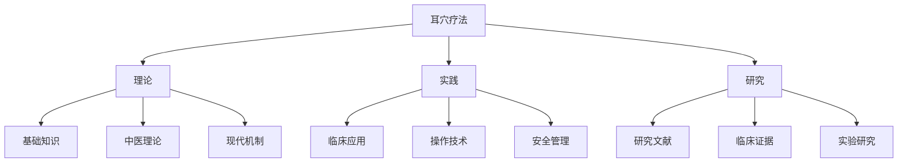
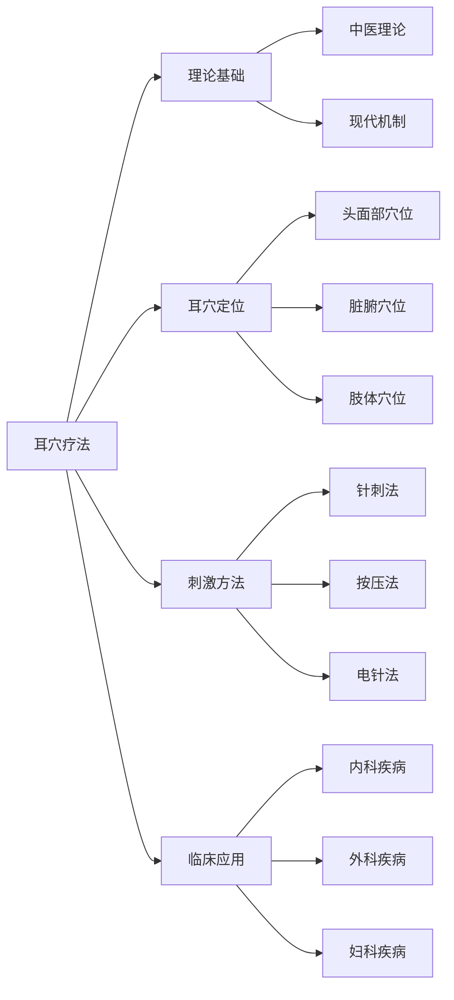

# 🏠 耳穴疗法知识库 - 主页

> 📍 **导航中心** | 🔄 **最后更新**：2026-01-21 | 📊 **笔记数量**：50+

## 🧭 快速导航

### 📚 核心内容
- [[耳穴疗法概述]] - 核心概念和基础知识
- [[耳穴定位总论]] - 耳穴分布和定位方法
- [[刺激方法比较]] - 各种刺激技术详解
- [[临床应用指南]] - 疾病治疗方案

### 🎯 专题内容地图 (MOCs)
| MOC          | 主题        | 笔记数量 | 最近更新       |
| ------------ | --------- | ---- | ---------- |
| [[MOC-基础知识]] | 理论基础与历史发展 | 8    | 2026-01-21 |
| [[MOC-耳穴定位]] | 耳穴定位与主治功能 | 12   | 2026-01-21 |
| [[MOC-刺激方法]] | 刺激技术与操作规范 | 10   | 2026-01-21 |
| [[MOC-临床应用]] | 疾病治疗与疗效评价 | 15   | 2026-01-21 |
| [[MOC-安全性]]  | 安全操作与不良反应 | 6    | 2026-01-21 |
| [[MOC-研究文献]] | 文献资料与参考资料 | 8    | 2026-01-21 |

## 🏷️ 标签系统

### 📊 按类型分类

### 🎨 标签体系
- `#theory` - 理论知识
- `#practice` - 实践应用
- `#research` - 研究文献
- `#safety` - 安全相关
- `#anatomy` - 解剖相关
- `#technique` - 技术方法
- `#disease` - 疾病治疗
- `#acupoint` - 穴位知识

## 🔍 快速查找

### 按需求查找
- 🧑‍⚕️ **临床医师** → [[临床应用指南]] | [[操作技术总览]]
- 👨‍🎓 **研究人员** → [[研究文献MOC]] | [[实验方法总结]]
- 👨‍🎓 **学生学者** → [[基础知识MOC]] | [[耳穴定位详解]]
- 👥 **患者家属** → [[患者教育材料]] | [[常见问题解答]]

### 按疾病查找
- 🧠 **神经系统** → [[失眠症治疗]] | [[头痛治疗]] | [[癫痫治疗]]
- ❤️ **心血管系统** → [[高血压治疗]] | [[冠心病治疗]]
- 🫁 **呼吸系统** → [[哮喘治疗]] | [[支气管炎治疗]]
- 🍽️ **消化系统** → [[胃炎治疗]] | [[便秘治疗]]

## 📈 知识图谱预览

## 🔄 最近更新

### 本周新增
- ✅ [[耳穴疗法概述]] - 完善基础理论
- ✅ [[失眠症治疗指南]] - 新增临床方案
- ✅ [[安全性操作规范]] - 更新安全标准

### 待办事项
- 🔄 [[耳穴机制研究进展]] - 整理最新研究成果
- 🔄 [[儿童耳穴应用]] - 补充特殊人群应用
- 🔄 [[耳穴设备对比]] - 添加设备评测内容

## 🛠️ 使用技巧

### 🔗 双向链接
- 使用 `[[笔记名称]]` 创建内部链接
- 使用 `[[笔记名称|显示文本]]` 自定义链接文本
- 使用 `![[图片名称]]` 嵌入图片

### 🏷️ 标签功能
- 使用 `#标签名` 创建标签
- 支持嵌套标签 `#父标签/子标签`
- 标签可以自动聚合相关内容

### 📝 模板使用
- 新建笔记时可使用预设模板
- 模板位于 `08-模板` 文件夹
- 支持日常笔记、研究笔记等多种模板

## 💡 特色功能

### 🧠 智能关联
- 自动显示相关笔记推荐
- 基于标签和链接的智能聚合
- 知识图谱可视化展示

### 📊 进度追踪
- 每个主题都有完成度标记
- 学习进度可视化展示
- 定期复习提醒功能

### 🔍 多维度搜索
- 支持全文搜索
- 标签筛选搜索
- 文件夹路径搜索

---

## 📞 联系方式

**如有问题或建议**：
- 📧 邮箱：auricular-therapy@example.com
- 💬 讨论区：[[交流讨论区]]
- 🐛 问题反馈：[[问题反馈区]]

**贡献指南**：
- 📝 内容贡献：[[贡献指南]]
- 🔄 更新规范：[[更新规范]]
- 📋 质量标准：[[质量标准]]

---

> 💡 **提示**：使用 `Ctrl/Cmd + O` 快速打开文件，使用 `Ctrl/Cmd + Shift + F` 全局搜索

**🌟 开始探索**：从 [[耳穴疗法概述]] 开始您的学习之旅！