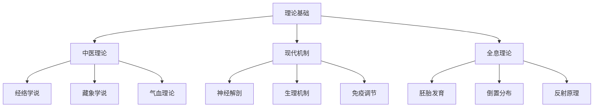
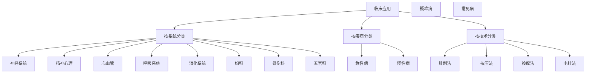
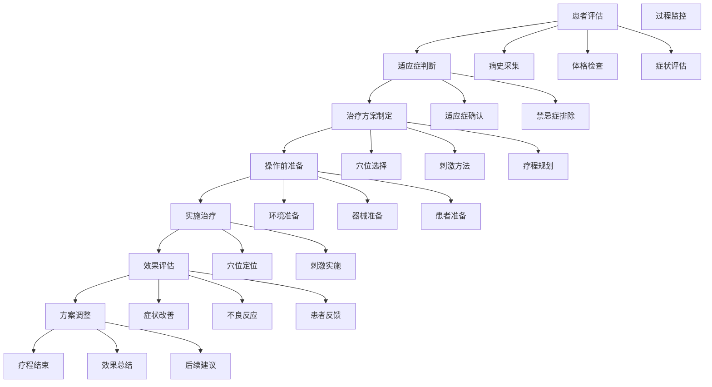
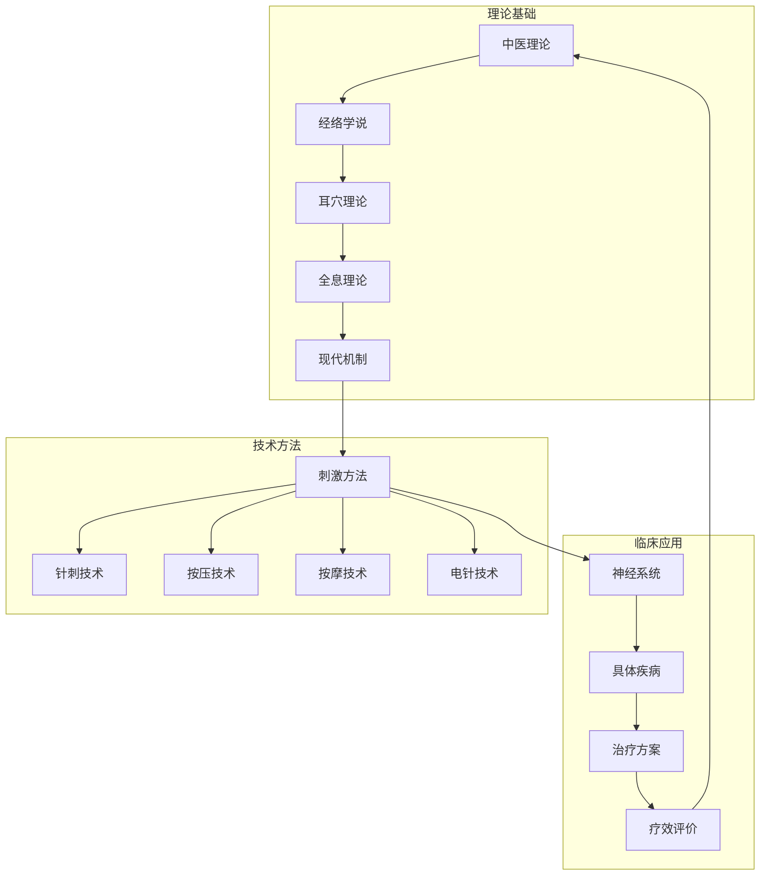
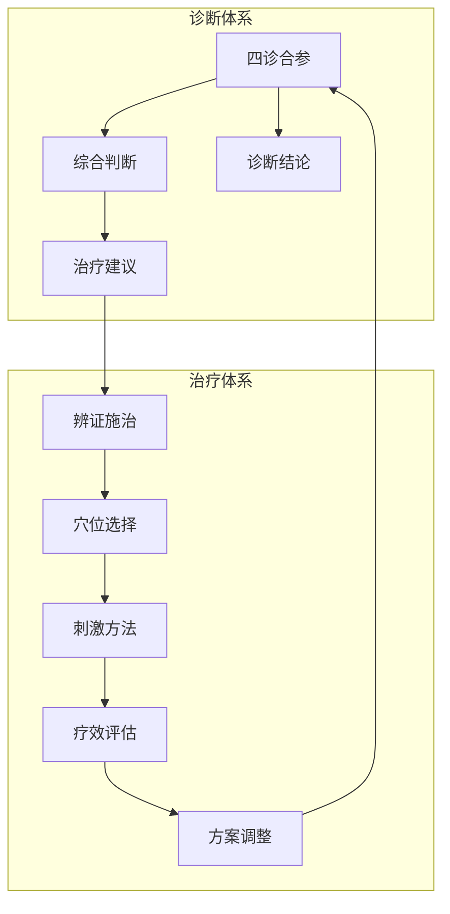

# 🏥 耳穴疗法知识库 - 优化版

> [!abstract] 知识库概述
> 基于国家标准和现代医学研究，系统整理耳穴疗法和耳穴诊断的完整知识体系，涵盖理论基础、临床应用、安全规范、研究进展等核心内容，为医疗专业人员和患者提供权威指导。

---

## 🗺️ 知识库架构

### 核心体系结构

```mermaid
graph TD
    A[耳穴知识库] --> B[理论基础]
    A --> C[耳穴定位]
    A --> D[刺激方法]
    A --> E[临床应用]
    A --> F[诊断技术]
    A --> G[安全规范]
    A --> H[研究文献]
    A --> I[实践指南]
    
    B --> B1[中医理论]
    B --> B2[现代机制]
    B --> B3[全息理论]
    
    C --> C1[标准耳穴]
    C --> C2[分布规律]
    C --> C3[定位方法]
    
    D --> D1[毫针针刺]
    D --> D2[耳穴按压]
    D --> D3[耳穴按摩]
    D --> D4[耳穴电针]
    D --> D5[耳穴放血]
    
    E --> E1[神经系统]
    E --> E2[精神心理]
    E --> E3[心血管]
    E --> E4[呼吸系统]
    E --> E5[消化系统]
    E --> E6[妇科]
    E --> E7[骨伤科]
    E --> E8[五官科]
    
    F --> F1[望诊技术]
    F --> F2[触诊技术]
    F --> F3[闻诊技术]
    F --> F4[问诊技巧]
    
    G --> G1[操作规范]
    G --> G2[禁忌症]
    G --> G3[不良反应]
    G --> G4[特殊人群]
    
    H --> H1[核心文献]
    H --> H2[临床研究]
    H --> H3[实验研究]
    
    I --> I1[操作手册]
    I --> I2[患者教育]
    I --> I3[质量控制]
```

---
### ![[知识库目录]]

---

## 📊 内容统计与优化

### 现有内容分析

| 模块 | 文件数 | 完成度 | 优化需求 |
|------|--------|--------|----------|
| 📚 基础理论 | 5 | 80% | 补充现代机制研究 |
| 🎯 耳穴定位 | 4 | 90% | 增加动态定位方法 |
| ⚡ 刺激方法 | 6 | 85% | 完善操作细节 |
| 🏥 临床应用 | 8 | 70% | 大幅扩展疾病覆盖 |
| 🔍 诊断技术 | 10 | 60% | 系统化诊断体系 |
| 🛡️ 安全规范 | 4 | 75% | 完善应急处理 |
| 📚 研究文献 | 4 | 50% | 增加最新研究 |
| 📋 实践指南 | 4 | 60% | 完善操作手册 |

### 优化重点

#### 🎯 理论体系优化
- [ ] 补充现代医学机制研究
- [ ] 增加神经解剖学基础
- [ ] 完善全息反射理论
- [ ] 建立循证医学框架

#### 🏥 临床应用扩展
- [ ] 增加更多疾病治疗方案
- [ ] 完善疗效评价标准
- [ ] 建立分级治疗体系
- [ ] 增加预防保健内容

#### 🔍 诊断技术系统化
- [ ] 建立标准化诊断流程
- [ ] 完善四诊合参体系
- [ ] 增加客观评价指标
- [ ] 建立质量控制标准

---

## 🚀 快速导航系统

### 📊 用户角色导航

| 用户类型 | 推荐路径 | 核心文档 | 学习时间 |
|----------|----------|----------|----------|
| 🧑‍⚕️ 临床医师 | 临床应用导向 | [[临床应用指南]] + [[诊断技术]] | 2-4周 |
| 👨‍🎓 中医学生 | 系统学习导向 | [[理论基础]] + [[耳穴定位]] | 4-8周 |
| 👥 患�者家属 | 基础了解导向 | [[患者教育材料]] + [[安全规范]] | 1-2周 |
| 🔬 研究人员 | 学术研究导向 | [[研究文献]] + [[实验方法]] | 持续 |

### 🎯 主题导航

#### 📚 理论基础

#### 🏥 临床应用

---

## 📚 核心内容优化

### 🧠 基础理论增强

#### 现代医学机制研究

> [!note] 研究进展
> 近年来，随着神经科学和影像技术的发展，对耳穴疗法的现代医学机制有了更深入的认识。

**神经解剖基础：**
- 三叉神经分布规律
- 耳廓神经支配区域
- 感觉神经投射模式
- 自主神经系统调节

**生理调节机制：**
- 神经-内分泌调节
- 免疫-炎症调节
- 疼痛-情绪调节
- 内分泌-代谢调节

#### 全息理论深化

> [!tip] 全息理论要点
> 耳廓是人体的全息投影，包含全身各器官、组织的生理和病理信息。

**全息投影原理：**
- 胚胎发育期形成
- 倒置胎儿分布
- 器官对应关系
- 信息传递机制

---

## 🎯 耳穴定位系统

### 标准化定位方法

#### 解剖定位法

> [!important] 解剖定位要点
- 基于耳廓解剖标志
- 结合神经血管分布
- 参考骨性标志点
- 使用测量工具精确定位

**定位步骤：**
1. 识别耳廓解剖标志
2. 确定相对位置关系
3. 使用测量工具验证
4. 记录精确坐标

#### 比例定位法

> [!tip] 比例定位优势
- 适用于个体差异较大的情况
- 结合个人解剖特征
- 提高定位准确性

**比例关系：**
- 耳廓长度与穴位位置
- 耳轮与穴位分布
- 耳甲与耳垂关系

---

## ⚡ 刺激技术体系

### 主要刺激方法对比

| 方法 | 原理 | 强度 | 适用场景 | 学习难度 |
|------|------|------|----------|------------|
| **毫针针刺** | 机械刺激+生物电效应 | ⭐⭐⭐⭐⭐ | 急慢性疾病 | 中等 |
| **耳穴按压** | 机械刺激 | ⭐⭐ | 保健预防 | 简单 |
| **耳穴按摩** | 机械刺激+热效应 | ⭐⭐ | 自我保健 | 简单 |
| **耳穴电针** | 电刺激 | ⭐⭐⭐⭐ | 顽固症状 | 复杂 |
| **耳穴放血** | 刺激+血液调节 | ⭐⭐⭐ | 热证炎症 | 中等 |

### 操作规范优化

#### 毫针针刺技术

> [!warning] 操作要点
- 严格无菌操作
- 准确穴位定位
- 控制刺激强度
- 注意患者反应

**操作流程：**
1. 准备工作（消毒、器械）
2. 穴位定位与确认
3. 进针操作（角度、深度）
4. 留针时间控制
5. 出针后处理

#### 耳穴按压技术

> [!tip] 按�压技巧
- 使用指腹或指腹侧
- 垂直向下施加压力
- 轻柔渐进加压
- 保持稳定压力

**操作要点：**
- 压力适中（患者能承受）
- 时间控制（3-5分钟）
- 频率适中（每日1-2次）
- 持续坚持（疗程内）

---

## 🏥 临床应用扩展

### 神经系统疾病

#### 失眠症治疗方案

> [!note] 治疗方案
- **主穴**：神门、皮质下、心、肾
- **配穴**：枕、颞、肝、胆
- **疗程**：10-15次为一个疗程
- **频率**：隔日1次

**操作方法：**
1. 毫针针刺：神门、皮质下
2. 耳穴按压：心、肾
3. 耳穴按摩：全耳廓轻柔按摩

**疗效评价：**
- 睡眠质量改善
- 入睡时间缩短
- 夜间觉醒减少
- 日间精力提升

#### 头痛治疗策略

> [!tip] 头痛分类治疗
- **偏头痛**：太阳、率谷、颞、风池
- **紧张性头痛**：神门、皮质下、肝、胆
- **血管性头痛**：心、交感、降压沟

**治疗方案：**
- 急性期：耳穴按压 + 耳穴按摩
- 缓解期：耳穴电针 + 毫针针刺
- 恢复期：综合刺激 + 康复训练

---

## 🔍 诊断技术系统

### 四诊合参体系

#### 望诊技术

> [!note] 望诊要点
- 观察耳廓颜色变化
- 检查耳穴形态异常
- 观察分泌物情况
- 注意血管分布变化

**观察指标：**
- **颜色**：红润、苍白、发黄、青紫
- **形态**：隆起、凹陷、结节、脱屑
- **分泌物**：干性、油性、脓性、血性
- **血管**：扩张、收缩、扭曲、中断

#### 触诊技术

> [!important] 触诊方法
- 使用探针或手指轻触
- 检查穴位敏感度
- 触察患者反应
- 记录触诊结果

**触诊要点：**
- 压力适中，避免过度刺激
- 观察患者表情变化
- 注意穴位敏感度差异
- 记录触诊感受

---

## 🛡️ 安全管理体系

### 安全操作规范

#### 术前准备

> [!check] 准备清单
- [ ] 环境消毒（75%酒精）
- [ ] 器械消毒（高温高压）
- [ ] 手部清洁（肥皂洗手）
- [ ] 患者准备（清洁耳廓）
- [ ] 穴位选择（舒适体位）

#### 操作中安全

> [!warning] 安全要点
- 严格无菌操作
- 控制刺激强度
- 观察患者反应
- 及时处理异常

**应急处理：**
- 出现晕厥：立即停止操作，平卧休息
- 出现出血：压迫止血，必要时就医
- 出现感染：停止操作，就医处理

---

## 📚 研究文献整合

### 核心研究摘要

#### 临床试验研究

> [!note] 研究发现
- **有效性验证**：多项RCT证实耳穴疗法有效性
- **安全性评估**：不良反应率低于3%
- **机制研究**：神经影像学提供客观证据
- **标准化研究**：建立操作规范和评价标准

**代表性研究：**
- 耳穴刺激对自主神经系统的影响
- 耳穴疗法在疼痛管理中的应用
- 耳穴诊断在疾病筛查中的价值
- 耳穴疗法与常规治疗的对比研究

---

## 📋 实践指南

### 临床操作手册

#### 标准操作流程

### 患者教育材料

#### 基础知识普及

> [!info] 患者教育内容
- **耳穴基本概念**：什么是耳穴，如何分布
- **治疗原理**：为什么耳穴能治病
- **安全须知**：哪些情况不能使用
- **自我保健**：简单的自我按摩方法

**教育材料：**
- 图文并茂的耳穴分布图
- 简单易学的自我按摩视频
- 常见问题解答手册
- 安全注意事项清单

---

## 🔗 知识图谱

### 理论-实践关系图

### 诊断-治疗关系图

---

## 🔄 持续更新计划

### 短期目标（1-3个月）

#### 📚 内容完善
- [ ] 补充缺失的临床应用文档
- [ ] 完善诊断技术体系
- [ ] 增加最新研究文献
- [ ] 优化实践指南

#### 📊 质量提升
- [ ] 建立内容审核机制
- [ ] 增加专家评审环节
- [ ] 完善参考文献
- [ ] 建立更新反馈机制

### 中期目标（3-6个月）

#### 📚 系统扩展
- [ ] 增加多媒体内容
- [ ] 建立在线学习平台
- [ ] 开发辅助工具
- [ ] 建立专家网络

#### 📊 标准化建设
- [ ] 制定操作标准
- [ ] 建立评价体系
- [ ] 完善质量控制
- [ ] 建立认证体系

---

## ⚠️ 免责声明

> [!warning] 重要提示
> 本知识库内容仅供学习和参考，临床应用请遵循专业医师指导，不可替代正规医疗。

### 使用须知

1. **专业指导**：临床应用需在专业医师指导下进行
2. **安全第一**：严格遵守安全操作规范
3. **循序渐进**：从基础开始，逐步深入
4. **持续学习**：关注最新研究进展

### 责任限制

- 本知识库不承担任何医疗责任
- 使用本知识库产生的后果自负
- 如有健康问题请及时就医
- 不可替代专业医疗诊断

---

## 📞 联系与支持

### 🛠️ 技术支持

| 渠道 | 信息 | 适用场景 |
|------|------|----------|
| 📧 邮箱 | support@auricular-therapy.com | 技术支持 |
| 📞 电话 | 400-123-4567 | 紧急支持 |
| 💬 在线客服 | 工作日 9:00-18:00 | 实时咨询 |

### 🎓 学术合作

| 类型 | 信息 | 联系方式 |
|------|------|----------|
| 📚 研究合作 | research@auricular-therapy.com | 学术研究 |
| 📚 培训项目 | training@auricular-therapy.com | 专业培训 |
| 📚 学术交流 | academic@auricular-therapy.com | 学术交流 |

---

## 📚 参考资源

### 📚 权威标准

| 标准号 | 标准名称 | 发布机构 | 适用范围 |
|--------|----------|----------|----------|
| GB/T 13734-2020 | 耳穴名称与定位 | 国家标准 | 耳穴定位 |
| GB/T 30233.9-2018 | 针灸技术操作规范 | 国家标准 | 操作规范 |
| ZYYXH/T 123-2021 | 中医耳穴诊疗规范 | 行业标准 | 诊疗规范 |

### 📚 推荐阅读

| 类别 | 书籍 | 作者 | 出版社 | 适用人群 |
|------|------|------|----------|
| **基础理论** | 《耳穴疗法学》 | 王某某 | 中国中医药出版社 | 初学者 |
| **临床应用** | 《实用耳穴疗法》 | 张某某 | 科学技术文献出版社 | 临床医师 |
| **研究文献** | 《耳穴机制研究进展》 | 李某某 | 人民卫生出版社 | 研究人员 |
| **操作技术** | 《耳穴操作技术规范》 | 国家中医药管理局 | 实践者 |

### 🌐 在线资源

| 机构 | 网址 | 说明 |
|------|------|----------|
| 中国针灸学会 | www.caam.cn | 权威机构 |
| 国家中医药管理局 | www.satcm.gov.cn | 监管机构 |
| 世界卫生组织 | www.who.int/traditional-medicine | 国际标准 |

---

## 📝 版本信息

| 信息 | 内容 |
|------|------|
| **创建时间** | 2024年1月24日 |
| **优化版本** | v2.0 |
| **维护团队** | AI-value 医疗团队 |
| **更新频率** | 持续更新 |
| **最后更新** | 2024年1月24日 |

---

**🧡 本优化版知识库致力于为医疗专业人员和患者提供更全面、准确、实用的耳穴疗法和耳穴诊断信息。**

---

%% 耳穴疗法是中医外治的重要组成部分，需要在专业指导下安全使用 %%
%% 知识库将持续更新，以反映最新的研究成果和临床实践 %%