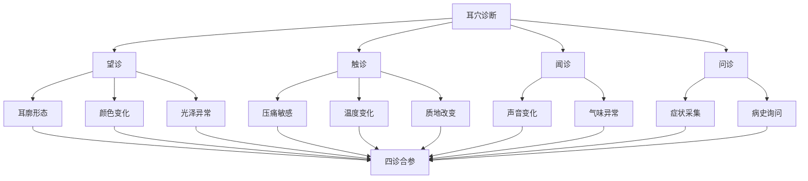
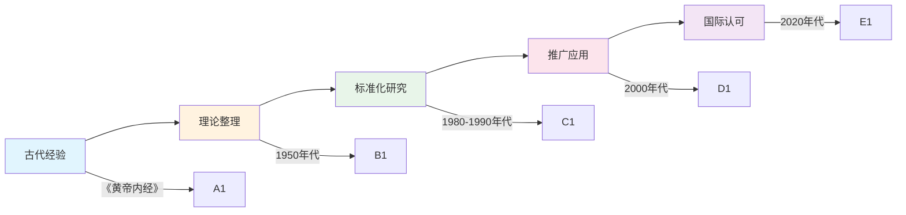
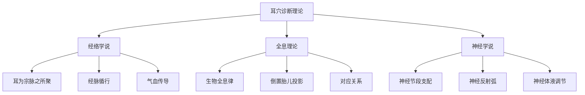
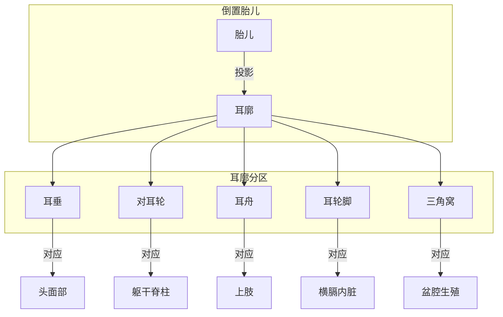
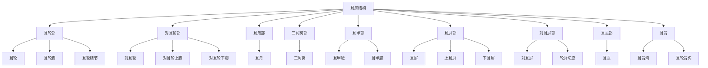
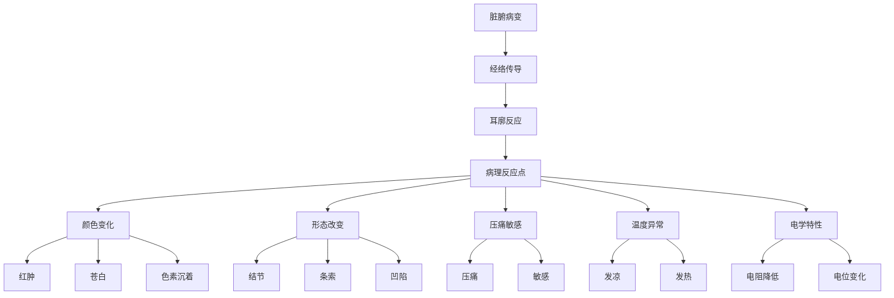
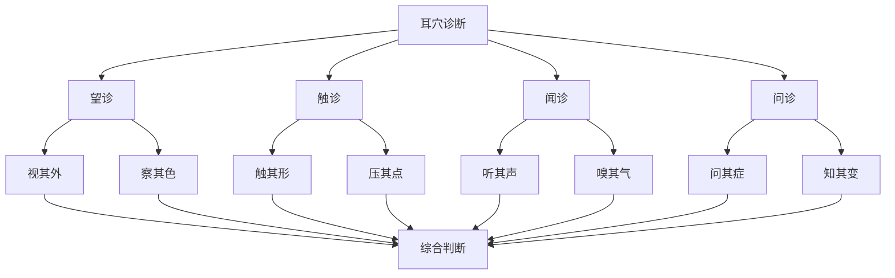
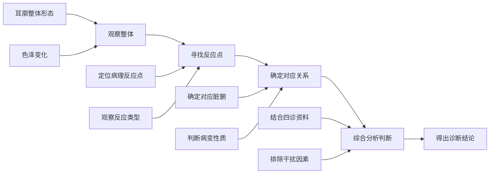

# 🏥 耳穴诊断概论

**📖 耳穴诊断学基础理论 | 医疗专业人员·研究人员**

> 📖 耳穴诊断是通过观察、触诊、闻诊等方法，根据耳廓上的病理反应点来判断身体各部位健康状况的诊断技术。

---

## 📑 目录

- [🔍 什么是耳穴诊断](#-什么是耳穴诊断)
- [📜 历史与发展](#-历史与发展)
- [🧠 理论基础](#-理论基础)
- [👂 耳廓解剖](#-耳廓解剖)
- [🔬 诊断原理](#-诊断原理)
- [📊 诊断方法](#-诊断方法)
- [🎯 诊断要点](#-诊断要点)
- [⚠️ 注意事项](#️-注意事项)
- [📚 相关资源](#-相关资源)

---

## 🔍 什么是耳穴诊断

### 定义

**耳穴诊断**是指通过观察耳廓的形态、颜色变化，以及触诊耳廓上的病理反应点，结合闻诊和问诊，综合判断人体脏腑、组织器官功能状态和病理变化的一种诊断方法。

### 特点

| 特点 | 说明 | 优势 |
|------|------|------|
| 🔎 **直观性** | 病理反应点可直接观察和触诊 | 快速初筛 |
| 🎯 **特异性** | 耳穴与脏腑有明确的对应关系 | 定位准确 |
| ⚡ **快捷性** | 检查时间短，效率高 | 适合普查 |
| 💰 **经济性** | 无需特殊设备，成本低 | 易于推广 |
| 🔄 **可重复** | 可动态观察病情变化 | 便于随访 |

### 与传统诊断的关系

---

## 📜 历史与发展

### 古代起源

| 时期 | 发展 | 重要典籍 |
|------|------|----------|
| **战国至秦汉** | 理论萌芽 | 《黄帝内经》提出"耳为宗脉之所聚" |
| **魏晋隋唐** | 经验积累 | 《针灸甲乙经》记载耳穴 |
| **宋元明清** | 体系形成 | 《厘正按摩要术》提出耳背分属五脏 |
| **近代** | 快速发展 | 1950年代法国 Nogier 提出耳针疗法图 |

### 现代发展

### 里程碑事件

| 年份 | 事件 | 意义 |
|------|------|------|
| 1957 | 法国 Nogier 发表耳针疗法图 | 现代耳针学开端 |
| 1982 | 中国针灸学会耳针学组成立 | 规范化组织 |
| 1990 | 《耳穴名称与定位》国家标准 | 标准化里程碑 |
| 2008 | 耳穴诊疗技术纳入国家规范 | 官方认可 |
| 2020 | 数字化耳穴诊断研究兴起 | 技术创新 |

---

## 🧠 理论基础

### 三大理论支柱

### 1. 经络学说

| 学说要点 | 内容说明 |
|----------|----------|
| **宗脉汇聚** | 耳廓是多条经脉汇聚之处 |
| **经络传导** | 刺激耳穴可通过经络传导至相应脏腑 |
| **气血关联** | 耳部气血变化反映全身状况 |

> 💡 **核心观点**："耳者，宗脉之所聚也。" ——《黄帝内经》

### 2. 全息理论

| 全息原理 | 耳廓对应 |
|----------|----------|
| **倒置胎儿** | 耳垂代表头部，耳轮脚代表横膈 |
| **分区对应** | 耳舟对上肢，对耳轮对躯干 |
| **精准定位** | 每个耳穴对应特定器官或功能 |

### 3. 神经学说

| 神经机制 | 说明 |
|----------|------|
| **神经支配** | 耳廓由耳大神经、枕小神经等支配 |
| **节段对应** | 耳穴与脊髓节段存在对应关系 |
| **反射弧** | 刺激通过躯体-内脏反射产生效应 |

---

## 👂 耳廓解剖

### 耳廓结构

### 耳穴分区与对应

| 耳廓分区 | 对应身体部位 | 代表耳穴 |
|----------|--------------|----------|
| 耳垂 | 头面部 | 眼、耳、牙、舌 |
| 对耳轮 | 躯干脊柱 | 颈椎、胸椎、腰椎 |
| 耳舟 | 上肢 | 肩、肘、腕、指 |
| 对耳轮上/下脚 | 盆腔臀部 | 坐骨神经、臀 |
| 三角窝 | 盆腔生殖器 | 子宫、神门 |
| 耳甲艇 | 腹部 | 肾、膀胱、肝 |
| 耳甲腔 | 胸部 | 心、肺、脾 |
| 耳屏 | 鼻咽部 | 内鼻、咽喉 |
| 对耳屏 | 头部 | 额、颞、枕、皮质下 |
| 耳轮脚 | 横膈 | 膈、耳中 |
| 耳背 | 背部 | 耳背心、耳背沟 |

---

## 🔬 诊断原理

### 病理反应机制

### 病理反应类型

| 反应类型 | 表现 | 临床意义 |
|----------|------|----------|
| 🔴 **颜色改变** | 红肿、苍白、紫暗、色素沉着 | 气血瘀滞、炎症、寒证 |
| 🔍 **形态改变** | 结节、条索、凹陷、隆起 | 器质性病变、慢性病 |
| 📍 **压痛敏感** | 压痛、触电样反应 | 急性期、实症 |
| 🌡️ **温度改变** | 发凉、灼热 | 寒证、热证 |
| ⚡ **电学改变** | 电阻降低、导电量增加 | 病理反应活跃 |

---

## 📊 诊断方法

### 四诊合参

### 1. 望诊

| 望诊内容 | 观察要点 | 临床意义 |
|----------|----------|----------|
| **形态** | 耳廓大小、厚薄、畸形 | 先天禀赋、发育状况 |
| **颜色** | 红润、苍白、发青、紫暗 | 气血、寒热、瘀血 |
| **光泽** | 明亮、晦暗、油腻 | 精气盛衰、湿浊 |
| **血管** | 络脉充盈、扩张 | 血瘀、实证 |
| **鳞屑** | 脱屑、油脂 | 皮肤病、消化系统 |

### 2. 触诊

| 触诊方法 | 操作要点 | 判断标准 |
|----------|----------|----------|
| **压痛法** | 用探棒按压耳穴 | 有无压痛、疼痛程度 |
| **探触法** | 触摸耳穴形态变化 | 有无结节、条索 |
| **电测法** | 用耳穴探测仪测量 | 电阻值、导电量 |
| **温度法** | 感知耳穴温度差异 | 局部发凉/发热 |

### 3. 闻诊

| 闻诊内容 | 表现 | 临床意义 |
|----------|------|----------|
| **声音** | 耳部摩擦音、弹响音 | 炎症、积液 |
| **气味** | 耳部分泌物气味 | 感染、化脓 |

### 4. 问诊

| 问诊要点 | 询问内容 |
|----------|----------|
| **主诉** | 主要不适症状 |
| **病史** | 发病时间、诱因、治疗经过 |
| **耳部** | 耳部不适、耳鸣、听力变化 |
| **全身** | 饮食、睡眠、二便情况 |

---

## 🎯 诊断要点

### 诊断流程

### 诊断原则

| 原则 | 说明 | 要点 |
|------|------|------|
| 🔍 **整体观念** | 从整体角度分析 | 不孤立看待单一变化 |
| 📊 **四诊合参** | 综合多种诊断方法 | 望闻问触相互印证 |
| ⚖️ **辨证施治** | 区分虚实寒热 | 病理反应的性质判断 |
| 🔄 **动态观察** | 追踪病情变化 | 治疗前后对比 |
| 🎯 **定位准确** | 精准判断病变部位 | 熟悉耳穴对应关系 |

### 常见病理反应与对应疾病

| 耳穴反应 | 病理类型 | 可能对应疾病 |
|----------|----------|--------------|
| 心穴红晕 | 热证、炎症 | 冠心病、心律失常 |
| 肺穴充血 | 呼吸系统疾病 | 支气管炎、哮喘 |
| 胃穴压痛 | 消化系统疾病 | 胃炎、胃溃疡 |
| 肝穴结节 | 慢性肝病 | 肝炎、脂肪肝 |
| 肾穴凹陷 | 肾虚 | 肾功能异常 |
| 神门穴敏感 | 神经系统疾病 | 失眠、焦虑 |

---

## ⚠️ 注意事项

### 诊断禁忌

| 禁忌情况 | 说明 | 处理建议 |
|----------|------|----------|
| 🚫 **耳部感染** | 局部红肿、化脓时 | 暂缓触诊 |
| 🚫 **耳部肿瘤** | 肿块、异物时 | 建议专科就诊 |
| 🚫 **耳部外伤** | 新鲜伤口时 | 避免刺激 |
| 🚫 **孕妇** | 特殊穴位可能引发宫缩 | 慎用刺激方法 |

### 影响因素

| 因素 | 影响 | 应对措施 |
|------|------|----------|
| ⏰ **时间因素** | 晨起、餐后有差异 | 选择相对固定时间 |
| 🌡️ **环境因素** | 温度、湿度影响 | 在适宜环境下进行 |
| 😴 **睡眠因素** | 疲劳、睡眠不足影响 | 充分休息后进行 |
| 💊 **药物因素** | 某些药物影响反应点 | 记录用药情况 |
| 🧴 **皮肤因素** | 耳部皮肤状况 | 清洁后进行检查 |

### 常见误区

| 误区 | 正确认识 |
|------|----------|
| ❌ 单一反应点即确诊 | ✅ 需要四诊合参，综合判断 |
| ❌ 反应越重病情越重 | ✅ 反应强度与病情不完全正相关 |
| ❌ 耳穴诊断可以替代现代检查 | ✅ 作为辅助诊断手段 |
| ❌ 所有人都适用 | ✅ 存在禁忌症和个体差异 |

---

## 📚 相关资源

### 核心文档

| 文档 | 说明 |
|------|------|
| [[耳穴定位总论]] | 耳穴定位方法详解 |
| [[耳穴望诊方法]] | 望诊技术详细介绍 |
| [[耳穴触诊技术]] | 触诊技术详细指导 |
| [[耳穴闻诊方法]] | 闻诊技术介绍 |
| [[耳穴诊断与脏腑对应]] | 脏腑对应关系详解 |

### MOC 导航

| MOC | 主题 |
|-----|------|
| [[MOC-诊断基础]] | 耳穴诊断理论基础 |
| [[MOC-诊断方法]] | 各种诊断技术方法 |
| [[MOC-诊断定位]] | 耳穴定位与对应关系 |
| [[MOC-诊断应用]] | 各种疾病诊断应用 |
| [[MOC-对应关系]] | 耳穴与脏腑对应关系 |

### 推荐阅读

| 书籍 | 作者 | 说明 |
|------|------|------|
| 《耳穴诊断学》 | 黄丽春 | 耳穴诊断学权威著作 |
| 《耳穴诊疗学》 | 王岱 | 耳穴诊疗技术专著 |
| 《实用耳穴诊疗法》 | 刘巧玲 | 临床实用指南 |

---

## 📝 版本信息

| 信息 | 内容 |
|------|------|
| **创建时间** | 2026年1月 |
| **最后更新** | 2026年1月25日 |
| **版本号** | v1.0 |
| **维护团队** | AI-value 医疗团队 |

**🧡 本文档旨在为医疗专业人员提供耳穴诊断基础理论参考。**

