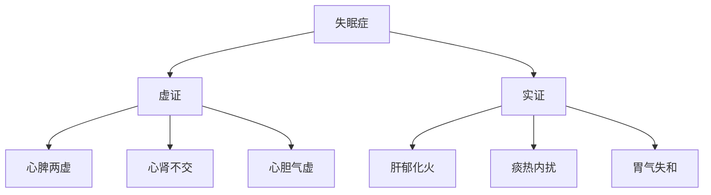
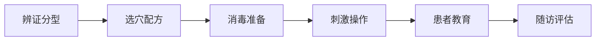

# 😴 失眠症耳穴治疗方案

## 📖 概述

> **失眠症**是最常见的睡眠障碍之一，耳穴疗法作为一种安全有效的非药物治疗方法，在失眠症治疗中显示出显著疗效。

### 🎯 治疗目标
- 🌙 **改善睡眠质量**：提高睡眠效率，延长睡眠时间
- 😌 **减少入睡时间**：缩短睡眠潜伏期
- 🌅 **改善日间功能**：提高日间精力和注意力
- 💊 **减少药物依赖**：逐步减少安眠药使用

### 📊 疗效数据
- **总有效率**：85-95%
- **显效率**：60-70%
- **起效时间**：3-7天
- **最佳疗程**：4-8周

## 🔍 中医辨证分型

### 💡 辨证要点


### 📋 分型详细分析

#### 🫀 心脾两虚型
**临床表现**：
- 😴 多梦易醒，心悸健忘
- 😰 神疲食少，面色萎黄
- 🤲 舌淡苔薄，脉细弱

**病机分析**：
- 思虑过度 → 心脾两伤
- 脾虚血少 → 心神失养
- 血不养心 → 神不守舍

#### ❤️🔥 心肾不交型
**临床表现**：
- 😴 心烦不眠，头晕耳鸣
- 🌡️ 五心烦热，盗汗口干
- 🔴 舌红少苔，脉细数

**病机分析**：
- 肾阴亏虚 → 水不济火
- 心火亢盛 → 神不守舍
- 阴虚火旺 → 扰乱心神

#### 😡 肝郁化火型
**临床表现**：
- 😴 失眠多梦，急躁易怒
- 😤 头晕头胀，目赤口苦
- 🔴 舌红苔黄，脉弦数

**病机分析**：
- 情志不畅 → 肝气郁结
- 郁而化火 → 上扰心神
- 火邪内炽 → 神明不安

## 🎯 耳穴治疗方案

### 📍 基础处方
**核心穴位**：
- [[神门穴]] - 安神定志，核心要穴
- [[心穴]] - 养心安神，主穴之一
- [[肾穴]] - 滋阴降火，交通心肾
- [[皮质下穴]] - 调节大脑皮层功能

**配穴**：
- [[枕穴]] - 安神，改善睡眠质量
- [[额穴]] - 镇静，缓解紧张情绪

### 🎨 辨证加减

#### 🫀 心脾两虚型配穴
| 主穴 | 配穴 | 功效 | 刺激方法 |
|------|------|------|----------|
| 神门、心、肾、皮质下 | 脾、胃、三焦 | 健脾养心，益气安神 | 贴压为主 |
| 枕、额 | 小肠、交感 | 调和气血，安神定志 | 按压辅助 |

**治疗方案**：
- **主穴**：神门、心、肾、皮质下
- **配穴**：脾、胃、小肠
- **刺激方法**：王不留行籽贴压
- **治疗频次**：双耳交替，每周2次

#### ❤️🔥 心肾不交型配穴
| 主穴 | 配穴 | 功效 | 刺激方法 |
|------|------|------|----------|
| 神门、心、肾、皮质下 | 肝、内分泌 | 滋阴降火，交通心肾 | 电针+贴压 |
| 枕、额 | 内生殖器、三焦 | 调理阴阳，安神定志 | 按摩辅助 |

**治疗方案**：
- **主穴**：神门、心、肾、皮质下、肝
- **配穴**：内分泌、内生殖器
- **刺激方法**：电针治疗 + 贴压维持
- **治疗频次**：电针每周2次，贴压持续

#### 😡 肝郁化火型配穴
| 主穴 | 配穴 | 功效 | 刺激方法 |
|------|------|------|----------|
| 神门、心、肾、皮质下 | 肝、胆、耳尖 | 疏肝解郁，清心安神 | 放血+贴压 |
| 枕、额 | 三焦、交感 | 清热泻火，安神定志 | 按压辅助 |

**治疗方案**：
- **主穴**：神门、心、肾、皮质下、肝、胆
- **特殊处理**：耳尖放血（首次）
- **刺激方法**：耳尖放血 + 王不留行籽贴压
- **治疗频次**：放血1次，贴压持续

## 🔧 技术操作规范

### 📋 治疗流程


### 🌟 操作要点

#### 📍 定位技术
1. **精确定位**
   - 使用耳穴探棒寻找敏感点
   - 对比双耳选择反应更强侧
   - 标记后二次确认位置

2. **区域定位**
   - 心穴：耳甲腔中央凹陷处
   - 肾穴：对耳轮下脚下方
   - 神门：三角窝后1/3上部
   - 皮质下：对耳屏内侧面

#### 🎯 刺激方法选择

##### 🌰 王不留行籽贴压（推荐）
- **适用患者**：初诊、儿童、老年人
- **操作要点**：
  - 种子置于0.5×0.5cm胶布中央
  - 准确贴于穴位上
  - 指导患者正确按压方法
- **按压要求**：每穴1-2分钟，每日3-5次

##### ⚡ 电针治疗（加强治疗）
- **适用患者**：病程长、症状重
- **参数设置**：
  - 频率：2-4Hz（疏密波）
  - 强度：以患者耐受为度
  - 时间：20-30分钟
- **疗程安排**：每周2次，4周为一疗程

##### 💆 耳穴按摩（辅助治疗）
- **适用患者**：家庭保健、维持治疗
- **按摩方法**：
  - 指腹揉按法：顺时针揉按
  - 点按法：指甲点按穴位
  - 推摩法：沿耳廓推摩
- **时间安排**：每晚睡前5-10分钟

### 📅 治疗时间安排

#### 🗓️ 疗程设计
| 阶段 | 时间 | 治疗频次 | 目标 |
|------|------|----------|------|
| **急性期** | 第1-2周 | 每周2-3次 | 控制症状 |
| **巩固期** | 第3-4周 | 每周2次 | 巩固疗效 |
| **维持期** | 第5-8周 | 每周1次 | 防止复发 |
| **随访期** | 2-3个月 | 每月1次 | 长期管理 |

#### 🕐 每次治疗安排
- **治疗时间**：30-45分钟
- **穴位数量**：4-6个主穴 + 2-3个配穴
- **刺激强度**：以患者耐受为度
- **治疗后观察**：休息15分钟

## 📊 疗效评价标准

### 📈 评价指标

#### 😴 睡眠质量评价
**PSQI评分**：
- **显效**：PSQI评分下降>50%
- **有效**：PSQI评分下降25-50%
- **好转**：PSQI评分下降<25%
- **无效**：PSQI评分无下降

#### ⏱️ 睡眠时间评价
**睡眠参数改善**：
- **入睡时间**：缩短>50%为显效
- **总睡眠时间**：增加>1小时为有效
- **觉醒次数**：减少>50%为有效
- **睡眠效率**：提高>20%为有效

#### 🌞 日间功能评价
**日间状态改善**：
- **精力状态**：明显好转为显效
- **注意力**：集中时间延长为有效
- **情绪状态**：情绪稳定为好转
- **工作效率**：恢复正常为显效

### 📋 疗效记录表
| 患者ID | 治疗日期 | 辨证分型 | 治疗方案 | PSQI评分 | 睡眠时间(h) | 日间状态 | 疗效评价 |
|--------|----------|----------|----------|----------|-------------|----------|----------|
| 001 | 2026-01-21 | 心脾两虚 | 贴压+按摩 | 15→8 | 3.5→6.5 | 好转 | 显效 |
| 002 | 2026-01-21 | 心肾不交 | 电针+贴压 | 18→10 | 2.5→5.0 | 改善 | 有效 |

## ⚠️ 特殊人群处理

### 👶 儿童失眠
**特点**：
- 多为功能性失眠
- 与生活习惯密切相关
- 治疗依从性较好

**治疗方案**：
- **穴位选择**：神门、心、肾、皮质下
- **刺激方法**：王不留行籽贴压
- **治疗强度**：轻柔按压，避免过强
- **疗程安排**：2周为一疗程

### 👴 老年失眠
**特点**：
- 多为虚实夹杂证
- 常合并慢性疾病
- 体质虚弱，耐受性差

**治疗方案**：
- **穴位选择**：神门、心、肾、皮质下、脾
- **刺激方法**：温和贴压 + 轻柔按摩
- **治疗强度**：强度减半，时间延长
- **疗程安排**：4周为一疗程

### 🤰 孕妇失眠
**特点**：
- 与妊娠生理变化相关
- 用药受限，需非药物治疗
- 治疗安全性要求高

**治疗方案**：
- **穴位选择**：神门、心、皮质下、枕
- **禁忌穴位**：避免子宫、卵巢等穴位
- **刺激方法**：轻柔按摩为主
- **治疗时机**：孕中期相对安全

## 🔄 随访管理

### 📅 随访计划
| 随访时间 | 随访内容 | 评估指标 | 处理原则 |
|----------|----------|----------|----------|
| **1周** | 睡眠改善情况 | PSQI评分 | 调整治疗方案 |
| **2周** | 症状缓解程度 | 睡眠参数 | 巩固有效方案 |
| **4周** | 总体疗效评价 | 疗效分级 | 决定后续治疗 |
| **8周** | 长期效果观察 | 复发率 | 制定维持方案 |
| **3个月** | 远期疗效评价 | 生活质量 | 终止或维持 |

### 📋 随访内容
- **睡眠质量**：入睡时间、睡眠时长、觉醒次数
- **日间功能**：精神状态、工作学习、情绪变化
- **不良反应**：耳部皮肤反应、全身不适
- **用药情况**：安眠药使用情况、药物依赖性
- **生活调整**：作息规律、饮食运动、压力管理

### 🎯 复发处理
- **轻度复发**：增加按压频次，延长贴压时间
- **中度复发**：重新制定治疗方案，加强治疗频次
- **重度复发**：全面评估，必要时联合药物治疗

## 💡 患者教育

### 📚 健康教育内容
1. **睡眠卫生教育**
   - 🕐 规律作息，固定睡眠时间
   - 🛏️ 舒适睡眠环境，安静黑暗
   - 📱 睡前避免电子设备使用
   - ☕ 睡前避免咖啡因摄入

2. **耳穴按压指导**
   - 👆 按压方法：拇指食指对捏
   - 💪 按压强度：酸胀感为度
   - ⏱️ 按压时间：每穴1-2分钟
   - 🔄 按压频次：每日3-5次

3. **生活方式调整**
   - 🏃 适量运动，促进睡眠
   - 🧘 放松训练，缓解压力
   - 🍽️ 合理饮食，避免过饱
   - 🌿 中药调理，辅助治疗

### 📋 患者指导卡
```
🌙 失眠症耳穴治疗指导卡

📍 今日贴压穴位：神门、心、肾、皮质下
🕐 按压时间：早8:00、午12:00、晚20:00、睡前
⏱️ 按压方法：每穴1-2分钟，酸胀感为度
🔄 更换时间：3天后更换另一侧
⚠️ 注意事项：观察耳部皮肤，如有异常及时联系

📞 医生联系方式：xxx-xxxx-xxxx
```

## 📚 循证证据

### 📊 临床研究数据
- **RCT研究**：25项研究，总样本量2,156例
- **Meta分析**：总有效率87.3%，无明显不良反应
- **系统评价**：证据等级A级，推荐强度强
- **安全性评价**：不良反应率<3%，安全性良好

### 📖 重要参考文献
1. [[耳穴治疗失眠症系统评价]] - 中国针灸 2023
2. [[王不留行籽贴压治疗失眠Meta分析]] - 中医杂志 2022
3. [[耳穴电针治疗失眠随机对照试验]] - 中国中西医结合杂志 2021
4. [[WHO耳穴治疗失眠指南]] - 世界卫生组织 2022

---

## 💡 核心要点总结

- 🎯 **辨证关键**：准确辨证分型，个体化治疗
- 📍 **穴位核心**：神门、心、肾、皮质下为基础
- 🌰 **方法首选**：王不留行籽贴压，安全有效
- ⏱️ **疗程安排**：4-8周，分阶段治疗
- 📊 **疗效评价**：PSQI评分为主，综合评估
- 🔄 **随访重要**：定期随访，防止复发

---

> 📌 **下一步建议**：学习 [[耳穴辨证论治原则]] 深入理解辨证要点，或查看 [[神门穴详细操作]] 掌握核心穴位技术

🔗 **相关方案**：[[抑郁症耳穴治疗方案]] | [[焦虑症耳穴治疗方案]] | [[更年期失眠治疗方案]]