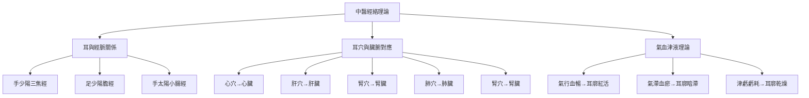

# 📖 耳穴診斷概論

> 🎯 **核心目標**：掌握耳穴診斷的基本概念和理論 | ⏱️ **學習時間**：30分鐘 | 📊 **難度等級**：⭐

## 📖 概念定義

### 耳穴診斷的定義
> **耳穴診斷**是指通過觀察、觸診、聽診、問診等方法，檢查耳廓的形態、色澤、質地、溫度、感覺等變化，從而推斷人體生理、病理狀況的一種診斷方法。

### 核心特點
- 🌟 **整體觀念**：耳廓為人體的縮影，體現局部與整體的關係
- 🎯 **早期預警**：能在疾病早期發現耳廓的異常變化
- 🩺 **無創檢查**：安全、無痛苦、可重複
- 💊 **簡便易行**：隨時隨地，不需特殊設備
- 🔄 **動態監測**：可連續觀察病情變化

## 🏛️ 理論基礎

### 中醫理論支撐

#### 中醫經絡理論


#### 中醫臟腑理論
```yaml
# 臟腑與耳穴對應關係
organs_relationships:
  心:
    auricular_points: ["心穴", "神門", "皮質下", "腎穴"]
    ear_region: "耳甲腔中央"
    clinical_signs:
      - 紅暗：心氣虛弱
      - 充血：心火亢盛
      - 枯白：心血不足
      - 色澤不均：心氣血不調
  
  肝:
    auricular_points: ["肝穴", "膽穴", "耳尖", "結節穴"]
    ear_region: "耳甲艇後下部"
    clinical_signs:
      - 紅暗: 肝氣鬱結
      - 充血: 肝火上炎
      - 脫屑: 肝腎不和
      - 裘紋: 肝經鬱滯
  
  脾:
    auricular_points: ["脾穴", "胃穴", "小腸穴", "大腸穴"]
    ear_region: "耳甲腔後上部"
    clinical_signs:
      - 蒼白: 脾氣虛弱
      - 充血: 脾胃濕熱
      - 厚陷: 脾胃氣虛
      - 粗糙: 脾胃不和
  
  肺:
    auricular_points: ["肺穴", "氣管穴", "平喘穴", "腎穴"]
    ear_region: "心穴周圍"
    clinical_signs:
      - 蒼白: 肺氣虛弱
      - 充血: 肺熱咳嗽
      - 水腫: 肺痰濕阻
      - 粗糙: 肺陰虛滯
  
  腎:
    auricular_points: ["腎穴", "腎穴", "內生殖器穴", "內分泌穴"]
    ear_region: "對耳輪下腳下方"
    clinical_signs:
      - 暗褐: 腎虧不足
      - 充血: 腎陰虛亢
      - 瘟陷: 腎精虧虧
      - 粗糙: 腎精血兩虧
```

### 珆代醫學理論支持

#### 神經解剖學基礎
```yaml
neural_anatomy:
  # 迷走神經耳支
  auricular_branches:
    name: "Arnold神經"
    origin: "頸靜脈神經"
    distribution: "耳甲、耳屏、對耳屏、耳垂"
    function: "感覺傳導、調節自律神經"
  
  # 三叉神經耳支
  trigeminal_branches:
    name: "三叉神經第三支"
    distribution: "外耳道、耳廓"
    function: "感覺支配"
  
  # 面面神經耳支
  facial_branches:
    name: "面神經"
    distribution: "耳廓外側"
    function: "運動支配、表達情感"
```

#### 全息理論基礎
```yaml
holographic_theory:
  # 胚胎投影理論
  fetal_projection:
    name: "倒置胎兒投影"
    head_location: "耳垂"
    torso_location: "對耳輪"
    limbs_location: "耳舟、耳屏"
    internal_organs: "耳甲"
    concept: "耳廓是全身的縮影"
  
  # 反射區理論
  reflex_zones:
    principle: "內臟器官在耳部有特定的反應區"
    mechanism: "神經反射、經絡傳導"
    clinical_application: "通過刺激耳穴調對應內臟器官"
  
  # 系統對應
  system_correspondence:
    nervous_system: "大腦皮層、邊緣系統"
    endocrine_system: "下丘腦-垂體-靶腺軸"
    immune_system: "淋巴器官、脾臟"
    circulatory_system: "心血管系統"
```

## 🔬 耳穴診斷特點

### 訾斷優勢
| 優點 | 內體描述 | 應用價值 |
|------|----------|----------|
| **早期性** | 疾病早期耳廓就有變化 | 早期診斷、早期治療 |
| **敏感性** | 對微的病理變化也能反映 | 提高診斷準確性 |
| **全面性** | 能夠反映全身各系統狀態 | 整體評估健康狀況 |
| **無創性** | 不需要侵入性檢查 | 患者接受度高 |
| **簡便性** | 隨時隨地可以進行 | 適合門診和自測 |
| **經濟性** | 成本低，可重複檢查 | 長期監測 |

### �斷局限性
| 局限性 | 具體描述 | 應註事項 |
|------|----------|----------|
| **特異性** | 不同人的耳廓有個體差異 | 需積累經驗 |
| **主觀性**：**診斷結果與醫師經驗有關** | 需結合其他診斷方法 |
| **精確度**：**不能給出具體的數據** | 需客觀檢查驗證 |
| **範圍**：**無法替代現代醫學檢查** | 僅作輔助診斷手段 |

## 📊 �斷方法分類

### 按方法分類
| 方法類型 | 主要內容 | 難度 | 需設備 |
|----------|----------|------|----------|
| **望診** | 觀測形態、色澤、光澤等 | ⭐⭐ | 無需工具 |
| **觸診** | 檢查壓痛、敏感度、質地等 | ⭐⭐ | �診棒/壓力計 |
| **聞診** | 聆覺聲音、嗅聞氣味 | ⭐ | 無需設備 |
| **問診** | 詢問病史、癥狀、症狀 | ⭐ | 無需記錄 |

### 按目標分類
| �斷目標 | �斷內容 | 意義 | 準用場景 |
|----------|----------|------|----------|
| **形態診斷** | 形態、大小、對稱性 | 解剖信息 | 解剖結構分析 |
| **色澤診斷** | 顏色、光澤、斑點 | 氣血狀態 | 氣血循環評估 |
| **質地診斷** | 壓軟度、彈性、溫度 | 組織狀態 | 營養狀況評估 |
| **溫度診斷** | 溫度、熱度、冷感 | 髓陽狀態 | 炎症辨證 |
| **感覺診斷** | 壓痛、酸脹、麻木 | 神經功能 | 神經系統疾病 |
| **敏感度診斷** | 壓痛反應、壓痛閾值 | 反應性 | 適藥效果預測 |

## 🎯 �斷原則

### 整體原則
1. **辨證結合**：辨證論與耳穴診斷相結合
2. **四診合參**：望聞問切四診資訊綜合
3. **局部與整體結合**：耳部變化與全身狀態結合分析
4. **動靜觀察**：疾病發展過程中連續觀察耳廓變化

### 準原則
1. **先主後次**：先辨證主證，再辨證兼證
2. **標本兼顧**：既有共性標準，又有個體差異
3. **常變結合**：考慮年齡、性別、體質等因素
4. **動態評估**：結合治療效果動態調整診斷

## 📚 學習方法

### 📖 理論學習
1. **中醫基礎**：熟練掌握中醫基礎理論
2. **耳穴知識**：學習93個標準耳穴的定位和主治
3   **診斷原理**：理解耳穴診斷的理論機制
4. **臨床應用**：學習各種疾病的耳穴診斷特點

### 🎯 實踐訓練
1. **觀察練習**：多觀察不同人的正常耳廓形態
2. **對比練習**：對比健康人與患者的耳廓差異
3. **記錄總結**：積累耳穴診斷經驗
4. **反思改進**：通過實踐不斷改進診斷技能

### 📊 學習資源
1. **經典著作**：《黃帝內經》、《靈樞經》、《耳針甲乙經》
2. **現代教材**：《耳穴診斷學》、《耳穴療法學》
3. **視頻教程**：耳穴診斷教學視頻
4. **實踐案例**：臨床耳穴診斷案例分析

## ✅ 學習評估

### 📋 自評估清單
#### 知識掌握程度
- [ ] 能夠描述耳穴診斷的定義和特點
- [ ] 了解中醫理論和現代醫學理論支持
- [ ] 掌握耳診斷方法的分類和應用
- [ ] 理解耳穴診斷的優勢和局限性

#### 技能掌握程度
- [ ] 能夠進行基本的望診
- [ ] 能夠進行基本的觸診
- [ ] 能夠進行基本的問診
- [ ] 能夠綜合運用四診資訊進行診斷

#### 臨床應用能力
- [ ] 能夠識別正常的耳廓形態
- [ ] 能夠發現常見的耳廓異常
- [ ] 能夠將耳穴診斷與臨床治療結合
- [ ] 能夠動態觀察耳廓變化評估療效

## 💡 學習建議

### 🎯 初學者建議
1. **從基礎開始**：先學習中醫基礎和耳穴知識
2. **重視實踐**：多觀察、多對比、多練習
3. **請教指導**：尋求經驗豐富的導師指導
4. **記錄總結**：做好學習筆記和經驗總結

### 🥈 進階建議
1. **深入理論**：深入研究中醫理論和現代醫學機制
2. **豐富經驗**：積累更多的臨床診斷經驗
3. **提高準確性**：通過對比驗證提高診斷準確性
4. **擴展應用**：擴大耳穴診斷的應用範圍

### 🚀 專家級建議
1. **理論創新**：在理論上有所創新和突破
2. **技術改進**：改進診斷方法和工具
3. **標準制定**：參與制定耳穴診斷標準
4. **學術推廣**：推廣耳穴診斷理論和技術

---

## 🎯 學習目標

通過學習本章，您應該能夠：

1. ✅ 理解耳穴診斷的基本概念和理論基礎
2. ✅ 掌握耳穴診斷的優勢和局限性
3. ✅ 了解耳穴診斷方法和應用原則
4. ✅ 掌握學習方法和評估標準
5. ✅ 能夠進行基本的耳穴診斷操作

---

> 📌 **下一步**：繼續學習 [[耳穴望診方法]] 了解具體的望診技術和方法

🔗 **相關知識**：[[耳穴診斷中醫理論]] | [[耳穴解剖基礎]] | [[耳穴定位對應關係]]

---
**📝 創建時間**：2026年1月22日 | **🔄 最後更新**：2026年1月22日 | **📊 版本**：v1.0