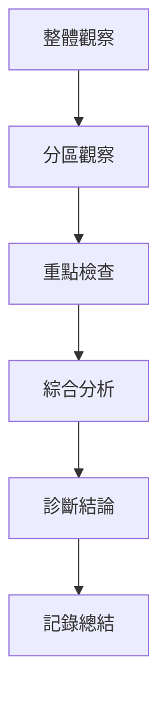

# 👀 耳穴望診技術

> 🎯 **核心目標**：掌握耳廓望診的具體方法和臨床應用 | ⏱️ **預計時間**：60分鐘 | 📊 **難度等級**：**⭐⭐**

## 📖 概述

> **耳廓望診**是指通過觀察耳廓的形態、顏色、光澤、質地等變化，來診斷人體健康狀況的一種診斷方法。

### 🎯 核心特點
- **無創檢查**：安全、無痛苦、患者易於接受
- **簡便快捷**：可隨時隨地進行，無需特殊設備
- **全面整體**：反映全身臟腑的生理病理狀態
- **動態監測**：可連續觀察疾病變化和治療效果

## 🏛️ 耳廓解剖分區望診

### 📋 分區對應關係
| 區域 | 對應部位 | 主要臟腑 | 主診要點 |
|------|----------|----------|----------|
| **耳輪** | 四肢、脊柱、生殖器 | 腎腎、生殖系 | 形態、紋摺、色澤 |
| **耳舟** | 上肢（肩、肘、腕、指） | 肺、小腸 | 丘疹、瘀斑、紋理 |
| **對耳輪** | 軕幹、盆腔、下肢 | 腎腎、膀胱、腎 | 形態、隆起、凹陷 |
| **耳甲** | 胸腹腔臟器 | 心、肝、脾、肺、腎 | 色澤、充血、形態 |
| **三角窩** | 盆腔、內生殖器 | 腎腎、內分泌 | 紅斑、丘疹、血管網 |

### 🎯 觀察要點
#### �體形態觀察
```yaml
overall_observation:
  耳廓形態:
    正常: "大小適中,兩側對稱,形態自然"
  
  異寬: "細長型 - 氣虛質弱"
  圓形: "肥厚型 - 氣血虛盛"
    扁形: "上寬下窄 - 腎腎虛弱"
    圓錐形: "上窄下寬 - 火熱內盛"
  
  對稱性: "左側較大 - 肝氣實/血瘀"
  
  缺陷: "局部凹陷 - 相應臟腑虛損"
  
  隆起: "局部隆起 - 氣血瘀阻/腫塊"
```

#### 顏色變化觀察
```yaml
color_changes:
  正常: "淡紅色, 潤紅色, 有光澤"
  
  常見異常:
    �紅色: "鮮血、熱毒、肝膽化火"
    白色: "氣血虛弱、寒證、貧血不足"
    黃色: "脾虛濕、化濕、運化失調"
    青色: "寒濕、陰寒內盛、腎氣不足"
    黑色: "腎腎虧衰、瘀血嚴重"
    青紫色: "氣滯血瘀"
    �暗: "腎陽血瘀、疼痛劇烈"
  
  特殊顏色:
    黃褐色: "慢性病、虛損、陳氣不足"
    淺灰色: "氣血虛弱、腎虛寒"
    暗色: "熱毒熾盛、炎症反應"
    �紫色: "血瘀、心脈阻滯、疼痛"
```

### 🖕 光澤質地觀察
```yaml
surface_observations:
  光澤度:
    有光澤: "氣血調和、健康狀態"
    暗淡無光: "氣血虛弱、腎腎虛衰"
    �燥粗糙: "陰虛內盛、津液不足"
    油潤光亮: "痰濕內盛、濕熱內盛"
  
  �部質地:
    潤軟: "正常狀態,津液充足"
    燥脫: "熱盛傷陰,腎腎虛熱"
    硬: "寒濕內盛,腎腎虛寒"
    厚硬: "瘀血阻滯,腎腎虛衰"
  
  彈態彈性:
    彈性: "氣血兩虚,精血不足"
    彈硬: "氣滯血瘀,寒凝血瘀"
    腫軟: "熱盛傷陰,陰盛格遏"
    無脆: "腎腎虛極虛,預後不良"
```

## 🎯 望診步驟

### 📋 標準流程


### 1. 整體觀察
#### 1.1 外觀檢查
- **體質識別**：體質強弱、肥瘦、虛實、虛弱
- **精神狀態**：精神振奮、萎靡不振、焦慮不安
- **步態體態**：輕靈自如、動作協調、肢體強弱
- **語音聲音**：聲音有力、微弱無力、言語清晰度

#### 1.2 耳廓整體評估
| 項目 | 正常 | 異寬型 | 圓形 | 傾厚型 | 憟形 |
|------|------|--------|------|--------|------|
| **耳輪形態** | 自然圓滑 | 向上傾斜 | 豐滿 | 飾厚肥厚 | 向下傾斜 |
| **對稱性** | 兩側對稱 | 輕側較大 | 左側較大 | 右側較大 | 不對稱 |
| **飽滿度** | 飽滿有彈性 | 欠陷虧弱 | 飾厚豐滿 | 滿度適中 | 消瘦乾瘪 |

### 2. 分區詳觀

#### 2.1 耳輪區
```yaml
helix_region:
  正常狀態:
    顏色: "淡紅或粉紅色"
    �部質地: "柔軟有彈性"
    光澤: "有光澤"
    形態: "圓滑自然, 無痕明顯"
  
  異寬型:
    表現: "耳輪變薄、拉長"
    意義: "腎腎虛弱,氣血不足"
    訙病: "虛損患者、慢性病患者"
  
  圓形型:
    表現: "耳輪變圓、肥厚"
    意義: "氣血雙盛、痰濕體質"
    相關疾病: "高血壓、肥胖、動脈硬化"
  
  扁形型:
    表現: "上寬下窄,形似漏斗"
    意義: "上實下虛、腎腎虛弱"
    相關疾病: "脾胃虛弱、消化不良、貧血不足"
  
  缺陷異常:
    部陷: "相應區域臟腑虛損"
    意義: "氣血不足、陰虛內盛"
  
  隆起異常:
    隆起: "相應區域氣滯血瘀"
    意義: "氣滯阻滯、腫塞不通"
```

#### 2.2 耳舟區
```yaml
auricle_region:
  正常狀態:
    顏色: "淡紅色,紅暈色"
    �部質地: "平滑細膩"
    光澤: "有光澤"
  
  �見病理變化:
    丘疹:
      顏色: "淡紅色或暗紅色"
      形態: "高出皮面的圓形丘疹"
      訙病: "過敏反應、濕疹、濕疹"
    
    瘲斑:
      顏色: "暗紅色或紫暗色"
      形態: "點片狀或條索狀"
      意義: "氣滯血瘀、疼痛症狀"
    
    紋理:
      顏色: "白色或灰白色"
      形態: "皮紋紋理"
      意義: "氣血虛弱、貧血不足"
    
    血管怒張:
      顏色: "鮮紅色或暗紅色"
      形態: "血管擴張、明顯可見"
      意義: "熱盛血行、高血壓、腎火上炎"
```

#### 2.3 對耳輪區
#### 2.3.1 髖體部
```yaml
crus_ear_region:
  正常狀態:
    顏色: "淡紅色或粉紅色"
    �部質地: "中等柔軟有彈性"
    形態: "平滑圓滑,結構清晰"
  
  �見病理變化:
  增厚:
    部增厚: "組織增厚、變硬"
    意義: "氣滞血瘀、腫塞不通"
    相關疾病: "高脂血症、動脈硬化"
  
  痛變:
    脫變: "軟骨脫炎、類風濕性關節炎"
    腹縮: "椎間盤退行性改變"
    腱腫脫: "腰椎間盤突出症"
  
  畿條隆起:
    隆起: "骨贅增生、椎體滑脫"
    意義: "腎腎虛弱、腎寒血瘀"
```

#### 2.3.2 髖體下體
```yaml
lower_crus_ear_region:
  正常狀態:
    形態: "平直或輕微凹陷"
    顏色: "正常顏色"
  
  隆起異常:
  僴起: "椎間盤突出"
    位置: "與脊椎病變部位相應"
    意義: "氣滯血瘀、腫塞不通"
    
  凹陷異常:
  凹陷: "脊髓型結核病後遺症"
    意義: "腎腎虛弱、腎精不足"
```

#### 2.4 對耳屏
```yaml
antitragus_region:
  正常狀態:
    顏色: "淡紅色或膚色"
    �部質地: "薄而柔軟"
  
  腥厚:
    腥厚: "内分泌失調、肥胖"
    意義: "濕痰內盛、氣虛濕"
    相關疾病: "甲狀腺功能亢進"
  
  紋理:
    紋理: "過敏性鼻炎、慢性咽炎"
    意義: "過敏體質、肺氣虛弱"
  
  腺疹:
    丘疹: "過敏反應"
    色疹: "病毒感染"
    意義: "熱毒熾盛、風熱束表"
```

### 3. 重點檢查部位

#### 3.1 核診穴位
```yaml
diagnosis_points:
  心穴:
    location: "耳甲腔中央凹陷處"
    正常: "淡紅色,柔軟,無異常感"
    畿床意義:
      充紅深: "心火亢盛、失眠健忘"
      淡白無澤: "心血不足、心氣虛弱"
      暗暗色: "心血瘀阻、心脈瘀阻"
    
  肝穴:
    location: "耳甲艇後下部"
    正常: "淡紅色,平滑,無隆起"
    長床意義:
      充血深: "肝火上炎、高血壓頭暈"
      暗暗色: "肝陽血瘀、肋痛"
    
  脾穴:
    location: "耳甲腔後上部"
    正常: "淡紅色,有彈性"
    長床意義:
      腥厚: "脾虛濕、痰濕內盛"
      褿黃無澤: "脾氣虛弱、運化失調"
    
  肺穴:
    location: "心穴上方,心穴外上方"
    正常: "淡粉色或乳白色"
    長床意義:
      白色: "肺氣虛弱、衛虛喘息"
      紅暗: "肺熱咳喘、黃膈濕熱"
    
  腎穴:
    location: "對耳輪下腳中部"
    正常: "淡紅色或褐色"
    長床意義:
      紅暗: "腎腎虛衰、耳鳴"
      暗紅: "腎火亢盛、遺精滑遺"
      蒼斑: "腎腎虛寒、氣滯血瘀"
```

#### 3.2 區助診斷區
```yaml
auxiliary_diagnosis_areas:
  內髏部:
    顏色: "正常皮膚顏色"
    畜床意義:
      紅暗: "心氣血不足、心絞絞失常"
      癜紅: "心火亢盛、心悸失眠"
    
  肩上角:
    顏色: "正常皮膚顏色"
    長床意義:
      紫斑: "氣滯血瘀、疼痛"
      隆起: "骨贅增生、關節炎"
    
  腮椎:
    顏色: "正常皮膚顏色"
    長床意義:
      凹陷: "脊髓型結核、腎腎虛弱"
      增厚: "脊椎增生、骨贊病"
    
  內髎部:
    顏色: "正常皮膚顏色"
    長床意義:
      隆起: "椎間盤突出"
      紅斑: "氣滯血瘀"
```

### 4. 綜合診斷

#### 4.1 耳診原則
```yaml
diagnosis_principles:
  整體觀察:
    - "觀其大體,先別陰陽"
    - "形態虛實,渾其彎盛"
    - "色澤光澤,辦其寒熱"
  
  局部觀察:
    - "分區詳觀,細察穴位"
    - "對比左右,辨別異常"
    - "觸其變化,動態觀察"
  
  綜合判斷:
    - "望診結合問診,全面評估"
    - "舌象脈象,參考互證"
    - "病機辨證,指導治療"
```

#### 4.2 辨證要點
```yaml
syndrome_differentiation:
  寒證:
    特點:
      - 耳廓色澤蒼白
      - 耳輪變薄
      - 心穴色淡白
      - 脾穴淡黃無澤
    
    �見病症:
      - 心悸、失眠、健忘
      - 面色蒼白
      - 四肢不溫
      - 面乏力
    
  熈證:
    特點:
      - 耳廓色澤紅
      - 耳輪紅暗
      - 心穴紅深
      - 肝穴暗紅
    
    �見病症:
      - 高血壓
      - 失眠、煩躁
      - 便秘
      - 口苦咽乾
  
  濕證:
    特點:
      - 耳廓色澤黃
      - 耳輪油膩
      - 脾穴黃褐色
      - 皮膚油潤
    
    常病症:
      - 眩眩、耳鳴
      - 頭暈、嗜睡
      - 髼心虛怯
      - 消化不良
  
  痰證:
    特點:
      - 耳廓色澤蒼
      - 耳輪乾燥無光
      - 耳穴色紫暗
      - 皮下瘀斑
    
    常病症:
      - 疼痛症狀
      - 月經不調
      - 痛症
      - 癌瘇腫塊
```

## 🔬 望診實踐技巧

### 📋 觀察技巧
#### 1. 準備工作
```yaml
preparation:
  環境要求:
    - 光照: "充足自然光線"
    - 髜位: "安靜舒適"
    溫度: "室溫20-25℃"
  
  工具準備:
    - "放大鏡" - 放大鏡觀察細微變化
    - "記錄筆記" - 詳細記錄發現
    - "色卡比對卡" - 標準化顏色對照
    - "解剖圖譜" - 耳廓解剖參考
  
  患者準備:
    - 清潔耳部: "使用溫水清潔或酒精棉片"
    - 放鬆頭髮: "方便觀察耳廓"
    - 放松情緒: "保持心平氣和"
```

#### 2. 觀察方法
```yaml
observation_methods:
  遠距離觀察:
    第一步: "距離患者0.5米觀察整體形態"
    第二步: "距離30cm觀察局部細節"
    第三步: "適當距離進行精確觀察"
    第四步: "貼近觀察確認異常"
  
  接觸診斷:
    溫和觸診: "用食指或探棒輕柔觸診"
    詫力診斷: "測試壓痛敏感度"
    適力診斷: "測試壓痛反應性"
    溫壓測試: "使用體溫計測耳廓溫度"
```

### 3. 訙錄要點
```yaml
recording_points:
  基礎信息:
    - 患者姓名、年齡、性別
    - 初診時間、主訴訴
    - 髨史記錄
  
  觀察記錄:
    整體形態: "長短、寬窄、厚薄、彈態"
    顏色變化: "主色、變色範圍、深淺、�勻"
    光澤質地: "光澤度、乾燥潤潤、彈性"
    特殊異常: "增生、潰爛、結節、腫塊"
  
  重點穴位:
    心穴狀態: "顏色、形態、感覺"
    肝穴狀態: "顏色、質地、隆起"
    脾穴狀態: "顏色、厚薄、脫紋"
    肺穴狀態: "顏色、溫度、壓痛"
  
  對稱性:
    左右差異: "左右形態、顏色、質地"
    上下對應: "不同區域的對應關係"
    動態變化: "治療前後的變化趨勢"
```

## 📊 臨床應用案例

### 🧠 心血管系統疾病

#### 高血壓
```yaml
hypertension:
  望診特徵:
    整體: "肥胖或消瘦,面紅油膩或蒼白"
    神志: "急躁易怒或精神不振"
    
    耳廓特點:
    耳輪: "紅暗色或暗紅色,增厚肥厚"
    心穴: "紅深色,有時可見血管紋"
    肝穴: "暗紅色,可見瘀斑"
    脾穴: "暗紫脫紋,可見皮膚乾燥"
    腎穴: "黃褐色,可見點狀瘀斑"
    
    相關區域:
      類: "耳輪增厚、腫管擴張"
      腮椎: "凹陷或隆起"
      類: "耳屏厚實、腎質地堅硬"
      心區: "心穴暗紅,可見血管怒張"
    
    訙病機: "肝陽化火,氣火上擾,痰濕內阻"
    
    治療原則: "清肝瀉火、活血化瘀、平肝潛陽"
```

#### 冠心病
```yaml
coronary_heart_disease:
  望診特徵:
    整體: "面色蒼白或紫暗,神疲乏力"
    耳廓特點:
    心穴: "蒼白色或淡紫色"
    腎穴: "暗紫色或瘀血狀"
    腎穴: "乾燥黃脫,光澤度差"
    脾穴: "黃褐色,可見脫紋紋"
    類: "耳甲腔區蒼白或淡灰色"
    
    相關區域:
      類: "耳廓蒼白,光澤度差"
      類: "心區貧血不足"
      類: "脾區黃膩,化濕內盛"
    
    標病機: "心氣虛弱,心陽不振,痰濕內阻,心脈瘀阻"
    
    治療原則: "補益心氣、活血化瘀、溫通心脈、豁痰開竅"
```

### 🧠 消化系統疾病

#### 脾胃虛弱
```yaml
spleen_deficiency:
  望診特徵:
    整體: "消瘦乏力,面色萎黃,精神不振"
    耳廓特點:
    脾穴: "黃褐色或蒼白色,乾燥無澤"
    胃穴: "黃膩無澤,可見點狀瘀斑"
    小腸穴: "黃脫紋,可見脫紋紋"
    
    相關區域:
      類: "消化不良,腹脹脹脹"
      類: "腎區貧血不足,運化失調"
      類: "胃區色澤黃,可見點狀"
    
    標病機: "脾氣虛弱,運化失調,胃失和降"
    
    治療原則: "補氣健脾、和胃降逆、調和運化"
```

#### 胃腸炎
```yaml
gastritis:
  望診特徵:
    整體: "面色紅赤或黃膩,口苦口乾"
    耳廓特點:
    肝穴: "紅暗色,可見壓痛敏感點"
    胃穴: "暗紫色,可見充血"
    胃腸穴: "深紅色,可見充血腫脹"
    
    相關區域:
      類: "胃區充血,可見血紋紋"
      類: "消化不良,脹脹脹"
      類: "小腸區點狀瘀斑"
    
    標病機: "肝火犯胃,胃失和降,濕熱中阻"
    
    治療原則: "清肝瀉火、和胃降逆、疏肝理氣"
```

### 🧠 呼吸系統疾病

#### 慢性支氣管炎
```yaml
chronic_bronchitis:
  望診特徵:
    整體: "消瘦或正常,面色蒼白或微黃"
    耳廓特點:
    肺穴: "蒼白色或淡紫色,可見點狀"
    平喘穴: "暗紅色或棕色,可見丘疹"
    氣管穴: "深紅色,可見血紋紋"
    腎穴: "乾燥黃脫,可見脫紋紋"
    
    相關區域:
      類: "肺區貧血不足"
      類: "肺區點狀瘀斑"
      類: "氣管區色澤異常"
    
    標病機: "肺氣虛弱,痰濕內阻,肺氣上逆"
    
    治療原則: "補益肺氣、化痰止咳、降逆平喘"
```

### 🧠 神經精神疾病

#### 抑鬱症
```yaml
depression:
  望診特徵:
    整體: "面色蒼白或微黃,精神疲憊"
    耳廓特點:
    心穴: "蒼白色或淡紫色"
    肝穴: "暗紫色,可見瘀斑"
    腎穴: "黃褐色,可見脫紋紋"
    
    相關區域:
      類: "心區貧血不足,精神抑鬱"
      類: "肝區色澤異常,肝氣鬱結"
      類: "腎區色澤異常,思慮過度"
    
    標病機: "肝鬱氣結,心脾兩虛,痰濕內擾"
    
    治療原則: "疏肝解鬱、養心安神、健脾化痰"
```

### 🧠 內科疾病

#### 痛經痛
```yaml
dysmenorrhea:
  望診特徵:
    整體: "面部蒼白,表情痛苦"
    耳廓特點:
    子宮穴: "暗紫色或紫暗色,可見點狀瘀斑"
    內髎穴: "暗紅色,可見壓痛敏感點"
    卵巢穴: "暗紫色,可見點狀"
    
    相關區域:
      類: "內生殖器區貧血瘀阻"
      類: "內分泌區色澤異常"
      類: "盆腔區點狀瘀斑"
    
    標病機: "氣滯血瘀,寒凝血瘀,胞宮虛寒"
    
    治療原則: "溫經散寒、活血化瘀、調理氣血"
```

#### 月經不調
```yaml
irregular_menstruation:
  望診特徵:
    整體: "面色蒼白或黃膩,精神疲憊"
    耳廓特點:
    子宮穴: "色澤不均,可見點狀或脫紋"
    卵巢穴: "色澤暗淡,可見脫紋"
    內髎穴: "色澤異常,可見點狀瘀斑"
    
    相關區域:
      類: "內分泌區功能異常"
      類: "生殖區點狀瘀斑"
      類: "消化區色澤異常"
    
    標病機: "腎腎失調,氣血不和,痰濕內阻"
    
    治療原則": "調補腎腎、調和氣血、化痰除濕"
```

## 📈 實錄與報告

### 📝 訙准記錄表
```yaml
observation_record:
  患者信息:
    姓名: ""
    性別: ""
    年齡: ""
    主訴: ""
    初診日期: ""
    訙病時間: ""
    
  整體形態:
    髓型: "正常/長寬/圓形/扁形/其它"
    髓況: "肥壯/消瘦/正常"
    精神狀態: "振奮/萎靡/焦慮/安靜"
    
  耳廓望診:
    整體形態: "完整描述"
    顏色變化: "分區描述"
    光澤質地: "分區描述"
    形態異常: "具體描述"
    
  重點穴位:
    心穴狀態: "顏色、形態、感覺"
    肝穴狀態: "顏色、質地、隆起"
    脾穴狀態: "顏色、厚薄、脫紋"
    肺穴�態: "顏色、溫度、壓痛"
    腎穴狀態: "顏色、點狀瘀斑、色澤異常"
    子宮穴狀態: "顏色、質地、點狀"
    卵巢穴狀態: "顏色、質地、脫紋"
    
  訙病機辨證:
    主要病機: "簡明概述"
    病機類型: "寒/熱/虛/實/夾雜"
    訙病位: "六經/臟腑/氣血/陰陽"
    
  訙病機:
    主要病因: "詳細病因"
    病病性質: "寒/熱/虛/實/夾雜"
    
  治療建議:
    主要治則: "補瀉瀉/溫通散寒/活血化瘀"
    建議方藥: "根據診斷結果"
    生活指導: "飲食起居注意事項"
    注意禁忌: "禁忌症提醒"
```

## ✅ 望診質量控制

### 🎯 訙熟要求
- [ ] 熟練掌握耳廓解剖知識
- [ ] 熟練辨識正常與異常狀態
- [ ] 熟練應用四診合參原則
- [ ] 準練收集完整診斷信息

### 📊 訙熟度評估
| 等級 | 描述 | 標熟標準 |
|------|------|----------|
| **初學者** | 能識別基本形態和色澤 | 能辨識8-10個主要穴位 |
| **中級** | 能辨別多種病理變化 | 能結合臨床實際應用 |
| **高級** | 能精確判斷病機和預後 | 能獨立制定治療方案 |

### 🔧 �見誤區
#### 誇色辨誤
- **光線影響**：不同光線下顏色不同，要在標準光源下觀察
- **膚色影響**：膚色皮膚影響本來的觀察
- **膚色盲**：部分人群對細微顏色辨識不準

#### 形態誤區
- **個體差異**：每人的耳廓形態都有差異，避免過度絕對化
- **年齡差異**：年齡增長，耳廓形態會自然變化
- **性別差異**：男女耳廓大小和形態略有差異

#### 經合診斷誤區
- **過度依賴**：只看耳廓不問病史，診斷不準確
- **主觀臆斷**：個人經驗影響診斷結果
- **標準不統**：缺乏統一的診斷標準

### 📚 學習建議

### 📖 學習階段
```yaml
learning_stages:
  初學階段:
    目標: "掌握基本觀察技能"
    時長: "1-2個月"
    任務:
      - 誇識10-15個主要穴位
      - 熆練辨識基本病理性狀態
      - 掌握觀察記錄要領
    
    方法:
      - 每日觀察20-30例
      - 繫寫觀察筆記
      - 對師指導下實踐
      - 參考標準色卡對
    
    詟查:
      - 理論考試（基本概念）
      - 實踐床考試（20例實際觀察）
      - 模擬診斷（病例分析）
  
  中級階段:
    目標: "提高診斷準確性和靈敏度"
    時長: "3-6個月"
    任務:
      - 掌握50+個診斷要點
      - 能辨別複雜病理性狀態
      - 能初步判斷病機和病位
      - 能提出治療建議
    
    方法:
      - 每日觀察30-50例
      - 病例討論和分析
      - 創練診斷技巧訓練
      - 中西醫結合診斷
  
  高級階段:
    目標: "成為耳穴診斷專家"
    時長: "6-12個月"
    任務:
      - 精準掌握100+診斷要點
      - 精確判斷複雜病例
      - 制定個體化治療方案
      - 指導初級診斷者
    
    方法:
      - 大量臨床實踐
      - 病例總結和分析
      - 教學術研究
      - 經術交流和培訓
```

### 📚 實踐練習
#### �習建議
- **每日堅持**：每天觀察5-10例
- **記錄總結**：定期整理分析病例
- **請教指導**：定期請教師指導和點評
- **經驗交流**：與同行交流診斷心得

#### �例積累
- **常見病例**：收集50+例常見病例
- **複雜病例**：收集30+例複雜疑难病例
- **特殊病例**：收集10+例特殊病例
- **誤診病例**：收集5-10例誤診病例

---

## 🎉 下一步

掌握本望診技術後，您可以：

1. **📖 學習臨床病例**：在臨床實踐中應用
2. **🔗 整理診斷案例**：積累和分析病例
3. **📋 制定記錄模板**：標準化診斷記錄
4. **🎯 提高診斷準確度**：通過臨床實踐不斷提升

> 💡 **學習提示**：望診需要大量臨床實踐，建議從簡單病例開始，逐步增加複雜度。

**🔗 **相關知識**：[[中醫理論]], [[耳穴解剖基礎]], [[耳穴定位總]]

---
**📝 創建時間**：2026年1月22日 | **🔄 最後更新**：2026年1月22日 | **👥 維護者**：耳穴診斷專業教學團隊