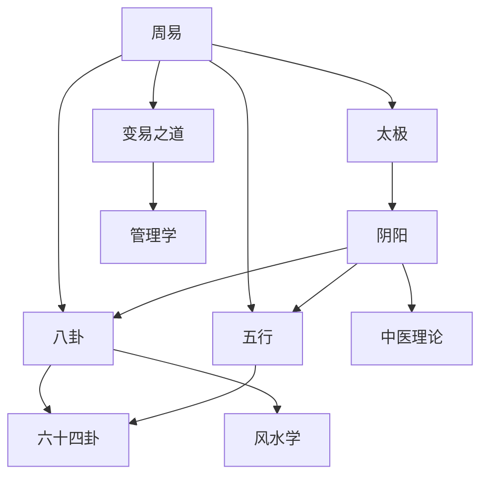

# 易经核心概念索引

本索引包含易经所有核心概念的原子化笔记，按主题分类组织。

---

## 🌌 哲学基础

### 根本本源
- [[20260201-0001 太极|太极]] - 宇宙万物的本源

### 核心范畴
- [[20260201-0002 阴阳|阴阳]] - 易经的根本范畴
- [[20260201-0010 变易之道|变易之道]] - 易经的核心哲学

---

## 🔢 符号系统

### 基础符号
- [[20260201-0008 八卦|八卦]] - 三爻系统，八种基本卦象
- [[20260201-0004 四象|四象]] - 两爻系统，四种基本状态
- [[20260201-0006 六爻|六爻]] - 六位系统，六种发展阶段

### 五行理论
- [[20260201-0005 五行|五行]] - 五种基本物质及其关系

---

## 📖 周易概念

### 易经总称
- [[周易|周易]] - 易经的别称和核心概念

### 三才思想
- [[20260201-0003 三才（天地人）|三才]] - 天道、地道、人道

---

## 🔗 概念关系图

---

## 📊 概念分类表

| 分类 | 概念 | 卡片 | 难度 | 状态 |
|------|------|------|------|------|
| 哲学基础 | 太极 | [[20260201-0001 太极]] | 基础 | ✅ |
| 哲学基础 | 阴阳 | [[20260201-0002 阴阳]] | 基础 | ✅ |
| 哲学基础 | 变易之道 | [[20260201-0010 变易之道]] | 中级 | ✅ |
| 符号系统 | 八卦 | [[20260201-0008 八卦]] | 中级 | ✅ |
| 符号系统 | 五行 | [[20260201-0005 五行]] | 中级 | ✅ |
| 周易概念 | 周易 | [[周易]] | 基础 | ✅ |
| 周易概念 | 三才 | [[三才（天地人）]] | 基础 | ✅ |

---

## 🎯 学习路径

### 初学者路径
1. 从[[20260201-0001 太极|太极]]开始 - 理解宇宙本源
2. 学习[[20260201-0002 阴阳|阴阳]] - 掌握根本范畴
3. 学习[[20260201-0008 八卦|八卦]]符号系统
4. 了解[[20260201-0010 变易之道|变易之道]]哲学思想

### 进阶路径
1. 深入理解[[20260201-0005 五行|五行]]关系
2. 掌握三才思想的综合应用
3. 探索概念间的复杂关系

---

## 🔗 相关索引

- [[MOC-易经知识库]] - 主索引
- [[易经-六十四卦]] - 卦象索引
- [[易经-应用领域]] - 应用索引

---

> 💡 **提示**：每个概念都有 wikilinks 连接到相关概念，点击链接可以探索整个知识网络。
