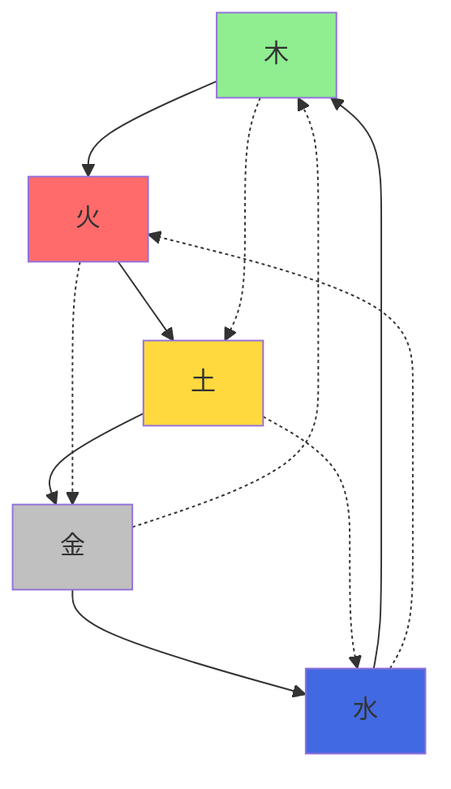

# 中医 - 阴阳五行

> [!quote] 阴阳五行奥义
> 阴阳者，天地之道也，万物之纲纪，变化之父母，生杀之本始，神明之府也。五行者，金木水火土，相生相克，制化调节。
> 
> —— 《黄帝内经》

## 🌓 阴阳学说

### 阴阳基本概念

#### 阴阳定义
- **阴阳对立**: 宇宙万物都存在相互对立的两个方面
- **阴阳互根**: 阴阳相互依存，互为存在基础
- **阴阳消长**: 阴阳在运动中此消彼长
- **阴阳转化**: 在一定条件下阴阳可以相互转化

#### 阴阳属性归类
```dataview
TABLE 
  "事物类别" as "类别",
  "属于阴" as "阴属性",
  "属于阳" as "阳属性"
FROM ""
WHERE contains(tags, "阴阳") OR contains(tags, "分类")
```

**自然现象阴阳分类:**
| 现象 | 阴属性 | 阳属性 |
|------|--------|--------|
| **时间** | 夜晚、秋冬、冬季 | 白天、春夏、夏季 |
| **方位** | 下、内、后、北 | 上、外、前、南 |
| **气候** | 寒、湿、静 | 热、燥、动 |
| **光暗** | 暗、阴、月 | 明、阳、日 |

**人体阴阳分类:**
| 人体部位 | 阴属性 | 阳属性 |
|----------|--------|--------|
| **部位** | 内、下、腹 | 外、上、背 |
| **脏腑** | 肝、脾、肾 | 心、肺、胃 |
| **气血** | 血、津液 | 气 |
| **功能** | 滋润、抑制 | 温煦、推动 |

### 阴阳平衡与失调

#### 阴阳平衡状态
| 生理表现 | 心理表现 | 行为表现 | 健康状态 |
|----------|----------|----------|----------|
| **体温适中** | 情绪稳定 | 动静适度 | 阴平阳秘 |
| **睡眠正常** | 精神饱满 | 饮食有节 | 精神乃治 |
| **二便调和** | 思维清晰 | 作息规律 | 身心健康 |
| **面色红润** | 记忆良好 | 适应力强 | 生命力旺盛 |

#### 阴阳失调类型
```dataview
TABLE 
  "失调类型" as "类型",
  "临床表现" as "表现",
  "调理原则" as "原则"
FROM ""
WHERE contains(tags, "阴阳失调") OR contains(tags, "调理")
```

**阳盛(阳偏盛):**
- **病因**: 外感阳邪，或阴虚阳亢
- **表现**: 发热、口渴、面红、脉数、烦躁不安
- **治法**: 清热泻火，滋阴潜阳
- **调理**: 苦寒药物，清淡饮食，充足睡眠

**阴盛(阴偏盛):**
- **病因**: 外感阴邪，或阳虚阴盛
- **表现**: 畏寒、肢冷、腹泻、舌苔白腻、脉沉迟
- **治法**: 温阳散寒，祛湿化饮
- **调理**: 温热食物，适度运动，保暖防寒

**阳虚(阳偏衰):**
- **病因**: 素体阳虚，或久病伤阳
- **表现**: 畏寒喜暖、面色苍白、乏力、舌淡、脉沉迟无力
- **治法**: 温补阳气，扶正固本
- **调理**: 温热食物，适度运动，充足休息

**阴虚(阴偏衰):**
- **病因**: 素体阴虚，或热病伤阴
- **表现**: 潮热盗汗、口干咽燥、心烦、舌红少苔、脉细数
- **治法**: 滋阴养血，清热除烦
- **调理**: 滋阴食物，避免熬夜，静养为主

### 阴阳在养生中的应用

#### 四季阴阳调节
| 季节 | 阴阳特点 | 养生原则 | 具体方法 |
|------|----------|----------|----------|
| **春季** | 阳气升发 | 养阳护阴 | 早睡早起，户外活动 |
| **夏季** | 阳气最盛 | 养阳为主 | 适度运动，清淡饮食 |
| **秋季** | 阴气渐长 | 养阴为主 | 早睡早起，收敛神气 |
| **冬季** | 阴气最盛 | 养阴护阳 | 早睡晚起，保存阳气 |

#### 一日阴阳调节
| 时辰 | 阴阳变化 | 养生要点 | 具体措施 |
|------|----------|----------|----------|
| **子时(23-1)** | 阴气最盛 | 养阴为主 | 深度睡眠 |
| **卯时(5-7)** | 阴阳交替 | 适度活动 | 起床晨练 |
| **午时(11-13)** | 阳气最盛 | 养阴护阳 | 午休片刻 |
| **酉时(17-19)** | 阴长阳消 | 养阴为主 | 放松休息 |

## 🌿 五行学说

### 五行基本理论

#### 五行归类表
| 五行 | 木 | 火 | 土 | 金 | 水 |
|------|---|---|---|---|---|
| **自然界** | |||||
| **季节** | 春 | 夏 | 长夏 | 秋 | 冬 |
| **气候** | 风 | 暑 | 湿 | 燥 | 寒 |
| **方位** | 东 | 南 | 中 | 西 | 北 |
| **颜色** | 青 | 赤 | 黄 | 白 | 黑 |
| **五味** | 酸 | 苦 | 甘 | 辛 | 咸 |
| **人体** | |||||
| **五脏** | 肝 | 心 | 脾 | 肺 | 肾 |
| **六腑** | 胆 | 小肠 | 胃 | 大肠 | 膀胱 |
| **五官** | 目 | 舌 | 口 | 鼻 | 耳 |
| **形体** | 筋 | 脉 | 肉 | 皮 | 骨 |
| **情志** | 怒 | 喜 | 思 | 悲 | 恐 |

#### 五行生克关系图


### 五行生克制化

#### 五行相生关系
```dataview
TABLE 
  "相生关系" as "关系",
  "生理意义" as "意义",
  "病理影响" as "病理"
FROM ""
WHERE contains(tags, "五行相生") OR contains(tags, "相生")
```

**相生循环:**
1. **木生火**: 肝木生心火
   - **生理**: 肝藏血，心主血脉，肝血充足以养心
   - **病理**: 肝血不足可导致心血亏虚

2. **火生土**: 心火生脾土
   - **生理**: 心阳温煦脾阳，助脾运化
   - **病理**: 心阳不足可导致脾阳虚弱

3. **土生金**: 脾土生肺金
   - **生理**: 脾运化水谷精微，上输于肺
   - **病理**: 脾气虚弱可导致肺气不足

4. **金生水**: 肺金生肾水
   - **生理**: 肺气肃降，助肾主水
   - **病理**: 肺气虚弱可导致肾水不足

5. **水生木**: 肾水生肝木
   - **生理**: 肾精化血，肝藏血，精血同源
   - **病理**: 肾精不足可导致肝血亏虚

#### 五行相克关系
| 相克关系 | 生理意义 | 病理影响 | 调理方法 |
|----------|----------|----------|----------|
| **木克土** | 肝木疏泄助脾运化 | 肝气郁结横逆犯脾 | 疏肝健脾 |
| **土克水** | 脾土运化制约肾水泛滥 | 脾虚不能制水，水湿内停 | 健脾利水 |
| **水克火** | 肾水上济心火防过亢 | 肾水不足不能制心火 | 滋阴降火 |
| **火克金** | 心火温煦肺金防过寒 | 心火过旺灼伤肺金 | 清心润肺 |
| **金克木** | 肺金清肃助肝木条达 | 肺金过旺克制肝木 | 润肺疏肝 |

### 五行在养生中的应用

#### 五脏养生法

##### 养肝(木)
**养肝要点:**
- **季节**: 春季养肝
- **时间**: 凌晨1-3点(肝经当令)
- **情志**: 疏肝解郁，避免暴怒
- **饮食**: 酸入肝，适量酸味
- **运动**: 舒展运动，户外活动

**养肝方法:**
```dataview
TABLE 
  "养肝方法" as "方法",
  "具体措施" as "措施",
  "注意事项" as "注意"
FROM ""
WHERE contains(tags, "养肝") OR contains(tags, "肝脏")
```

**养肝食物:**
- **绿色食物**: 菠菜、芹菜、青椒、黄瓜
- **酸味食物**: 柠檬、山楂、乌梅、醋
- **养肝药材**: 枸杞、菊花、当归、白芍

**养肝运动:**
- **伸展运动**: 伸展肢体，舒展筋骨
- **户外活动**: 接触自然，呼吸新鲜空气
- **情绪调节**: 保持心情舒畅，避免抑郁

##### 养心(火)
**养心要点:**
- **季节**: 夏季养心
- **时间**: 中午11-13点(心经当令)
- **情志**: 保持清静，避免过喜
- **饮食**: 苦入心，适量苦味
- **运动**: 适度运动，避免过度

**养心方法:**
- **养心食物**: 红色食物，苦味食物
- **养心药材**: 丹参、三七、酸枣仁
- **养心运动**: 太极拳、静坐、冥想

##### 养脾(土)
**养脾要点:**
- **季节**: 长夏养脾
- **时间**: 上午9-11点(脾经当令)
- **情志**: 节制思虑，避免过度
- **饮食**: 甘入脾，适量甘味
- **运动**: 适度运动，饭后百步

**养脾方法:**
- **养脾食物**: 黄色食物，甘味食物
- **养脾药材**: 黄芪、白术、茯苓
- **养脾运动**: 散步、八段锦、腹部按摩

##### 养肺(金)
**养肺要点:**
- **季节**: 秋季养肺
- **时间**: 凌晨3-5点(肺经当令)
- **情志**: 保持乐观，避免悲伤
- **饮食**: 辛入肺，适量辛味
- **运动**: 呼吸锻炼，增强肺气

**养肺方法:**
- **养肺食物**: 白色食物，辛味食物
- **养肺药材**: 沙参、麦冬、百合
- **养肺运动**: 深呼吸、扩胸运动、晨起散步

##### 养肾(水)
**养肾要点:**
- **季节**: 冬季养肾
- **时间**: 下午5-7点(肾经当令)
- **情志**: 保持冷静，避免恐惧
- **饮食**: 咸入肾，适量咸味
- **运动**: 温和运动，保存阳气

**养肾方法:**
- **养肾食物**: 黑色食物，咸味食物
- **养肾药材**: 熟地、山药、杜仲
- **养肾运动**: 太极拳、八段锦、腰部按摩

## 🔗 阴阳五行相互关系

### 阴阳与五行的统一

#### 五行阴阳属性
| 五行 | 阴阳属性 | 特点说明 |
|------|----------|----------|
| **木** | 阴中之阳 | 春生，阳气初升 |
| **火** | 阳中之阳 | 夏长，阳气最盛 |
| **土** | 阴中之至阴 | 长夏，阴阳平衡 |
| **金** | 阳中之阴 | 秋收，阳气渐收 |
| **水** | 阴中之至阴 | 冬藏，阴气最盛 |

#### 阴阳五行与体质
**阴阳体质分类:**
- **平和质**: 阴阳平衡，五行调和
- **阳虚质**: 阳气不足，多见于水木体质
- **阴虚质**: 阴液不足，多见于火金体质
- **痰湿质**: 阳虚湿盛，多见于土水体质
- **气郁质**: 肝气郁结，多见于木体质

**五行体质特征:**
- **木形人**: 身材瘦长，面青，性急，易怒
- **火形人**: 面红目赤，性急，热情
- **土形人**: 身材矮胖，面黄，性缓，诚信
- **金形人**: 方脸，面白，性急，刚毅
- **水形人**: 面黑，性沉，谨慎

## 💡 现代应用

### 阴阳五行与现代科学

#### 现代诠释
**阴阳的生物学基础:**
- **自主神经系统**: 交感神经(阳)和副交感神经(阴)
- **内分泌系统**: 肾上腺素(阳)和胰岛素(阴)
- **免疫调节**: 免疫增强(阳)和免疫抑制(阴)

**五行的现代理解:**
- **系统论**: 五行相当于五个相互作用的子系统
- **控制论**: 相生相克相当于正反馈和负反馈
- **生态学**: 五行平衡相当于生态系统平衡

#### 实际应用
**时间医学:**
- **生物节律**: 根据阴阳变化调整作息
- **用药时间**: 根据五行时辰选择最佳用药时间
- **养生保健**: 根据时辰经络理论安排养生

**心理调节:**
- **情绪管理**: 五志与五脏对应调节情绪
- **压力应对**: 根据体质特点选择减压方法
- **心理治疗**: 结合五行理论的心理疗法

**营养保健:**
- **五味养生**: 根据五味入五脏调节饮食
- **五色养生**: 根据五色入五脏选择食物
- **体质营养**: 根据五行体质制定营养方案

---

> [!tldr] 快速概要
> 阴阳五行是中医的核心理论，阴阳讲对立统一，五行讲生克制化，两者结合指导中医养生实践，实现身心平衡健康。

## 🏷️ 标签
#阴阳学说 #五行理论 #中医哲学 #体质养生 #整体观念

## 🔗 关联笔记
- [[中医养生-基础理论]]
- [[健康-四大维度]]
- [[中医-体质辨识]]

---
*创建时间：2026-01-19*  
*更新时间：2026-01-19*  
*分类：中医基础理论*