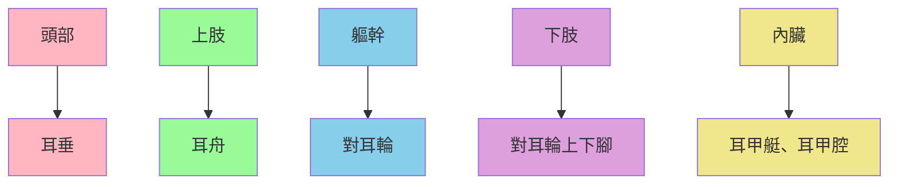

# 耳诊 - 耳穴分布规律

耳穴分布遵循特定的規律，掌握這些規律有助於準確定位和應用耳穴。

## 耳穴定位原则

### 整體投影規律

耳穴的分布呈現倒置胎兒的投影規律，這是耳穴定位的基本原則。

### 投影對應關係

| 身體部位 | 耳部位置 | 特點 |
|----------|----------|------|
| **頭面部** | 耳垂 | 倒置胎兒頭部向下 |
| **上肢** | 耳舟 | 沿耳舟分布 |
| **軀幹** | 對耳輪 | 對耳輪體 |
| **下肢** | 對耳輪上下腳 | 分佈在上下腳 |
| **內臟** | 耳甲艇、耳甲腔 | 耳甲腔內 |

## 系統分類耳穴

### 神經系統

| 屬性 | 內容 |
|------|------|
| **耳穴位置** | 耳垂內側 |
| **定位標誌** | 屏間切跡 |
| **主治範圍** | 神經衰弱、失眠、頭痛 |
| **常用穴位** | 神門、皮质下、交感 |

**常用穴位詳解:**
- **神門**：鎮靜安神，主治失眠、頭痛
- **皮质下**：調節神經，主治神經衰弱
- **交感**：調節自主神經，主治情緒問題

### 心血管系統

| 屬性 | 內容 |
|------|------|
| **耳穴位置** | 耳甲腔中心 |
| **定位標誌** | 心穴 |
| **主治範圍** | 心悸、胸悶、高血壓 |
| **常用穴位** | 心、交感、腎上腺 |

**常用穴位詳解:**
- **心**：寧心安神，主治心悸、失眠
- **交感**：調節心律，主治心律失常
- **腎上腺**：調節血壓，主治高血壓

### 呼吸系統

| 屬性 | 內容 |
|------|------|
| **耳穴位置** | 耳甲腔上部 |
| **定位標誌** | 肺穴、氣管 |
| **主治範圍** | 咳嗽、哮喘、支氣管炎 |
| **常用穴位** | 肺、氣管、內鼻 |

**常用穴位詳解:**
- **肺**：宣肺止咳，主治咳嗽、哮喘
- **氣管**：寬胸理氣，主治氣管炎
- **內鼻**：通鼻竅，主治鼻炎

### 消化系統

| 屬性 | 內容 |
|------|------|
| **耳穴位置** | 耳甲艇 |
| **定位標誌** | 胃穴、腸穴、肝穴 |
| **主治範圍** | 胃痛、腹瀉、消化不良 |
| **常用穴位** | 胃、腸、肝、膽、脾 |

**常用穴位詳解:**
- **胃**：和胃止痛，主治胃痛、消化不良
- **腸**：調腸通便，主治腹瀉、便秘
- **肝**：疏肝理氣，主治肝膽疾病
- **膽**：利膽排石，主治膽囊炎
- **脾**：健脾益氣，主治消化不良

### 泌尿生殖系統

| 屬性 | 內容 |
|------|------|
| **耳穴位置** | 三角窩 |
| **定位標誌** | 腎穴、膀胱穴、子宮 |
| **主治範圍** | 泌尿感染、月經不調 |
| **常用穴位** | 腎、膀胱、尿道、子宮、卵巢 |

**常用穴位詳解:**
- **腎**：補腎益精，主治腰痛、腎炎
- **膀胱**：利尿通淋，主治泌尿感染
- **子宮**：調經活血，主治月經不調
- **卵巢**：調節內分泌，主治卵巢疾病

### 內分泌系統

| 屬性 | 內容 |
|------|------|
| **耳穴位置** | 耳甲腔後部 |
| **定位標誌** | 內分泌穴 |
| **主治範圍** | 內分泌失調、糖尿病 |
| **常用穴位** | 內分泌、甲狀腺、胰膽 |

**常用穴位詳解:**
- **內分泌**：調節內分泌，主治內分泌失調
- **甲狀腺**：調節甲狀腺功能
- **胰膽**：調節胰島素，主治糖尿病

### 運動系統

| 屬性 | 內容 |
|------|------|
| **耳穴位置** | 耳輪、對耳輪 |
| **定位標誌** | 頸、肩、腰、膝等 |
| **主治範圍** | 關節疼痛、肌肉損傷 |
| **常用穴位** | 頸椎、胸椎、腰椎、肩、肘、膝、踝 |

**常用穴位詳解:**
- **頸椎**：頸部疾病，主治頸椎病
- **胸椎**：胸部疾病，主治胸椎病
- **腰椎**：腰部疾病，主治腰痛
- **肩**：肩部疾病，主治肩周炎
- **肘**：肘部疾病，主治肘痛
- **膝**：膝部疾病，主治膝關節痛
- **踝**：踝部疾病，主治踝扭傷

## 定位技巧

### 經典定位法
1. **找標誌**：先找到明顯解剖標誌
2. **分區域**：按區域劃分反射區
3. **定穴位**：在反射區內定位具體穴位
4. **驗證**：通過壓痛驗證定位

### 壓痛定位法
1. **系統檢查**：順序檢查各個反射區
2. **尋找壓痛點**：輕壓尋找壓痛敏感點
3. **確定穴位**：壓痛明顯處即為穴位
4. **對比雙耳**：左右耳對比確認

### 反應點定位法
1. **觀察顏色**：觀察耳廓顏色變化
2. **觸摸質地**：觸摸結節、條索
3. **感覺溫度**：感受溫度變化
4. **綜合判斷**：綜合多種反應確定

## 耳穴分布圖表

### 主要耳穴一覽表

| 系統 | 穴位 | 位置 | 主治 |
|------|------|------|------|
| **神經** | 神門 | 三角窩 | 失眠、頭痛 |
| **神經** | 皮质下 | 耳甲腔 | 神經衰弱 |
| **心血管** | 心 | 耳甲腔 | 心悸、胸悶 |
| **呼吸** | 肺 | 耳甲腔 | 咳嗽、哮喘 |
| **消化** | 胃 | 耳甲艇 | 胃痛、消化不良 |
| **消化** | 肝 | 耳甲艇 | 肝炎、眼疾 |
| **泌尿** | 腎 | 耳甲艇 | 腰痛、腎炎 |
| **生殖** | 子宮 | 三角窩 | 月經不調 |
| **內分泌** | 內分泌 | 耳甲腔 | 內分泌失調 |
| **運動** | 頸椎 | 對耳輪 | 頸椎病 |
| **運動** | 腰椎 | 對耳輪 | 腰痛 |

## 注意事項

### 定位準確性
- **解剖基礎**：熟記解剖結構
- **標誌參照**：明確定位標誌
- **多次驗證**：通過壓痛驗證
- **經驗積累**：積累定位經驗

### 個體差異
- **耳廓形態**：不同人耳廓形態有差異
- **穴位位置**：相對位置穩定，絕對位置有差異
- **反應強度**：不同人反應強度不同
- **靈活調整**：根據個體差異靈活調整

## 關聯筆記

- [[中医-耳诊]] - 耳診總覽
- [[耳诊-耳部解剖结构]] - 耳部結構詳解
- [[耳诊-重要耳穴详解]] - 重要耳穴詳解
- [[耳诊-基础理论]] - 理論基礎

---

> [!tldr] 快速概要
> 耳穴分布遵循倒置胎兒投影規律，按神經、心血管、呼吸、消化、泌尿、內分泌、運動等系統分類，掌握定位原則和技巧有助於準確應用耳穴。

## 🏷️ 標籤
#耳診 #耳穴 #穴位定位 #反射區 #中醫診斷

---
*創建時間：2026-01-20*
*分類：中醫診斷方法*
