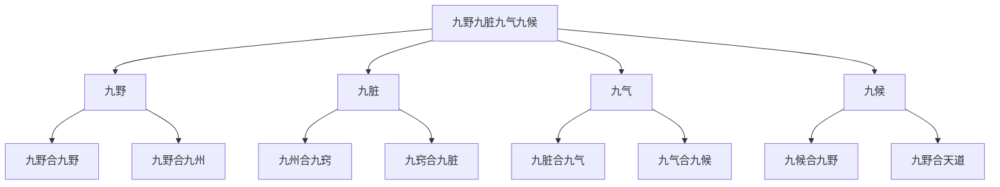

# 素问-三部九候论篇第二十

> "黄帝曰：余闻九针于夫子，众多博大，不可胜数。余愿闻要道，以属子孙，传之后世，著之骨髓，藏之肺肝，歃血而受，不敢妄泄，令合天道，必有终始，上应天光，星辰历纪，下副四时五行，贵贱更立，冬阴夏阳，以人应之奈何？" - 黄帝

---

## 📜 原文（节选）/ Original Text (Excerpt)

黄帝问曰：余闻九针于夫子，众多博大，不可胜数。余愿闻要道，以属子孙，传之后世，著之骨髓，藏之肺肝，歃血而受，不敢妄泄，令合天道，必有终始，上应天光，星辰历纪，下副四时五行，贵贱更立，冬阴夏阳，以人应之奈何？

岐伯对曰：妙乎哉问也！此天地之合，四海之内，九州之野，九野之数也。

帝曰：以人应之奈何？

岐伯曰：人有九野，九野合九野，九野合九州，九州合九窍，九窍合九脏，九脏合九气，九气合九候，九候合九野，九野合天道。

帝曰：何谓三部？

岐伯曰：有下部，有中部，有上部。部各有三候，三候者，有天有地有人也。必指而导之，乃以为真。

上部天，两额之动脉；上部地，两颊之动脉；上部人，耳前之动脉。

中部天，手太阴也；中部地，手阳明也；中部人，手少阴也。

下部天，足厥阴也；下部地，足少阴也；下部人，足太阴也。

故下部之天以候肝，地以候肾，人以候脾胃之气。

帝曰：中部之候奈何？

岐伯曰：亦有天，亦有地，亦有人。天以候肺，地以候胸中之气，人以候心。

帝曰：上部以候何脏？

岐伯曰：亦有天，亦有地，亦有人。天以候头角之气，地以候口齿之气，人以候耳目之气。

三部者，各有天，各有地，各有人。三而成天，三而成地，三而成人，三而三之，合为九候。

---

## 📖 白话文翻译（节选）/ Modern Chinese Translation (Excerpt)

黄帝问道：我听您讲九针的道理，众多博大，不可胜数。我希望听到其中的要道，用来传给子孙，传给后世，刻在骨髓中，藏在肺肝中，歃血接受，不敢随意泄露，让它合乎天道，一定有始有终，上应天光星辰历纪，下合四时五行，贵贱更替，冬阴夏阳，以人体相应是怎样的？

岐伯回答说：问得太好了！这是天地的配合，四海之内，九州的田野，九野的数目。

黄帝说：以人体相应是怎样的？

岐伯说：人有九野，九野合九野，九野合九州，九州合九窍，九窍合九脏，九脏合九气，九气合九候，九候合九野，九野合天道。

黄帝说：什么是三部？

岐伯说：有下部，有中部，有上部。每部各有三候，三候就是有天有地有人。必须指点引导，才能认为真实。

上部天，两额的动脉；上部地，两颊的动脉；上部人，耳前的动脉。

中部天，手太阴；中部地，手阳明；中部人，手少阴。

下部天，足厥阴；下部地，足少阴；下部人，足太阴。

所以下部的天用来候肝，地用来候肾，人用来候脾胃之气。

黄帝说：中部的候怎样？

岐伯说：也有天，也有地，也有人。天用来候肺，地用来候胸中之气，人用来候心。

黄帝说：上部候什么脏？

岐伯说：也有天，也有地，也有人。天用来候头角的气，地用来候口齿的气，人用来候耳目的气。

三部，各有天，各有地，各有人。三而成天，三而成地，三而成人，三而三之，合为九候。

---

## 🔑 核心要点 / Core Concepts

### 1. 三部九候系统 / Three Regions and Nine Observations System

| 部位 | 天 | 地 | 人 |
|------|------|------|------|
| 上部 | 两额之动脉 | 两颊之动脉 | 耳前之动脉 |
| 中部 | 手太阴（肺） | 手阳明（胸中） | 手少阴（心） |
| 下部 | 足厥阴（肝） | 足少阴（肾） | 足太阴（脾胃） |

### 2. 三部九候对应脏腑 / Three Regions and Nine Observations Corresponding to Zang-Fu

| 部位 | 天候 | 地候 | 人候 |
|------|------|------|------|
| 上部 | 头角之气 | 口齿之气 | 耳目之气 |
| 中部 | 肺 | 胸中之气 | 心 |
| 下部 | 肝 | 肾 | 脾胃之气 |

### 3. 九野九脏九气九候 / Nine Fields Nine Zang Nine Qi Nine Observations

---

## 📚 理论解释 / Theoretical Analysis

### 三部九候理论 / Three Regions and Nine Observations Theory

> [!info] 核心概念
- 人分三部，每部有三候
- 三部九候合为九候
- 九候合天道

#### 三部详解 / Detailed Three Regions

**1. 上部 / Upper Region**
- 上部天：两额之动脉
- 上部地：两颊之动脉
- 上部人：耳前之动脉

**2. 中部 / Middle Region**
- 中部天：手太阴（肺）
- 中部地：手阳明（胸中）
- 中部人：手少阴（心）

**3. 下部 / Lower Region**
- 下部天：足厥阴（肝）
- 下部地：足少阴（肾）
- 下部人：足太阴（脾胃）

#### 九候详解 / Detailed Nine Observations

**1. 上部三候 / Upper Region Three Observations**
- 上部天：候头角之气
- 上部地：候口齿之气
- 上部人：候耳目之气

**2. 中部三候 / Middle Region Three Observations**
- 中部天：候肺
- 中部地：候胸中之气
- 中部人：候心

**3. 下部三候 / Lower Region Three Observations**
- 下部天：候肝
- 下部地：候肾
- 下部人：候脾胃之气

### 九野九脏九气九候理论 / Nine Fields Nine Zang Nine Qi Nine Observations Theory

> [!warning] 核心理念
- 人有九野，合天道
- 九野合九州，九州合九窍
- 九窍合九脏，九脏合九气
- 九气合九候，九候合天道

#### 九野九脏九气九候关系 / Relationship of Nine Fields Nine Zang Nine Qi Nine Observations

**1. 九野 / Nine Fields**
- 四海之内，九州之野
- 九野之数
- 九野合天道

**2. 九脏 / Nine Zang**
- 九州合九窍
- 九窍合九脏
- 九脏合九气

**3. 九气 / Nine Qi**
- 九脏合九气
- 九气合九候
- 九候合九野

**4. 九候 / Nine Observations**
- 九候合九野
- 九野合天道
- 上应天光，下副四时五行

---

## 🏥 中医实践应用 / TCM Practice Application

### 三部九候脉诊应用 / Three Regions and Nine Observations Pulse Diagnosis Application

#### 现代三部九候脉诊要点 / Modern Three Regions and Nine Observations Pulse Diagnosis Key Points

**1. 上部脉诊 / Upper Region Pulse Diagnosis**
- 上部天：两额之动脉（头角之气）
- 上部地：两颊之动脉（口齿之气）
- 上部人：耳前之动脉（耳目之气）

**2. 中部脉诊 / Middle Region Pulse Diagnosis**
- 中部天：手太阴（肺）
- 中部地：手阳明（胸中之气）
- 中部人：手少阴（心）

**3. 下部脉诊 / Lower Region Pulse Diagnosis**
- 下部天：足厥阴（肝）
- 下部地：足少阴（肾）
- 下部人：足太阴（脾胃之气）

### 现代医学启示 / Modern Medical Insights

**1. 综合诊断 / Comprehensive Diagnosis**
- 多部位检查：头、胸、腹、四肢
- 多指标评估：脉搏、呼吸、血压、体温
- 整体观念：人体各部位相互关联

**2. 个体化治疗 / Individualized Treatment**
- 根据不同部位的情况制定治疗方案
- 考虑个体差异
- 综合评估

---

## 🔗 相关链接 / Related Links

- [[MOC-黄帝内经知识库]] - 主索引
- [[黄帝内经-素问索引]] - 素问索引
- [[黄帝内经-核心理论]] - 核心理论体系
- [[素问-脉要精微论篇第十七]] - 脉象精微
- [[素问-平人气象论篇第十八]] - 平人脉象

### 易学关联 / Yi Jing Connection

- [[MOC-易经知识库]] - 易经索引
- [[20260201-0003 八卦]] - 八卦理论

**易学与三部九候的联系:**
- 三才理论：易学的三才理论与中医三部九候相通
- 天人合一：易学的天人合一思想与中医天人相应相通

---

## 💡 学习要点 / Learning Points

### 掌握重点 / Key Points to Master

- [ ] 理解三部九候的概念
- [ ] 掌握三部九候的部位
- [ ] 学会运用三部九候诊断疾病
- [ ] 了解九野九脏九气九候的关系

### 思考问题 / Questions for Reflection

1. **为什么说"三部者，各有天，各有地，各有人"？**
   - 三部各有三候：天、地、人
   - 三而三之，合为九候
   - 上应天光，下副四时五行

2. **现代医学如何应用"三部九候"？**
   - 多部位检查
   - 综合诊断
   - 个体化治疗

---

## 📊 学习进度 / Learning Progress

### 完成情况 / Completion Status

| 学习内容 | 状态 | 备注 |
|---------|------|------|
| 原文诵读 | 📝 进行中 | 建议每日诵读 |
| 白话文理解 | ✅ 已完成 | 理解主要含义 |
| 三部九候 | ✅ 已完成 | 掌握系统 |
| 诊断应用 | 📝 进行中 | 需要临床实践 |
| 理论分析 | ✅ 已完成 | 理解理论 |

---

## 🔄 更新日志 / Update Log

### 2026-02-03

- ✅ 创建三部九候论篇第二十笔记
- ✅ 完成原文、白话文翻译（节选）
- ✅ 整理三部九候对照表
- ✅ 编写三部九候理论

---

**笔记创建日期**：2026年2月3日

**最后更新**：2026年2月3日
