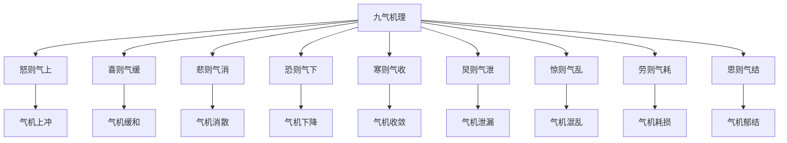

# 素问-举痛论篇第三十九

> "黄帝问曰：余闻善言天者，必有验于人；善言古者，必有合于今；善言人者，必有厌于己。如此则道理不惑，而要道极矣。" - 黄帝

---

## 📜 原文（节选）/ Original Text (Excerpt)

黄帝问曰：余闻善言天者，必有验于人；善言古者，必有合于今；善言人者，必有厌于己。如此则道理不惑，而要道极矣。

岐伯对曰：帝问何也？帝曰：愿闻九气于五脏，何气使然？

岐伯曰：怒则气上，喜则气缓，悲则气消，恐则气下，寒则气收，炅则气泄，惊则气乱，劳则气耗，思则气结。九气不同，何病之同？

帝曰：愿闻之。

岐伯曰：怒则气上，甚则呕血及飧泄，故气上矣。喜则气缓，卫气和利，故气缓矣。悲则气消，脉涩血虚，故气消矣。恐则气下，还于下焦，膀胱不约，遗溺，故气下矣。寒则气收，腠理闭，气不行，故气收矣。炅则气泄，腠理开，汗大泄，故气泄矣。惊则气乱，无所倚，神无所归，虑无所定，故气乱矣。劳则气耗，喘息汗出，内外皆越，故气耗矣。思则气结，神有所止，气留而不行，故气结矣。

---

## 📖 白话文翻译（节选）/ Modern Chinese Translation (Excerpt)

黄帝问道：我听说善于谈论天的，一定在人身上验证；善于谈论古的，一定与现在相合；善于谈论人的，一定厌倦于自己。像这样则道理不困惑，而要道达到了极点。

岐伯回答说：黄帝问什么？黄帝说：我希望听到九气在五脏，什么气使它这样？

岐伯说：愤怒则气机上冲，欢喜则气机缓和，悲哀则气机消散，恐惧则气机下降，寒冷则气机收敛，炎热则气机泄漏，惊恐则气机混乱，劳累则气机耗损，思虑则气机郁结。九气不同，什么疾病相同？

黄帝说：我希望听到它。

岐伯说：愤怒则气机上冲，严重就呕血和完谷不化泄泻，所以气机上冲了。欢喜则气机缓和，卫气调和通利，所以气机缓和了。悲哀则气机消散，脉象涩滞血虚，所以气机消散了。恐惧则气机下降，还归于下焦，膀胱不能约束，遗尿，所以气机下降了。寒冷则气机收敛，腠理闭合，气机不能运行，所以气机收敛了。炎热则气机泄漏，腠理张开，汗液大量泄漏，所以气机泄漏了。惊恐则气机混乱，无所倚靠，精神无所归属，思虑无所安定，所以气机混乱了。劳累则气机耗损，喘息汗出，内外都越过，所以气机耗损了。思虑则气机郁结，精神有所止息，气机留滞而不能运行，所以气机郁结了。

---

## 🔑 核心要点 / Core Concepts

### 1. 九气致痛 / Nine Qi Causing Pain

| 气 | 病机 | 表现 |
|------|------|------|
| 怒 | 气上 | 甚则呕血及飧泄 |
| 喜 | 气缓 | 卫气和利 |
| 悲 | 气消 | 脉涩血虚 |
| 恐 | 气下 | 膀胱不约，遗溺 |
| 寒 | 气收 | 腠理闭，气不行 |
| 炅 | 气泄 | 腠理开，汗大泄 |
| 惊 | 气乱 | 无所倚，神无所归，虑无所定 |
| 劳 | 气耗 | 喘息汗出，内外皆越 |
| 思 | 气结 | 神有所止，气留而不行 |

### 2. 九气相同点 / Nine Qi Similar Points

| 特点 | 说明 |
|------|------|
| 九气不同 | 九气不同 |
| 何病之同 | 什么疾病相同 |
| 气机紊乱 | 气机紊乱 |

### 3. 九气机理 / Nine Qi Mechanism

---

## 📚 理论解释 / Theoretical Analysis

### 九气致痛理论 / Nine Qi Causing Pain Theory

> [!info] 核心概念
- 九气不同，何病之同
- 气机紊乱，疼痛产生
- 情志影响气机

#### 九气致痛详解 / Detailed Nine Qi Causing Pain

**1. 怒则气上 / Anger Makes Qi Rise**
- 病机：气机上冲
- 表现：甚则呕血及飧泄
- 治法：平肝降逆

**2. 喜则气缓 / Joy Makes Qi Relax**
- 病机：气机缓和
- 表现：卫气和利
- 治法：调畅气机

**3. 悲则气消 / Grief Makes Qi Dissipate**
- 病机：气机消散
- 表现：脉涩血虚
- 治法：补气养血

**4. 恐则气下 / Fear Makes Qi Descend**
- 病机：气机下降
- 表现：膀胱不约，遗溺
- 治法：温肾固摄

**5. 寒则气收 / Cold Makes Qi Contract**
- 病机：气机收敛
- 表现：腠理闭，气不行
- 治法：散寒通络

**6. 炅则气泄 / Heat Makes Qi Leak**
- 病机：气机泄漏
- 表现：腠理开，汗大泄
- 治法：清热固表

**7. 惊则气乱 / Startle Makes Qi Chaos**
- 病机：气机混乱
- 表现：无所倚，神无所归，虑无所定
- 治法：安神定志

**8. 劳则气耗 / Labor Makes Qi Consume**
- 病机：气机耗损
- 表现：喘息汗出，内外皆越
- 治法：益气固表

**9. 思则气结 | Thinking Makes Qi Stagnate**
- 病机：气机郁结
- 表现：神有所止，气留而不行
- 治法：解郁行气

---

## 🏥 中医实践应用 / TCM Practice Application

### 九气治疗 / Nine Qi Treatment

#### 现代九气治疗要点 / Modern Nine Qi Treatment Key Points

**1. 怒气治疗 / Anger Qi Treatment**
- 症状：气机上冲，甚则呕血及飧泄
- 治法：平肝降逆
- 药物：龙胆泻肝汤、丹栀逍遥散

**2. 喜气治疗 / Joy Qi Treatment**
- 症状：气机缓和，卫气和利
- 治法：调畅气机
- 药物：逍遥散、越鞠丸

**3. 悲气治疗 / Grief Qi Treatment**
- 症状：气机消散，脉涩血虚
- 治法：补气养血
- 药物：归脾汤、人参养荣汤

**4. 恐气治疗 / Fear Qi Treatment**
- 症状：气机下降，膀胱不约，遗溺
- 治法：温肾固摄
- 药物：金匮肾气丸、桑螵蛸散

**5. 寒气治疗 / Cold Qi Treatment**
- 症状：气机收敛，腠理闭，气不行
- 治法：散寒通络
- 药物：麻黄汤、桂枝汤

**6. 热气治疗 / Heat Qi Treatment**
- 症状：气机泄漏，腠理开，汗大泄
- 治法：清热固表
- 药物：白虎汤、竹叶石膏汤

**7. 惊气治疗 / Startle Qi Treatment**
- 症状：气机混乱，无所倚，神无所归
- 治法：安神定志
- 药物：朱砂安神丸、磁朱丸

**8. 劳气治疗 / Labor Qi Treatment**
- 症状：气机耗损，喘息汗出，内外皆越
- 治法：益气固表
- 药物：玉屏风散、补中益气汤

**9. 思气治疗 / Thinking Qi Treatment**
- 症状：气机郁结，神有所止，气留而不行
- 治法：解郁行气
- 药物：半夏厚朴汤、柴胡疏肝散

---

## 🔗 相关链接 / Related Links

- [[MOC-黄帝内经知识库]] - 主索引
- [[黄帝内经-素问索引]] - 素问索引
- [[黄帝内经-核心理论]] - 核心理论体系
- [[素问-咳论篇第三十八]] - 咳论
- [[素问-腹中论篇第四十]] - 腹中论

### 易学关联 / Yi Jing Connection

- [[MOC-易经知识库]] - 易经索引
- [[20260201-0002 五行]] - 五行理论

**易学与举痛论的联系:**
- 五行理论：易学的五行理论与中医九气相通
- 情志理论：易学的情志理论与中医气机相通

---

## 💡 学习要点 / Learning Points

### 掌握重点 / Key Points to Master

- [ ] 理解九气致痛的概念
- [ ] 掌握九气的病机
- [ ] 学会九气的治疗方法
- [ ] 了解九气致痛的现代应用

### 思考问题 / Questions for Reflection

1. **为什么说"九气不同，何病之同"？**
   - 九气不同：九气不同
   - 何病之同：什么疾病相同
   - 气机紊乱：气机紊乱

2. **现代医学如何应用"九气致痛"？**
   - 情志疾病：情志疾病治疗
   - 心理治疗：心理治疗应用
   - 综合治疗：综合治疗方案

---

## 📊 学习进度 / Learning Progress

### 完成情况 / Completion Status

| 学习内容 | 状态 | 备注 |
|---------|------|------|
| 原文诵读 | 📝 进行中 | 建议每日诵读 |
| 白话文理解 | ✅ 已完成 | 理解主要含义 |
| 九气致痛 | ✅ 已完成 | 掌握概念 |
| 九气治疗 | 📝 进行中 | 需要临床实践 |
| 理论分析 | ✅ 已完成 | 理解理论 |

---

## 🔄 更新日志 / Update Log

### 2026-02-03

- ✅ 创建举痛论篇第三十九笔记
- ✅ 完成原文、白话文翻译（节选）
- ✅ 整理九气致痛对照表
- ✅ 编写九气致痛理论

---

**笔记创建日期**：2026年2月3日

**最后更新**：2026年2月3日
