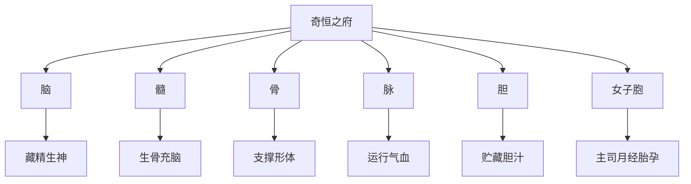

# 素问-五脏别论篇第十一

> "脑、髓、骨、脉、胆、女子胞，此六者，地气之所生也，皆藏于阴而象于地，故藏而不写，名曰奇恒之府。" - 岐伯

---

## 📜 原文（节选）/ Original Text (Excerpt)

黄帝问曰：余闻方士，或以脑髓为脏，或以肠胃为脏，或以为腑。敢问更相反，皆自谓是，不知其道，愿闻其说。

岐伯对曰：脑、髓、骨、脉、胆、女子胞，此六者，地气之所生也，皆藏于阴而象于地，故藏而不写，名曰奇恒之府。

夫胃、大肠、小肠、三焦、膀胱，此五者，天气之所生也，其气象天，故写而不藏，此受五脏浊气，名曰传化之府，此不能久留，输泻者也。

魄门亦为五脏使，水谷不得久藏。

所谓五脏者，所以藏精神血气魂魄者也。六腑者，所以化水谷而行津液者也。

此人之所以具受于天也，无愚智贤不肖，无以相倚也。

然有其独尽天寿者，有无邪避，无避邪者。

此非其道也，此其天命也。

故凡治病，必察其下，适其脉，观其志意，与其病也。

拘于鬼神者，不可与言至德。

恶于针石者，不可与言至巧。

病不许治者，病必不治，治之无功矣。

---

## 📖 白话文翻译（节选）/ Modern Chinese Translation (Excerpt)

黄帝问道：我听说一些方士，有的把脑和髓称为脏，有的把肠胃称为脏，有的则认为它们是腑。这种说法互相矛盾，却都自认为正确，我不知道其中的道理，希望听您讲解一下。

岐伯回答说：脑、髓、骨、脉、胆、女子胞，这六者是禀受地气而生的，它们都主藏阴精，其形态如地，所以是主藏而不泻的，名叫奇恒之府。

胃、大肠、小肠、三焦、膀胱，这五者是禀受天气而生的，其形态象天，所以是主泻而不藏的。它们接受五脏代谢的浊气，名叫传化之府，它们不能久留浊气，要输送排泄。

肛门也是五脏的使者，水谷糟粕不能久留其中。

所谓五脏，是贮藏精神气血魂魄的。所谓六腑，是传化水谷而运行津液的。

这些都是人从自然界禀受而来的，无论愚笨还是聪明，无论贤能还是不肖，都没有什么差别。

然而有人能够尽享天年，有的人则不能避免邪气的侵害，有的人则能避开邪气。

这不是他们知道养生之道，而是他们的天命。

所以凡是治病，必须观察病人的下部，调和病人的脉象，观察病人的精神意志，同时了解病人的病情。

被鬼神迷信所束缚的人，不能与他谈论高深的医学道理。

厌恶针刺砭石治疗的人，不能与他谈论高明的医术。

病人不允许治疗的，疾病一定无法治愈，强行治疗也不会有功效。

---

## 🔑 核心要点 / Core Concepts

### 1. 奇恒之府与传化之府 / Extraordinary Fu and Transformation Fu

| 类别 | 组成 | 来源 | 特点 | 功能 |
|------|------|------|------|------|
| 奇恒之府 | 脑、髓、骨、脉、胆、女子胞 | 地气 | 藏而不泻 | 藏精藏血 |
| 传化之府 | 胃、大肠、小肠、三焦、膀胱 | 天气 | 泻而不藏 | 传化水谷 |
| 五脏 | 心、肝、脾、肺、肾 | 天地合气 | 藏精气 | 藏神藏志 |

### 2. 五脏与六腑的区别 / Difference between Zang and Fu

| 特点 | 五脏 | 六腑 |
|------|------|------|
| 性质 | 藏精气 | 化水谷 |
| 功能 | 藏而不泻 | 泻而不藏 |
| 特点 | 满而不能实 | 实而不能满 |
| 对应 | 阴 | 阳 |
| 生理 | 贮藏精神血气魂魄 | 传化水谷运行津液 |

---

## 📚 理论解释 / Theoretical Analysis

### 奇恒之府理论 / Extraordinary Fu Theory

> [!info] 核心概念
> 奇恒之府形态似腑，功能似脏，故称奇恒。

#### 奇恒之府详解 / Extraordinary Fu Details

**奇恒之府特点 / Extraordinary Fu Features:**
1. **形态似腑**：中空有腔
2. **功能似脏**：藏精而不泻
3. **禀受地气**：属阴
4. **藏而不泻**：精气内藏

### 传化之府理论 / Transformation Fu Theory

> [!note] 传化机制
> 传化之府接受五脏浊气，输泻而不藏。

#### 传化之府功能 / Transformation Fu Functions

| 腑 | 主要功能 | 传化特点 |
|------|----------|----------|
| 胃 | 受纳腐熟水谷 | 胃主受纳 |
| 大肠 | 传导糟粕 | 大肠主津 |
| 小肠 | 泌别清浊 | 小肠主液 |
| 三焦 | 通行水道 | 三焦主决渎 |
| 膀胱 | 贮存尿液 | 膀胱主藏 |

---

## 🏥 中医实践应用 / TCM Practice Application

### 诊断要点 / Diagnosis Key Points

#### 四诊合参 / Four Examinations Combined

> [!warning] 治病四要素
> 必察其下、适其脉、观其志意、与其病也。

**1. 察其下 / Examine Lower Part**
- 观察二便情况
- 检查腹部症状
- 了解下部病变

**2. 适其脉 / Observe Pulse**
- 脉象虚实
- 脉位深浅
- 脉势强弱

**3. 观其志意 / Observe Will and Mind**
- 精神状态
- 情志变化
- 意志强弱

**4. 与其病 / Understand Disease**
- 病因病机
- 病位病性
- 病程演变

### 治疗禁忌 / Treatment Contraindications

#### 三不可治 / Three Untreatable Conditions

**1. 拘于鬼神者 / Bound by Ghosts and Gods**
- 迷信鬼神
- 不信医理
- 难以沟通

**2. 恶于针石者 / Averse to Acupuncture and Stone**
- 厌恶针刺
- 拒绝治疗
- 难以施术

**3. 病不许治者 / Disease Not Allowed Treatment**
- 不配合治疗
- 拒绝医嘱
- 治之无功

---

## 🔗 相关链接 / Related Links

- [[MOC-黄帝内经知识库]] - 主索引
- [[黄帝内经-素问索引]] - 素问索引
- [[黄帝内经-核心理论]] - 核心理论体系
- [[素问-五脏生成篇第十]] - 五脏生成
- [[素问-六节藏象论篇第九]] - 五脏功能

### 易学关联 / Yi Jing Connection

- [[MOC-易经知识库]] - 易经索引
- [[20260201-0002 五行]] - 五行理论

**易学与藏象理论的联系:**
- 天地阴阳：天之气生传化之府，地之气生奇恒之府
- 阴阳对立：五脏藏精（阴），六腑传化（阳）

---

## 💡 学习要点 / Learning Points

### 掌握重点 / Key Points to Master

- [ ] 理解奇恒之府的概念和组成
- [ ] 掌握传化之府的功能特点
- [ ] 区分五脏与六腑的本质区别
- [ ] 学会四诊合参的诊断方法

### 思考问题 / Questions for Reflection

1. **为什么胆既属奇恒之府又属六腑？**
   - 形态中空似腑
   - 功能藏精似脏
   - 故称奇恒，与众不同

2. **如何理解"满而不能实"与"实而不能满"？**
   - 五脏精气充盈，不主水谷
   - 六腑容纳水谷，不藏精气
   - 阴阳不同，功能各异

---

## 📊 学习进度 / Learning Progress

### 完成情况 / Completion Status

| 学习内容 | 状态 | 备注 |
|---------|------|------|
| 原文诵读 | 📝 进行中 | 建议每日诵读 |
| 白话文理解 | ✅ 已完成 | 理解主要含义 |
| 奇恒之府 | ✅ 已完成 | 掌握概念 |
| 四诊合参 | 📝 进行中 | 需要临床实践 |
| 理论分析 | ✅ 已完成 | 理解藏腑区别 |

---

## 🔄 更新日志 / Update Log

### 2026-02-03

- ✅ 创建五脏别论篇第十一笔记
- ✅ 完成原文、白话文翻译（节选）
- ✅ 整理奇恒之府与传化之府对照表
- ✅ 编写四诊合参诊断要点

---

**笔记创建日期**：2026年2月3日

**最后更新**：2026年2月3日
