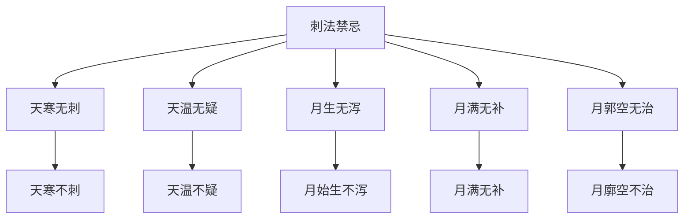

# 素问-八正神明论篇第二十六

> "黄帝问曰：用针之服，必有法则，上视天光，下司八正，以辟奇邪，而观百姓，审于虚实，无犯其邪。" - 黄帝

---

## 📜 原文（节选）/ Original Text (Excerpt)

黄帝问曰：用针之服，必有法则，上视天光，下司八正，以辟奇邪，而观百姓，审于虚实，无犯其邪，其故何也？

岐伯对曰：法天则地，合于天光，必知八正，八正者，所以候八风之虚邪以至者也。

凡刺之法，必候日月星辰，四时八正之气，气定乃刺之。

是故天温日明，则人血淖液而卫气浮，故血易泻，气易行；天寒日阴，则人血凝泣而卫气沉，故血难泻，气难行。

月始生，则血气始精，卫气始行；月郭满，则血气实，肌肉坚；月郭空，则肌肉减，经络虚，卫气去，形独居。

是以因天时而调血气也，是以天寒无刺，天温无疑；月生无泻，月满无补，月郭空无治，是谓得时而调之。

---

## 📖 白话文翻译（节选）/ Modern Chinese Translation (Excerpt)

黄帝问道：用针的法则，一定有方法，上视天光，下司八正，以避奇邪，而观察百姓，审察虚实，不侵犯其邪，这是什么原因？

岐伯回答说：法天则地，合于天光，必须知道八正，八正，是用来候八风的虚邪而至的。

凡是刺的法则，必须候日月星辰，四时八正的气，气定就刺它。

所以天温日明，则人血淖液而卫气浮，所以血易泻，气易行；天寒日阴，则人血凝涩而卫气沉，所以血难泻，气难行。

月始生，则血气开始精微，卫气开始行；月廓满，则血气充实，肌肉坚实；月廓空，则肌肉减少，经络空虚，卫气离去，形体独居。

因此根据天时调血气，所以天寒不刺，天温不疑；月始生不泻，月满无补，月廓空不治，这叫做得时而调。

---

## 🔑 核心要点 / Core Concepts

### 1. 八正 / Eight Zheng

| 八正 | 含义 |
|------|------|
| 立春 | 春季开始 |
| 立夏 | 夏季开始 |
| 立秋 | 秋季开始 |
| 立冬 | 冬季开始 |
| 春分 | 春季中点 |
| 夏至 | 夏至 |
| 秋分 | 秋季中点 |
| 冬至 | 冬至 |

### 2. 天时与血气 / Heavenly Time and Blood Qi

| 天时 | 血 | 气 |
|------|------|------|
| 天温日明 | 淖液 | 浮 |
| 天寒日阴 | 凝泣 | 沉 |
| 月始生 | 始精 | 始行 |
| 月郭满 | 实 | - |
| 月郭空 | 减 | 去 |

### 3. 刺法禁忌 / Acupuncture Contraindications

---

## 📚 理论解释 / Theoretical Analysis

### 八正理论 / Eight Zheng Theory

> [!info] 核心概念
- 八正是四时八个节气
- 八正候八风之虚邪
- 刺法必候八正

#### 八正详解 / Detailed Eight Zheng

**1. 立春 / Start of Spring**
- 时间：春季开始
- 天气：天气渐暖
- 刺法：适宜刺

**2. 立夏 / Start of Summer**
- 时间：夏季开始
- 天气：天气炎热
- 刺法：适宜刺

**3. 立秋 / Start of Autumn**
- 时间：秋季开始
- 天气：天气渐凉
- 刺法：适宜刺

**4. 立冬 / Start of Winter**
- 时间：冬季开始
- 天气：天气寒冷
- 刺法：不适宜刺

**5. 春分 / Spring Equinox**
- 时间：春季中点
- 天气：天气温和
- 刺法：适宜刺

**6. 夏至 / Summer Solstice**
- 时间：夏至
- 天气：天气最热
- 刺法：适宜刺

**7. 秋分 / Autumn Equinox**
- 时间：秋季中点
- 天气：天气凉爽
- 刺法：适宜刺

**8. 冬至 / Winter Solstice**
- 时间：冬至
- 天气：天气最冷
- 刺法：不适宜刺

### 天时与血气理论 / Heavenly Time and Blood Qi Theory

> [!warning] 核心理念
- 天时影响血气
- 血气随天时变化
- 刺法根据天时

#### 天时与血气详解 / Detailed Heavenly Time and Blood Qi

**1. 天温日明 / Sky Warm Day Bright**
- 血：淖液
- 卫气：浮
- 刺法：易泻易行

**2. 天寒日阴 / Sky Cold Day Dark**
- 血：凝泣
- 卫气：沉
- 刺法：难泻难行

**3. 月始生 / Moon First Appear**
- 血气：始精
- 卫气：始行
- 刺法：不泻

**4. 月郭满 / Moon Outline Full**
- 血气：实
- 肌肉：坚
- 刺法：无补

**5. 月郭空 / Moon Outline Empty**
- 肌肉：减
- 经络：虚
- 卫气：去
- 刺法：不治

---

## 🏥 中医实践应用 / TCM Practice Application

### 八正刺法应用 / Eight Zheng Acupuncture Application

#### 现代八正刺法要点 / Modern Eight Zheng Acupuncture Key Points

**1. 四时刺法 / Four Seasons Acupuncture**
- 春：适宜刺
- 夏：适宜刺
- 秋：适宜刺
- 冬：不适宜刺

**2. 八正刺法 / Eight Zheng Acupuncture**
- 立春：适宜刺
- 立夏：适宜刺
- 立秋：适宜刺
- 立冬：不适宜刺
- 春分：适宜刺
- 夏至：适宜刺
- 秋分：适宜刺
- 冬至：不适宜刺

**3. 月相刺法 / Moon Phase Acupuncture**
- 月始生：不泻
- 月郭满：无补
- 月郭空：不治

---

## 🔗 相关链接 / Related Links

- [[MOC-黄帝内经知识库]] - 主索引
- [[黄帝内经-素问索引]] - 素问索引
- [[黄帝内经-核心理论]] - 核心理论体系
- [[素问-宝命全形论篇第二十五]] - 宝命全形
- [[素问-离合真邪论篇第二十七]] - 离合真邪

### 易学关联 / Yi Jing Connection

- [[MOC-易经知识库]] - 易经索引
- [[20260201-0003 八卦]] - 八卦理论

**易学与八正神明的联系:**
- 四时理论：易学的四时理论与中医八正相通
- 八卦方位：易学的八卦理论与中医八正相通

---

## 💡 学习要点 / Learning Points

### 掌握重点 / Key Points to Master

- [ ] 理解八正的概念
- [ ] 掌握天时与血气的关系
- [ ] 学会刺法禁忌的判断
- [ ] 了解八正刺法的应用

### 思考问题 / Questions for Reflection

1. **为什么说"天寒无刺"？**
   - 天寒血凝泣
   - 卫气沉滞
   - 刺之难泻难行

2. **现代医学如何应用"八正神明"？**
   - 时间医学：根据时间治疗
   - 生物节律：根据生物节律治疗
   - 个体化治疗：根据个体情况治疗

---

## 📊 学习进度 / Learning Progress

### 完成情况 / Completion Status

| 学习内容 | 状态 | 备注 |
|---------|------|------|
| 原文诵读 | 📝 进行中 | 建议每日诵读 |
| 白话文理解 | ✅ 已完成 | 理解主要含义 |
| 八正 | ✅ 已完成 | 掌握概念 |
| 天时血气 | 📝 进行中 | 需要临床实践 |
| 理论分析 | ✅ 已完成 | 理解理论 |

---

## 🔄 更新日志 / Update Log

### 2026-02-03

- ✅ 创建八正神明论篇第二十六笔记
- ✅ 完成原文、白话文翻译（节选）
- ✅ 整理八正和天时血气对照表
- ✅ 编写八正和天时血气理论

---

**笔记创建日期**：2026年2月3日

**最后更新**：2026年2月3日
