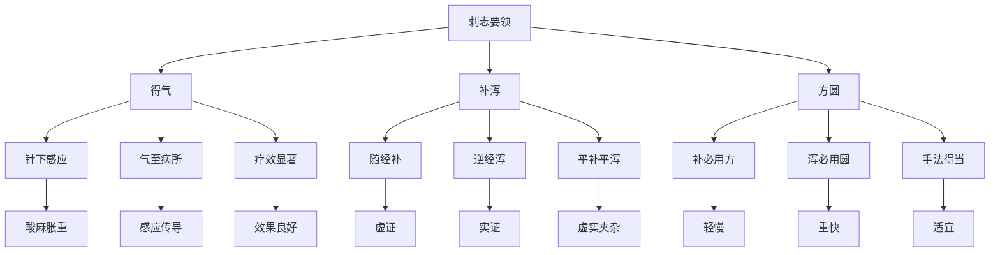

# 素问-刺志论篇第五十三

> "黄帝问曰：愿闻刺志。岐伯曰：刺之要者，在于得气。" - 岐伯

---

## 📜 原文（节选）/ Original Text (Excerpt)

黄帝问曰：愿闻刺志。

岐伯曰：刺之要者，在于得气。得气者，如鱼吞钩饵之浮沉也。

帝曰：补泻何如？

岐伯曰：补者，随之；泻者，逆之。补必用方，泻必用圆。

---

## 📖 白话文翻译（节选）/ Modern Chinese Translation (Excerpt)

黄帝问道：我愿意听到针刺的志意。

岐伯回答说：针刺的关键，在于得气。所谓得气，就像鱼吞食钩饵时浮沉的感觉。

黄帝说：补法和泻法如何？

岐伯说：补法是顺经而刺，泻法是逆经而刺。补法必须用方，泻法必须用圆。

---

## 🔍 英文释义 / English Interpretation

Yellow Emperor asked: I would like to hear the intention of acupuncture.

Qibo replied: The key to acupuncture lies in obtaining qi. Obtaining qi is like the feeling of a fish swallowing a hook and bait as it floats and sinks.

Yellow Emperor said: How are the tonifying and dispersing methods?

Qibo said: The tonifying method follows the meridian, while the dispersing method goes against the meridian. Tonifying must use square, dispersing must use round.

---

## 🔑 核心要点 / Core Concepts

### 1. 得气概念 / Obtaining Qi Concept

| 要素 | 说明 | 表现 | 感觉 |
|------|------|------|------|
| 针下得气 | 针刺后出现的感应 | 酸、麻、胀、重 | 医者手下沉紧 |
| 气至病所 | 气感传导至病位 | 感应扩散、传导 | 疗效显著 |
| 气不至 | 未得气 | 无明显感觉 | 疗效不佳 |

### 2. 补泻方法 / Tonifying and Dispersing Methods

| 方法 | 经络方向 | 手法特点 | 适用病症 |
|------|---------|---------|---------|
| 补法 | 随经而刺 | 轻刺激、慢提插 | 虚证、寒证 |
| 泻法 | 逆经而刺 | 重刺激、快提插 | 实证、热证 |
| 平补平泻 | 不分方向 | 中等刺激 | 虚实夹杂 |

### 3. 刺志要领 / Acupuncture Intention Essentials

---

## 📚 理论解释 / Theoretical Analysis

### 刺志理论 / Acupuncture Intention Theory

> [!info] 核心概念
- 刺之要者，在于得气
- 补必用方，泻必用圆
- 意在针先，气随意外

#### 刺志详解 / Detailed Acupuncture Intention

**1. 得气理论 / Obtaining Qi Theory**
- **得气感觉**：酸、麻、胀、重
- **得气表现**：针下沉紧、患者有感应
- **得气意义**：疗效的基础
- **气至病所**：气感传导至病位

**2. 补泻理论 / Tonifying and Dispersing Theory**
- **补法**：随经而刺，轻刺激，慢提插
- **泻法**：逆经而刺，重刺激，快提插
- **平补平泻**：不分方向，中等刺激
- **补泻原则**：虚补实泻，辨证施治

**3. 方圆理论 / Square and Round Theory**
- **补必用方**：手法方正，轻柔缓慢
- **泻必用圆**：手法圆润，快速有力
- **方圆结合**：根据病情选择手法
- **手法得当**：轻重要适宜，快慢要得当

### 补泻机理 / Tonifying and Dispersing Mechanism

> [!warning] 核心理念
- 随经而补，逆经而泻
- 得气为要，方圆为法
- 辨证施治，虚实有别

#### 补泻机理详解 / Detailed Tonifying and Dispersing Mechanism

**1. 补法机理 / Tonifying Mechanism**
- **随经而刺**：顺着经络走向进针
- **轻刺激**：手法轻柔，刺激量小
- **慢提插**：提插缓慢，留针时间长
- **适用虚证**：适用于虚证、寒证、气虚

**2. 泻法机理 / Dispersing Mechanism**
- **逆经而刺**：逆着经络走向进针
- **重刺激**：手法有力，刺激量大
- **快提插**：提插快速，留针时间短
- **适用实证**：适用于实证、热证、气实

**3. 平补平泻机理 / Even Tonifying and Dispersing Mechanism**
- **不分方向**：不区分经络方向
- **中等刺激**：手法适中，刺激量中等
- **适当提插**：提插适当，留针时间适中
- **适用虚实夹杂**：适用于虚实夹杂的病症

---

## 🏥 中医实践应用 / TCM Practice Application

### 针刺治疗 / Acupuncture Treatment

#### 现代针刺治疗应用 / Modern Acupuncture Treatment Application

**1. 得气判断 / Obtaining Qi Judgment**
- **针下感觉**：沉紧感、鱼吞钩饵感
- **患者反应**：酸、麻、胀、重
- **气至病所**：感应传导至病位
- **疗效预测**：得气良好则疗效显著

**2. 补法治疗 / Tonifying Treatment**
- 取穴：足三里、关元、气海
- 刺法：随经而刺，轻刺激，慢提插
- 适应症：虚证、寒证、气虚、阳虚
- 疗效：补益正气，温阳散寒

**3. 泻法治疗 / Dispersing Treatment**
- 取穴：合谷、曲池、太冲
- 刺法：逆经而刺，重刺激，快提插
- 适应症：实证、热证、气实、阴虚火旺
- 疗效：泻实清热，调和气血

**4. 平补平泻治疗 / Even Tonifying and Dispersing Treatment**
- 取穴：三阴交、足三里、合谷
- 刺法：不分方向，中等刺激，适当提插
- 适应症：虚实夹杂、慢性病、调理身体
- 疗效：调和气血，平衡阴阳

### 现代医学对应 / Modern Medicine Correspondence

| 中医概念 | 现代医学解释 | 临床应用 |
|---------|-------------|---------|
| 得气 | 神经刺激反应 | 针刺效果的判断 |
| 补法 | 兴奋性刺激 | 增强机体功能 |
| 泻法 | 抑制性刺激 | 减轻炎症反应 |
| 平补平泻 | 调节性刺激 | 调节机体功能 |

---

## 🔗 相关链接 / Related Links

- [[MOC-黄帝内经知识库]] - 主索引
- [[黄帝内经-素问索引]] - 素问索引
- [[黄帝内经-核心理论]] - 核心理论体系
- [[素问-刺齐论篇第五十一]] - 刺齐论
- [[素问-刺禁论篇第五十二]] - 刺禁论
- [[素问-针解篇第五十四]] - 针解篇

### 易学关联 / Yi Jing Connection

- [[MOC-易经知识库]] - 易经索引
- [[20260201-0002 五行]] - 五行理论

**易学与刺志的联系:**
- 得气如鱼：易学的象数思维与得气感应相通
- 方圆之道：易学的方圆理念与补泻手法相通

---

## 💡 学习要点 / Learning Points

### 掌握重点 / Key Points to Master

- [ ] 理解得气的重要意义
- [ ] 掌握补泻的方法和原则
- [ ] 学会方圆手法的应用
- [ ] 了解刺志的理论依据

### 思考问题 / Questions for Reflection

1. **为什么说"刺之要者，在于得气"？**
   - 得气为基：得气是针刺疗效的基础
   - 气至病所：气感传导是疗效的关键
   - 辨气为要：辨别气感是施治的前提

2. **现代医学如何应用"刺志论"？**
   - 神经刺激：基于现代神经生理学
   - 辨证施治：根据病情选择刺激方式
   - 疗效评价：通过感应判断疗效

---

## 📊 学习进度 / Learning Progress

### 完成情况 / Completion Status

| 学习内容 | 状态 | 备注 |
|---------|------|------|
| 原文诵读 | 📝 进行中 | 建议每日诵读 |
| 白话文理解 | ✅ 已完成 | 理解主要含义 |
| 得气理论 | ✅ 已完成 | 掌握理论 |
| 补泻方法 | 📝 进行中 | 需要临床实践 |
| 理论分析 | ✅ 已完成 | 理解理论 |

---

## 🔄 更新日志 / Update Log

### 2026-02-03

- ✅ 创建刺志论篇第五十三笔记
- ✅ 完成原文、白话文翻译（节选）
- 整理得气和补泻对照表
- ✅ 编写刺志和补泻理论

---

**笔记创建日期**：2026年2月3日

**最后更新**：2026年2月3日
