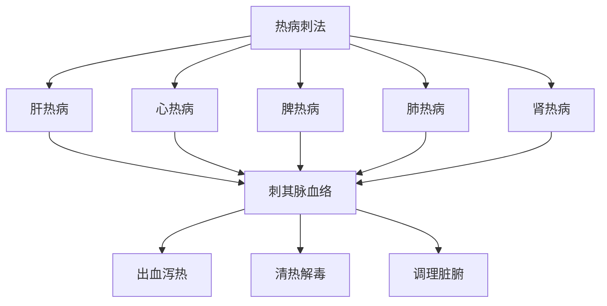

# 素问-刺热篇第三十二

> "黄帝问曰：五脏热病奈何？岐伯曰：肝热病者，小便先黄，腹痛，多卧身热。" - 岐伯

---

## 📜 原文（节选）/ Original Text (Excerpt)

黄帝问曰：五脏热病奈何？

岐伯曰：肝热病者，小便先黄，腹痛，多卧身热。热争则狂言及惊，胁满痛，手足躁，不得安卧。

心热病者，先不乐，数日乃热。热争则卒心痛，烦闷善呕，头痛面赤无汗。

脾热病者，先头重颊痛，心烦颜青，欲呕身热。热争则腰痛不可用俯仰，腹满泄，两颔痛。

肺热病者，淅然厥起毫毛，恶风寒，舌上黄，身热。热争则喘咳，痛走胸膺背，不得太息，头痛不堪，汗出而寒。

肾热病者，先腰痛胻酸，苦渴数饮，身热。热争则项痛强，胻寒且酸，脚下热，不欲言。

---

## 📖 白话文翻译（节选）/ Modern Chinese Translation (Excerpt)

黄帝问道：五脏热病怎样？

岐伯说：肝热病，小便先黄，腹痛，多卧身热。热气相争则狂言及惊恐，胁胀满疼痛，手足躁动，不能安卧。

心热病，先不快乐，数日后发热。热气相争则突然心痛，烦闷时常呕吐，头痛面赤没有汗。

脾热病，先头沉重颊部疼痛，心烦面青，想要呕吐身体发热。热气相争则腰部疼痛不能俯仰，腹部胀满泄泻，两颔疼痛。

肺热病，寒战突然起立毫毛，厌恶风寒，舌上黄，身体发热。热气相争则喘息咳嗽，疼痛行走胸膺背部，不能长叹息，头痛不能忍受，汗出而寒。

肾热病，先腰痛小腿酸楚，苦于口渴频繁饮水，身体发热。热气相争则颈部疼痛强直，小腿寒冷而且酸楚，脚下发热，不想说话。

---

## 🔑 核心要点 / Core Concepts

### 1. 五脏热病表现 / Five Zang Heat Disease Manifestations

| 脏 | 先兆症状 | 热争症状 |
|------|----------|----------|
| 肝 | 小便先黄，腹痛，多卧身热 | 狂言及惊，胁满痛，手足躁，不得安卧 |
| 心 | 先不乐，数日乃热 | 卒心痛，烦闷善呕，头痛面赤无汗 |
| 脾 | 先头重颊痛，心烦颜青，欲呕身热 | 腰痛不可用俯仰，腹满泄，两颔痛 |
| 肺 | 淅然厥起毫毛，恶风寒，舌上黄，身热 | 喘咳，痛走胸膺背，不得太息，头痛不堪，汗出而寒 |
| 肾 | 先腰痛胻酸，苦渴数饮，身热 | 项痛强，胻寒且酸，脚下热，不欲言 |

### 2. 刺热疗法 / Heat Puncture Therapy

| 脏 | 刺法 |
|------|------|
| 肝 | 刺其脉血络 |
| 心 | 刺其脉血络 |
| 脾 | 刺其脉血络 |
| 肺 | 刺其脉血络 |
| 肾 | 刺其脉血络 |

### 3. 热病刺法特点 / Heat Disease Acupuncture Characteristics

---

## 📚 理论解释 / Theoretical Analysis

### 五脏热病理论 / Five Zang Heat Disease Theory

> [!info] 核心概念
- 五脏各有热病表现
- 热气相争症状明显
- 刺其脉血络以泻热

#### 五脏热病详解 / Detailed Five Zang Heat Disease

**1. 肝热病 / Liver Heat Disease**
- 先兆症状：小便先黄，腹痛，多卧身热
- 热争症状：狂言及惊，胁满痛，手足躁，不得安卧
- 病机：肝火旺盛，热气上炎

**2. 心热病 / Heart Heat Disease**
- 先兆症状：先不乐，数日乃热
- 热争症状：卒心痛，烦闷善呕，头痛面赤无汗
- 病机：心火旺盛，热气上冲

**3. 脾热病 / Spleen Heat Disease**
- 先兆症状：先头重颊痛，心烦颜青，欲呕身热
- 热争症状：腰痛不可用俯仰，腹满泄，两颔痛
- 病机：脾火旺盛，湿热内生

**4. 肺热病 / Lung Heat Disease**
- 先兆症状：淅然厥起毫毛，恶风寒，舌上黄，身热
- 热争症状：喘咳，痛走胸膺背，不得太息，头痛不堪，汗出而寒
- 病机：肺火旺盛，热气上逆

**5. 肾热病 / Kidney Heat Disease**
- 先兆症状：先腰痛胻酸，苦渴数饮，身热
- 热争症状：项痛强，胻寒且酸，脚下热，不欲言
- 病机：肾火旺盛，热气下注

### 刺热疗法理论 / Heat Puncture Therapy Theory

> [!warning] 核心理念
- 刺其脉血络
- 出血泻热
- 调理脏腑

#### 刺热疗法详解 / Detailed Heat Puncture Therapy

**1. 刺法原则 / Acupuncture Principle**
- 刺其脉血络：刺其经脉血络
- 出血泻热：出血以泻热
- 调理脏腑：调理脏腑功能

**2. 刺法要点 / Acupuncture Key Points**
- 选穴：选择相应的经脉穴位
- 手法：刺其脉血络
- 出血：适当出血，泻热清热

---

## 🏥 中医实践应用 / TCM Practice Application

### 五脏热病治疗 / Five Zang Heat Disease Treatment

#### 现代五脏热病治疗要点 / Modern Five Zang Heat Disease Treatment Key Points

**1. 肝热病治疗 / Liver Heat Disease Treatment**
- 症状：小便先黄，腹痛，多卧身热
- 治法：清肝泻火
- 药物：龙胆泻肝汤、丹栀逍遥散
- 针刺：刺其脉血络

**2. 心热病治疗 / Heart Heat Disease Treatment**
- 症状：先不乐，数日乃热
- 治法：清心泻火
- 药物：导赤散、朱砂安神丸
- 针刺：刺其脉血络

**3. 脾热病治疗 / Spleen Heat Disease Treatment**
- 症状：先头重颊痛，心烦颜青，欲呕身热
- 治法：清热健脾
- 药物：清胃散、健脾丸
- 针刺：刺其脉血络

**4. 肺热病治疗 / Lung Heat Disease Treatment**
- 症状：淅然厥起毫毛，恶风寒，舌上黄，身热
- 治法：清肺泻火
- 药物：麻杏石甘汤、清肺散
- 针刺：刺其脉血络

**5. 肾热病治疗 / Kidney Heat Disease Treatment**
- 症状：先腰痛胻酸，苦渴数饮，身热
- 治法：滋阴降火
- 药物：知柏地黄丸、大补阴丸
- 针刺：刺其脉血络

---

## 🔗 相关链接 / Related Links

- [[MOC-黄帝内经知识库]] - 主索引
- [[黄帝内经-素问索引]] - 素问索引
- [[黄帝内经-核心理论]] - 核心理论体系
- [[素问-热论篇第三十一]] - 热论
- [[素问-评热病论篇第三十三]] - 评热病论

### 易学关联 / Yi Jing Connection

- [[MOC-易经知识库]] - 易经索引
- [[20260201-0002 五行]] - 五行理论

**易学与刺热的联系:**
- 五行理论：易学的五行理论与中医五脏热病相通
- 阴阳理论：易学的阴阳理论与中医热病刺法相通

---

## 💡 学习要点 / Learning Points

### 掌握重点 / Key Points to Master

- [ ] 理解五脏热病的表现
- [ ] 掌握刺热疗法的方法
- [ ] 学会热争症状的判断
- [ ] 了解五脏热病的治疗

### 思考问题 / Questions for Reflection

1. **为什么说"刺其脉血络"？**
   - 出血泻热：出血以泻热
   - 清热解毒：清热解毒
   - 调理脏腑：调理脏腑功能

2. **现代医学如何应用"五脏热病"？**
   - 发热疾病：发热疾病治疗
   - 脏腑疾病：脏腑疾病辨证治疗
   - 针刺治疗：针刺治疗发热

---

## 📊 学习进度 / Learning Progress

### 完成情况 / Completion Status

| 学习内容 | 状态 | 备注 |
|---------|------|------|
| 原文诵读 | 📝 进行中 | 建议每日诵读 |
| 白话文理解 | ✅ 已完成 | 理解主要含义 |
| 五脏热病 | ✅ 已完成 | 掌握表现 |
| 刺热疗法 | 📝 进行中 | 需要临床实践 |
| 理论分析 | ✅ 已完成 | 理解理论 |

---

## 🔄 更新日志 / Update Log

### 2026-02-03

- ✅ 创建刺热篇第三十二笔记
- ✅ 完成原文、白话文翻译（节选）
- ✅ 整理五脏热病表现对照表
- ✅ 编写五脏热病和刺热疗法理论

---

**笔记创建日期**：2026年2月3日

**最后更新**：2026年2月3日
