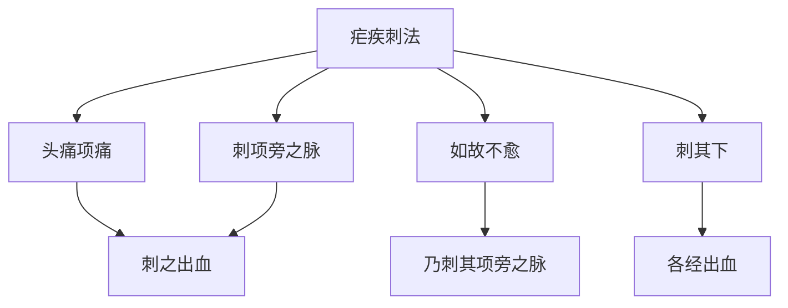

# 素问-刺疟篇第三十六

> "黄帝问曰：刺疟奈何？岐伯曰：疟之始发也，先起于毫毛，伸欠乃作，刺之奈何？" - 黄帝

---

## 📜 原文（节选）/ Original Text (Excerpt)

黄帝问曰：刺疟奈何？

岐伯曰：疟之始发也，先起于毫毛，伸欠乃作，刺之奈何？先刺其头痛项痛，刺之出血，如故不愈，乃刺其项旁之脉，出血如故，乃刺其下。

帝曰：刺疟奈之何也？

岐伯曰：足太阳之疟，令人腰痛头重，寒从背起，先刺郄中出血，又刺太阳之脉，出血如故。

足少阳之疟，令人身体解㑊，寒不甚，热不甚，恶见人，见人心惕惕然，热多汗出，刺足少阳，出血如故。

足阳明之疟，令人先寒，洒淅寒甚，久乃热，热去汗出，喜见日月光火气，乃快然，刺足阳明跗上出血，如故。

足太阴之疟，令人好太息，不乐，寒多热少，汗不出，病至则呕，呕已乃衰，即取之。

---

## 📖 白话文翻译（节选）/ Modern Chinese Translation (Excerpt)

黄帝问道：刺疟如何？

岐伯说：疟疾开始发作，先起立于毫毛，伸欠就发作，刺它如何？先刺它的头痛项痛，刺它出血，如旧不痊愈，就刺它的项旁的经脉，出血如旧，就刺它的下部。

黄帝说：刺疟怎么样？

岐伯说：足太阳的疟疾，使人腰部疼痛头部沉重，寒战从背部起，先刺郄中出血，又刺太阳经脉，出血如旧。

足少阳的疟疾，使人身体解㑊，寒战不严重，发热不严重，厌恶看见人，看见人就恐惧战战，发热多汗出，刺足少阳，出血如旧。

足阳明的疟疾，使人先寒战，寒战严重，久才发热，发热去汗出，喜欢看见太阳月亮光火气，就舒畅然，刺足阳明脚背上出血，如旧。

足太阴的疟疾，使人喜欢长叹息，不快乐，寒战多发热少，汗不出，疾病到就呕吐，呕吐已经就衰减，就取它。

---

## 🔑 核心要点 / Core Concepts

### 1. 六经疟疾表现 / Six Meridians Malaria Manifestations

| 经脉 | 症状 | 刺法 |
|------|------|------|
| 足太阳 | 腰痛头重，寒从背起 | 刺郄中出血，又刺太阳之脉 |
| 足少阳 | 身体解㑊，寒不甚，热不甚，恶见人 | 刺足少阳，出血如故 |
| 足阳明 | 先寒，洒淅寒甚，久乃热 | 刺足阳明跗上出血，如故 |
| 足太阴 | 好太息，不乐，寒多热少 | 即取之 |

### 2. 疟疾刺法原则 / Malaria Acupuncture Principles

| 原则 | 内容 |
|------|------|
| 先刺 | 头痛项痛 |
| 如故不愈 | 乃刺其项旁之脉 |
| 出血如故 | 各经出血 |

### 3. 疟疾刺法流程 / Malaria Acupuncture Process

---

## 📚 理论解释 / Theoretical Analysis

### 疟疾刺法理论 / Malaria Acupuncture Theory

> [!info] 核心概念
- 先刺头痛项痛
- 如故不愈，乃刺项旁
- 各经出血以泻疟

#### 疟疾刺法详解 / Detailed Malaria Acupuncture

**1. 刺法原则 / Acupuncture Principle**
- 先刺头痛项痛：先刺头痛项痛
- 如故不愈：如旧不痊愈
- 乃刺项旁之脉：就刺项旁的经脉
- 刺其下：刺它的下部

**2. 六经刺法 / Six Meridians Acupuncture**
- 足太阳：刺郄中出血，又刺太阳之脉
- 足少阳：刺足少阳，出血如故
- 足阳明：刺足阳明脚背上出血，如故
- 足太阴：即取之

**3. 出血疗法 / Bleeding Therapy**
- 刺之出血：刺它出血
- 出血如故：出血如旧
- 泻疟：泻疟

### 六经疟疾理论 / Six Meridians Malaria Theory

> [!warning] 核心理念
- 各经疟疾表现不同
- 刺法根据经脉选择
- 出血以泻疟邪

#### 六经疟疾详解 / Detailed Six Meridians Malaria

**1. 足太阳疟疾 / Foot Taiyang Malaria**
- 症状：腰痛头重，寒从背起
- 刺法：刺郄中出血，又刺太阳之脉

**2. 足少阳疟疾 / Foot Shaoyang Malaria**
- 症状：身体解㑊，寒不甚，热不甚，恶见人
- 刺法：刺足少阳，出血如故

**3. 足阳明疟疾 / Foot Yangming Malaria**
- 症状：先寒，洒淅寒甚，久乃热
- 刺法：刺足阳明脚背上出血，如故

**4. 足太阴疟疾 / Foot Taiyin Malaria**
- 症状：好太息，不乐，寒多热少
- 刺法：即取之

---

## 🏥 中医实践应用 / TCM Practice Application

### 疟疾针刺治疗 / Malaria Acupuncture Treatment

#### 现代疟疾针刺治疗要点 / Modern Malaria Acupuncture Treatment Key Points

**1. 足太阳疟疾治疗 / Foot Taiyang Malaria Treatment**
- 症状：腰痛头重，寒从背起
- 刺法：刺郄中出血，又刺太阳之脉
- 穴位：大椎、委中

**2. 足少阳疟疾治疗 / Foot Shaoyang Malaria Treatment**
- 症状：身体解㑊，寒不甚，热不甚
- 刺法：刺足少阳，出血如故
- 穴位：风池、侠溪

**3. 足阳明疟疾治疗 / Foot Yangming Malaria Treatment**
- 症状：先寒，洒淅寒甚，久乃热
- 刺法：刺足阳明脚背上出血，如故
- 穴位：冲阳、解溪

**4. 足太阴疟疾治疗 / Foot Taiyin Malaria Treatment**
- 症状：好太息，不乐，寒多热少
- 刺法：即取之
- 穴位：三阴交、公孙

---

## 🔗 相关链接 / Related Links

- [[MOC-黄帝内经知识库]] - 主索引
- [[黄帝内经-素问索引]] - 素问索引
- [[黄帝内经-核心理论]] - 核心理论体系
- [[素问-疟论篇第三十五]] - 疟论
- [[素问-气厥论篇第三十七]] - 气厥

### 易学关联 / Yi Jing Connection

- [[MOC-易经知识库]] - 易经索引
- [[20260201-0002 五行]] - 五行理论

**易学与刺疟的联系:**
- 六经理论：易学的六经理论与中医六经疟疾相通
- 出血疗法：易学的泻法理论与中医出血疗法相通

---

## 💡 学习要点 / Learning Points

### 掌握重点 / Key Points to Master

- [ ] 理解疟疾刺法的原则
- [ ] 掌握六经疟疾的表现
- [ ] 学会各经的刺法要点
- [ ] 了解疟疾刺法的应用

### 思考问题 / Questions for Reflection

1. **为什么说"刺之出血"？**
   - 出血泻疟：出血以泻疟邪
   - 刺法原则：刺法原则
   - 各经出血：各经出血

2. **现代医学如何应用"刺疟"？**
   - 针刺治疗：针刺治疗疟疾
   - 穴位选择：根据经脉选择穴位
   - 出血疗法：出血疗法应用

---

## 📊 学习进度 / Learning Progress

### 完成情况 / Completion Status

| 学习内容 | 状态 | 备注 |
|---------|------|------|
| 原文诵读 | 📝 进行中 | 建议每日诵读 |
| 白话文理解 | ✅ 已完成 | 理解主要含义 |
| 疟疾刺法 | ✅ 已完成 | 掌握原则 |
| 六经疟疾 | 📝 进行中 | 需要临床实践 |
| 理论分析 | ✅ 已完成 | 理解理论 |

---

## 🔄 更新日志 / Update Log

### 2026-02-03

- ✅ 创建刺疟篇第三十六笔记
- ✅ 完成原文、白话文翻译（节选）
- ✅ 整理六经疟疾对照表
- ✅ 编写疟疾刺法理论

---

**笔记创建日期**：2026年2月3日

**最后更新**：2026年2月3日
