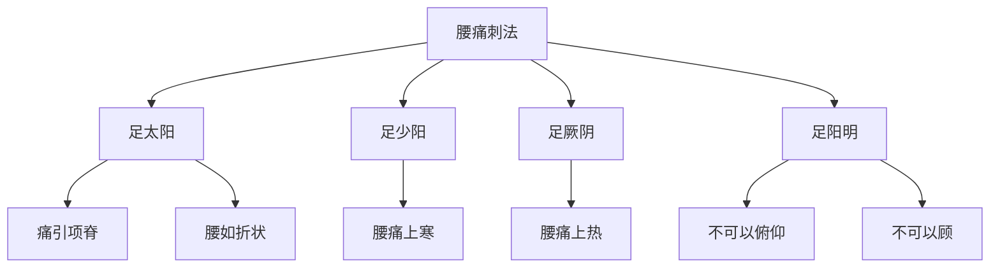

# 素问-刺腰痛篇第四十一

> "黄帝问曰：腰痛，痛上怦心，不可以仰息，刺之奈何？" - 黄帝

---

## 📜 原文（节选）/ Original Text (Excerpt)

黄帝问曰：腰痛，痛上怦心，不可以仰息，刺之奈何？

岐伯对曰：足太阳脉令人腰痛，痛引项脊，腰如折状，不可以仰，不可以顾。刺腰痛，出血如故，血已，令人腰痛益甚，不可刺矣。

腰痛上寒，不可以顾，刺足少阳出血，如故，血已，令人腰痛如解。

腰痛上热，不可以顾，刺足厥阴出血，如故，血已，令人腰痛如解。

腰痛不可以俯仰，不可以顾，刺足阳明出血，如故，血已，令人腰痛如解。

腰痛如折，不可以仰，不可以顾，刺足太阳出血，如故，血已，令人腰痛如解。

---

## 📖 白话文翻译（节选）/ Modern Chinese Translation (Excerpt)

黄帝问道：腰痛，疼痛向上冲心，不能仰息，针刺它如何？

岐伯回答说：足太阳经脉使人腰痛，疼痛牵引颈部脊背，腰部像折断的样子，不能仰身，不能回顾。针刺腰痛，出血如旧，血已出，使人腰痛更加严重，不可以针刺了。

腰痛向上寒，不能回顾，针刺足少阳出血，如旧，血已出，使人腰痛如解除。

腰痛向上热，不能回顾，针刺足厥阴出血，如旧，血已出，使人腰痛如解除。

腰痛不能俯仰，不能回顾，针刺足阳明出血，如旧，血已出，使人腰痛如解除。

腰痛像折断，不能仰身，不能回顾，针刺足太阳出血，如旧，血已出，使人腰痛如解除。

---

## 🔑 核心要点 / Core Concepts

### 1. 经脉腰痛表现 / Meridian Lumbar Pain Manifestations

| 经脉 | 症状特点 | 刺法 |
|------|----------|------|
| 足太阳 | 痛引项脊，腰如折状 | 刺出血，如故 |
| 足少阳 | 腰痛上寒 | 刺出血，如故 |
| 足厥阴 | 腰痛上热 | 刺出血，如故 |
| 足阳明 | 不可以俯仰，不可以顾 | 刺出血，如故 |

### 2. 腰痛类型 / Lumbar Pain Types

| 类型 | 表现 |
|------|------|
| 腰痛上怦心 | 痛上怦心，不可以仰息 |
| 腰痛上寒 | 上寒，不可以顾 |
| 腰痛上热 | 上热，不可以顾 |
| 腰痛如折 | 腰如折状，不可以仰，不可以顾 |

### 3. 腰痛刺法特点 / Lumbar Pain Acupuncture Characteristics

---

## 📚 理论解释 / Theoretical Analysis

### 腰痛理论 / Lumbar Pain Theory

> [!info] 核心概念
- 腰痛与经脉相关
- 不同经脉有不同表现
- 刺法根据经脉选择

#### 腰痛详解 / Detailed Lumbar Pain

**1. 足太阳腰痛 / Foot Taiyang Lumbar Pain**
- 症状：痛引项脊，腰如折状
- 表现：不可以仰，不可以顾
- 刺法：刺出血

**2. 足少阳腰痛 / Foot Shaoyang Lumbar Pain**
- 症状：腰痛上寒
- 表现：不可以顾
- 刺法：刺出血

**3. 足厥阴腰痛 / Foot Jueyin Lumbar Pain**
- 症状：腰痛上热
- 表现：不可以顾
- 刺法：刺出血

**4. 足阳明腰痛 / Foot Yangming Lumbar Pain**
- 症状：不可以俯仰，不可以顾
- 表现：腰痛如解除
- 刺法：刺出血

### 腰痛刺法理论 / Lumbar Pain Acupuncture Theory

> [!warning] 核心理念
- 刺腰痛，出血如故
- 血已，令人腰痛如解
- 不可复刺

#### 腰痛刺法详解 / Detailed Lumbar Pain Acupuncture

**1. 刺法原则 / Acupuncture Principle**
- 刺出血：针刺出血
- 如故：如旧
- 血已：血已出
- 如解：如解除

**2. 刺法禁忌 / Acupuncture Contraindications**
- 不可复刺：不可以再刺
- 血已，令人腰痛益甚：血已出，使人腰痛更加严重

**3. 各经刺法 / Each Meridian Acupuncture**
- 足太阳：刺出血
- 足少阳：刺出血
- 足厥阴：刺出血
- 足阳明：刺出血

---

## 🏥 中医实践应用 / TCM Practice Application

### 腰痛治疗 / Lumbar Pain Treatment

#### 现代腰痛治疗要点 / Modern Lumbar Pain Treatment Key Points

**1. 经脉腰痛治疗 / Meridian Lumbar Pain Treatment**
- 症状：痛引项脊，腰如折状
- 治法：舒筋活血
- 药物：独活寄生汤、活络效灵丹
- 针刺：针刺太阳经穴

**2. 寒热腰痛治疗 / Cold Heat Lumbar Pain Treatment**
- 上寒：温阳散寒
  - 药物：右归丸、金匮肾气丸
  - 针刺：针刺少阳经穴

- 上热：清热凉血
  - 药物：知柏地黄丸
  - 针刺：针刺厥阴经穴

**3. 腰痛如折治疗 / Lumbar Pain Like Breaking Treatment**
- 症状：腰如折状，不可以俯仰
- 治法：补肾强腰
- 药物：青娥丸、补肾强腰丸
- 针刺：针刺太阳经穴

---

## 🔗 相关链接 / Related Links

- [[MOC-黄帝内经知识库]] - 主索引
- [[黄帝内经-素问索引]] - 素问索引
- [[黄帝内经-核心理论]] - 核心理论体系
- [[素问-风论篇第四十二]] - 风论
- [[素问-痹论篇第四十三]] - 痹论

### 易学关联 / Yi Jing Connection

- [[MOC-易经知识库]] - 易经索引
- [[20260201-0002 五行]] - 五行理论

**易学与刺腰痛的联系:**
- 五行理论：易学的五行理论与中医经脉相通
- 阴阳理论：易学的阴阳理论与中医寒热腰痛相通

---

## 💡 学习要点 / Learning Points

### 掌握重点 / Key Points to Master

- [ ] 理解经脉腰痛的表现
- [ ] 掌握腰痛类型的判断
- [ ] 学会腰痛刺法的方法
- [ ] 了解腰痛的治疗方法

### 思考问题 / Questions for Reflection

1. **为什么说"腰痛如折状"？**
   - 痛引项脊：疼痛牵引颈部脊背
   - 严重程度：像折断一样严重
   - 功能受限：不可以俯仰回顾

2. **现代医学如何应用"刺腰痛"？**
   - 腰椎疾病：腰椎疾病治疗
   - 针刺治疗：针刺治疗腰痛
   - 综合治疗：综合治疗方案

---

## 📊 学习进度 / Learning Progress

### 完成情况 / Completion Status

| 学习内容 | 状态 | 备注 |
|---------|------|------|
| 原文诵读 | 📝 进行中 | 建议每日诵读 |
| 白话文理解 | ✅ 已完成 | 理解主要含义 |
| 经脉腰痛 | ✅ 已完成 | 掌握概念 |
| 腰痛治疗 | 📝 进行中 | 需要临床实践 |
| 理论分析 | ✅ 已完成 | 理解理论 |

---

## 🔄 更新日志 / Update Log

### 2026-02-03

- ✅ 创建刺腰痛篇第四十一笔记
- ✅ 完成原文、白话文翻译（节选）
- ✅ 整理经脉腰痛对照表
- ✅ 编写腰痛刺法理论

---

**笔记创建日期**：2026年2月3日

**最后更新**：2026年2月3日
