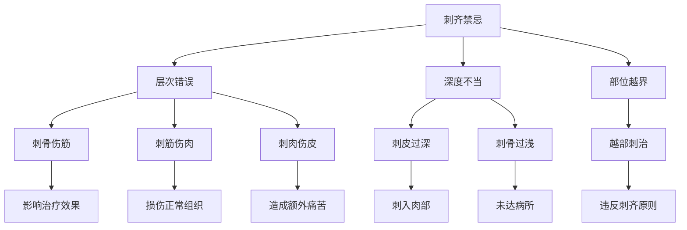

# 素问-刺齐论篇第五十一

> "黄帝问曰：愿闻刺齐。岐伯曰：刺有浅深，各至其理。" - 岐伯

---

## 📜 原文（节选）/ Original Text (Excerpt)

黄帝问曰：愿闻刺齐。

岐伯曰：刺有浅深，各至其理。皮肉筋骨，各有分部。

帝曰：其分部何如？

岐伯曰：皮之部，皮部也；肉之部，肉部也；筋之部，筋部也；骨之部，骨部也。刺骨者无伤筋，刺筋者无伤肉，刺肉者无伤皮，刺皮者无伤肉。

---

## 📖 白话文翻译（节选）/ Modern Chinese Translation (Excerpt)

黄帝问道：我愿意听到针刺深浅的法则。

岐伯回答说：针刺有浅有深，各有其所应达到的理法。皮、肉、筋、骨，各有其分部。

黄帝说：它的分部如何？

岐伯说：皮的分部是皮部；肉的分部是肉部；筋的分部是筋部；骨的分部是骨部。刺骨的时候不要损伤筋，刺筋的时候不要损伤肉，刺肉的时候不要损伤皮，刺皮的时候不要损伤肉。

---

## 🔍 英文释义 / English Interpretation

Yellow Emperor asked: I would like to hear the principles of acupuncture depth levels.

Qibo replied: Acupuncture has shallow and deep depths, each reaching its corresponding principle. Skin, flesh, tendons, and bones each have their respective areas.

Yellow Emperor said: How are these areas divided?

Qibo said: The area of skin is the skin area; the area of flesh is the flesh area; the area of tendons is the tendon area; the area of bones is the bone area. When needling bones, do not injure tendons; when needling tendons, do not injure flesh; when needling flesh, do not injure skin; when needling skin, do not injure flesh.

---

## 🔑 核心要点 / Core Concepts

### 1. 刺齐原则 / Acupuncture Level Principles

| 层次 | 部位 | 刺法要点 | 深度要求 |
|------|------|---------|---------|
| 皮部 | 皮肤 | 刺皮无伤肉 | 浅刺 |
| 肉部 | 肌肉 | 刺肉无伤皮 | 中浅刺 |
| 筋部 | 肌腱 | 刺筋无伤肉 | 中深刺 |
| 骨部 | 骨骼 | 刺骨无伤筋 | 深刺 |

### 2. 各部针刺法 / Acupuncture Methods for Each Area

| 部位 | 主要穴位 | 治疗病症 | 刺刺特点 |
|------|---------|---------|---------|
| 皮部 | 井穴、荥穴 | 表证、发热 | 浅刺、点刺 |
| 肉部 | 输穴、经穴 | 痹证、麻木 | 中浅刺 |
| 筋部 | 经穴、合穴 | 拘挛、疼痛 | 中深刺 |
| 骨部 | 合穴、阿是穴 | 骨病、深部病 | 深刺、透刺 |

### 3. 刺齐禁忌 / Acupuncture Level Contraindications

---

## 📚 理论解释 / Theoretical Analysis

### 刺齐理论 / Acupuncture Level Theory

> [!info] 核心概念
- 刺有浅深，各至其理
- 皮肉筋骨，各有分部
- 各司其职，互不干扰

#### 刺齐详解 / Detailed Acupuncture Levels

**1. 刺齐原则 / Acupuncture Level Principles**
- **皮部**：浅刺，适用于表证、发热、皮肤病等
- **肉部**：中浅刺，适用于痹证、麻木、肌肉病等
- **筋部**：中深刺，适用于拘挛、疼痛、筋腱病等
- **骨部**：深刺，适用于骨病、深部疾病等

**2. 刺法要点 / Acupuncture Method Key Points**
- **刺骨无伤筋**：深刺至骨时，注意不要损伤筋
- **刺筋无伤肉**：中深刺至筋时，注意不要损伤肉
- **刺肉无伤皮**：中浅刺至肉时，注意不要损伤皮
- **刺皮无伤肉**：浅刺至皮时，注意不要损伤肉

**3. 深度标准 / Depth Standards**
- **皮部刺法**：2-3分，点刺或斜刺
- **肉部刺法**：3-5分，直刺或斜刺
- **筋部刺法**：5-8分，直刺或透刺
- **骨部刺法**：8-12分，直刺或透刺至骨

### 层次理论 / Layer Theory

> [!warning] 核心理念
- 分层施治
- 精准定位
- 安全有效

#### 层次理论详解 / Detailed Layer Theory

**1. 解剖层次 / Anatomical Layers**
- **皮肤层**：表皮、真皮、皮下组织
- **肌肉层**：浅筋膜、深筋膜、肌肉
- **筋膜层**：肌腱、韧带、筋膜
- **骨骼层**：骨膜、骨质、骨髓

**2. 病理层次 / Pathological Layers**
- **表证在皮**：发热、汗出、恶寒
- **痹证在肉**：麻木、酸重、肌肉痛
- **拘挛在筋**：痉挛、抽搐、关节不利
- **骨病在骨**：骨痛、骨蒸、骨折

**3. 治疗层次 / Treatment Layers**
- **因病定层**：根据病变所在层次选择针刺深度
- **因部定刺**：根据部位特点选择针刺方法
- **因人定深**：根据体质胖瘦调整针刺深度

---

## 🏥 中医实践应用 / TCM Practice Application

### 针刺治疗 / Acupuncture Treatment

#### 现代针刺治疗应用 / Modern Acupuncture Treatment Application

**1. 刺齐法治疗表证 / Level Method for Exterior Syndromes**
- 取穴：井穴、荥穴（如少商、商阳）
- 刺法：浅刺2-3分，点刺出血
- 适应症：发热、感冒、咽喉肿痛

**2. 刺齐法治疗痹证 / Level Method for Bi Syndromes**
- 取穴：输穴、经穴（如合谷、曲池）
- 刺法：中浅刺3-5分，平补平泻
- 适应症：麻木、酸重、肌肉疼痛

**3. 刺齐法治疗拘挛 / Level Method for Spasms**
- 取穴：经穴、合穴（如阳陵泉、足三里）
- 刺法：中深刺5-8分，透刺
- 适应症：痉挛、抽搐、关节不利

**4. 刺齐法治疗骨病 / Level Method for Bone Diseases**
- 取穴：合穴、阿是穴（如肾俞、委中）
- 刺法：深刺8-12分，透刺至骨
- 适应症：骨痛、骨蒸、骨折

### 现代医学对应 / Modern Medicine Correspondence

| 中医层次 | 现代解剖 | 临床应用 |
|---------|---------|---------|
| 皮部 | 表皮、真皮 | 穴位注射、皮内针 |
| 肉部 | 皮下组织、肌肉 | 肌肉注射、电针 |
| 筋部 | 肌腱、韧带 | 针刀、激痛点 |
| 骨部 | 骨膜、骨质 | 骨膜针、深部刺激 |

---

## 🔗 相关链接 / Related Links

- [[MOC-黄帝内经知识库]] - 主索引
- [[黄帝内经-素问索引]] - 素问索引
- [[黄帝内经-核心理论]] - 核心理论体系
- [[素问-刺要论篇第五十]] - 刺要论
- [[素问-刺禁论篇第五十二]] - 刺禁论
- [[素问-经络论篇第五十七]] - 经络论

### 易学关联 / Yi Jing Connection

- [[MOC-易经知识库]] - 易经索引
- [[20260201-0002 五行]] - 五行理论

**易学与刺齐的联系:**
- 分层理论：易学的层次观念与中医刺齐相通
- 精准定位：易学的定位理论与中医针刺相通

---

## 💡 学习要点 / Learning Points

### 掌握重点 / Key Points to Master

- [ ] 理解刺齐的原则和层次
- [ ] 掌握皮肉筋骨的针刺方法
- [ ] 学会各部深浅的标准
- [ ] 了解刺齐禁忌的重要性

### 思考问题 / Questions for Reflection

1. **为什么说"刺有浅深，各至其理"？**
   - 层次分明：人体结构层次分明
   - 病位不同：病变在不同层次
   - 治法各异：不同层次需要不同治法

2. **现代医学如何应用"刺齐论"？**
   - 精准解剖：基于现代解剖学
   - 层次治疗：根据病变层次选择治疗
   - 安全有效：避免误伤正常组织

---

## 📊 学习进度 / Learning Progress

### 完成情况 / Completion Status

| 学习内容 | 状态 | 备注 |
|---------|------|------|
| 原文诵读 | 📝 进行中 | 建议每日诵读 |
| 白话文理解 | ✅ 已完成 | 理解主要含义 |
| 刺齐原则 | ✅ 已完成 | 掌握原则 |
| 层次刺法 | 📝 进行中 | 需要临床实践 |
| 理论分析 | ✅ 已完成 | 理解理论 |

---

## 🔄 更新日志 / Update Log

### 2026-02-03

- ✅ 创建刺齐论篇第五十一笔记
- ✅ 完成原文、白话文翻译（节选）
- 整理刺齐原则和层次对照表
- ✅ 编写刺齐和层次理论

---

**笔记创建日期**：2026年2月3日

**最后更新**：2026年2月3日
