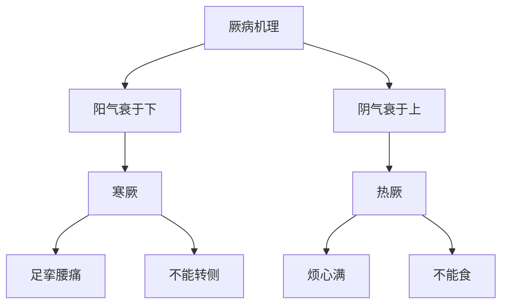

# 素问-厥论篇第四十五

> "黄帝问曰：厥之状何如？岐伯曰：阳气衰于下，则为寒厥；阴气衰于上，则为热厥。" - 岐伯

---

## 📜 原文（节选）/ Original Text (Excerpt)

黄帝问曰：厥之状何如？

岐伯曰：阳气衰于下，则为寒厥；阴气衰于上，则为热厥。

帝曰：愿闻其状。

岐伯曰：阳气衰于下，则为寒厥；阴气衰于上，则为热厥。阳气衰于下，则为寒厥，足挛腰痛，不能转侧，阴气盛于上，则为热厥，烦心满，不能食，足挛腰痛，不能转侧。

帝曰：治之奈何？

岐伯曰：寒厥者，温阳散寒；热厥者，清热养阴。

---

## 📖 白话文翻译（节选）/ Modern Chinese Translation (Excerpt)

黄帝问道：厥的状况如何？

岐伯回答说：阳气衰于下，就成为寒厥；阴气衰于上，就成为热厥。

黄帝说：我希望听到它的状况。

岐伯说：阳气衰于下，就成为寒厥；阴气衰于上，就成为热厥。阳气衰于下，就成为寒厥，足部拘挛腰部疼痛，不能转侧，阴气旺盛于上，就成为热厥，烦闷胀满，不能进食，足部拘挛腰部疼痛，不能转侧。

黄帝说：治疗它如何？

岐伯说：寒厥，温阳散寒；热厥，清热养阴。

---

## 🔑 核心要点 / Core Concepts

### 1. 厥病类型 / Jue Disease Types

| 类型 | 机理 | 症状 |
|------|------|------|
| 寒厥 | 阳气衰于下 | 足挛腰痛，不能转侧 |
| 热厥 | 阴气衰于上 | 烦心满，不能食 |

### 2. 寒热厥表现 / Cold Heat Jue Manifestations

| 厥型 | 机理 | 表现 |
|------|------|------|
| 寒厥 | 阳气衰于下 | 足挛腰痛，不能转侧 |
| 热厥 | 阴气衰于上 | 烦心满，不能食 |

### 3. 厥病机理 / Jue Disease Mechanism

---

## 📚 理论解释 / Theoretical Analysis

### 厥病理论 / Jue Disease Theory

> [!info] 核心概念
- 阳气衰于下，则为寒厥
- 阴气衰于上，则为热厥
- 厥病有寒热之分

#### 厥病详解 / Detailed Jue Disease

**1. 寒厥 / Cold Jue**
- 机理：阳气衰于下
- 症状：足挛腰痛，不能转侧
- 病机：阳气不足，下焦虚寒

**2. 热厥 / Heat Jue**
- 机理：阴气衰于上
- 症状：烦心满，不能食
- 病机：阴气不足，上焦虚热

**3. 厥病特点 / Jue Disease Characteristics**
- 寒热之分：有寒厥、热厥之分
- 阴阳失调：阴气阳气失调
- 气机紊乱：气机紊乱

### 寒热厥理论 / Cold Heat Jue Theory

> [!warning] 核心理念
- 寒厥温阳散寒
- 热厥清热养阴
- 调和阴阳为要

#### 寒热厥详解 / Detailed Cold Heat Jue

**1. 寒厥机理 / Cold Jue Mechanism**
- 阳气衰于下：阳气衰于下
- 病机：阳气不足
- 表现：足挛腰痛，不能转侧

**2. 热厥机理 / Heat Jue Mechanism**
- 阴气衰于上：阴气衰于上
- 病机：阴气不足
- 表现：烦心满，不能食

**3. 治疗原则 / Treatment Principle**
- 寒厥：温阳散寒
- 热厥：清热养阴
- 调和阴阳：调和阴阳

---

## 🏥 中医实践应用 / TCM Practice Application

### 厥病治疗 / Jue Disease Treatment

#### 现代厥病治疗要点 / Modern Jue Disease Treatment Key Points

**1. 寒厥治疗 / Cold Jue Treatment**
- 症状：足挛腰痛，不能转侧
- 治法：温阳散寒
- 药物：四逆汤、当归四逆汤
- 针刺：针刺肾俞、命门、关元穴

**2. 热厥治疗 / Heat Jue Treatment**
- 症状：烦心满，不能食
- 治法：清热养阴
- 药物：黄连阿胶汤、生脉散
- 针刺：针刺心俞、膻中、内关穴

**3. 阴阳调和治疗 / Yin Yang Harmony Treatment**
- 症状：阴气阳气失调
- 治法：调和阴阳
- 药物：右归丸、金匮肾气丸
- 针刺：针刺百会、大椎、命门穴

---

## 🔗 相关链接 / Related Links

- [[MOC-黄帝内经知识库]] - 主索引
- [[黄帝内经-素问索引]] - 素问索引
- [[黄帝内经-核心理论]] - 核心理论体系
- [[素问-痿论篇第四十四]] - 痿论
- [[素问-气厥论篇第三十七]] - 气厥

### 易学关联 / Yi Jing Connection

- [[MOC-易经知识库]] - 易经索引
- [[20260201-0002 五行]] - 五行理论

**易学与厥论的联系:**
- 五行理论：易学的五行理论与中医寒热厥相通
- 阴阳理论：易学的阴阳理论与中医厥病相通

---

## 💡 学习要点 / Learning Points

### 掌握重点 / Key Points to Master

- [ ] 理解厥病的类型
- [ ] 掌握寒热厥的判断
- [ ] 学会厥病的治疗方法
- [ ] 了解阴气阳气失调的理论

### 思考问题 / Questions for Reflection

1. **为什么说"阳气衰于下，则为寒厥"？**
   - 阳气衰：阳气衰退
   - 衰于下：衰退于下焦
   - 寒厥：寒气上逆

2. **现代医学如何应用"厥论"？**
   - 厥病治疗：厥病治疗方法
   - 阴阳平衡：阴阳平衡调节
   - 综合治疗：综合治疗方案

---

## 📊 学习进度 / Learning Progress

### 完成情况 / Completion Status

| 学习内容 | 状态 | 备注 |
|---------|------|------|
| 原文诵读 | 📝 进行中 | 建议每日诵读 |
| 白话文理解 | ✅ 已完成 | 理解主要含义 |
| 厥病理论 | ✅ 已完成 | 掌握概念 |
| 厥病治疗 | 📝 进行中 | 需要临床实践 |
| 理论分析 | ✅ 已完成 | 理解理论 |

---

## 🔄 更新日志 / Update Log

### 2026-02-03

- ✅ 创建厥论篇第四十五笔记
- ✅ 完成原文、白话文翻译（节选）
- ✅ 整理厥病类型对照表
- ✅ 编写厥病和寒热厥理论

---

**笔记创建日期**：2026年2月3日

**最后更新**：2026年2月3日
