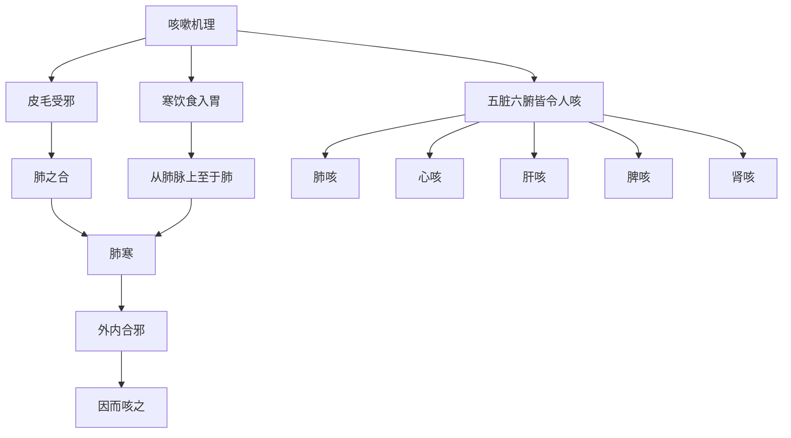

# 素问-咳论篇第三十八

> "黄帝问曰：咳之状何如？岐伯曰：皮毛者，肺之合也，皮毛先受邪气，邪气以从其合也。" - 岐伯

---

## 📜 原文（节选）/ Original Text (Excerpt)

黄帝问曰：咳之状何如？

岐伯曰：皮毛者，肺之合也，皮毛先受邪气，邪气以从其合也。其寒饮食入胃，从肺脉上至于肺则肺寒，肺寒则外内合邪，因而咳之，是为肺咳。

五脏六腑皆令人咳，非独肺也。

帝曰：愿闻五脏之咳。

岐伯曰：肺咳之状，咳而喘息有音，甚则唾血。心咳之状，咳则心痛，喉中介介如梗状，甚则咽肿喉痹。肝咳之状，咳则两胁下痛，甚不可以转，转则两胠下满。脾咳之状，咳则右胁下痛，痛引肩背，甚则不可以动，动则咳剧。肾咳之状，咳则腰背相引而痛，甚则咳涎。

帝曰：六腑之咳奈何？

岐伯曰：脾咳不已，则胃受之，胃咳之状，咳而呕，呕甚则长虫出。肝咳不已，则胆受之，胆咳之状，呕胆汁。肺咳不已，则大肠受之，大肠咳之状，咳而遗矢。心咳不已，则小肠受之，小肠咳之状，咳而失气，气与咳俱失。肾咳不已，则膀胱受之，膀胱咳之状，咳而遗溺。

---

## 📖 白话文翻译（节选）/ Modern Chinese Translation (Excerpt)

黄帝问道：咳嗽的状况如何？

岐伯说：皮毛，是肺的配合，皮毛先受邪气，邪气从而从它的配合。它的寒冷饮食进入胃，从肺脉向上到达肺则肺寒，肺寒则外内配合邪气，因而咳嗽，这叫做肺咳。

五脏六腑都使人咳嗽，不只是肺。

黄帝说：我希望听到五脏的咳嗽。

岐伯说：肺咳的状况，咳嗽而喘息有声音，严重就唾血。心咳的状况，咳嗽就心痛，喉咙中好像有梗塞的样子，严重就咽肿喉咙麻痹。肝咳的状况，咳嗽就两胁下痛，严重不可以转动，转动就两胠下胀满。脾咳的状况，咳嗽就右胁下痛，痛牵引肩背，严重就不可以活动，活动就咳嗽剧烈。肾咳的状况，咳嗽就腰背相互牵引而痛，严重就咳嗽涎液。

黄帝说：六腑的咳嗽如何？

岐伯说：脾咳不停止，则胃受它，胃咳的状况，咳嗽而呕吐，呕吐严重就长虫出。肝咳不停止，则胆受它，胆咳的状况，呕吐胆汁。肺咳不停止，则大肠受它，大肠咳的状况，咳嗽而遗矢。心咳不停止，则小肠受它，小肠咳的状况，咳嗽而失气，气与咳嗽一起失。肾咳不停止，则膀胱受它，膀胱咳的状况，咳嗽而遗尿。

---

## 🔑 核心要点 / Core Concepts

### 1. 五脏咳 / Five Zang Cough

| 脏 | 症状 |
|------|------|
| 肺 | 咳而喘息有音，甚则唾血 |
| 心 | 咳则心痛，喉中介介如梗状，甚则咽肿喉痹 |
| 肝 | 咳则两胁下痛，甚不可以转，转则两胠下满 |
| 脾 | 咳则右胁下痛，痛引肩背，甚则不可以动，动则咳剧 |
| 肾 | 咳则腰背相引而痛，甚则咳涎 |

### 2. 六腑咳 / Six Fu Cough

| 腑 | 症状 |
|------|------|
| 胃 | 咳而呕，呕甚则长虫出 |
| 胆 | 呕胆汁 |
| 大肠 | 咳而遗矢 |
| 小肠 | 咳而失气，气与咳俱失 |
| 膀胱 | 咳而遗溺 |

### 3. 咳嗽机理 / Cough Mechanism

---

## 📚 理论解释 / Theoretical Analysis

### 咳嗽理论 / Cough Theory

> [!info] 核心概念
- 皮毛受邪，邪气以从其合
- 五脏六腑皆令人咳
- 非独肺也

#### 咳嗽机理详解 / Detailed Cough Mechanism

**1. 皮毛受邪 / Skin Hair Receiving Evil**
- 皮毛者，肺之合：皮毛，是肺的配合
- 皮毛先受邪气：皮毛先受邪气
- 邪气以从其合：邪气从而从它的配合

**2. 寒饮食入胃 / Cold Drink Food Entering Stomach**
- 寒饮食入胃：寒冷饮食进入胃
- 从肺脉上至于肺：从肺脉向上到达肺
- 肺寒则外内合邪：肺寒则外内配合邪气

**3. 因而咳之 / Therefore Cough**
- 外内合邪：外内配合邪气
- 因而咳之：因而咳嗽
- 是为肺咳：这叫做肺咳

### 五脏咳理论 / Five Zang Cough Theory

> [!warning] 核心理念
- 五脏皆令人咳
- 各有其特点
- 非独肺也

#### 五脏咳详解 / Detailed Five Zang Cough

**1. 肺咳 / Lung Cough**
- 症状：咳而喘息有音，甚则唾血
- 病机：肺寒，外内合邪

**2. 心咳 / Heart Cough**
- 症状：咳则心痛，喉中介介如梗状，甚则咽肿喉痹
- 病机：寒饮食入胃，从肺脉上至于肺则心咳

**3. 肝咳 / Liver Cough**
- 症状：咳则两胁下痛，甚不可以转，转则两胠下满
- 病机：肝咳不已，则胆受之

**4. 脾咳 / Spleen Cough**
- 症状：咳则右胁下痛，痛引肩背，甚则不可以动，动则咳剧
- 病机：脾咳不已，则胃受之

**5. 肾咳 / Kidney Cough**
- 症状：咳则腰背相引而痛，甚则咳涎
- 病机：肾咳不已，则膀胱受之

### 六腑咳理论 / Six Fu Cough Theory

> [!note] 六腑咳概念
- 五脏咳不已，则六腑受之
- 六腑咳，症状各异

#### 六腑咳详解 / Detailed Six Fu Cough

**1. 胃咳 / Stomach Cough**
- 症状：咳而呕，呕甚则长虫出
- 来源：脾咳不已

**2. 胆咳 / Gallbladder Cough**
- 症状：呕胆汁
- 来源：肝咳不已

**3. 大肠咳 / Large Intestine Cough**
- 症状：咳而遗矢
- 来源：肺咳不已

**4. 小肠咳 / Small Intestine Cough**
- 症状：咳而失气，气与咳俱失
- 来源：心咳不已

**5. 膀胱咳 / Bladder Cough**
- 症状：咳而遗溺
- 来源：肾咳不已

---

## 🏥 中医实践应用 / TCM Practice Application

### 咳嗽治疗 / Cough Treatment

#### 现代咳嗽治疗要点 / Modern Cough Treatment Key Points

**1. 肺咳治疗 / Lung Cough Treatment**
- 症状：咳而喘息有音，甚则唾血
- 治法：宣肺止咳
- 药物：麻黄汤、杏苏散

**2. 心咳治疗 / Heart Cough Treatment**
- 症状：咳则心痛，喉中介介如梗状
- 治法：清心宁咳
- 药物：导赤散、朱砂安神丸

**3. 肝咳治疗 / Liver Cough Treatment**
- 症状：咳则两胁下痛，甚不可以转
- 治法：疏肝止咳
- 药物：柴胡疏肝散、逍遥散

**4. 脾咳治疗 / Spleen Cough Treatment**
- 症状：咳则右胁下痛，痛引肩背
- 治法：健脾止咳
- 药物：六君子汤、参苓白术散

**5. 肾咳治疗 / Kidney Cough Treatment**
- 症状：咳则腰背相引而痛，甚则咳涎
- 治法：补肾纳气
- 药物：肾气丸、金匮肾气丸

---

## 🔗 相关链接 / Related Links

- [[MOC-黄帝内经知识库]] - 主索引
- [[黄帝内经-素问索引]] - 素问索引
- [[黄帝内经-核心理论]] - 核心理论体系
- [[素问-气厥论篇第三十七]] - 气厥
- [[素问-举痛论篇第三十九]] - 举痛

### 易学关联 / Yi Jing Connection

- [[MOC-易经知识库]] - 易经索引
- [[20260201-0002 五行]] - 五行理论

**易学与咳论的联系:**
- 五行理论：易学的五行理论与中医五脏咳相通
- 腑表里：易学的表里理论与中医脏腑咳相通

---

## 💡 学习要点 / Learning Points

### 掌握重点 / Key Points to Master

- [ ] 理解咳嗽的机理
- [ ] 掌握五脏咳的症状
- [ ] 学会六腑咳的症状
- [ ] 了解咳嗽的治疗方法

### 思考问题 / Questions for Reflection

1. **为什么说"五脏六腑皆令人咳，非独肺也"？**
   - 五脏六腑：五脏六腑都影响咳嗽
   - 非独肺也：不只是肺
   - 整体观念：整体观念

2. **现代医学如何应用"五脏咳"？**
   - 脏腑辨证：脏腑辨证治疗
   - 咳嗽分型：咳嗽分型治疗
   - 个体化治疗：根据个体情况治疗

---

## 📊 学习进度 / Learning Progress

### 完成情况 / Completion Status

| 学习内容 | 状态 | 备注 |
|---------|------|------|
| 原文诵读 | 📝 进行中 | 建议每日诵读 |
| 白话文理解 | ✅ 已完成 | 理解主要含义 |
| 咳嗽机理 | ✅ 已完成 | 掌握机理 |
| 五脏六腑咳 | 📝 进行中 | 需要临床实践 |
| 理论分析 | ✅ 已完成 | 理解理论 |

---

## 🔄 更新日志 / Update Log

### 2026-02-03

- ✅ 创建咳论篇第三十八笔记
- ✅ 完成原文、白话文翻译（节选）
- ✅ 整理五脏六腑咳对照表
- ✅ 编写咳嗽理论

---

**笔记创建日期**：2026年2月3日

**最后更新**：2026年2月3日
