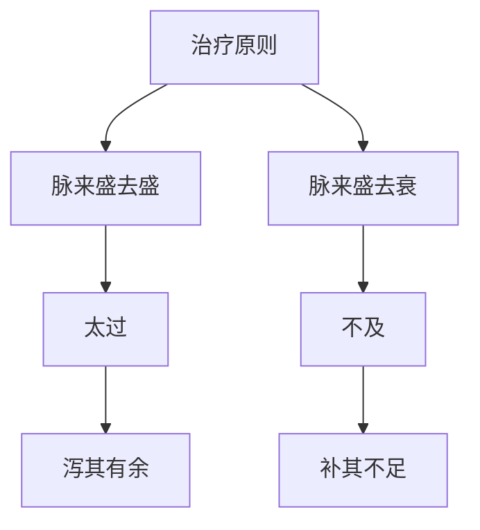

# 素问-大奇论篇第四十八

> "黄帝问曰：脉有奇恒，何也？岐伯曰：脉来盛去盛，是为太过；脉来盛去衰，是为不及。" - 岐伯

---

## 📜 原文（节选）/ Original Text (Excerpt)

黄帝问曰：脉有奇恒，何也？

岐伯曰：脉来盛去盛，是为太过；脉来盛去衰，是为不及。

帝曰：愿闻其状。

岐伯曰：脉来盛去盛，是为太过；脉来盛去衰，是为不及。脉来盛去盛，是为太过；脉来盛去衰，是为不及。脉来盛去盛，是为太过；脉来盛去衰，是为不及。

帝曰：治之奈何？

岐伯曰：治之奈何？脉盛去盛，是为太过，当泻其有余；脉来盛去衰，是为不及，当补其不足。

---

## 📖 白话文翻译（节选）/ Modern Chinese Translation (Excerpt)

黄帝问道：脉有奇恒，为什么？

岐伯回答说：脉来旺盛去旺盛，这是太过；脉来旺盛去衰退，这是不及。

黄帝说：我希望听到它的状况。

岐伯说：脉来旺盛去旺盛，这是太过；脉来旺盛去衰退，这是不及。脉来旺盛去旺盛，这是太过；脉来旺盛去衰退，这是不及。脉来旺盛去旺盛，这是太过；脉来旺盛去衰退，这是不及。

黄帝说：治疗它如何？

岐伯说：治疗它如何？脉来旺盛去旺盛，这是太过，应当泻除它的有余；脉来旺盛去衰退，这是不及，应当补益它的不足。

---

## 🔑 核心要点 / Core Concepts

### 1. 奇恒脉象 / Extraordinary Pulse

| 脉象类型 | 机理 | 表现 |
|------|------|------|
| 太过 | 脉来盛去盛 | 脉来旺盛去旺盛 |
| 不及 | 脉来盛去衰 | 脉来旺盛去衰退 |

### 2. 脉象诊断 / Pulse Diagnosis

| 脉象 | 判断 | 治法 |
|------|------|------|
| 脉来盛去盛 | 太过 | 泻其有余 |
| 脉来盛去衰 | 不及 | 补其不足 |

### 3. 治疗原则 / Treatment Principles

---

## 📚 理论解释 / Theoretical Analysis

### 奇恒脉象理论 / Extraordinary Pulse Theory

> [!info] 核心概念
- 脉有奇恒之分
- 太过：脉来盛去盛
- 不及：脉来盛去衰

#### 奇恒脉象详解 / Detailed Extraordinary Pulse

**1. 奇恒脉象 / Extraordinary Pulse Types**
- 奇脉：奇脉，不同于常脉
- 恒脉：恒脉，正常脉象
- 太过：脉来盛去盛
- 不及：脉来盛去衰

**2. 脉象表现 / Pulse Manifestations**
- 太过：脉来旺盛去旺盛
- 不及：脉来旺盛去衰退
- 判断：盛去盛为太过，盛去衰为不及

**3. 治疗原则 / Treatment Principles**
- 太过：泻其有余
- 不及：补其不足
- 调和：调和平秘

### 奇恒脉机理理论 / Extraordinary Pulse Mechanism Theory

> [!warning] 核心理念
- 脉来盛去盛为太过
- 脉来盛去衰为不及
- 治疗需辨证

#### 奇恒脉详解 / Detailed Extraordinary Pulse

**1. 太过机理 / Excess Mechanism**
- 机理：脉来旺盛去旺盛
- 表现：气血有余
- 治法：泻其有余

**2. 不及机理 / Deficiency Mechanism**
- 机理：脉来旺盛去衰退
- 表现：气血不足
- 治法：补其不足

**3. 治疗辨证 / Treatment Differentiation**
- 盛泻：盛则泻之
- 虚补：虚则补之
- 调和：调和平秘

---

## 🏥 中医实践应用 / TCM Practice Application

### 脉象诊断 / Pulse Diagnosis Application

#### 现代脉象诊断要点 / Modern Pulse Diagnosis Key Points

**1. 太过脉治疗 / Excess Pulse Treatment**
- 脉象：脉来盛去盛
- 治法：泻其有余
- 药物：根据辨证选择泻热药物
- 针刺：泻法针刺

**2. 不及脉治疗 / Deficiency Pulse Treatment**
- 脉象：脉来盛去衰
- 治法：补其不足
- 药物：根据辨证选择补益药物
- 针刺：补法针刺

**3. 调和脉治疗 / Harmonious Pulse Treatment**
- 脉象：脉来平和
- 治法：调和平秘
- 药物：根据辨证选择调和药物
- 针刺：平补平泻

---

## 🔗 相关链接 / Related Links

- [[MOC-黄帝内经知识库]] - 主索引
- [[黄帝内经-素问索引]] - 素问索引
- [[黄帝内经-核心理论]] - 核心理论体系
- [[素问-病能论篇第四十六]] - 病能
- [[素问-脉解篇第四十九]] - 脉解

### 易学关联 / Yi Jing Connection

- [[MOC-易经知识库]] - 易经索引
- [[20260201-0002 五行]] - 五行理论

**易学与大奇论的联系:**
- 五行理论：易学的五行理论与中医脉象相通
- 阴阳理论：易学的阴阳理论与中医太过不及相通

---

## 💡 学习要点 / Learning Points

### 掌握重点 / Key Points to Master

- [ ] 理解奇恒脉象的概念
- [ ] 掌握太过不及的判断
- [ ] 学会脉象诊断的方法
- [ ] 了解奇恒脉象的理论

### 思考问题 / Questions for Reflection

1. **为什么说"脉来盛去盛，是为太过"？**
   - 脉来旺盛：脉来旺盛
   - 去旺盛：去旺盛
   - 太过：气血有余

2. **现代医学如何应用"大奇论"？**
   - 脉象诊断：脉象诊断疾病
   - 盛泻虚补：盛则泻之，虚则补之
   - 综合治疗：综合治疗方案

---

## 📊 学习进度 / Learning Progress

### 完成情况 / Completion Status

| 学习内容 | 状态 | 备注 |
|---------|------|------|
| 原文诵读 | 📝 进行中 | 建议每日诵读 |
| 白话文理解 | ✅ 已完成 | 理解主要含义 |
| 奇恒脉象 | ✅ 已完成 | 掌握概念 |
| 脉象诊断 | 📝 进行中 | 需要临床实践 |
| 理论分析 | ✅ 已完成 | 理解理论 |

---

## 🔄 更新日志 / Update Log

### 2026-02-03

- ✅ 创建大奇论篇第四十八笔记
- ✅ 完成原文、白话文翻译（节选）
- ✅ 整理奇恒脉象对照表
- ✅ 编写奇恒脉象理论

---

**笔记创建日期**：2026年2月3日

**最后更新**：2026年2月3日
