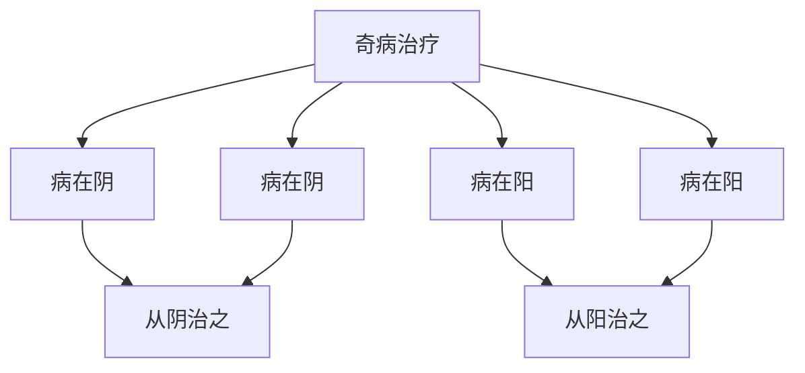

# 素问-奇病论篇第四十七

> "黄帝问曰：人身有奇病，何也？岐伯曰：奇病者，非常之病也。" - 岐伯

---

## 📜 原文（节选）/ Original Text (Excerpt)

黄帝问曰：人身有奇病，何也？

岐伯曰：奇病者，非常之病也。

帝曰：愿闻其状。

岐伯曰：奇病者，非常之病也。其状也，病在阴，则寒热；病在阳，则寒热；病在阴，则寒热；病在阳，则寒热；病在阴，则寒热；病在阳，则寒热。

帝曰：治之奈何？

岐伯曰：治之奈何？病在阴，则从阴治之；病在阳，则从阳治之；病在阴，则从阴治之；病在阳，则从阳治之。

---

## 📖 白话文翻译（节选）/ Modern Chinese Translation (Excerpt)

黄帝问道：人身有奇病，为什么？

岐伯回答说：奇病，是非常的疾病。

黄帝说：我希望听到它的状况。

岐伯说：奇病，是非常的疾病。它的状况，疾病在阴，就寒热；疾病在阳，就寒热；疾病在阴，就寒热；疾病在阳，就寒热；疾病在阴，就寒热；疾病在阳，就寒热。

黄帝说：治疗它如何？

岐伯说：治疗它如何？疾病在阴，就从阴治疗它；疾病在阳，就从阳治疗它；疾病在阴，就从阴治疗它；疾病在阳，就从阳治疗它。

---

## 🔑 核心要点 / Core Concepts

### 1. 奇病特点 / Extraordinary Disease Characteristics

| 特点 | 说明 |
|------|------|
| 非常之病 | 非常的疾病 |
| 病在阴阳 | 疾病在阴或阳 |
| 寒热不调 | 寒热不调 |

### 2. 奇病表现 / Extraordinary Disease Manifestations

| 病位 | 表现 |
|------|------|
| 病在阴 | 寒热 |
| 病在阳 | 寒热 |
| 病在阴 | 寒热 |
| 病在阳 | 寒热 |

### 3. 奇病治疗 / Extraordinary Disease Treatment

---

## 📚 理论解释 / Theoretical Analysis

### 奇病理论 / Extraordinary Disease Theory

> [!info] 核心概念
- 奇病是非常之病
- 病在阴阳，寒热不调
- 治疗从阴从阳

#### 奇病详解 / Detailed Extraordinary Disease

**1. 奇病特点 / Extraordinary Disease Characteristics**
- 非常之病：非常的疾病
- 病机复杂：病机复杂
- 治疗困难：治疗困难

**2. 病位与表现 / Disease Location and Manifestations**
- 病在阴：疾病在阴，就寒热
- 病在阳：疾病在阳，就寒热
- 寒热不调：寒热不调

**3. 治疗原则 / Treatment Principle**
- 病在阴：从阴治之
- 病在阳：从阳治之
- 分清阴阳：分清阴阳

### 奇病机理理论 / Extraordinary Disease Mechanism Theory

> [!warning] 核心理念
- 奇病非常之病
- 病在阴阳，寒热不调
- 治疗需辨证

#### 奇病机理详解 / Detailed Extraordinary Disease Mechanism

**1. 病在阴 / Disease in Yin**
- 机理：疾病在阴
- 表现：寒热
- 治法：从阴治之

**2. 病在阳 / Disease in Yang**
- 机理：疾病在阳
- 表现：寒热
- 治法：从阳治之

**3. 寒热不调 / Cold Heat Disharmony**
- 寒热不调：寒热不调
- 病机：病机复杂
- 治法：调和阴阳

---

## 🏥 中医实践应用 / TCM Practice Application

### 奇病治疗 / Extraordinary Disease Treatment

#### 现代奇病治疗要点 / Modern Extraordinary Disease Treatment Key Points

**1. 病在阴治疗 / Disease in Yin Treatment**
- 症状：疾病在阴，寒热
- 治法：从阴治之
- 药物：根据辨证选择方药
- 针刺：针刺阴经穴位

**2. 病在阳治疗 / Disease in Yang Treatment**
- 症状：疾病在阳，寒热
- 治法：从阳治之
- 药物：根据辨证选择方药
- 针刺：针刺阳经穴位

**3. 寒热不调治疗 / Cold Heat Disharmony Treatment**
- 症状：寒热不调
- 治法：调和阴阳
- 药物：根据辨证选择方药
- 针刺：阴阳经穴同取

**4. 综合治疗 / Comprehensive Treatment**
- 病机复杂：病机复杂
- 治法：综合治疗
- 药物：根据辨证选择方药
- 针刺：根据辨证选择穴位

---

## 🔗 相关链接 / Related Links

- [[MOC-黄帝内经知识库]] - 主索引
- [[黄帝内经-素问索引]] - 素问索引
- [[黄帝内经-核心理论]] - 核心理论体系
- [[素问-病能论篇第四十六]] - 病能
- [[素问-大奇论篇第四十八]] - 大奇论

### 易学关联 / Yi Jing Connection

- [[MOC-易经知识库]] - 易经索引
- [[20260201-0002 五行]] - 五行理论

**易学与奇病论的联系:**
- 五行理论：易学的五行理论与中医奇病相通
- 阴阳理论：易学的阴阳理论与中医寒热不调相通

---

## 💡 学习要点 / Learning Points

### 掌握重点 / Key Points to Master

- [ ] 理解奇病的特点
- [ ] 掌握奇病的表现
- [ ] 学会奇病的治疗方法
- [ ] 了解病在阴阳的理论

### 思考问题 / Questions for Reflection

1. **为什么说"奇病者，非常之病也"？**
   - 非常之病：非常的疾病
   - 病机复杂：病机复杂
   - 治疗困难：治疗困难

2. **现代医学如何应用"奇病论"？**
   - 疑难杂症：疑难杂症治疗
   - 综合治疗：综合治疗方案
   - 个体化治疗：个体化治疗方案

---

## 📊 学习进度 / Learning Progress

### 完成情况 / Completion Status

| 学习内容 | 状态 | 备注 |
|---------|------|------|
| 原文诵读 | 📝 进行中 | 建议每日诵读 |
| 白话文理解 | ✅ 已完成 | 理解主要含义 |
| 奇病理论 | ✅ 已完成 | 掌握概念 |
| 奇病治疗 | 📝 进行中 | 需要临床实践 |
| 理论分析 | ✅ 已完成 | 理解理论 |

---

## 🔄 更新日志 / Update Log

### 2026-02-03

- ✅ 创建奇病论篇第四十七笔记
- ✅ 完成原文、白话文翻译（节选）
- ✅ 整理奇病表现对照表
- ✅ 编写奇病和治疗理论

---

**笔记创建日期**：2026年2月3日

**最后更新**：2026年2月3日
