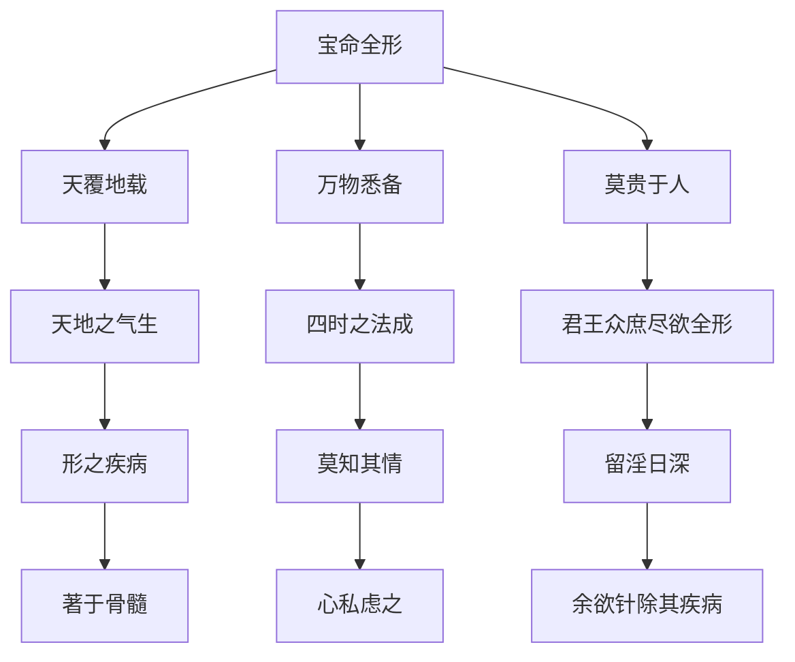

# 素问-宝命全形论篇第二十五

> "黄帝问曰：天覆地载，万物悉备，莫贵于人，人以天地之气生，四时之法成。" - 黄帝

---

## 📜 原文（节选）/ Original Text (Excerpt)

黄帝问曰：天覆地载，万物悉备，莫贵于人，人以天地之气生，四时之法成。

君王众庶，尽欲全形，形之疾病，莫知其情，留淫日深，著于骨髓，心私虑之，余欲针除其疾病，为之奈何？

岐伯对曰：夫盐之味咸者，其气令器津泄；弦绝者，其音嘶败；木敷者，其叶发；病深者，其声哕。人有此三者，是谓坏府，毒药无治，短针无取，此皆绝皮伤肉，血气争黑。

帝曰：余念其痛，心为之乱惑，反更其自，令其不愈，其故何也？

岐伯曰：针有悬布天下者五，黔首共余食，莫知之也。一曰治神，二曰知养身，三曰知毒药为真，四曰知砭石小大，五曰知府藏血气之诊。五法俱立，各有所先。

---

## 📖 白话文翻译（节选）/ Modern Chinese Translation (Excerpt)

黄帝问道：天覆盖地承载，万物都已具备，没有比人更贵的，人依靠天地的气而生存，依靠四时的法则而形成。

君王百姓，都想保全形体，形体有疾病，不知道它的真情，邪气留淫日益深入，附着于骨髓，心里私下思虑它，我想用针刺祛除它的疾病，怎么做？

岐伯回答说：盐的味道是咸的，它的气使器皿中的津液泄漏；琴弦断裂的，它的声音嘶哑败坏；木根敷布的，它的叶子发散；疾病深重的，它的声音呃逆。人有这三种情况，叫做坏府，毒药不能治愈，短针不能取用，这都是绝皮伤肉，血气争黑。

黄帝说：我顾念它的疼痛，心里为此混乱迷惑，反而改变它的自然，使它不愈，这是什么原因？

岐伯说：针刺有布天下的五条，黔首与我共享食物，不知道它。一是治神，二是知养身，三是知毒药为真，四是知砭石大小，五是知脏腑血气的诊断。五法都确立，各有先后。

---

## 🔑 核心要点 / Core Concepts

### 1. 针刺五法 / Five Methods of Acupuncture

| 法 | 内容 |
|------|------|
| 一 | 治神 |
| 二 | 知养身 |
| 三 | 知毒药为真 |
| 四 | 知砭石大小 |
| 五 | 知府藏血气之诊 |

### 2. 坏府三征 / Three Signs of Ruined Fu

| 征 | 表现 |
|------|------|
| 盐之味咸者 | 其气令器津泄 |
| 弦绝者 | 其音嘶败 |
| 木敷者 | 其叶发 |
| 病深者 | 其声哕 |

### 3. 宝命全形理论 / Treasuring Life and Perfecting Form Theory

---

## 📚 理论解释 / Theoretical Analysis

### 宝命全形理论 / Treasuring Life and Perfecting Form Theory

> [!info] 核心概念
- 人以天地之气生
- 四时之法成人
- 宝命全形为要

#### 宝命全形详解 / Detailed Treasuring Life and Perfecting Form

**1. 天地与人 / Heaven Earth and Human**
- 天覆地载：天地覆盖承载
- 万物悉备：万物都已具备
- 莫贵于人：没有比人更贵的

**2. 人生成理 / Human Life Formation Reason**
- 天地之气生：依靠天地之气生存
- 四时之法成：依靠四时的法则形成
- 君王众庶尽欲全形：君王百姓都想保全形体

**3. 疾病深重 / Disease Deep and Severe**
- 形之疾病：形体有疾病
- 莫知其情：不知道它的真情
- 留淫日深：邪气留淫日益深入
- 著于骨髓：附着于骨髓

### 针刺五法理论 / Five Methods of Acupuncture Theory

> [!warning] 核心理念
- 针刺有五法
- 五法俱立，各有所先
- 必须掌握五法

#### 针刺五法详解 / Detailed Five Methods of Acupuncture

**1. 治神 / Treating Spirit**
- 治神第一
- 精神调摄
- 神气通畅

**2. 知养身 / Knowing How to Nourish Body**
- 知养身第二
- 身体调养
- 形体健康

**3. 知毒药为真 / Knowing Toxic Medicine as True**
- 知毒药为真第三
- 药物知识
- 药效判断

**4. 知砭石大小 / Knowing Bian Stone Size**
- 知砭石大小第四
- 工具掌握
- 适当选择

**5. 知府藏血气之诊 / Knowing Diagnosis of Fu Zang Blood Qi**
- 知府藏血气之诊第五
- 诊断能力
- 准确判断

---

## 🏥 中医实践应用 / TCM Practice Application

### 针刺治疗 / Acupuncture Treatment

#### 现代针刺治疗要点 / Modern Acupuncture Treatment Key Points

**1. 治神应用 / Treating Spirit Application**
- 精神调摄：患者精神放松
- 医者神定：医者精神集中
- 神气相通：医患神气相通

**2. 养身应用 / Nourishing Body Application**
- 身体调养：适度运动
- 饮食调理：合理饮食
- 作息规律：按时作息

**3. 药物应用 / Medicine Application**
- 药物知识：了解药物性质
- 药效判断：准确判断药效
- 配合治疗：药物配合针刺

**4. 工具应用 / Tools Application**
- 工具掌握：熟练掌握工具
- 适当选择：根据情况选择工具
- 安全使用：注意安全使用

**5. 诊断应用 / Diagnosis Application**
- 诊断能力：提高诊断能力
- 准确判断：准确判断病情
- 制定方案：制定治疗方案

---

## 🔗 相关链接 / Related Links

- [[MOC-黄帝内经知识库]] - 主索引
- [[黄帝内经-素问索引]] - 素问索引
- [[黄帝内经-核心理论]] - 核心理论体系
- [[素问-血气形志篇第二十四]] - 血气形志
- [[素问-八正神明论篇第二十六]] - 八正神明

### 易学关联 / Yi Jing Connection

- [[MOC-易经知识库]] - 易经索引
- [[20260201-0002 五行]] - 五行理论

**易学与宝命全形的联系:**
- 天人合一：易学的天人合一思想与中医宝命全形相通
- 四时法则：易学的四时理论与中医四时成法相通

---

## 💡 学习要点 / Learning Points

### 掌握重点 / Key Points to Master

- [ ] 理解宝命全形的概念
- [ ] 掌握针刺五法的内容
- [ ] 学会坏府三征的判断
- [ ] 了解针刺治疗的应用

### 思考问题 / Questions for Reflection

1. **为什么说"人以天地之气生，四时之法成"？**
   - 天人合一：人与天地相应
   - 四时法则：顺应四时变化
   - 宝命全形：保全生命形体

2. **现代医学如何应用"针刺五法"？**
   - 针刺治疗：针刺治疗疾病
   - 综合治疗：药物、心理、诊断
   - 个体化治疗：根据患者情况制定方案

---

## 📊 学习进度 / Learning Progress

### 完成情况 / Completion Status

| 学习内容 | 状态 | 备注 |
|---------|------|------|
| 原文诵读 | 📝 进行中 | 建议每日诵读 |
| 白话文理解 | ✅ 已完成 | 理解主要含义 |
| 宝命全形 | ✅ 已完成 | 掌握概念 |
| 针刺五法 | 📝 进行中 | 需要临床实践 |
| 理论分析 | ✅ 已完成 | 理解理论 |

---

## 🔄 更新日志 / Update Log

### 2026-02-03

- ✅ 创建宝命全形论篇第二十五笔记
- ✅ 完成原文、白话文翻译（节选）
- ✅ 整理针刺五法和坏府三征对照表
- ✅ 编写宝命全形和针刺五法理论

---

**笔记创建日期**：2026年2月3日

**最后更新**：2026年2月3日
