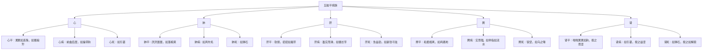

# 素问-平人气象论篇第十八

> "黄帝曰：平人何如？岐伯曰：人一呼脉再动，一吸脉亦再动，呼吸定息脉五动，闰以太息，命曰平人。" - 岐伯

---

## 📜 原文（节选）/ Original Text (Excerpt)

黄帝曰：平人何如？

岐伯曰：人一呼脉再动，一吸脉亦再动，呼吸定息脉五动，闰以太息，命曰平人。平人者，不病也。常以不病调病人，医不病，故为病人平息以调之为法。

人一呼脉一动，一吸脉一动，曰少气。人一呼脉三动，一吸脉三动而躁，尺热，曰病温；尺不热，脉滑，曰病风；脉涩，曰痹。人一呼脉四动以上，曰死；脉绝不至，曰死；乍疏乍数，曰死。

人一呼脉再动，一吸脉再动，曰平人。平人无太过，无不及。一呼脉三动，一吸脉三动，曰太过；一呼脉一动，一吸脉一动，曰不及。

脉来累累如连珠，如循琅玕，曰心平。夏以胃气为本。脉来喘喘累累如钩，曰心平。脉来前曲后居，如操带钩，曰心病。脉来如引葛，曰死。

脉来厌厌聂聂，如落榆荚，曰肺平。秋以胃气为本。脉来不上不下，如循鸡羽，曰肺平。脉来如风吹毛，曰肺病。脉来如弹石，曰死。

脉来软弱，招招如揭竿，曰肝平。春以胃气为本。脉来盈实而滑，如循长竿，曰肝病。脉来急益劲，如新张弓弦，曰死。

脉来和柔相离，如鸡践地，曰脾平。长夏以胃气为本。脉来实而强，如举指如流水，曰脾病。脉来锐坚，如乌之喙，如鸟之距，如屋之漏，如水之流，曰死。

脉来喘喘累累如钩，按之而坚，曰肾平。冬以胃气为本。脉来如引葛，按之益坚，曰肾病。脉来如弹石，按之如解索，曰死。

---

## 📖 白话文翻译（节选）/ Modern Chinese Translation (Excerpt)

黄帝问道：正常人（平人）的脉象是什么样的？

岐伯说：人呼气一次脉搏跳动两次，吸气一次脉搏跳动两次，呼吸定息脉搏跳动五次，加上长呼吸，叫做平人。平人，就是没有病的人。经常用没有病的人来调节病人，医生没有病，所以为病人平息以调节作为法则。

人呼气一次脉搏跳动一次，吸气一次脉搏跳动一次，叫做少气。人呼气一次脉搏跳动三次，吸气一次脉搏跳动三次而且躁动，尺部发热，叫做病温；尺部不发热，脉象滑，叫做病风；脉象涩，叫做痹。人呼气一次脉搏跳动四次以上，叫做死；脉象断绝不到，叫做死；脉象忽疏忽数，叫做死。

人呼气一次脉搏跳动两次，吸气一次脉搏跳动两次，叫做平人。平人没有太过，没有不及。呼气一次脉搏跳动三次，吸气一次脉搏跳动三次，叫做太过；呼气一次脉搏跳动一次，吸气一次脉搏跳动一次，叫做不及。

脉来累累如连珠，如循琅玕，叫做心平。夏季以胃气为本。脉来喘喘累累如钩，叫做心平。脉来前曲后居，如操带钩，叫做心病。脉来如引葛，叫做死。

脉来厌厌聂聂，如落榆荚，叫做肺平。秋季以胃气为本。脉来不上不下，如循鸡羽，叫做肺平。脉来如风吹毛，叫做肺病。脉来如弹石，叫做死。

脉来软弱，招招如揭竿，叫做肝平。春季以胃气为本。脉来盈实而滑，如循长竿，叫做肝病。脉来急益劲，如新张弓弦，叫做死。

脉来和柔相离，如鸡践地，叫做脾平。长夏以胃气为本。脉来实而强，如举指如流水，叫做脾病。脉来锐坚，如乌之喙，如鸟之距，如屋之漏，如水之流，叫做死。

脉来喘喘累累如钩，按之而坚，叫做肾平。冬季以胃气为本。脉来如引葛，按之益坚，叫做肾病。脉来如弹石，按之如解索，叫做死。

---

## 🔑 核心要点 / Core Concepts

### 1. 平人脉象 / Normal Pulse

| 呼吸 | 脉动次数 | 脉象特征 |
|------|----------|----------|
| 一呼 | 再动 | 两次 |
| 一吸 | 再动 | 两次 |
| 呼吸定息 | 五动 | 五次 |
| 闰以太息 | 变化 | 加长呼吸 |

### 2. 异常脉象与疾病 / Abnormal Pulse and Diseases

| 脉动次数 | 脉象特征 | 病名 | 预后 |
|----------|----------|------|------|
| 呼一吸一 | 脉一动 | 少气 | - |
| 呼三吸三 | 脉三动躁 | 尺热：病温 | - |
| 呼三吸三 | 脉滑 | 尺不热：病风 | - |
| 呼三吸三 | 脉涩 | - | 痹 |
| 呼四以上 | 四动以上 | - | 死 |
| 脉绝不至 | 脉断绝 | - | 死 |
| 乍疏乍数 | 脉不匀 | - | 死 |

### 3. 五脏平病脉 / Five Zang Normal and Sick Pulse

---

## 📚 理论解释 / Theoretical Analysis

### 平人气象理论 / Normal Person Qi Theory

> [!info] 核心概念
- 平人脉象的标准
- 异常脉象的诊断
- 五脏平病脉的区别

#### 平人脉象标准 / Normal Pulse Standard

**1. 呼吸与脉动 / Breathing and Pulse Beat**
- 一呼脉再动：呼气一次脉搏跳动两次
- 一吸脉再动：吸气一次脉搏跳动两次
- 呼吸定息脉五动：呼吸定息脉搏跳动五次
- 闰以太息：加上长呼吸

**2. 平人脉象特点 / Normal Pulse Characteristics**
- 无太过：没有过多
- 无不及：没有不足
- 平和调和：脉象平和调和

#### 异常脉象诊断 / Abnormal Pulse Diagnosis

**1. 少气 / Less Qi**
- 脉动次数：呼一吸一
- 脉象特征：脉搏跳动次数少
- 病机：气机不足

**2. 病温 / Wen Disease**
- 脉动次数：呼三吸三
- 脉象特征：脉三动躁，尺热
- 病机：温热病

**3. 病风 / Wind Disease**
- 脉动次数：呼三吸三
- 脉象特征：脉滑，尺不热
- 病机：风邪致病

**4. 痹 / Bi Disease**
- 脉动次数：呼三吸三
- 脉象特征：脉涩
- 病机：痹证

**5. 死脉 / Death Pulse**
- 脉动次数：呼四以上
- 脉象特征：脉四动以上、脉绝不至、乍疏乍数
- 病机：死候

### 五脏平病脉理论 / Five Zang Normal and Sick Pulse Theory

> [!warning] 核心理念
- 五脏各有平脉、病脉、死脉
- 平脉柔和有胃气
- 病脉失去胃气
- 死脉真脏脉见

#### 五脏平脉 / Five Zang Normal Pulse

**1. 心平 / Heart Normal Pulse**
- 脉象：累累如连珠，如循琅玕
- 季节：夏以胃气为本
- 特征：脉象圆润，如连珠如琅玕

**2. 肺平 / Lung Normal Pulse**
- 脉象：厌厌聂聂，如落榆荚
- 季节：秋以胃气为本
- 特征：脉象柔和，如落榆荚

**3. 肝平 / Liver Normal Pulse**
- 脉象：软弱，招招如揭竿
- 季节：春以胃气为本
- 特征：脉象软弱，如揭竿

**4. 脾平 / Spleen Normal Pulse**
- 脉象：和柔相离，如鸡践地
- 季节：长夏以胃气为本
- 特征：脉象和柔，如鸡践地

**5. 肾平 / Kidney Normal Pulse**
- 脉象：喘喘累累如钩，按之而坚
- 季节：冬以胃气为本
- 特征：脉象如钩，按之坚

#### 五脏病脉 / Five Zang Sick Pulse

**1. 心病 / Heart Sick Pulse**
- 脉象：前曲后居，如操带钩
- 特征：脉象失去胃气，如操带钩

**2. 肺病 / Lung Sick Pulse**
- 脉象：如风吹毛
- 特征：脉象失去胃气，如风吹毛

**3. 肝病 / Liver Sick Pulse**
- 脉象：盈实而滑，如循长竿
- 特征：脉象失去胃气，如循长竿

**4. 脾病 / Spleen Sick Pulse**
- 脉象：实而强，如举指如流水
- 特征：脉象失去胃气，如举指如流水

**5. 肾病 / Kidney Sick Pulse**
- 脉象：如引葛，按之益坚
- 特征：脉象失去胃气，如引葛

#### 五脏死脉 / Five Zang Death Pulse

**1. 心死 / Heart Death Pulse**
- 脉象：如引葛
- 特征：真脏脉见，如引葛

**2. 肺死 / Lung Death Pulse**
- 脉象：如弹石
- 特征：真脏脉见，如弹石

**3. 肝死 / Liver Death Pulse**
- 脉象：急益劲，如新张弓弦
- 特征：真脏脉见，如新张弓弦

**4. 脾死 / Spleen Death Pulse**
- 脉象：锐坚，如乌之喙，如鸟之距，如屋之漏，如水之流
- 特征：真脏脉见，如乌之喙

**5. 肾死 / Kidney Death Pulse**
- 脉象：如弹石，按之如解索
- 特征：真脏脉见，如弹石

---

## 🏥 中医实践应用 / TCM Practice Application

### 脉诊应用 / Pulse Diagnosis Application

#### 现代脉诊要点 / Modern Pulse Diagnosis Key Points

**1. 平人脉象标准 / Normal Pulse Standard**
- 一呼脉再动，一吸脉再动
- 呼吸定息脉五动
- 脉象平和调和

**2. 异常脉象诊断 / Abnormal Pulse Diagnosis**
- 呼一吸一：少气
- 呼三吸三躁：病温
- 呼三吸三滑：病风
- 呼三吸三涩：痹
- 呼四以上：死

**3. 五脏平病脉诊断 / Five Zang Normal and Sick Pulse Diagnosis**
- 心平：累累如连珠，如循琅玕
- 肺平：厌厌聂聂，如落榆荚
- 肝平：软弱，招招如揭竿
- 脾平：和柔相离，如鸡践地
- 肾平：喘喘累累如钩，按之而坚

### 现代医学启示 / Modern Medical Insights

**1. 脉搏频率 / Pulse Frequency**
- 正常脉搏频率：每分钟60-100次
- 呼吸与脉搏比例：1:4（呼吸一次脉搏跳动四次）
- 异常脉搏：过快、过慢、不均匀

**2. 脉搏强弱 / Pulse Strength**
- 正常脉搏：有力而柔和
- 异常脉搏：过强、过弱
- 脉搏均匀度：均匀或不均匀

---

## 🔗 相关链接 / Related Links

- [[MOC-黄帝内经知识库]] - 主索引
- [[黄帝内经-素问索引]] - 素问索引
- [[黄帝内经-核心理论]] - 核心理论体系
- [[素问-脉要精微论篇第十七]] - 脉象精微
- [[素问-玉机真脏论篇第十九]] - 真脏脉

### 易学关联 / Yi Jing Connection

- [[MOC-易经知识库]] - 易经索引
- [[20260201-0002 五行]] - 五行理论

**易学与平人气象的联系:**
- 五行对应：易学的五行理论与中医五脏脉象相通
- 阴阳调和：易学的阴阳理论与中医平人脉象相通

---

## 💡 学习要点 / Learning Points

### 掌握重点 / Key Points to Master

- [ ] 理解平人脉象的标准
- [ ] 掌握异常脉象与疾病的关系
- [ ] 学会辨别五脏平病脉
- [ ] 了解死脉的特征

### 思考问题 / Questions for Reflection

1. **为什么说"平人者，不病也"？**
   - 平人脉象调和，气血流通
   - 无太过，无不及
   - 阴阳平衡，气血调和

2. **现代医学如何应用"平人气象"？**
   - 正常脉搏标准：每分钟60-100次
   - 脉搏均匀度：均匀不均匀
   - 脉搏强弱：有力柔和

---

## 📊 学习进度 / Learning Progress

### 完成情况 / Completion Status

| 学习内容 | 状态 | 备注 |
|---------|------|------|
| 原文诵读 | 📝 进行中 | 建议每日诵读 |
| 白话文理解 | ✅ 已完成 | 理解主要含义 |
| 平人脉象 | ✅ 已完成 | 掌握标准 |
| 五脏脉象 | 📝 进行中 | 需要临床实践 |
| 理论分析 | ✅ 已完成 | 理解脉象理论 |

---

## 🔄 更新日志 / Update Log

### 2026-02-03

- ✅ 创建平人气象论篇第十八笔记
- ✅ 完成原文、白话文翻译（节选）
- ✅ 整理平人脉象和异常脉象对照表
- ✅ 编写五脏平病脉理论

---

**笔记创建日期**：2026年2月3日

**最后更新**：2026年2月3日
