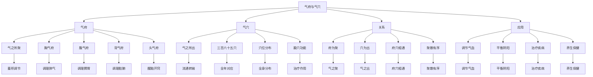

# 素问-气府论篇第五十九

> "黄帝问曰：愿闻气府。岐伯曰：气府者，气之所聚也。" - 岐伯

---

## 📜 原文（节选）/ Original Text (Excerpt)

黄帝问曰：愿闻气府。

岐伯曰：气府者，气之所聚也。气穴者，气之所出也。

帝曰：其府何如？

岐伯曰：胸气府、腹气府、背气府、头气府，各有其府。

---

## 📖 白话文翻译（节选）/ Modern Chinese Translation (Excerpt)

黄帝问道：我愿意听到气府的理论。

岐伯回答说：气府，是气聚集的地方。气穴，是气流出的地方。

黄帝说：它的府如何？

岐伯说：胸气府、腹气府、背气府、头气府，各有其府。

---

## 🔍 英文释义 / English Interpretation

Yellow Emperor asked: I would like to hear the theory of qi mansions.

Qibo replied: Qi mansions are places where qi gathers. Qi points are places where qi flows out.

Yellow Emperor said: What about the mansions?

Qibo said: The chest qi mansion, abdomen qi mansion, back qi mansion, and head qi mansion each have their own mansions.

---

## 🔑 核心要点 / Core Concepts

### 1. 气府概念 / Qi Mansion Concept

| 概念 | 说明 | 作用 | 临床意义 |
|------|------|------|---------|
| 气府 | 气聚集之处 | 蓄积调节 | 气血调节 |
| 气穴 | 气流出之处 | 流通转输 | 针刺治疗 |
| 气聚 | 气聚集 | 蓄积 | 调节气机 |
| 气出 | 气流出 | 输布 | 通行气血 |

### 2. 四气府 / Four Qi Mansions

| 气府 | 位置 | 主要穴位 | 作用 |
|------|------|---------|------|
| 胸气府 | 胸部 | 膻中、中府等 | 调理肺气、宽胸理气 |
| 腹气府 | 腹部 | 中脘、气海、关元等 | 调理脾胃、培补元气 |
| 背气府 | 背部 | 肺俞、心俞、肾俞等 | 调理脏腑、温阳益气 |
| 头气府 | 头部 | 百会、印堂、太阳等 | 醒脑开窍、安神定志 |

### 3. 气府与气穴 / Qi Mansions and Qi Points

---

## 📚 理论解释 / Theoretical Analysis

### 气府理论 / Qi Mansion Theory

> [!info] 核心概念
- 气府者，气之所聚也
- 气穴者，气之所出也
- 各有其府

#### 气府详解 / Detailed Qi Mansions

**1. 气府定义 / Qi Mansion Definition**
- **概念**：气聚集的地方
- **特点**：是气蓄积、调节的场所
- **本质**：气府是气血运行的枢纽
- **意义**：调节气血、平衡阴阳的关键

**2. 气府与气穴 / Qi Mansions and Qi Points**
- **气府**：气之所聚，气聚集的地方
- **气穴**：气之所出，气流出的地方
- **关系**：气府是气穴的上游，气穴是气府的下游
- **作用**：气府蓄积调节，气穴流通转输

**3. 四气府 / Four Qi Mansions**
- **胸气府**：胸部的气府，调理肺气
- **腹气府**：腹部的气府，调理脾胃
- **背气府**：背部的气府，调理脏腑
- **头气府**：头部的气府，醒脑开窍

### 气聚与气出 / Qi Gathering and Qi Exiting

> [!warning] 核心理念
- 聚散有序
- 出入有常
- 调节平衡

#### 气聚与气出详解 / Detailed Qi Gathering and Qi Exiting

**1. 气聚 / Qi Gathering**
- **聚于气府**：气聚集在气府
- **蓄积调节**：蓄积调节气血
- **平衡阴阳**：平衡阴阳气血
- **维持生命**：维持生命活动

**2. 气出 / Qi Exiting**
- **出于气穴**：气从气穴流出
- **流通转输**：流通转输气血
- **营养全身**：营养全身组织
- **排泄废物**：排泄代谢废物

**3. 聚散有序 / Orderly Gathering and Dispersing**
- **聚散有序**：气聚气散有序
- **出入有常**：气出气入有常
- **调节平衡**：调节气血平衡
- **维持健康**：维持身体健康

---

## 🏥 中医实践应用 / TCM Practice Application

### 气府治疗 / Qi Mansion Treatment

#### 现代气府治疗应用 / Modern Qi Mansion Treatment Application

**1. 胸气府治疗 / Chest Qi Mansion Treatment**
- 主要穴位：膻中、中府、云门
- 治疗方法：针刺、艾灸、按摩
- 适应症：咳嗽、气喘、胸痛
- 疗效：调理肺气，宽胸理气

**2. 腹气府治疗 / Abdomen Qi Mansion Treatment**
- 主要穴位：中脘、气海、关元
- 治疗方法：针刺、艾灸、按摩
- 适应症：腹胀、腹泻、消化不良
- 疗效：调理脾胃，培补元气

**3. 背气府治疗 / Back Qi Mansion Treatment**
- 主要穴位：肺俞、心俞、肾俞
- 治疗方法：针刺、艾灸、拔罐
- 适应症：咳嗽、心悸、腰痛
- 疗效：调理脏腑，温阳益气

**4. 头气府治疗 / Head Qi Mansion Treatment**
- 主要穴位：百会、印堂、太阳
- 治疗方法：针刺、艾灸、按摩
- 适应症：头痛、失眠、眩晕
- 疗效：醒脑开窍，安神定志

### 现代医学对应 / Modern Medicine Correspondence

| 中医概念 | 现代解剖 | 临床应用 |
|---------|---------|---------|
| 气府 | 神经节、血管丛 | 神经调节 |
| 胸气府 | 胸腔神经 | 胸腔疾病 |
| 腹气府 | 腹腔神经 | 腹腔疾病 |
| 背气府 | 脊柱神经 | 脊柱疾病 |
| 头气府 | 头部神经 | 头部疾病 |

---

## 🔗 相关链接 / Related Links

- [[MOC-黄帝内经知识库]] - 主索引
- [[黄帝内经-素问索引]] - 索引
- [[黄帝内经-核心理论]] - 核心理论体系
- [[素问-气穴论篇第五十八]] - 气穴论
- [[素问-骨空论篇第六十]] - 骨空论
- [[灵枢-经脉第十]] - 经脉篇

### 易学关联 / Yi Jing Connection

- [[MOC-易经知识库]] - 易经索引
- [[20260201-0002 五行]] - 五行理论

**易学与气府的联系:**
- 聚散有序：易学的聚散观念与气府理论相通
- 天人相应：易学的天人相应观与气府分布相通

---

## 💡 学习要点 / Learning Points

### 掌握重点 / Key Points to Master

- [ ] 理解气府的概念和作用
- [ ] 掌握四气府的分布和功能
- [ ] 学会气府的治疗方法
- [ ] 了解气府的理论依据

### 思考问题 / Questions for Reflection

1. **为什么说"气府者，气之所聚也"？**
   - 气之所聚：气聚集在气府
   - 蓄积调节：蓄积调节气血
   - 维持生命：维持生命活动

2. **现代医学如何应用"气府论"？**
   - 神经调节：基于现代神经生理学
   - 区域治疗：区域神经调节
   - 综合治疗：针刺、艾灸、按摩

---

## 📊 学习进度 / Learning Progress

### 完成情况 / Completion Status

| 学习内容 | 状态 | 备注 |
|---------|------|------|
| 原文诵读 | 📝 进行中 | 建议每日诵读 |
| 白话文理解 | ✅ 已完成 | 理解主要含义 |
| 气府理论 | ✅ 已完成 | 掌握理论 |
| 四气府 | 📝 进行中 | 需要记忆 |
| 理论分析 | ✅ 已完成 | 理解理论 |

---

## 🔄 更新日志 / Update Log

### 2026-02-03

- ✅ 创建气府论篇第五十九笔记
- ✅ 完成原文、白话文翻译（节选）
- 整理气府概念和四气府对照表
- ✅ 编写气府和聚散理论

---

**笔记创建日期**：2026年2月3日

**最后更新**：2026年2月3日
