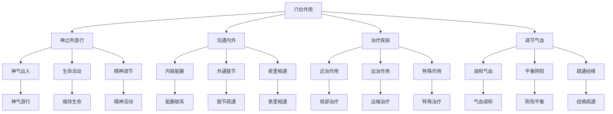

# 素问-气穴论篇第五十八

> "黄帝问曰：愿闻气穴。岐伯曰：气穴者，神之所游行出入也。" - 岐伯

---

## 📜 原文（节选）/ Original Text (Excerpt)

黄帝问曰：愿闻气穴。

岐伯曰：气穴者，神之所游行出入也。非皮肉筋骨也。

帝曰：其穴何如？

岐伯曰：穴有三百六十五，以应一岁。

---

## 📖 白话文翻译（节选）/ Modern Chinese Translation (Excerpt)

黄帝问道：我愿意听到气穴的理论。

岐伯回答说：气穴，是神气游行出入的地方。不是皮肉筋骨的孔窍。

黄帝说：它的穴位如何？

岐伯说：穴位有三百六十五个，对应一年的天数。

---

## 🔍 英文释义 / English Interpretation

Yellow Emperor asked: I would like to hear the theory of qi points.

Qibo replied: Qi points are places where spirit qi moves and enters and exits. They are not the holes of skin, flesh, tendons, and bones.

Yellow Emperor said: What about the points?

Qibo said: There are 365 points, corresponding to the days of a year.

---

## 🔑 核心要点 / Core Concepts

### 1. 气穴概念 / Qi Point Concept

| 概念 | 说明 | 作用 | 临床意义 |
|------|------|------|---------|
| 气穴 | 神气游行出入处 | 沟通内外 | 针刺治疗 |
| 神气 | 生命活动之气 | 维持生命 | 生命基础 |
| 穴位 | 气穴的定位点 | 治疗部位 | 针刺取穴 |

### 2. 穴位分类 / Acupoint Classification

| 分类 | 数量 | 特点 | 作用 |
|------|------|------|------|
| 十四经穴 | 361个 | 分布于十四经脉 | 主治相关病症 |
| 奇穴 | 若干 | 经外奇穴 | 特殊治疗作用 |
| 阿是穴 | 不定 | 压痛反应点 | 局部止痛 |
| 经验穴 | 若干 | 临床经验总结 | 特殊治疗 |

### 3. 穴位作用 / Acupoint Functions

---

## 📚 理论解释 / Theoretical Analysis

### 气穴理论 / Qi Point Theory

> [!info] 核心概念
- 气穴者，神之所游行出入也
- 非皮肉筋骨也
- 穴有三百六十五，以应一岁

#### 气穴详解 / Detailed Qi Points

**1. 气穴定义 / Qi Point Definition**
- **概念**：神气游行出入的地方
- **特点**：不是皮肉筋骨的孔窍
- **本质**：神气聚集、转输、出入的场所
- **意义**：治疗疾病、调节气血的关键

**2. 神气游行 / Spirit Qi Movement**
- **神气**：生命活动之气，精神活动
- **游行**：在经络中游行流动
- **出入**：在穴位处出入转输
- **作用**：维持生命，调节功能

**3. 三百六十五穴 / 365 Points**
- **数量**：365个穴位
- **对应**：对应一年的天数
- **分布**：分布于全身各部
- **规律**：有规律的分布

### 穴位理论 / Acupoint Theory

> [!warning] 核心理念
- 穴有定处
- 穴有定性
- 穴有定用

#### 穴位理论详解 / Detailed Acupoint Theory

**1. 穴位定位 / Acupoint Location**
- **定位标准**：骨度分寸、指寸定位
- **定位方法**：解剖标志、骨度分寸
- **定位准确**：定位准确才能取穴准确
- **定位意义**：定位准确是治疗效果的基础

**2. 穴位特性 / Acupoint Characteristics**
- **近治作用**：治疗局部及邻近病症
- **远治作用**：治疗远端病症
- **特殊作用**：某些穴位有特殊治疗作用
- **双向调节**：某些穴位有双向调节作用

**3. 穴位分类 / Acupoint Classification**
- **十四经穴**：分布于十四经脉
- **奇穴**：经外奇穴，有特殊作用
- **阿是穴**：压痛点，不定位置
- **经验穴**：临床经验总结

---

## 🏥 中医实践应用 / TCM Practice Application

### 穴位治疗 / Acupoint Treatment

#### 现代穴位治疗应用 / Modern Acupoint Treatment Application

**1. 穴位针刺 / Acupoint Needling**
- **取穴原则**：循经取穴、近端取穴、远端取穴
- **针刺方法**：直刺、斜刺、平刺、透刺
- **刺激强度**：轻刺激、中刺激、强刺激
- **治疗作用**：疏通经络、调和气血

**2. 穴位艾灸 / Acupoint Moxibustion**
- **艾灸方法**：直接灸、间接灸、温针灸
- **艾灸时间**：根据病情确定
- **艾灸作用**：温通经络、散寒止痛
- **适应症**：虚证、寒证、慢性病

**3. 穴位按摩 / Acupoint Massage**
- **按摩方法**：点按、揉、推、拿
- **按摩时间**：每次5-15分钟
- **按摩作用**：疏通经络、调和气血
- **适应症**：各类病症

**4. 穴位贴敷 / Acupoint Application**
- **贴敷方法**：药物贴敷穴位
- **贴敷时间**：根据病情确定
- **贴敷作用**：药物刺激穴位
- **适应症**：慢性病、内科病

### 现代医学对应 / Modern Medicine Correspondence

| 中医概念 | 现代解剖 | 临床应用 |
|---------|---------|---------|
| 气穴 | 神经末梢、血管 | 针刺、艾灸 |
| 神气 | 神经冲动 | 神经调节 |
| 穴位 | 刺激点 | 穴位注射、埋线 |

---

## 🔗 相关链接 / Related Links

- [[MOC-黄帝内经知识库]] - 主索引
- [[黄帝内经-素问索引]] - 索引
- [[黄帝内经-核心理论]] - 核心理论体系
- [[素问-经络论篇第五十七]] - 经络论
- [[素问-气府论篇第五十九]] - 气府论
- [[灵枢-经脉第十]] - 经脉篇

### 易学关联 / Yi Jing Connection

- [[MOC-易经知识库]] - 易经索引
- [[20260201-0002 五行]] - 五行理论

**易学与气穴的联系:**
- 神气游行：易学的气化理论与神气游行相通
- 天人相应：易学的天人相应观与穴位分布相通

---

## 💡 学习要点 / Learning Points

### 掌握重点 / Key Points to Master

- [ ] 理解气穴的概念和作用
- [ ] 掌握穴位的分类和定位
- [ ] 学会穴位的治疗方法
- [ ] 了解气穴的理论依据

### 思考问题 / Questions for Reflection

1. **为什么说"气穴者，神之所游行出入也"？**
   - 神气游行：神气在经络中游行流动
   - 出入转输：神气在穴位处出入转输
   - 生命基础：神气是生命活动的基础

2. **现代医学如何应用"气穴论"？**
   - 神经刺激：基于现代神经生理学
   - 穴位刺激：穴位注射、埋线、贴敷
   - 综合治疗：针刺、艾灸、按摩

---

## 📊 学习进度 / Learning Progress

### 完成情况 / Completion Status

| 学习内容 | 状态 | 备注 |
|---------|------|------|
| 原文诵读 | 📝 进行中 | 建议每日诵读 |
| 白话文理解 | ✅ 已完成 | 理解主要含义 |
| 气穴理论 | ✅ 已完成 | 掌握理论 |
| 穴位分类 | 📝 进行中 | 需要记忆 |
| 理论分析 | ✅ 已完成 | 理解理论 |

---

## 🔄 更新日志 / Update Log

### 2026-02-03

- ✅ 创建气穴论篇第五十八笔记
- ✅ 完成原文、白话文翻译（节选）
- 整理气穴概念和穴位分类对照表
- ✅ 编写气穴和穴位理论

---

**笔记创建日期**：2026年2月3日

**最后更新**：2026年2月3日
