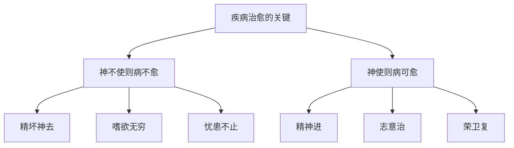

# 素问-汤液醪醴论篇第十四

> "针石治其外，汤液治其内。" - 黄帝

---

## 📜 原文（节选）/ Original Text (Excerpt)

黄帝问曰：为五谷汤液及醪醴奈何？

岐伯对曰：必以稻米，炊之稻薪。稻米者完，稻薪者坚。

帝曰：何以然？

岐伯曰：此得天地之和，高下之宜，故能至完。伐取得时，故能至坚也。

帝曰：上古圣人作汤液醪醴，为而不用何也？

岐伯曰：自古圣人之作汤液醪醴者，以为备耳，夫上古作汤液，故为而弗服也。中古之世，道德稍衰，邪气时至，服之万全。当今之世，必齐毒药攻其中，镵石针艾治其外，其形乃尽，其神独存，而后可以已。

帝曰：形弊血尽而功不立者何？

岐伯曰：神不使也。

帝曰：何谓神不使？

岐伯曰：针石，道也。精神不进，志意不治，故病不可愈。今精坏神去，荣卫不可复收，何者？嗜欲无穷，而忧患不止，精气弛坏，荣泣卫除，故神去之而病不愈也。

帝曰：夫病之始生也，极微极精，必先入结于皮肤。今良工皆称曰病成，名曰逆，则针石不能治，良药不能及也。今良工皆得其法，守其数，亲戚兄弟远近音声日闻于耳，五色日见于目，而病不愈者，亦何暇不早乎？

岐伯曰：病为本，工为标，标本不得，神不使，病之不愈，其本在神。且夫良工之治病也，亦治其神而已矣。

---

## 📖 白话文翻译（节选）/ Modern Chinese Translation (Excerpt)

黄帝问道：制作五谷汤液和醪醴应该怎样做？

岐伯回答说：一定要用稻米，用稻草做燃料。稻米之气完备，稻草之气坚劲。

黄帝说：为什么呢？

岐伯说：这是因为稻米得到了天地的调和、高下的适宜，所以能够完备。稻米在适当的时候收割，稻草在适当的时候采集，所以能够坚劲。

黄帝说：上古圣人制作汤液和醪醴，制作了却不用，为什么？

岐伯说：自古圣人制作汤液醪醴，是作为备用罢了。上古时代制作汤液，所以制作了却不服用。中古时代，道德稍微衰落，邪气时常到来，服用它就能万全。现在这个时代，必须用毒药攻治内脏，用针石艾灸治疗外表，形体毁坏，只有精神尚存，然后才可以治愈。

黄帝说：形体毁坏，血气耗尽，治疗功效不显著，为什么？

岐伯说：是精神不发挥作用了。

黄帝说：什么是精神不发挥作用？

岐伯说：针石治疗，是医道。精神不进，志意不治，所以疾病不能治愈。现在精气毁坏，精神离去，营卫之气不能再恢复，为什么？因为嗜欲无穷，忧患不止，精气松懈毁坏，营气凝涩，卫气消除，所以精神离去而疾病不能治愈。

黄帝说：疾病开始发生时，极其微细，一定先进入结聚在皮肤。现在良医都说疾病已成，称为逆证，那么针石不能治疗，良药也不能达到。现在良医都掌握了方法，遵守了法度，亲戚兄弟远近的声音每天听到，五色每天看到，而疾病不能治愈，也是没有早点治疗的缘故吗？

岐伯说：疾病是根本，医生是枝节，根本和枝节不能配合，精神不发挥作用，疾病不能治愈，根本在于精神。况且良医治病，也是治疗精神罢了。

---

## 🔑 核心要点 / Core Concepts

### 1. 汤液醪醴的制作 / Preparation of Decoctions and Medicinal Wines

| 要素 | 要求 | 原因 |
|------|------|------|
| 谷物 | 稻米 | 得天地之和，高下之宜，至完 |
| 燃料 | 稻薪 | 伐取得时，至坚 |
| 特点 | 完备坚劲 | 天地调和，时令得当 |

### 2. 不同时代的治疗变化 / Treatment Changes in Different Eras

| 时代 | 道德水平 | 疾病特点 | 治疗方法 | 效果 |
|------|----------|----------|----------|------|
| 上古 | 道德淳厚 | 邪气不至 | 汤液醪醴备用 | 为而不用 |
| 中古 | 道德稍衰 | 邪气时至 | 服用汤液醪醴 | 万全 |
| 当今 | 道德衰落 | 形弊血尽 | 齐毒药攻中，镵石针艾治外 | 形尽神存可愈 |

### 3. 治病求本，本在神 / Treating the Root, Root Lies in Spirit

---

## 📚 理论解释 / Theoretical Analysis

### 汤液醪醴理论 / Decoction and Medicinal Wine Theory

> [!info] 核心概念
> 汤液醪醴是中药制剂的早期形式，具有独特的制作方法和治疗作用。

#### 汤液与醪醴的区别 / Difference Between Decoction and Medicinal Wine

**汤液 / Decoction:**
- 煎煮汤药
- 水煎服用
- 清热解毒，调理气血

**醪醴 / Medicinal Wine:**
- 酒精浸泡
- 发酵制剂
- 温通血脉，祛寒除湿

#### 制作原理 / Preparation Principle

**1. 稻米的作用 / Role of Rice**
- 得天地之和：天地调和，营养丰富
- 高下之宜：生长环境适宜
- 至完：气味完备，品质优良

**2. 稻薪的作用 / Role of Rice Straw**
- 伐取得时：适时采集
- 至坚：火力坚劲，煎煮充分

**3. 天人相应 / Correspondence between Man and Nature**
- 遵循自然规律
- 适时采集制作
- 保证药效完整

### 治病求本理论 / Treating Root Disease Theory

> [!warning] 核心理念
- 疾病为本，医生为标
- 治病必须治神
- 神不使则病不愈

#### 神的作用 / Role of Spirit

**1. 精神与疾病 / Spirit and Disease**
- 精神不进，志意不治：疾病不能治愈
- 精坏神去，荣卫不可复收：疾病深入难愈
- 嗜欲无穷，忧患不止：精神耗散，疾病加重

**2. 治神的方法 / Methods to Treat Spirit**
- 移精变气：转移精神，变换气机
- 说理开导：讲道理，解心结
- 顺情从欲：顺从意愿，情志舒畅
- 导引按蹻：调理气血，安神定志

**3. 病为本，工为标 / Disease as Root, Doctor as Branch**
- 医生必须了解疾病的根本
- 治病不能只治标，要治本
- 本在神，治病必须治神

---

## 🏥 中医实践应用 / TCM Practice Application

### 现代中药制剂 / Modern TCM Preparations

#### 中药制剂分类 / Classification of TCM Preparations

| 类别 | 特点 | 适应症 | 制作方法 |
|------|------|----------|----------|
| 汤剂 | 水煎服用 | 急症、重症 | 药材煎煮 |
| 酒剂 | 酒精浸泡 | 虚寒、血瘀 | 药材酒浸 |
| 丸剂 | 粉碎制丸 | 慢性病 | 药材粉碎，制丸 |
| 散剂 | 粉碎成散 | 外敷、内服 | 药材粉碎 |
| 膏剂 | 熬制成膏 | 慢性病、调养 | 药材熬制 |

### 治神疗法 / Spirit Treatment Therapy

#### 现代治神方法 / Modern Spirit Treatment Methods

**1. 心理治疗 / Psychotherapy**
- 认知行为疗法：改变认知，改善行为
- 放松训练：放松身心，缓解压力
- 音乐疗法：音乐调畅情志

**2. 生活方式调整 / Lifestyle Adjustment**
- 饮食调养：节制嗜欲，合理饮食
- 起居有常：按时作息，规律生活
- 运动锻炼：适度运动，强健体魄

**3. 信仰疗法 / Faith Therapy**
- 积极暗示：建立信心，激发潜能
- 精神寄托：信仰支撑，精神支柱
- 冥想静坐：静心凝神，调和气血

---

## 🔗 相关链接 / Related Links

- [[MOC-黄帝内经知识库]] - 主索引
- [[黄帝内经-素问索引]] - 素问索引
- [[黄帝内经-核心理论]] - 核心理论体系
- [[素问-移精变气论篇第十三]] - 移精变气
- [[素问-玉版论要篇第十五]] - 诊脉色脉相参

### 现代医学关联 / Modern Medicine Connection

- [[MOC-现代医学知识库]] - 现代医学索引
- [[20260201-0001 药理学]] - 药理学理论

**现代医学与汤液醪醴的联系:**
- 药物制剂：中药制剂与现代药物制剂相通
- 心理治疗：治神与现代心理治疗相通

---

## 💡 学习要点 / Learning Points

### 掌握重点 / Key Points to Master

- [ ] 理解汤液醪醴的制作原理
- [ ] 掌握不同时代的治疗变化
- [ ] 理解治病求本、本在神的理念
- [ ] 学会运用治神疗法

### 思考问题 / Questions for Reflection

1. **为什么说"病为本，工为标"？**
   - 疾病是根本，医生是帮助者
   - 医生必须了解疾病的本质
   - 治病不能只治标，要治本

2. **现代医学如何体现"治神"？**
   - 心理治疗的重要性
   - 医患关系的建立
   - 患者信念的作用

---

## 📊 学习进度 / Learning Progress

### 完成情况 / Completion Status

| 学习内容 | 状态 | 备注 |
|---------|------|------|
| 原文诵读 | 📝 进行中 | 建议每日诵读 |
| 白话文理解 | ✅ 已完成 | 理解主要含义 |
| 汤液醪醴 | ✅ 已完成 | 掌握制作原理 |
| 治神疗法 | 📝 进行中 | 需要实践体会 |
| 理论分析 | ✅ 已完成 | 理解治病求本 |

---

## 🔄 更新日志 / Update Log

### 2026-02-03

- ✅ 创建汤液醪醴论篇第十四笔记
- ✅ 完成原文、白话文翻译（节选）
- ✅ 整理不同时代的治疗变化对照表
- ✅ 编写汤液醪醴和治神理论

---

**笔记创建日期**：2026年2月3日

**最后更新**：2026年2月3日
