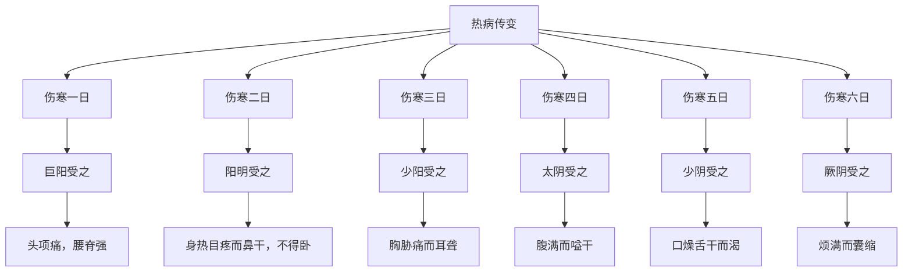

# 素问-热论篇第三十一

> "黄帝问曰：今夫热病者，皆伤寒之类也。或愈，或死，其死皆以六七日之间，其愈皆以十日以上者，何也？" - 黄帝

---

## 📜 原文（节选）/ Original Text (Excerpt)

黄帝问曰：今夫热病者，皆伤寒之类也。或愈，或死，其死皆以六七日之间，其愈皆以十日以上者，何也？

岐伯对曰：巨阳者，诸阳之属也。其脉连于风府，故为诸阳主气也。人之伤于寒也，则为病热，热虽甚不死。其两感于寒而病者，必不免于死。

帝曰：愿闻其状。

岐伯曰：伤寒一日，巨阳受之，故头项痛，腰脊强。二日阳明受之，故身热目疼而鼻干，不得卧也。三日少阳受之，故胸胁痛而耳聋。三阳经络皆受其病，而未入于脏者，故可汗而已。四日太阴受之，故腹满而嗌干。五日少阴受之，故口燥舌干而渴。六日厥阴受之，故烦满而囊缩。

三阴三阳，五脏六腑皆受病，荣卫不行，五脏不通，则死矣。

其不两感于寒者，七日巨阳病衰，头痛少愈；八日阳明病衰，身热少愈；九日少阳病衰，耳聋微闻；十日太阴病衰，腹减如故，则欲饮食；十一日少阴病衰，渴止不满，舌干已而嚏；十二日厥阴病衰，囊纵少腹微下，大气皆去，病日已矣。

---

## 📖 白话文翻译（节选）/ Modern Chinese Translation (Excerpt)

黄帝问道：现在的热病，都是伤寒这一类。有的痊愈，有的死亡，死亡的都在六七日之间，痊愈的都在十日以上，这是为什么？

岐伯回答说：巨阳，是各种阳的归属。它的经脉连接风府，所以是各种阳的主气。人被寒邪所伤，就成为热病，发热虽然严重不会死亡。如果两感于寒邪而生病，一定不能避免死亡。

黄帝说：我希望听到它的状况。

岐伯说：伤寒一日，巨阳受它，所以头项疼痛，腰脊强直。二日阳明受它，所以身体发热眼睛疼痛而且鼻子干燥，不能安卧。三日少阳受它，所以胸胁疼痛而且耳聋。三阳经络都受病，还没有进入脏腑，所以可以出汗而痊愈。四日太阴受它，所以腹部胀满而且咽喉干燥。五日少阴受它，所以口腔干燥舌头干燥而且口渴。六日厥阴受它，所以烦闷胀满而且阴囊收缩。

三阴三阳，五脏六腑都受病，荣气卫气不能运行，五脏不通，就死了。

如果不同时感受两种寒邪，七日巨阳病衰减，头痛稍好；八日阳明病衰减，身体发热稍好；九日少阳病衰减，耳聋稍能听到；十日太阴病衰减，腹部减退像原来一样，就想要饮食；十一日少阴病衰减，口渴停止胀满，舌头干燥已经而且打喷嚏；十二日厥阴病衰减，阴囊舒张少腹稍向下，病邪都离去，疾病一日痊愈了。

---

## 🔑 核心要点 / Core Concepts

### 1. 六经传变 / Six Meridians Transmission

| 日数 | 经脉 | 症状 |
|------|------|------|
| 一日 | 巨阳 | 头项痛，腰脊强 |
| 二日 | 阳明 | 身热目疼而鼻干，不得卧 |
| 三日 | 少阳 | 胸胁痛而耳聋 |
| 四日 | 太阴 | 腹满而嗌干 |
| 五日 | 少阴 | 口燥舌干而渴 |
| 六日 | 厥阴 | 烦满而囊缩 |

### 2. 两感于寒 / Two Sensations of Cold

| 类型 | 预后 |
|------|------|
| 两感于寒 | 必不免于死 |
| 不两感于寒 | 可汗而已，病日已矣 |

### 3. 热病传变规律 / Heat Disease Transmission Law

---

## 📚 理论解释 / Theoretical Analysis

### 热病理论 / Heat Disease Theory

> [!info] 核心概念
- 热病是伤寒之类
- 六经传变规律
- 两感于寒则死

#### 热病详解 / Detailed Heat Disease

**1. 热病性质 / Heat Disease Nature**
- 热病是伤寒之类：都是伤寒这一类
- 或愈或死：有的痊愈，有的死亡
- 死期：六七日之间
- 愈期：十日以上

**2. 两感于寒 / Two Sensations of Cold**
- 两感于寒：同时感受两种寒邪
- 必不免于死：一定不能避免死亡
- 三阴三阳：五脏六腑都受病
- 荣卫不行：荣气卫气不能运行
- 五脏不通：五脏不通

### 六经传变理论 / Six Meridians Transmission Theory

> [!warning] 核心理念
- 六经依次传变
- 每日一经
- 三阳后传三阴

#### 六经传变详解 / Detailed Six Meridians Transmission

**1. 三阳受病 / Three Yang Receiving Disease**
- 一日巨阳：头项痛，腰脊强
- 二日阳明：身热目疼而鼻干，不得卧
- 三日少阳：胸胁痛而耳聋
- 可汗而已：三阳经络都受病，还未进入脏腑，可以出汗而痊愈

**2. 三阴受病 / Three Yin Receiving Disease**
- 四日太阴：腹满而嗌干
- 五日少阴：口燥舌干而渴
- 六日厥阴：烦满而囊缩
- 五脏六腑皆受病：三阴三阳，五脏六腑都受病

**3. 病愈过程 / Disease Recovery Process**
- 七日巨阳病衰：头痛少愈
- 八日阳明病衰：身热少愈
- 九日少阳病衰：耳聋微闻
- 十日太阴病衰：腹减如故，则欲饮食
- 十一日少阴病衰：渴止不满，舌干已而嚏
- 十二日厥阴病衰：囊纵少腹微下，大气皆去，病日已矣

---

## 🏥 中医实践应用 / TCM Practice Application

### 热病治疗 / Heat Disease Treatment

#### 现代热病治疗要点 / Modern Heat Disease Treatment Key Points

**1. 三阳受病治疗 / Three Yang Disease Treatment**
- 一日巨阳：头项痛，腰脊强
  - 治法：发汗解表
  - 药物：麻黄汤、桂枝汤

- 二日阳明：身热目疼而鼻干，不得卧
  - 治法：清热泻火
  - 药物：白虎汤

- 三日少阳：胸胁痛而耳聋
  - 治法：和解少阳
  - 药物：小柴胡汤

**2. 三阴受病治疗 / Three Yin Disease Treatment**
- 四日太阴：腹满而嗌干
  - 治法：温中健脾
  - 药物：理中汤

- 五日少阴：口燥舌干而渴
  - 治法：滋阴降火
  - 药物：黄连阿胶汤

- 六日厥阴：烦满而囊缩
  - 治法：厥阴病治
  - 药物：乌梅丸

---

## 🔗 相关链接 / Related Links

- [[MOC-黄帝内经知识库]] - 主索引
- [[黄帝内经-素问索引]] - 素问索引
- [[黄帝内经-核心理论]] - 核心理论体系
- [[素问-阳明脉解篇第三十]] - 阳明脉解
- [[素问-刺热篇第三十二]] - 刺热

### 易学关联 / Yi Jing Connection

- [[MOC-易经知识库]] - 易经索引
- [[20260201-0002 五行]] - 五行理论

**易学与热论的联系:**
- 六经理论：易学的六经理论与中医六经传变相通
- 阴阳理论：易学的阴阳理论与中医三阴三阳相通

---

## 💡 学习要点 / Learning Points

### 掌握重点 / Key Points to Master

- [ ] 理解热病的性质
- [ ] 掌握六经传变的规律
- [ ] 学会两感于寒的判断
- [ ] 了解热病的治疗方法

### 思考问题 / Questions for Reflection

1. **为什么说"两感于寒而病者，必不免于死"？**
   - 两感于寒：同时感受两种寒邪
   - 病邪深入：病邪深入三阴三阳
   - 五脏六腑皆受病：五脏六腑都受病

2. **现代医学如何应用"六经传变"？**
   - 病程分期：疾病分期治疗
   - 传变规律：疾病传变规律研究
   - 个体化治疗：根据个体情况治疗

---

## 📊 学习进度 / Learning Progress

### 完成情况 / Completion Status

| 学习内容 | 状态 | 备注 |
|---------|------|------|
| 原文诵读 | 📝 进行中 | 建议每日诵读 |
| 白话文理解 | ✅ 已完成 | 理解主要含义 |
| 热病理论 | ✅ 已完成 | 掌握理论 |
| 六经传变 | 📝 进行中 | 需要临床实践 |
| 理论分析 | ✅ 已完成 | 理解理论 |

---

## 🔄 更新日志 / Update Log

### 2026-02-03

- ✅ 创建热论篇第三十一笔记
- ✅ 完成原文、白话文翻译（节选）
- ✅ 整理六经传变对照表
- ✅ 编写热病和六经传变理论

---

**笔记创建日期**：2026年2月3日

**最后更新**：2026年2月3日
