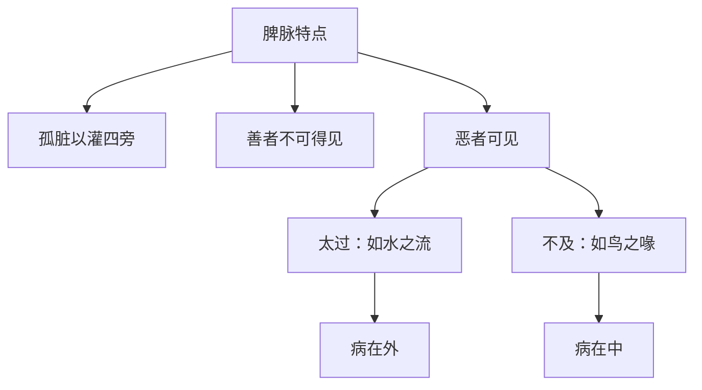

# 素问-玉机真脏论篇第十九

> "黄帝曰：凡治病，察其形气色泽，脉之盛衰，病之新故，乃治之无后其时。" - 黄帝

---

## 📜 原文（节选）/ Original Text (Excerpt)

黄帝问曰：春脉如弦，何如而弦？

岐伯对曰：春脉者肝也，东方木也，万物之所以始生也，故其气来软弱，轻虚而滑，端直以长，故曰弦，反此者病。

帝曰：何如而反？

岐伯曰：其气来实而强，此谓太过，病在外；其气来不实而微，此谓不及，病在中。太过则令人善忘，忽忽眩冒而巅疾；不及则令人胸痛引背，下则两胁胠满。

帝曰：夏脉如钩，何如而钩？

岐伯曰：夏脉者心也，南方火也，万物之所以盛长也，故其气来盛去衰，故曰钩，反此者病。

帝曰：何如而反？

岐伯曰：其气来盛去亦盛，此谓太过，病在外；其气来不盛去反盛，此谓不及，病在中。太过则令人身热而肤痛，为浸淫；不及则令人烦心，上见咳唾，下为气泄。

帝曰：秋脉如浮，何如而浮？

岐伯曰：秋脉者肺也，西方金也，万物之所以收成也，故其气来轻虚以浮，来急去散，故曰浮，反此者病。

帝曰：何如而反？

岐伯曰：其气来毛而中央坚，两旁虚，此谓太过，病在外；其气来毛而微，此谓不及，病在中。太过则令人逆气而背痛，愠愠然；不及则令人喘，呼吸少气而咳，上气见血，下闻病音。

帝曰：冬脉如营，何如而营？

岐伯曰：冬脉者肾也，北方水也，万物之所以合藏也，故其气来沉以搏，故曰营，反此者病。

帝曰：何如而反？

岐伯曰：其气来如弹石，此谓太过，病在外；其气去如数者，此谓不及，病在中。太过则令人解㑊，脊脉痛而少气不欲言；不及则令人心悬如病饥，䏚中清，脊中痛，少腹满，小便变。

帝曰：四时之序，逆从之变异也，然脾脉独何主？

岐伯曰：脾脉者土也，孤脏以灌四旁者也。

帝曰：然则脾善恶可得见之乎？

岐伯曰：善者不可得见，恶者可见。

帝曰：恶者何如可见？

岐伯曰：其来如水之流者，此为太过，病在外；如鸟之喙者，此为不及，病在中。

---

## 📖 白话文翻译（节选）/ Modern Chinese Translation (Excerpt)

黄帝问道：春季脉象如弦，怎样才叫弦？

岐伯回答说：春季脉属于肝，东方属木，是万物开始生发的时候，所以它的脉气来软弱，轻虚而滑，端直而长，所以叫弦，与此相反的就是病。

黄帝说：怎样才叫相反？

岐伯说：它的脉气来实而强，这叫太过，病在外；它的脉气来不实而微，这叫不及，病在中。太过就使人健忘，忽然眩晕昏冒而头顶有病；不及就使人胸痛牵引背部，向下则两胁肋胀满。

黄帝说：夏季脉象如钩，怎样才叫钩？

岐伯回答说：夏季脉属于心，南方属火，是万物盛长的时候，所以它的脉气来盛去衰，所以叫钩，与此相反的就是病。

黄帝说：怎样才叫相反？

岐伯说：它的脉气来盛去也盛，这叫太过，病在外；它的脉气来不盛去反盛，这叫不及，病在中。太过就使人身体发热而皮肤疼痛，成为浸淫；不及就使人烦心，上面出现咳嗽唾血，下面气机下泄。

黄帝说：秋季脉象如浮，怎样才叫浮？

岐伯回答说：秋季脉属于肺，西方属金，是万物收成的时候，所以它的脉气来轻虚而浮，来急去散，所以叫浮，与此相反的就是病。

黄帝说：怎样才叫相反？

岐伯说：它的脉气来如毛而中央坚，两旁虚，这叫太过，病在外；它的脉气来如毛而微，这叫不及，病在中。太过就使人气机上逆而背部疼痛，抑郁不乐；不及就使人喘息，呼吸少气而咳嗽，气机上逆见血，下面听到病音。

黄帝说：冬季脉象如营，怎样才叫营？

岐伯回答说：冬季脉属于肾，北方属水，是万物合藏的时候，所以它的脉气来沉而搏，所以叫营，与此相反的就是病。

黄帝说：怎样才叫相反？

岐伯说：它的脉气来如弹石，这叫太过，病在外；它的脉气去如数，这叫不及，病在中。太过就使人解㑊，脊脉疼痛而少气不想说话；不及就使人心悬如病饥，季肋中清冷，脊中疼痛，小腹胀满，小便变化。

黄帝说：四季的次序，逆从的变化，但是脾脉单独主管什么？

岐伯说：脾脉属土，是孤脏，用来灌溉四旁的。

黄帝说：那么脾的善恶可以看到吗？

岐伯说：好的脾脉看不到，坏的脾脉可以看到。

黄帝说：坏的脾脉怎样可以看到？

岐伯说：它的脉气来如水流，这叫太过，病在外；如鸟喙，这叫不及，病在中。

---

## 🔑 核心要点 / Core Concepts

### 1. 四时正常脉象 / Normal Pulse in Four Seasons

| 季节 | 脏腑 | 五行 | 脉象特征 | 比喻 |
|------|------|------|----------|------|
| 春 | 肝 | 木 | 软弱，轻虚而滑，端直以长 | 如弦 |
| 夏 | 心 | 火 | 来盛去衰 | 如钩 |
| 秋 | 肺 | 金 | 轻虚以浮，来急去散 | 如浮 |
| 冬 | 肾 | 水 | 沉以搏 | 如营 |

### 2. 四时太过脉象 / Excessive Pulse in Four Seasons

| 季节 | 太过脉象 | 病位 | 症状 |
|------|----------|------|------|
| 春 | 实而强 | 病在外 | 善忘，忽忽眩冒而巅疾 |
| 夏 | 来盛去亦盛 | 病在外 | 身热而肤痛，为浸淫 |
| 秋 | 毛而中央坚，两旁虚 | 病在外 | 逆气而背痛，愠愠然 |
| 冬 | 如弹石 | 病在外 | 解㑊，脊脉痛而少气不欲言 |

### 3. 四时不及脉象 / Deficient Pulse in Four Seasons

| 季节 | 不及脉象 | 病位 | 症状 |
|------|----------|------|------|
| 春 | 不实而微 | 病在中 | 胸痛引背，下则两胁胠满 |
| 夏 | 来不盛去反盛 | 病在中 | 烦心，上见咳唾，下为气泄 |
| 秋 | 毛而微 | 病在中 | 喘，呼吸少气而咳，上气见血，下闻病音 |
| 冬 | 去如数 | 病在中 | 心悬如病饥，䏚中清，脊中痛，少腹满，小便变 |

### 4. 脾脉特点 / Spleen Pulse Characteristics

---

## 📚 理论解释 / Theoretical Analysis

### 四时脉象理论 / Four Seasons Pulse Theory

> [!info] 核心概念
- 四时各有正常的脉象特征
- 四时脉象有太过不及之分
- 脉象变化反映病情进展

#### 四时正常脉象详解 / Detailed Normal Pulse in Four Seasons

**1. 春脉如弦 / Spring Pulse like String**
- 脏腑：肝
- 五行：木
- 脉象特征：软弱，轻虚而滑，端直以长
- 比喻：如弦

**2. 夏脉如钩 / Summer Pulse like Hook**
- 脏腑：心
- 五行：火
- 脉象特征：来盛去衰
- 比喻：如钩

**3. 秋脉如浮 / Autumn Pulse like Floating**
- 脏腑：肺
- 五行：金
- 脉象特征：轻虚以浮，来急去散
- 比喻：如浮

**4. 冬脉如营 / Winter Pulse like Camp**
- 脏腑：肾
- 五行：水
- 脉象特征：沉以搏
- 比喻：如营

#### 四时太过脉象详解 / Detailed Excessive Pulse in Four Seasons

**1. 春脉太过 / Spring Pulse Excessive**
- 脉象：实而强
- 病位：病在外
- 症状：善忘，忽忽眩冒而巅疾

**2. 夏脉太过 / Summer Pulse Excessive**
- 脉象：来盛去亦盛
- 病位：病在外
- 症状：身热而肤痛，为浸淫

**3. 秋脉太过 / Autumn Pulse Excessive**
- 脉象：毛而中央坚，两旁虚
- 病位：病在外
- 症状：逆气而背痛，愠愠然

**4. 冬脉太过 / Winter Pulse Excessive**
- 脉象：如弹石
- 病位：病在外
- 症状：解㑊，脊脉痛而少气不欲言

#### 四时不及脉象详解 / Detailed Deficient Pulse in Four Seasons

**1. 春脉不及 / Spring Pulse Deficient**
- 脉象：不实而微
- 病位：病在中
- 症状：胸痛引背，下则两胁胠满

**2. 夏脉不及 / Summer Pulse Deficient**
- 脉象：来不盛去反盛
- 病位：病在中
- 症状：烦心，上见咳唾，下为气泄

**3. 秋脉不及 / Autumn Pulse Deficient**
- 脉象：毛而微
- 病位：病在中
- 症状：喘，呼吸少气而咳，上气见血，下闻病音

**4. 冬脉不及 / Winter Pulse Deficient**
- 脉象：去如数
- 病位：病在中
- 症状：心悬如病饥，䏚中清，脊中痛，少腹满，小便变

### 脾脉理论 / Spleen Pulse Theory

> [!warning] 核心理念
- 脾脉属土，是孤脏
- 孤脏以灌四旁
- 善者不可得见，恶者可见

#### 脾脉特点 / Spleen Pulse Characteristics

**1. 孤脏以灌四旁 / Lonely Organ Irrigates Four Sides**
- 脾脉属土
- 土生万物
- 灌溉四旁（四季、四脏）

**2. 善者不可得见 / Good Cannot Be Seen**
- 正常脾脉柔和
- 与四季脉象融合
- 不单独显现

**3. 恶者可见 / Evil Can Be Seen**
- 脾脉病时显现
- 太过：如水之流
- 不及：如鸟之喙

---

## 🏥 中医实践应用 / TCM Practice Application

### 四时脉诊应用 / Four Seasons Pulse Diagnosis Application

#### 现代四时脉诊要点 / Modern Four Seasons Pulse Diagnosis Key Points

**1. 春季脉诊 / Spring Pulse Diagnosis**
- 正常脉象：弦脉
- 太过脉象：实而强
- 不及脉象：不实而微

**2. 夏季脉诊 / Summer Pulse Diagnosis**
- 正常脉象：钩脉
- 太过脉象：来盛去亦盛
- 不及脉象：来不盛去反盛

**3. 秋季脉诊 / Autumn Pulse Diagnosis**
- 正常脉象：浮脉
- 太过脉象：毛而中央坚，两旁虚
- 不及脉象：毛而微

**4. 冬季脉诊 / Winter Pulse Diagnosis**
- 正常脉象：营脉
- 太过脉象：如弹石
- 不及脉象：去如数

### 现代医学启示 / Modern Medical Insights

**1. 季节与疾病 / Season and Disease**
- 季节变化影响疾病
- 不同季节易患不同疾病
- 预防季节性疾病

**2. 个体化治疗 / Individualized Treatment**
- 根据季节调整治疗方案
- 考虑个体差异
- 综合治疗

---

## 🔗 相关链接 / Related Links

- [[MOC-黄帝内经知识库]] - 主索引
- [[黄帝内经-素问索引]] - 素问索引
- [[黄帝内经-核心理论]] - 核心理论体系
- [[素问-脉要精微论篇第十七]] - 脉象精微
- [[素问-平人气象论篇第十八]] - 平人脉象

### 易学关联 / Yi Jing Connection

- [[MOC-易经知识库]] - 易经索引
- [[20260201-0002 五行]] - 五行理论

**易学与玉机真脏的联系:**
- 四时理论：易学的四时理论与中医四时脉象相通
- 五行对应：易学的五行理论与中医五脏脉象相通

---

## 💡 学习要点 / Learning Points

### 掌握重点 / Key Points to Master

- [ ] 理解四时正常脉象的特征
- [ ] 掌握四时太过不及脉象
- [ ] 学会辨别脾脉的善恶
- [ ] 了解脉象与症状的关系

### 思考问题 / Questions for Reflection

1. **为什么说"脾脉者土也，孤脏以灌四旁者也"？**
   - 脾属土，土生万物
   - 脾灌溉四旁，滋养四脏
   - 脾为后天之本

2. **现代医学如何应用"四时脉象"？**
   - 季节性疾病研究
   - 个体化治疗
   - 预防医学

---

## 📊 学习进度 / Learning Progress

### 完成情况 / Completion Status

| 学习内容 | 状态 | 备注 |
|---------|------|------|
| 原文诵读 | 📝 进行中 | 建议每日诵读 |
| 白话文理解 | ✅ 已完成 | 理解主要含义 |
| 四时脉象 | ✅ 已完成 | 掌握脉象 |
| 脾脉特点 | 📝 进行中 | 需要临床实践 |
| 理论分析 | ✅ 已完成 | 理解脉象理论 |

---

## 🔄 更新日志 / Update Log

### 2026-02-03

- ✅ 创建玉机真脏论篇第十九笔记
- ✅ 完成原文、白话文翻译（节选）
- ✅ 整理四时脉象对照表
- ✅ 编写四时脉象和脾脉理论

---

**笔记创建日期**：2026年2月3日

**最后更新**：2026年2月3日
