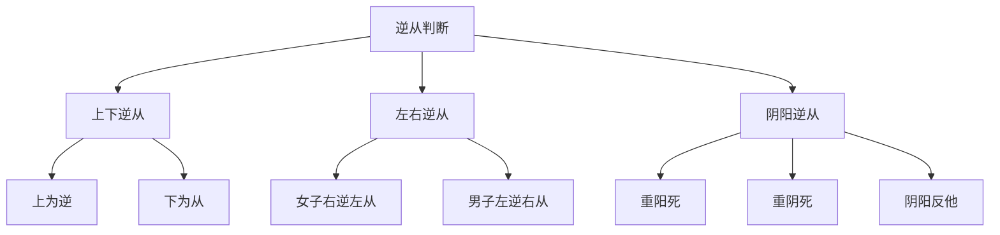

# 素问-玉版论要篇第十五

> "色脉与尺之相应也，如桴鼓影响之相应也，不得相失也。" - 岐伯

---

## 📜 原文（节选）/ Original Text (Excerpt)

黄帝问曰：余闻揆度奇恒，所指不同，用之奈何？

岐伯对曰：揆度者，度病之浅深也。奇恒者，言奇病也。请言道之至数，五色脉变，揆度奇恒，道在于一。

神转不回，回则不转，乃失其机。至数之要，迫近于微，著之玉版，藏之脏腑，每旦读之，名曰玉版。

容色见上下左右，各在其要。其色见浅者，汤液主治，十日已。其见深者，必齐主治，二十一日已。其见大深者，醪醴主治，百日已。

色夭面脱，不治，百日尽已。脉短气绝，死。病温虚甚，死。

色见上下左右，各在其要。上为逆，下为从。女子右为逆，左为从；男子左为逆，右为从。

易，重阳死，重阴死。阴阳反他，治在权衡相夺，奇恒事也，揆度事也。

搏脉痹躄，寒热之交。脉孤为消气，虚泄为夺血。脉逆阴阳，治在权衡相夺。

奇恒者，言奇病也。奇恒之数，揆度之要，道在于一。

---

## 📖 白话文翻译（节选）/ Modern Chinese Translation (Excerpt)

黄帝问道：我听说揆度和奇恒，所指不同，应该怎么运用？

岐伯回答说：揆度，是衡量疾病的浅深。奇恒，是说奇特的疾病。请说大道的至数，五色的变化，脉象的变化，揆度奇恒，道理在于一个原则。

神气运行不回转，回转就不再运行，就失去了生机的关键。至数的要领，接近于微妙，把它记录在玉版上，藏在脏腑中，每天阅读它，叫做玉版。

容色出现在上下左右，各自有其关键所在。容色浅的，用汤液主治，十天可以治愈。容色深的，必须用药剂主治，二十一天可以治愈。容色很深的，用醪醴主治，一百天可以治愈。

容色枯槁、面部消瘦的，不能治愈，一百天就会死。脉象短促、气机断绝的，会死。温病虚弱的，会死。

容色出现在上下左右，各自有其关键。向上为逆证，向下为顺证。女子右边为逆证，左边为顺证；男子左边为逆证，右边为顺证。

变化，重阳会死，重阴会死。阴阳相反，治疗在于权衡相夺，这是奇恒的事情，也是揆度的事情。

脉象搏击、肢体麻痹、跛行的，是寒热交结。脉象孤绝为消气，虚泄为夺血。脉象违背阴阳，治疗在于权衡相夺。

奇恒，是说奇特的疾病。奇恒的数，揆度的要领，道理在于一个原则。

---

## 🔑 核心要点 / Core Concepts

### 1. 揆度奇恒 / Kuaidu Qiheng (Measuring and Extraordinary)

| 概念 | 含义 | 作用 |
|------|------|------|
| 揆度 | 度量疾病的浅深 | 判断病情轻重 |
| 奇恒 | 奇特的疾病 | 诊断疑难杂症 |
| 道在于一 | 道理在于一个原则 | 把握阴阳神机 |

### 2. 色脉相参 / Color and Pulse Correlation

| 容色 | 深浅 | 治疗方法 | 治愈时间 |
|------|------|----------|----------|
| 浅 | 浅 | 汤液主治 | 十日已 |
| 中 | 深 | 齐主治 | 二十一日已 |
| 深 | 大深 | 醪醴主治 | 百日已 |
| 死候 | 色夭面脱 | 不治 | 百日尽已 |

### 3. 逆从判断 / Judgment of Adverse and Favorable

---

## 📚 理论解释 / Theoretical Analysis

### 揆度奇恒理论 / Kuaidu Qiheng Theory

> [!info] 核心概念
> 揆度是衡量疾病浅深的方法，奇恒是诊断奇特疾病的理论。

#### 揆度的方法 / Methods of Kuaidu

**1. 度病之浅深 / Measure Depth of Disease**
- 观察五色的变化
- 诊察脉象的变化
- 判断病情的轻重

**2. 奇恒的判断 / Judgment of Extraordinary**
- 识别奇特的疾病
- 诊断疑难杂症
- 掌握特殊的治法

**3. 道在于一 / Principle Lies in One**
- 阴阳调和
- 神气运行
- 气机通畅

### 色脉相参理论 / Color and Pulse Correlation Theory

> [!warning] 核心理念
- 色脉与尺之相应，如桴鼓影响之相应
- 不得相失，必须色脉相参

#### 色脉相参的要点 / Key Points of Color and Pulse Correlation

**1. 色脉相应 / Color and Pulse Correspondence**
- 色脉一致：预后良好
- 色脉相反：预后不良
- 色脉相失：难治

**2. 容色深浅 / Depth of Color**
- 浅：病轻，易治
- 深：病重，难治
- 大深：病危，难愈

**3. 治疗方法 / Treatment Methods**
- 容色浅：汤液主治
- 容色深：必齐主治
- 容色大深：醪醴主治

### 逆从理论 / Adverse and Favorable Theory

> [!note] 逆从判断
- 逆：病势向上，预后不良
- 从：病势向下，预后良好

#### 逆从的判断标准 / Criteria for Adverse and Favorable Judgment

**1. 上下逆从 / Adverse and Favorable in Upper and Lower**
- 上为逆：病势向上，难治
- 下为从：病势向下，易治

**2. 左右逆从 / Adverse and Favorable in Left and Right**
- 女子右逆左从：女子右边为逆证，左边为顺证
- 男子左逆右从：男子左边为逆证，右边为顺证

**3. 阴阳逆从 / Adverse and Favorable in Yin and Yang**
- 重阳死：阳热过盛，阴液衰竭
- 重阴死：阴寒过盛，阳气衰竭
- 阴阳反他：阴阳逆乱，治疗权衡相夺

---

## 🏥 中医实践应用 / TCM Practice Application

### 望色诊断 / Color Diagnosis

#### 望色要点 / Color Diagnosis Key Points

**1. 容色深浅 / Depth of Color**
- 浅：病轻，预后好
- 深：病重，预后差
- 色夭：枯槁无华，死候

**2. 容色上下左右 / Upper, Lower, Left and Right of Color**
- 上为逆，下为从
- 女子右逆左从
- 男子左逆右从

**3. 容色与脉象相参 / Color and Pulse Correlation**
- 色脉一致：预后良好
- 色脉相反：预后不良
- 色脉相失：难治

### 脉诊应用 / Pulse Diagnosis Application

#### 脉象判断 / Pulse Judgment

**1. 搏脉 / Beating Pulse**
- 搏脉痹躄：脉象搏击，肢体麻痹、跛行
- 寒热之交：寒热交结

**2. 孤脉 / Isolated Pulse**
- 脉孤为消气：脉象孤绝，消气
- 虚泄为夺血：脉象虚泄，夺血

**3. 逆脉 / Adverse Pulse**
- 脉逆阴阳：脉象违背阴阳
- 治在权衡相夺：治疗在于权衡相夺

### 现代医学启示 / Modern Medical Insights

**1. 色脉相参 / Color and Pulse Correlation**
- 综合诊断：现代医学综合多种诊断方法
- 预后判断：根据体征判断疾病预后
- 个体化治疗：根据不同情况选择治疗方案

**2. 揆度奇恒 / Kuaidu Qiheng**
- 疾病分级：根据病情轻重分级治疗
- 疑难杂症：运用特殊方法诊断治疗
- 权衡相夺：综合权衡，攻补兼施

---

## 🔗 相关链接 / Related Links

- [[MOC-黄帝内经知识库]] - 主索引
- [[黄帝内经-素问索引]] - 素问索引
- [[黄帝内经-核心理论]] - 核心理论体系
- [[素问-脉要精微论篇第十七]] - 脉象精微
- [[素问-平人气象论篇第十八]] - 平人脉象

### 易学关联 / Yi Jing Connection

- [[MOC-易经知识库]] - 易经索引
- [[20260201-0002 五行]] - 五行理论

**易学与玉版论要的联系:**
- 阴阳理论：易学阴阳与中医阴阳相通
- 逆从判断：易学吉凶判断与中医预后判断相通

---

## 💡 学习要点 / Learning Points

### 掌握重点 / Key Points to Master

- [ ] 理解揆度奇恒的概念和作用
- [ ] 掌握色脉相参的诊断方法
- [ ] 学会逆从的判断标准
- [ ] 了解治疗方法的分类

### 思考问题 / Questions for Reflection

1. **为什么说"道在于一"？**
   - 阴阳调和是根本
   - 神气运行是关键
   - 把握核心原则

2. **现代医学如何体现"色脉相参"？**
   - 综合诊断方法
   - 体征与检验相结合
   - 整体观念

---

## 📊 学习进度 / Learning Progress

### 完成情况 / Completion Status

| 学习内容 | 状态 | 备注 |
|---------|------|------|
| 原文诵读 | 📝 进行中 | 建议每日诵读 |
| 白话文理解 | ✅ 已完成 | 理解主要含义 |
| 揆度奇恒 | ✅ 已完成 | 掌握概念 |
| 色脉相参 | 📝 进行中 | 需要临床实践 |
| 理论分析 | ✅ 已完成 | 理解诊断方法 |

---

## 🔄 更新日志 / Update Log

### 2026-02-03

- ✅ 创建玉版论要篇第十五笔记
- ✅ 完成原文、白话文翻译（节选）
- ✅ 整理揆度奇恒和色脉相参对照表
- ✅ 编写逆从判断理论

---

**笔记创建日期**：2026年2月3日

**最后更新**：2026年2月3日
