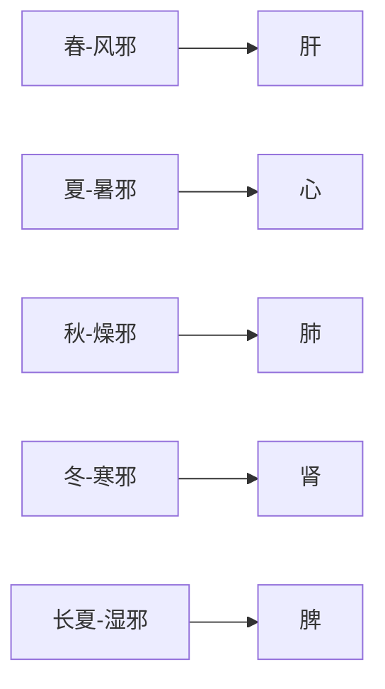

# 素问-生气通天论篇第三

> "苍天之气，清净则志意治，顺之则阳气固。" - 岐伯

---

## 📜 原文（节选）/ Original Text (Excerpt)

黄帝曰：夫自古通天者，生之本，本于阴阳。天地之间，六合之内，其气九州、九窍、五藏、十二节，皆通乎天气。其生五，其气三，数犯此者，则邪气伤人，此寿命之本也。

苍天之气，清净则志意治，顺之则阳气固，虽有贼邪，弗能害也。此因时之序。故圣人传精神，服天气，而通神明，失之则内闭九窍，外壅肌肉，卫气散解，此谓自伤，气之削也。

阳气者，若天与日，失其所，则折寿而不彰。故天运当以日光明，是故阳因而上，卫外者也。

因于寒，欲如运枢，起居如惊，神气乃浮。因于暑，汗烦则喘喝，静则多言，体若燔炭，汗出而散。因于湿，首如裹，湿热不攘，大筋緛短，小筋驰长，软短为拘，驰长为痿。因于气，为肿，四维相代，阳气乃竭。

阳气者，烦劳则张，精绝，辟积于夏，使人煎厥。目盲不可以视，耳闭不可以听，溃溃乎若坏都，汩汩乎不可止。

阳气者，大怒则形气绝，而血菀于上，使人薄厥，有伤于筋，纵，其若不容，汗出偏沮，使人偏枯。汗出见湿，乃坐痤痱。高梁之变，足生大丁，受如持虚。劳汗当风，寒薄为皴，郁乃痤。

阳气者，精则养神，柔则养筋。开阖不得，寒气从之，乃生大偻。陷脉为瘘，留连肉腠，俞气化薄，传为善畏，及为惊骇；营气不从，逆于肉理，乃生臃肿；魄汗未尽，形弱而气烁，穴俞以闭，发为风疟。

故风者，百病之始也。清静则肉腠闭拒，虽有大风苛毒，弗之能害，此因时之序也。

---

## 📖 白话文翻译（节选）/ Modern Chinese Translation (Excerpt)

黄帝说：自古以来都以通于天气为生命的根本，这个根本在于阴阳。天地之间，六合之内，大如九州之域，小如人的九窍、五脏、十二关节，都与天气相通。天气衍生五行，阴阳之气又依盛衰消长而各分为三。如果经常违背阴阳五行的变化规律，那么邪气就会伤害人体。因此，适应这个规律是寿命得以延续的根本。

苍天之气清爽洁净，人的精神就相应地调畅平和，顺应天气的变化，就会阳气固密，虽有贼风邪气，也不能加害于人。这是适应时序阴阳变化的结果。所以圣人能够专心致志，顺应天气，而通达阴阳变化之理。如果违逆了适应天气的原则，就会内使九窍不通，外使肌肉闭塞，卫气涣散不固，这是由于人们不能适应自然变化所致，阳气就会因此而受到削弱。

人体的阳气，如象天上的太阳一样重要，假若阳气失去了正常的位次而不能发挥其重要作用，人就会减损寿命或夭折，生命机能亦暗弱不足。所以天体的正常运行，是因太阳的光明普照而显现出来，而人的阳气也应在上在外，并起到保护身体、抵御外邪的作用。

由于寒邪，阳气应如门轴在门臼中运转一样活动于体内。若起居猝急，扰动阳气，则易使神气外越。由于暑邪，则汗多烦躁，喝喝而喘，安静时多言多语，若身体发高热，一经出汗，热邪就能散去。由于湿邪，头部象有物蒙裹一样沉重。若湿热相兼而不得排除，则伤害大小诸筋，而出现短缩或弛纵，短缩的造成拘挛，弛纵的造成痿弱。由于风邪，可致浮肿。以上四种邪气维系缠绵不离，相互更代伤人，就会使阳气倾竭。

在人体烦劳过度时，阳气就会亢盛而外张，阴精逐渐耗竭。如此多次重复，阳愈盛而阴愈亏，到夏季暑热之时，便易使人发生煎厥病，发作的时候眼睛昏蒙看不见东西，耳朵闭塞听不到声音，混乱之时就象都城崩毁，急流奔泻一样不可收拾。

人体的阳气，在大怒时就会上逆，血随气生而淤积于上部，与身体其他部位阻隔不通，使人发生薄厥。若伤及诸筋，使筋弛纵不收，而不能随意运动。经常半身出汗，可以演变为半身不遂。出汗的时候，遇到湿邪阻遏就容易发生小的疮疮和痱子。经常吃肥肉精米厚味，足以导致发生疔疮，患兵很容易，就象以空的容器接收东西一样。在劳动出汗时遇到风寒之邪，迫聚于皮腠形成粉刺，郁积化热而成疮疖。

人体的阳气，既能养神而使精神慧爽，又能养筋而使诸筋柔韧。汗孔的开闭调节失常，汗气就会随之侵入，损伤阳气，以致筋失所养，造成身体俯曲不伸。寒气深陷脉中，留连肉腠之间，气血不通而郁积，久而成为疮瘘。从腧穴侵入的寒气内传而迫及五脏，损伤神志，就会出现恐惧和惊骇的症象。由于寒气的稽留，营气不能顺利地运行，阻逆于肌肉之间，就会发生痈肿。汗出未止的时候，形体与阳气都受到一定的消弱，若风寒内侵，俞穴闭阻，就会发生风疟。

所以风是引起各种疾病的起始原因。而只要人体保持精神的安定和劳逸适度等养生的原则，那么肌肉腠理就会密闭而有抗拒外邪的能力，虽有大风苛毒的侵染，也不能伤害，这正是循着时序的变化规律保养生气的结果。

---

## 🔑 核心要点 / Core Concepts

### 1. 生气通天 / Essence Qi Corresponding to Heaven

| 概念 | 英文 | 含义 |
|------|------|------|
| **生气通天** | Essence qi corresponds to heaven | 人与天地相通，生命源于天地 |
| **六合之内** | Within the six directions | 天地四方上下 |
| **九州** | Nine provinces | 大地广阔 |
| **九窍、五脏、十二节** | Nine orifices, five zang, twelve joints | 人体器官皆通天气 |

### 2. 四淫伤人 / Four Pathogens Harm the Body

| 邪气 | 季节 | 损伤 | 症状 |
|------|------|------|------|
| **寒邪** | 冬季 | 阳气如运枢 | 神气浮，起居如惊 |
| **暑邪** | 夏季 | 汗烦喘喝，体若燔炭 | 汗多烦躁，安静多言 |
| **湿邪** | 长夏 | 首如裹，湿热不攘 | 大筋緛短，小筋驰长 |
| **风邪** | 春季 | 为肿，四维相代 | 阳气竭 |

### 3. 阳气的重要性 / Importance of Yang Qi

- **阳气如日**：阳气象天上的太阳
- **阳因而上**：阳气在上在外，卫外者也
- **阳气固密**：顺应天气则阳气固密
- **失其所则折寿**：阳气失序则寿命减损

---

## 📚 理论解释 / Theoretical Analysis

### 阴阳平衡 / Yin-Yang Balance

> [!info] 核心理念
> 苍天之气清净，志意治，顺之则阳气固

#### 四时与邪气 / Four Seasons and Pathogens

---

## 🏥 中医实践应用 / TCM Practice Application

### 四时防病 / Disease Prevention by Seasons

| 季节 | 邪气 | 防护措施 | 养生建议 |
|------|------|---------|---------|
| **春** | 风邪 | 避风保暖 | 养肝，防风 |
| **夏** | 暑邪 | 清暑降温，适度出汗 | 养心，防暑 |
| **长夏** | 湿邪 | 避湿防潮 | 养脾，祛湿 |
| **秋** | 燥邪 | 润燥防燥 | 养肺，润燥 |
| **冬** | 寒邪 | 保暖防寒 | 养肾，温阳 |

---

## 🔗 相关链接 / Related Links

- [[MOC-黄帝内经知识库]] - 主索引
- [[黄帝内经-素问索引]] - 素问索引
- [[素问-上古天真论篇第一]] - 上篇
- [[素问-四气调神大论篇第二]] - 前篇
- [[素问-金匮真言论篇第四]] - 后篇

---

**笔记创建日期**：2026年2月3日

**最后更新**：2026年2月3日
