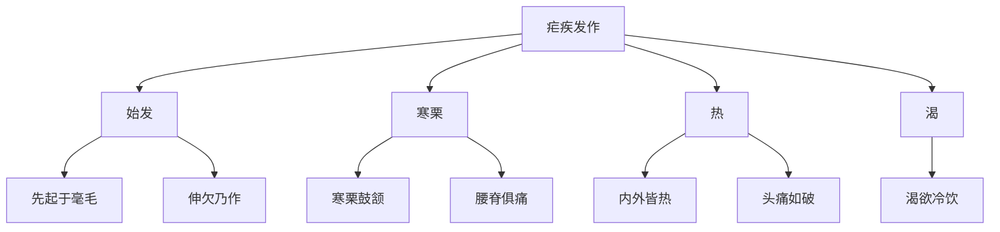

# 素问-疟论篇第三十五

> "黄帝问曰：夫疟疾皆生于风，其蓄作有时，何也？" - 黄帝

---

## 📜 原文（节选）/ Original Text (Excerpt)

黄帝问曰：夫疟疾皆生于风，其蓄作有时，何也？

岐伯对曰：疟之始发也，先起于毫毛，伸欠乃作，寒栗鼓颔，腰脊俱痛，寒去则内外皆热，头痛如破，渴欲冷饮。

帝曰：何气使然？

岐伯曰：阴阳上下交争，虚实更作，阴阳相移也。阳并于阴，则阴实而阳虚，阳明虚则寒栗鼓颔也；巨阳病衰，则阴气逆，阴气逆则外内皆热。

帝曰：疟而不作，何也？

岐伯曰：疟气随经络，沉以内薄，故卫气应乃作。疟气之随也，故日作，间日者，邪气与卫气客于六府，有时相失，不能相得，故间日乃作。

---

## 📖 白话文翻译（节选）/ Modern Chinese Translation (Excerpt)

黄帝问道：疟疾都产生于风，它的蓄积发作有定时，为什么？

岐伯回答说：疟疾开始发作，先起立于毫毛，伸欠就发作，寒战鼓颔，腰脊都痛，寒去则内外都发热，头痛如破裂，口渴想要冷饮。

黄帝说：什么气使它这样？

岐伯说：阴阳上下交争，虚实交替发作，阴阳相互转移。阳气并入于阴，则阴气充实而阳气虚弱，阳明虚弱则寒战鼓颔；巨阳病衰减，则阴气上逆，阴气上逆则内外都发热。

黄帝说：疟疾而不发作，为什么？

岐伯说：疟气随着经络，沉入内而搏击，所以卫气应和就发作。疟气的随着，所以每日发作，隔日发作的，邪气与卫气客居六腑，有时相互失散，不能相互得到，所以隔日才发作。

---

## 🔑 核心要点 / Core Concepts

### 1. 疟疾发作症状 / Malaria Onset Symptoms

| 阶段 | 症状 |
|------|------|
| 始发 | 先起于毫毛，伸欠乃作 |
| 寒栗 | 寒栗鼓颔，腰脊俱痛 |
| 热 | 寒去则内外皆热，头痛如破 |
| 渴 | 渴欲冷饮 |

### 2. 阴阳交争 / Yin-Yang Fighting

| 阴阳 | 表现 | 症状 |
|------|------|------|
| 阳并于阴 | 阴实而阳虚 | 寒栗鼓颔 |
| 阴气逆 | 外内皆热 | 头痛如破 |

### 3. 疟疾发作规律 / Malaria Onset Pattern

---

## 📚 理论解释 / Theoretical Analysis

### 疟疾理论 / Malaria Theory

> [!info] 核心概念
- 疟疾皆生于风
- 蓄作有时
- 阴阳上下交争

#### 疟疾详解 / Detailed Malaria

**1. 疟疾发作 / Malaria Onset**
- 始发：先起于毫毛，伸欠乃作
- 寒栗：寒栗鼓颔，腰脊俱痛
- 热：寒去则内外皆热，头痛如破
- 渴：渴欲冷饮

**2. 阴阳交争 / Yin-Yang Fighting**
- 阴阳上下交争：阴阳上下交争
- 虚实更作：虚实交替发作
- 阴阳相移：阴阳相互转移

**3. 阳并于阴 / Yang Merging into Yin**
- 阴实而阳虚：阴气充实而阳气虚弱
- 阳明虚：阳明虚弱
- 寒栗鼓颔：寒战鼓颔

**4. 阴气逆 / Yin Qi Counterflow**
- 外内皆热：内外都发热
- 头痛如破：头痛如破裂
- 渴欲冷饮：口渴想要冷饮

### 疟疾发作规律理论 / Malaria Onset Pattern Theory

> [!warning] 核心理念
- 疟气随经络
- 沉以内薄
- 卫气应乃作

#### 疟疾发作规律详解 / Detailed Malaria Onset Pattern

**1. 每日发作 / Daily Onset**
- 疟气随经络：疟气随着经络
- 沉以内薄：沉入内而搏击
- 卫气应乃作：卫气应和就发作
- 日作：每日发作

**2. 隔日发作 / Intermittent Onset**
- 邪气与卫气：邪气与卫气
- 客于六府：客居六腑
- 有时相失：有时相互失散
- 间日乃作：隔日才发作

---

## 🏥 中医实践应用 / TCM Practice Application

### 疟疾治疗 / Malaria Treatment

#### 现代疟疾治疗要点 / Modern Malaria Treatment Key Points

**1. 寒栗阶段 / Chill Stage**
- 症状：寒栗鼓颔，腰脊俱痛
- 治法：温阳散寒
- 药物：桂枝汤、麻黄汤

**2. 发热阶段 / Fever Stage**
- 症状：内外皆热，头痛如破
- 治法：清热泻火
- 药物：白虎汤、柴胡汤

**3. 口渴阶段 / Thirst Stage**
- 症状：渴欲冷饮
- 治法：滋阴生津
- 药物：生脉散、白虎汤

---

## 🔗 相关链接 / Related Links

- [[MOC-黄帝内经知识库]] - 主索引
- [[黄帝内经-素问索引]] - 素问索引
- [[黄帝内经-核心理论]] - 核心理论体系
- [[素问-逆调论篇第三十四]] - 逆调
- [[素问-刺疟篇第三十六]] - 刺疟

### 易学关联 / Yi Jing Connection

- [[MOC-易经知识库]] - 易经索引
- [[20260201-0002 五行]] - 五行理论

**易学与疟论的联系:**
- 阴阳理论：易学的阴阳理论与中医阴阳交争相通
- 风邪理论：易学的风邪理论与中医疟疾相通

---

## 💡 学习要点 / Learning Points

### 掌握重点 / Key Points to Master

- [ ] 理解疟疾的概念
- [ ] 掌握疟疾发作的症状
- [ ] 学会阴阳交争的机理
- [ ] 了解疟疾的治疗方法

### 思考问题 / Questions for Reflection

1. **为什么说"疟疾皆生于风"？**
   - 风邪致病：风邪导致疟疾
   - 蓄作有时：蓄积发作有定时
   - 阴阳交争：阴阳上下交争

2. **现代医学如何应用"疟论"？**
   - 疟疾治疗：疟疾治疗方法
   - 发热治疗：发热疾病治疗
   - 个体化治疗：根据个体情况治疗

---

## 📊 学习进度 / Learning Progress

### 完成情况 / Completion Status

| 学习内容 | 状态 | 备注 |
|---------|------|------|
| 原文诵读 | 📝 进行中 | 建议每日诵读 |
| 白话文理解 | ✅ 已完成 | 理解主要含义 |
| 疟疾理论 | ✅ 已完成 | 掌握概念 |
| 疟疾治疗 | 📝 进行中 | 需要临床实践 |
| 理论分析 | ✅ 已完成 | 理解理论 |

---

## 🔄 更新日志 / Update Log

### 2026-02-03

- ✅ 创建疟论篇第三十五笔记
- ✅ 完成原文、白话文翻译（节选）
- ✅ 整理疟疾发作症状对照表
- ✅ 编写疟疾和阴阳交争理论

---

**笔记创建日期**：2026年2月3日

**最后更新**：2026年2月3日
