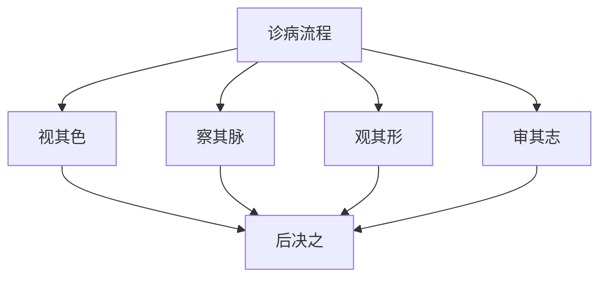

# 素问-病能论篇第四十六

> "黄帝问曰：诊病何如？岐伯曰：诊病者，必先视其色，察其脉，观其形，审其志，而后决之。" - 岐伯

---

## 📜 原文（节选）/ Original Text (Excerpt)

黄帝问曰：诊病何如？

岐伯曰：诊病者，必先视其色，察其脉，观其形，审其志，而后决之。

帝曰：其状何如？

岐伯曰：其状何如？色赤如赭，脉大如钩，形气有余，志意不乱，病在心，名曰心痹。

色白如枯骨，脉涩如毛，形气不足，志意不乱，病在肺，名曰肺痹。

色青如草兹，脉小如弦，形气不足，志意不乱，病在肝，名曰肝痹。

色黄如枳实，脉代如钩，形气不足，志意不乱，病在脾，名曰脾痹。

色黑如炱，脉坚如石，形气不足，志意不乱，病在肾，名曰肾痹。

---

## 📖 白话文翻译（节选）/ Modern Chinese Translation (Excerpt)

黄帝问道：诊察疾病如何？

岐伯回答说：诊察疾病，必须先观察它的气色，察看它的脉象，观察它的形体，审察它的志意，然后决断它。

黄帝说：它的状况如何？

岐伯说：它的状况如何？气色红如赭石，脉象大如钩，形体气机有余，志意不紊乱，疾病在心，名叫心痹。

气色白如枯骨，脉象涩滞如毛，形体气机不足，志意不紊乱，疾病在肺，名叫肺痹。

气色青如枯草，脉象小如弦，形体气机不足，志意不紊乱，疾病在肝，名叫肝痹。

气色黄如枳实，脉象代止如钩，形体气机不足，志意不紊乱，疾病在脾，名叫脾痹。

气色黑如烟灰，脉象坚硬如石，形体气机不足，志意不紊乱，疾病在肾，名叫肾痹。

---

## 🔑 核心要点 / Core Concepts

### 1. 诊病四要 / Four Essentials of Diagnosis

| 要点 | 内容 |
|------|------|
| 视其色 | 先观察气色 |
| 察其脉 | 察看脉象 |
| 观其形 | 观察形体 |
| 审其志 | 审察志意 |

### 2. 五脏痹表现 / Five Zang Bi Manifestations

| 脏 | 气色 | 脉象 | 形气 | 志意 | 病名 |
|------|------|------|------|------|------|
| 心 | 赤如赭 | 大如钩 | 有余 | 不乱 | 心痹 |
| 肺 | 白如枯骨 | 涩如毛 | 不足 | 不乱 | 肺痹 |
| 肝 | 青如草兹 | 小如弦 | 不足 | 不乱 | 肝痹 |
| 脾 | 黄如枳实 | 代如钩 | 不足 | 不乱 | 脾痹 |
| 肾 | 黑如炱 | 坚如石 | 不足 | 不乱 | 肾痹 |

### 3. 诊病流程 / Diagnosis Process

---

## 📚 理论解释 / Theoretical Analysis

### 诊病理论 / Diagnosis Theory

> [!info] 核心概念
- 诊病四要：视色、察脉、观形、审志
- 四诊合参：四诊合参
- 后决之：然后决断疾病

#### 诊病详解 / Detailed Diagnosis

**1. 视其色 / Observe Its Color**
- 观察气色：观察气色
- 气色判断：气色判断疾病
- 五色生死：五色生死判断

**2. 察其脉 / Observe Its Pulse**
- 察看脉象：察看脉象
- 脉象判断：脉象判断疾病
- 脉象生死：脉象生死判断

**3. 观其形 / Observe Its Form**
- 观察形体：观察形体
- 形体判断：形体判断疾病
- 气有余不足：气机有余不足

**4. 审其志 / Examine Its Will**
- 审察志意：审察志意
- 志意判断：志意判断疾病
- 志意不乱：志意不紊乱

### 五脏痹理论 / Five Zang Bi Theory

> [!warning] 核心理念
- 五脏痹，各有所主
- 气色、脉象、形体、志意合参
- 诊断五脏痹

#### 五脏痹详解 / Detailed Five Zang Bi

**1. 心痹 / Heart Bi**
- 气色：赤如赭
- 脉象：大如钩
- 形体气机：有余
- 志意：不乱
- 病名：心痹

**2. 肺痹 / Lung Bi**
- 气色：白如枯骨
- 脉象：涩如毛
- 形体气机：不足
- 志意：不乱
- 病名：肺痹

**3. 肝痹 / Liver Bi**
- 气色：青如草兹
- 脉象：小如弦
- 形体气机：不足
- 志意：不乱
- 病名：肝痹

**4. 脾痹 / Spleen Bi**
- 气色：黄如枳实
- 脉象：代如钩
- 形体气机：不足
- 志意：不乱
- 病名：脾痹

**5. 肾痹 / Kidney Bi**
- 气色：黑如炱
- 脉象：坚如石
- 形体气机：不足
- 志意：不乱
- 病名：肾痹

---

## 🏥 中医实践应用 / TCM Practice Application

### 诊病治疗 / Diagnosis Treatment

#### 现代诊病治疗要点 / Modern Diagnosis Treatment Key Points

**1. 心痹治疗 / Heart Bi Treatment**
- 症状：气色赤如赭，脉大如钩，形体气机有余
- 治法：清心泻火
- 药物：导赤散、朱砂安神丸
- 针刺：针刺心俞、内关、神门穴

**2. 肺痹治疗 / Lung Bi Treatment**
- 症状：气色白如枯骨，脉涩如毛，形体气机不足
- 治法：补肺益气
- 药物：补肺汤、生脉散
- 针刺：针刺肺俞、太渊、膏肓穴

**3. 肝痹治疗 / Liver Bi Treatment**
- 症状：气色青如草兹，脉小如弦，形体气机不足
- 治法：疏肝解郁
- 药物：柴胡疏肝散、逍遥散
- 针刺：针刺肝俞、太冲、期门穴

**4. 脾痹治疗 / Spleen Bi Treatment**
- 症状：气色黄如枳实，脉代如钩，形体气机不足
- 治法：健脾益气
- 药物：参苓白术散、六君子汤
- 针刺：针刺脾俞、胃俞、三阴交穴

**5. 肾痹治疗 / Kidney Bi Treatment**
- 症状：气色黑如炱，脉坚如石，形体气机不足
- 治法：补肾填精
- 药物：左归丸、金匮肾气丸
- 针刺：针刺肾俞、命门、太溪穴

---

## 🔗 相关链接 / Related Links

- [[MOC-黄帝内经知识库]] - 主索引
- [[黄帝内经-素问索引]] - 素问索引
- [[黄帝内经-核心理论]] - 核心理论体系
- [[素问-刺腰痛篇第四十一]] - 刺腰痛
- [[素问-大奇论篇第四十八]] - 大奇论

### 易学关联 / Yi Jing Connection

- [[MOC-易经知识库]] - 易经索引
- [[20260201-0002 五行]] - 五行理论

**易学与病能论的联系:**
- 五行理论：易学的五行理论与中医五脏痹相通
- 阴阳理论：易学的阴阳理论与中医气口脉相通

---

## 💡 学习要点 / Learning Points

### 掌握重点 / Key Points to Master

- [ ] 理解诊病四要的方法
- [ ] 掌握五脏痹的判断
- [ ] 学会五脏痹的治疗方法
- [ ] 了解四诊合参的理论

### 思考问题 / Questions for Reflection

1. **为什么说"必先视其色，察其脉，观其形，审其志"？**
   - 四诊合参：四诊合参
   - 全面诊断：全面诊断疾病
   - 准确判断：准确判断疾病

2. **现代医学如何应用"病能论"？**
   - 四诊合参：四诊合参方法
   - 望闻问切：望闻问切方法
   - 综合诊断：综合诊断疾病

---

## 📊 学习进度 / Learning Progress

### 完成情况 / Completion Status

| 学习内容 | 状态 | 备注 |
|---------|------|------|
| 原文诵读 | 📝 进行中 | 建议每日诵读 |
| 白话文理解 | ✅ 已完成 | 理解主要含义 |
| 诊病四要 | ✅ 已完成 | 掌握方法 |
| 五脏痹治疗 | 📝 进行中 | 需要临床实践 |
| 理论分析 | ✅ 已完成 | 理解理论 |

---

## 🔄 更新日志 / Update Log

### 2026-02-03

- ✅ 创建病能论篇第四十六笔记
- ✅ 完成原文、白话文翻译（节选）
- ✅ 整理五脏痹表现对照表
- ✅ 编写诊病四要和五脏痹理论

---

**笔记创建日期**：2026年2月3日

**最后更新**：2026年2月3日
