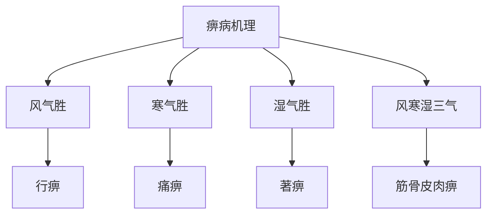

# 素问-痹论篇第四十三

> "黄帝问曰：痹之安生？岐伯曰：风、寒、湿三气杂至，合而为痹也。" - 岐伯

---

## 📜 原文（节选）/ Original Text (Excerpt)

黄帝问曰：痹之安生？

岐伯曰：风、寒、湿三气杂至，合而为痹也。

帝曰：其有别乎？

岐伯曰：风气胜者为行痹，寒气胜者为痛痹，湿气胜者为著痹。风寒湿三气合而为痹，则为筋骨皮肉之痹。

帝曰：愿闻其状。

岐伯曰：风气胜者为行痹，游走上下，无所留止，为行痹。寒气胜者为痛痹，痛不可忍，为痛痹。湿气胜者为著痹，湿气所着之处，为著痹。风寒湿三气合而为痹，则为筋骨皮肉之痹。

---

## 📖 白话文翻译（节选）/ Modern Chinese Translation (Excerpt)

黄帝问道：痹的产生如何？

岐伯回答说：风、寒、湿三气混杂而至，合成为痹。

黄帝说：它有区别吗？

岐伯说：风气旺盛的成为行痹，寒气旺盛的成为痛痹，湿气旺盛的成为著痹。风、寒、湿三气合成为痹，就成为筋、骨、皮、肉的痹。

黄帝说：我希望听到它的状况。

岐伯说：风气旺盛的成为行痹，游走上下，没有停留止，成为行痹。寒气旺盛的成为痛痹，疼痛不能忍受，成为痛痹。湿气旺盛的成为著痹，湿气附着的地方，成为著痹。风、寒、湿三气合成为痹，就成为筋、骨、皮、肉的痹。

---

## 🔑 核心要点 / Core Concepts

### 1. 痹病产生 / Arthralgia Production

| 因素 | 作用 |
|------|------|
| 风 | 风气胜者为行痹 |
| 寒 | 寒气胜者为痛痹 |
| 湿 | 湿气胜者为著痹 |
| 风寒湿三气 | 合而为痹，为筋骨皮肉之痹 |

### 2. 痹病类型 / Arthralgia Types

| 类型 | 特点 | 症状 |
|------|------|------|
| 行痹 | 风气胜 | 游走上下，无所留止 |
| 痛痹 | 寒气胜 | 痛不可忍 |
| 著痹 | 湿气胜 | 湿气所着之处 |
| 筋骨皮肉痹 | 风寒湿三气合 | 筋骨皮肉之痹 |

### 3. 痹病机理 / Arthralgia Mechanism

---

## 📚 理论解释 / Theoretical Analysis

### 痹病理论 / Arthralgia Theory

> [!info] 核心概念
- 痹病产生于风、寒、湿
- 三气杂至，合而为痹
- 不同气胜，不同痹型

#### 痹病详解 / Detailed Arthralgia

**1. 痹病产生 / Arthralgia Production**
- 风寒湿三气：风、寒、湿三气
- 杂至：混杂而至
- 合而为痹：合成为痹

**2. 痹病类型 / Arthralgia Types**
- 行痹：风气胜
- 痛痹：寒气胜
- 著痹：湿气胜
- 筋骨皮肉痹：风寒湿三气合

**3. 各型表现 / Each Type Manifestation**
- 行痹：游走上下，无所留止
- 痛痹：痛不可忍
- 著痹：湿气所着之处
- 筋骨皮肉痹：筋、骨、皮、肉之痹

### 风寒湿三气理论 / Wind Cold Damp Three Qi Theory

> [!warning] 核心理念
- 风、寒、湿三气
- 杂至合为痹
- 伤及筋骨皮肉

#### 风寒湿三气详解 / Detailed Wind Cold Damp Three Qi

**1. 风、寒、湿三气 / Wind, Cold, Damp Three Qi**
- 风：风邪
- 寒：寒邪
- 湿：湿邪
- 三气：三气混杂

**2. 三气杂至 / Three Qi Mixed Arrival**
- 杂至：混杂而至
- 合而为痹：合成为痹
- 伤及筋骨皮肉：伤及筋、骨、皮、肉

**3. 各气胜 / Each Qi Victory**
- 风气胜：风气胜
- 寒气胜：寒气胜
- 湿气胜：湿气胜

---

## 🏥 中医实践应用 / TCM Practice Application

### 痹病治疗 / Arthralgia Treatment

#### 现代痹病治疗要点 / Modern Arthralgia Treatment Key Points

**1. 行痹治疗 / Migratory Arthralgia Treatment**
- 症状：游走上下，无所留止
- 治法：疏风通络
- 药物：独活寄生汤、蠲痹汤
- 针刺：针刺风门、膈俞穴

**2. 痛痹治疗 | Painful Arthralgia Treatment**
- 症状：痛不可忍
- 治法：温经散寒
- 药物：乌头汤、附子汤
- 针刺：针刺肾俞、命门穴

**3. 著痹治疗 / Fixed Arthralgia Treatment**
- 症状：湿气所着之处
- 治法：祛湿通络
- 药物：薏苡仁汤、木防己汤
- 针刺：针刺阴陵泉、阳陵泉穴

**4. 筋骨皮肉痹治疗 / Tendon Bone Skin Flesh Arthralgia Treatment**
- 症状：筋、骨、皮、肉之痹
- 治法：祛风散寒除湿
- 药物：独活寄生汤加减
- 针刺：根据部位选择穴位

---

## 🔗 相关链接 / Related Links

- [[MOC-黄帝内经知识库]] - 主索引
- [[黄帝内经-素问索引]] - 素问索引
- [[黄帝内经-核心理论]] - 核心理论体系
- [[素问-刺腰痛篇第四十一]] - 刺腰痛
- [[素问-痿论篇第四十四]] - 痿论

### 易学关联 / Yi Jing Connection

- [[MOC-易经知识库]] - 易经索引
- [[20260201-0002 五行]] - 五行理论

**易学与痹论的联系:**
- 五行理论：易学的五行理论与中医风、寒、湿相通
- 阴阳理论：易学的阴阳理论与中医痹病相通

---

## 💡 学习要点 / Learning Points

### 掌握重点 / Key Points to Master

- [ ] 理解痹病产生的机理
- [ ] 掌握痹病类型的判断
- [ ] 学会痹病的治疗方法
- [ ] 了解风、寒、湿三气理论

### 思考问题 / Questions for Reflection

1. **为什么说"风、寒、湿三气杂至，合而为痹"？**
   - 三气杂至：风、寒、湿三气混杂而至
   - 合而为痹：合成为痹
   - 伤及广泛：伤及筋骨皮肉

2. **现代医学如何应用"痹论"？**
   - 风湿疾病：风湿性疾病治疗
   - 祛风散寒除湿：祛风散寒除湿方法
   - 综合治疗：综合治疗方案

---

## 📊 学习进度 / Learning Progress

### 完成情况 / Completion Status

| 学习内容 | 状态 | 备注 |
|---------|------|------|
| 原文诵读 | 📝 进行中 | 建议每日诵读 |
| 白话文理解 | ✅ 已完成 | 理解主要含义 |
| 痹病理论 | ✅ 已完成 | 掌握概念 |
| 痹病治疗 | 📝 进行中 | 需要临床实践 |
| 理论分析 | ✅ 已完成 | 理解理论 |

---

## 🔄 更新日志 / Update Log

### 2026-02-03

- ✅ 创建痹论篇第四十三笔记
- ✅ 完成原文、白话文翻译（节选）
- ✅ 整理痹病类型对照表
- ✅ 编写痹病和风寒湿三气理论

---

**笔记创建日期**：2026年2月3日

**最后更新**：2026年2月3日
