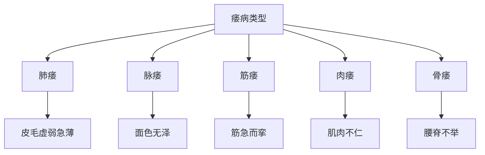

# 素问-痿论篇第四十四

> "黄帝问曰：五脏使人痿，何也？岐伯曰：肺主身之皮毛也，心主身之血脉也，肝主身之筋膜也，脾主身之肌肉也，肾主身之骨髓也。" - 岐伯

---

## 📜 原文（节选）/ Original Text (Excerpt)

黄帝问曰：五脏使人痿，何也？

岐伯曰：肺主身之皮毛也，心主身之血脉也，肝主身之筋膜也，脾主身之肌肉也，肾主身之骨髓也。

帝曰：其状何如？

岐伯曰：肺热者，则焦皮毛虚弱急薄，著则生痿躄也。心气热者，则下血脉虚，脉虚则血虚，血虚则经虚，经虚则脉不通，脉不通则血不流，血不流则色不泽，故面色无泽也。肝气热者，则胆泄口苦，筋膜干则筋急而挛，故为筋痿。脾气热者，则胃干而渴，肌肉不仁，故为肉痿。肾气热者，则腰脊不举，骨枯而髓减，故为骨痿。

---

## 📖 白话文翻译（节选）/ Modern Chinese Translation (Excerpt)

黄帝问道：五脏使人痿，为什么？

岐伯回答说：肺主管身体的皮毛，心主管身体的血脉，肝主管身体的筋膜，脾主管身体的肌肉，肾主管身体的骨髓。

黄帝说：它的状况如何？

岐伯说：肺热，则焦灼皮毛虚弱急薄，留滞就产生痿软。心气热，则下泄血脉虚，脉虚则血虚，血虚则经虚，经虚则脉不通，脉不通则血不流通，血不流通则色泽不润泽，所以面容没有光泽。肝气热，则胆泄口苦，筋膜干则筋脉拘急而挛缩，所以成为筋痿。脾气热，则胃干而口渴，肌肉不仁，所以成为肉痿。肾气热，则腰脊不能举起，骨头枯萎而骨髓衰减，所以成为骨痿。

---

## 🔑 核心要点 / Core Concepts

### 1. 五脏所主 / Five Zang What They Govern

| 脏 | 所主 |
|------|------|
| 肺 | 身之皮毛 |
| 心 | 身之血脉 |
| 肝 | 身之筋膜 |
| 脾 | 身之肌肉 |
| 肾 | 身之骨髓 |

### 2. 五脏致痿 / Five Zang Causing Flaccidity

| 脏 | 致痿原因 | 症状 |
|------|----------|------|
| 肺 | 肺热 | 焦皮毛虚弱急薄，著则生痿躄 |
| 心 | 心气热 | 下血脉虚，脉虚则血虚，经虚，脉不通，血不流，色不泽 |
| 肝 | 肝气热 | 胆泄口苦，筋膜干，筋急而挛，筋痿 |
| 脾 | 脾气热 | 胃干而渴，肌肉不仁，肉痿 |
| 肾 | 肾气热 | 腰脊不举，骨枯髓减，骨痿 |

### 3. 痿病类型 / Flaccidity Disease Types

---

## 📚 理论解释 / Theoretical Analysis

### 痿病理论 / Flaccidity Disease Theory

> [!info] 核心概念
- 五脏致痿
- 各脏所主不同
- 热邪伤脏，致痿

#### 五脏所主详解 / Detailed Five Zang What They Govern

**1. 肺主皮毛 / Lung Governs Skin Hair**
- 所主：身之皮毛
- 病机：肺热则焦灼皮毛

**2. 心主血脉 / Heart Governs Blood Vessels**
- 所主：身之血脉
- 病机：心气热则血脉下泄

**3. 肝主筋膜 / Liver Governs Tendon Membrane**
- 所主：身之筋膜
- 病机：肝气热则筋膜干

**4. 脾主肌肉 / Spleen Governs Muscle**
- 所主：身之肌肉
- 病机：脾气热则肌肉不仁

**5. 肾主骨髓 / Kidney Governs Bone Marrow**
- 所主：身之骨髓
- 病机：肾气热则骨髓衰减

### 五脏致痿理论 / Five Zang Causing Flaccidity Theory

> [!warning] 核心理念
- 五脏致痿，各有其因
- 热邪伤脏，致痿不同
- 治疗需辨证

#### 五脏致痿详解 / Detailed Five Zang Causing Flaccidity

**1. 肺致痿 / Lung Causing Flaccidity**
- 原因：肺热
- 病机：焦灼皮毛，虚弱急薄
- 结果：生痿躄

**2. 心致痿 / Heart Causing Flaccidity**
- 原因：心气热
- 病机：下血脉虚，脉虚血虚，经虚脉不通，血不流，色不泽
- 结果：面色无泽

**3. 肝致痿 / Liver Causing Flaccidity**
- 原因：肝气热
- 病机：胆泄口苦，筋膜干，筋急而挛
- 结果：筋痿

**4. 脾致痿 / Spleen Causing Flaccidity**
- 原因：脾气热
- 病机：胃干而渴，肌肉不仁
- 结果：肉痿

**5. 肾致痿 / Kidney Causing Flaccidity**
- 原因：肾气热
- 病机：腰脊不举，骨枯髓减
- 结果：骨痿

---

## 🏥 中医实践应用 / TCM Practice Application

### 痿病治疗 / Flaccidity Disease Treatment

#### 现代痿病治疗要点 / Modern Flaccidity Disease Treatment Key Points

**1. 肺痿治疗 / Lung Flaccidity Treatment**
- 症状：皮毛虚弱急薄，生痿躄
- 治法：清肺润燥
- 药物：清燥救肺汤、沙参麦冬汤
- 针刺：针刺肺俞、膏肓穴

**2. 心痿治疗 / Heart Flaccidity Treatment**
- 症状：面色无泽，血脉虚
- 治法：养血安神
- 药物：归脾汤、人参养荣汤
- 针刺：针刺心俞、膻中穴

**3. 肝痿治疗 / Liver Flaccidity Treatment**
- 症状：筋急而挛，口苦
- 治法：滋阴养肝
- 药物：虎潜丸、杞菊地黄丸
- 针刺：针刺肝俞、太冲穴

**4. 脾痿治疗 / Spleen Flaccidity Treatment**
- 症状：肌肉不仁，胃干渴
- 治法：健脾养胃
- 药物：参苓白术散、补中益气汤
- 针刺：针刺脾俞、胃俞穴

**5. 肾痿治疗 / Kidney Flaccidity Treatment**
- 症状：腰脊不举，骨枯髓减
- 治法：补肾填精
- 药物：左归丸、金匮肾气丸
- 针刺：针刺肾俞、命门穴

---

## 🔗 相关链接 / Related Links

- [[MOC-黄帝内经知识库]] - 主索引
- [[黄帝内经-素问索引]] - 素问索引
- [[黄帝内经-核心理论]] - 核心理论体系
- [[素问-痹论篇第四十三]] - 痹论
- [[素问-厥论篇第四十五]] - 厥论

### 易学关联 / Yi Jing Connection

- [[MOC-易经知识库]] - 易经索引
- [[20260201-0002 五行]] - 五行理论

**易学与痿论的联系:**
- 五行理论：易学的五行理论与中医五脏致痿相通
- 阴阳理论：易学的阴阳理论与中医痿病相通

---

## 💡 学习要点 / Learning Points

### 掌握重点 / Key Points to Master

- [ ] 理解五脏所主的关系
- [ ] 掌握五脏致痿的机理
- [ ] 学会痿病的治疗方法
- [ ] 了解五脏致痿的理论

### 思考问题 / Questions for Reflection

1. **为什么说"五脏使人痿，何也"？**
   - 五脏致痿：五脏致痿
   - 各有病因：各有其因
   - 治疗需辨证：治疗需辨证

2. **现代医学如何应用"痿论"？**
   - 痿病治疗：痿病治疗方法
   - 神经疾病：神经系统疾病治疗
   - 综合治疗：综合治疗方案

---

## 📊 学习进度 / Learning Progress

### 完成情况 / Completion Status

| 学习内容 | 状态 | 备注 |
|---------|------|------|
| 原文诵读 | 📝 进行中 | 建议每日诵读 |
| 白话文理解 | ✅ 已完成 | 理解主要含义 |
| 五脏所主 | ✅ 已完成 | 掌握关系 |
| 痿病治疗 | 📝 进行中 | 需要临床实践 |
| 理论分析 | ✅ 已完成 | 理解理论 |

---

## 🔄 更新日志 / Update Log

### 2026-02-03

- ✅ 创建痿论篇第四十四笔记
- ✅ 完成原文、白话文翻译（节选）
- ✅ 整理五脏所主和致痿对照表
- ✅ 编写五脏致痿理论

---

**笔记创建日期**：2026年2月3日

**最后更新**：2026年2月3日
