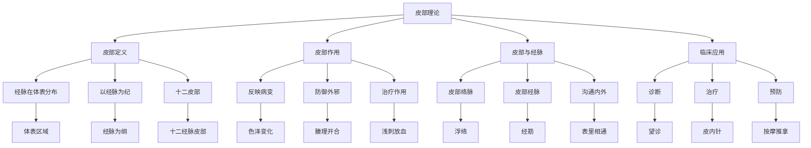

# 素问-皮部论篇第五十六

> "黄帝问曰：愿闻皮部。岐伯曰：皮者，脉之部也。" - 岐伯

---

## 📜 原文（节选）/ Original Text (Excerpt)

黄帝问曰：愿闻皮部。

岐伯曰：皮者，脉之部也。邪客于皮，则腠理开，开则邪入客于络脉。

帝曰：其部何如？

岐伯曰：欲知皮部，以经脉为纪。诸经皆然。

---

## 📖 白话文翻译（节选）/ Modern Chinese Translation (Excerpt)

黄帝问道：我愿意听到皮部的理论。

岐伯回答说：皮部，是经脉的部属。邪气停留在皮部，就会使腠理张开，张开后邪气就会进入络脉。

黄帝说：它的部属如何？

岐伯说：要知道皮部，以经脉为纲领。各经都是这样。

---

## 🔍 英文释义 / English Interpretation

Yellow Emperor asked: I would like to hear the theory of cutaneous regions.

Qibo replied: The cutaneous regions are the territories of the meridians. When pathogenic factors reside in the cutaneous regions, the pores open, and once open, the pathogens enter the collaterals.

Yellow Emperor said: What are their territories?

Qibo said: To know the cutaneous regions, use the meridians as the standard. All meridians are like this.

---

## 🔑 核心要点 / Core Concepts

### 1. 皮部概念 / Cutaneous Region Concept

| 概念 | 说明 | 作用 | 临床意义 |
|------|------|------|---------|
| 皮部 | 经脉在体表的分布区域 | 反映经脉病变 | 诊断依据 |
| 腠理 | 皮肤毛孔 | 邪气出入通道 | 防御屏障 |
| 络脉 | 浅层经脉 | 联系皮部与经脉 | 沟通桥梁 |

### 2. 十二皮部 / Twelve Cutaneous Regions

| 经脉 | 皮部 | 分布区域 | 相关病症 |
|------|------|---------|---------|
| 手太阴肺经 | 太阴之皮 | 上肢内侧前缘 | 咳嗽、气喘 |
| 手阳明大肠经 | 阳明之皮 | 上肢外侧前缘 | 腹泻、便秘 |
| 手少阴心经 | 少阴之皮 | 上肢内侧后缘 | 心悸、失眠 |
| 手太阳小肠经 | 太阳之皮 | 上肢外侧后缘 | 尿频、尿痛 |
| 手厥阴心包经 | 厥阴之皮 | 上肢内侧中间 | 心痛、胸闷 |
| 手少阳三焦经 | 少阳之皮 | 上肢外侧中间 | 耳鸣、偏头痛 |
| 足太阴脾经 | 太阴之皮 | 下肢内侧前缘 | 腹胀、便溏 |
| 足阳明胃经 | 阳明之皮 | 下肢外侧前缘 | 胃痛、呕吐 |
| 足少阴肾经 | 少阴之皮 | 下肢内侧后缘 | 腰痛、水肿 |
| 足太阳膀胱经 | 太阳之皮 | 下肢外侧后缘 | 尿闭、遗尿 |
| 足厥阴肝经 | 厥阴之皮 | 下肢内侧中间 | 头痛、眩晕 |
| 足少阳胆经 | 少阳之皮 | 下肢外侧中间 | 胆绞痛、口苦 |

### 3. 皮部理论 / Cutaneous Region Theory

---

## 📚 理论解释 / Theoretical Analysis

### 皮部理论 / Cutaneous Region Theory

> [!info] 核心概念
- 皮者，脉之部也
- 欲知皮部，以经脉为纪
- 邪客于皮，则腠理开

#### 皮部详解 / Detailed Cutaneous Regions

**1. 皮部定义 / Cutaneous Region Definition**
- **概念**：经脉在体表的分布区域
- **特点**：以经脉为纲，分布于体表
- **作用**：反映经脉病变，防御外邪
- **意义**：诊断和治疗的重要依据

**2. 皮部与经脉 / Cutaneous Regions and Meridians**
- **皮部络脉**：络脉浮于皮部
- **皮部经脉**：经脉分布于皮部
- **沟通内外**：皮部沟通表里内外
- **经脉为纪**：以经脉为皮部纲领

**3. 邪气客皮 / Pathogens Residing in Skin**
- **腠理开**：邪气停留在皮部，腠理张开
- **邪入络**：腠理开后，邪气进入络脉
- **传经脉**：络脉病久，传至经脉
- **入脏腑**：经脉病久，传入脏腑

### 腠理理论 / Pore Theory

> [!warning] 核心理念
- 腠理开合
- 邪气出入
- 防御屏障

#### 腠理理论详解 / Detailed Pore Theory

**1. 腠理功能 / Pore Functions**
- **防御外邪**：腠理闭合，防御外邪
- **调节体温**：腠理开合，调节体温
- **排泄汗液**：腠理张开，排泄汗液
- **呼吸交换**：皮肤腠理，呼吸交换

**2. 腠理开合 / Pore Opening and Closing**
- **正常开合**：根据需要开合腠理
- **开合失常**：开合失常导致病变
- **腠理不开**：腠理不开，邪气内伏
- **腠理不闭**：腠理不闭，外邪易入

**3. 腠理与疾病 / Pores and Diseases**
- **表证**：腠理开合失常，表证出现
- **汗证**：腠理开泄太过，汗证发生
- **寒证**：腠理闭合太紧，寒证形成
- **热证**：腠理开泄太过，热证产生

---

## 🏥 中医实践应用 / TCM Practice Application

### 皮部治疗 / Cutaneous Region Treatment

#### 现代皮部治疗应用 / Modern Cutaneous Region Treatment Application

**1. 望皮部诊断 / Observing Cutaneous Regions for Diagnosis**
- **色泽变化**：观察皮部色泽变化
- **形态变化**：观察皮部形态变化
- **温度变化**：触摸皮部温度变化
- **压痛反应**：按压皮部压痛反应

**2. 皮部刺法 / Cutaneous Region Needling**
- **皮内针**：留置于皮部皮下
- **梅花针**：叩刺皮部表面
- **放血疗法**：刺破浮络放血
- **穴位注射**：皮部穴位注射

**3. 皮部按摩 / Cutaneous Region Massage**
- **推法**：推动皮部气血
- **拿法**：拿捏皮部肌肉
- **揉法**：揉动皮部组织
- **拍法**：拍打皮部表面

**4. 皮部外治 / Cutaneous Region External Treatment**
- **贴敷疗法**：药物贴敷皮部
- **熏蒸疗法**：药液熏蒸皮部
- **热敷疗法**：热敷皮部患处
- **艾灸疗法**：艾灸皮部穴位

### 现代医学对应 / Modern Medicine Correspondence

| 中医概念 | 现代解剖 | 临床应用 |
|---------|---------|---------|
| 皮部 | 皮肤、皮下组织 | 皮肤诊断 |
| 腠理 | 毛孔、汗腺 | 体温调节 |
| 浮络 | 浅静脉、毛细血管 | 静脉穿刺 |
| 络脉 | 浅层神经 | 神经阻滞 |

---

## 🔗 相关链接 / Related Links

- [[MOC-黄帝内经知识库]] - 主索引
- [[黄帝内经-素问索引]] - 素问索引
- [[黄帝内经-核心理论]] - 核心理论体系
- [[素问-经络论篇第五十七]] - 经络论
- [[素问-气穴论篇第五十八]] - 气穴论
- [[灵枢-经脉第十]] - 经脉篇

### 易学关联 / Yi Jing Connection

- [[MOC-易经知识库]] - 易经索引
- [[20260201-0002 五行]] - 五行理论

**易学与皮部的联系:**
- 象外知内：易学的象数思维与皮部诊断相通
- 表里相应：易学的表里观念与皮部理论相通

---

## 💡 学习要点 / Learning Points

### 掌握重点 / Key Points to Master

- [ ] 理解皮部的概念和作用
- [ ] 掌握十二皮部的分布
- [ ] 学会皮部诊断的方法
- [ ] 了解皮部治疗的原理

### 思考问题 / Questions for Reflection

1. **为什么说"皮者，脉之部也"？**
   - 皮部为表：皮部是经脉在体表的表现
   - 以脉为纪：皮部以经脉为纲领
   - 反映病变：皮部反映经脉的病变

2. **现代医学如何应用"皮部论"？**
   - 皮肤诊断：观察皮肤色泽形态变化
   - 外治法：皮肤贴敷、熏蒸、艾灸
   - 神经反射：皮肤刺激反射调节内脏

---

## 📊 学习进度 / Learning Progress

### 完成情况 / Completion Status

| 学习内容 | 状态 | 备注 |
|---------|------|------|
| 原文诵读 | 📝 进行中 | 建议每日诵读 |
| 白话文理解 | ✅ 已完成 | 理解主要含义 |
| 皮部理论 | ✅ 已完成 | 掌握理论 |
| 十二皮部 | 📝 进行中 | 需要记忆 |
| 理论分析 | ✅ 已完成 | 理解理论 |

---

## 🔄 更新日志 / Update Log

### 2026-02-03

- ✅ 创建皮部论篇第五十六笔记
- ✅ 完成原文、白话文翻译（节选）
- 整理皮部概念和十二皮部对照表
- ✅ 编写皮部和腠理理论

---

**笔记创建日期**：2026年2月3日

**最后更新**：2026年2月3日
