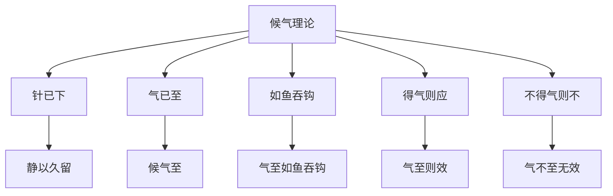

# 素问-离合真邪论篇第二十七

> "黄帝问曰：余闻九针于夫子，众多博大，不可胜数。余愿闻要道，以属子孙，传之后世。" - 黄帝

---

## 📜 原文（节选）/ Original Text (Excerpt)

黄帝问曰：余闻九针于夫子，众多博大，不可胜数。余愿闻要道，以属子孙，传之后世。

岐伯对曰：夫九针者，小之则无内，大之则无外，深不可及，浅不可得，往来之间，针行其上，以神会之，以候息动，以知其内。

黄帝曰：候气奈何？

岐伯曰：夫邪气之中人也，或中于阴，或中于阳，上下左右，无有恒常，其在于阳筋，其在于阴络，其在于阴筋，其在于阳络，其在于阴分，其在于阳分。

是以候之者，在于针下，静以久留，以候气至，气至而效，气不至无效。

黄帝曰：候气何如而至？何如而不至？

岐伯曰：针已下，气已至，如鱼吞钩，如得气则应，如不则不。

---

## 📖 白话文翻译（节选）/ Modern Chinese Translation (Excerpt)

黄帝问道：我听您讲九针的道理，众多博大，不可胜数。我希望听到其中的要道，用来传给子孙，传给后世。

岐伯回答说：九针，小则不能进入，大则不能外出，深则不能到达，浅则不能得到，往来之间，针行其上，用神气相会，以候息动，以知其内。

黄帝说：候气怎么样？

岐伯说：邪气中人，有的中于阴，有的中于阳，上下左右，没有恒常，它在阳筋，它在阴络，它在阴筋，它在阳络，它在阴分，它在阳分。

所以候气的，在于针下，静以久留，以候气至，气至则效，气不至无效。

黄帝说：候气怎样而至？怎样而不至？

岐伯说：针已下，气已至，如鱼吞钩，如得气则应，如不则不。

---

## 🔑 核心要点 / Core Concepts

### 1. 九针特点 / Nine Needles Characteristics

| 特点 | 含义 |
|------|------|
| 小之 | 无内 |
| 大之 | 无外 |
| 深 | 不可及 |
| 浅 | 不可得 |
| 往来 | 针行其上 |

### 2. 邪气中入部位 / Evil Qi Invasion Locations

| 邪气 | 部位 |
|------|------|
| 中于阴 | 阴分 |
| 中于阳 | 阳分 |
| 在阳筋 | 阳筋 |
| 在阴络 | 阴络 |
| 在阴筋 | 阴筋 |
| 在阳络 | 阳络 |

### 3. 候气理论 / Waiting for Qi Theory

---

## 📚 理论解释 / Theoretical Analysis

### 九针理论 / Nine Needles Theory

> [!info] 核心概念
- 九针大小深浅各有宜
- 九针往来之间
- 针行其上，以神会之

#### 九针详解 / Detailed Nine Needles

**1. 九针特点 / Nine Needles Characteristics**
- 小之则无内：小则不能进入
- 大之则无外：大则不能外出
- 深不可及：深则不能到达
- 浅不可得：浅则不能得到
- 往来之间：往来之间
- 针行其上：针行其上

**2. 九针应用 / Nine Needles Application**
- 以神会之：用神气相会
- 以候息动：以候息动
- 以知其内：以知其内

### 邪气中入理论 / Evil Qi Invasion Theory

> [!warning] 核心理念
- 邪气中人无常处
- 或中于阴，或中于阳
- 上下左右，无有恒常

#### 邪气中入详解 / Detailed Evil Qi Invasion

**1. 邪气中入部位 / Evil Qi Invasion Locations**
- 中于阴：邪气中于阴
- 中于阳：邪气中于阳
- 上下左右：上下左右
- 无有恒常：没有恒常

**2. 邪气所在部位 / Evil Qi Locations**
- 在阳筋：邪气在阳筋
- 在阴络：邪气在阴络
- 在阴筋：邪气在阴筋
- 在阳络：邪气在阳络
- 在阴分：邪气在阴分
- 在阳分：邪气在阳分

### 候气理论 / Waiting for Qi Theory

> [!note] 候气要领
- 候之在于针下
- 静以久留
- 气至而效

#### 候气详解 / Detailed Waiting for Qi

**1. 候气方法 / Waiting for Qi Method**
- 针已下：针已下
- 气已至：气已至
- 如鱼吞钩：如鱼吞钩
- 得气则应：得气则应
- 不得气则不：不得气则不

**2. 候气效果 / Waiting for Qi Effect**
- 静以久留：静以久留
- 候气至：候气至
- 气至而效：气至则效
- 气不至无效：气不至无效

---

## 🏥 中医实践应用 / TCM Practice Application

### 九针应用 / Nine Needles Application

#### 现代九针应用要点 / Modern Nine Needles Application Key Points

**1. 针具选择 / Needle Selection**
- 大小适中：大小适中
- 深浅适宜：深浅适宜
- 根据病情：根据病情选择

**2. 针刺手法 / Acupuncture Technique**
- 针行其上：针行其上
- 以神会之：以神会之
- 以候息动：以候息动

**3. 候气方法 / Waiting for Qi Method**
- 静以久留：静以久留
- 候气至：候气至
- 得气则应：得气则应

---

## 🔗 相关链接 / Related Links

- [[MOC-黄帝内经知识库]] - 主索引
- [[黄帝内经-素问索引]] - 素问索引
- [[黄帝内经-核心理论]] - 核心理论体系
- [[素问-八正神明论篇第二十六]] - 八正神明
- [[素问-通评虚实论篇第二十八]] - 通评虚实

### 易学关联 / Yi Jing Connection

- [[MOC-易经知识库]] - 易经索引
- [[20260201-0002 五行]] - 五行理论

**易学与离合真邪的联系:**
- 阴阳理论：易学的阴阳理论与中医真邪离合相通
- 邪正相争：易学的邪正理论与中医真邪离合相通

---

## 💡 学习要点 / Learning Points

### 掌握重点 / Key Points to Master

- [ ] 理解九针的特点
- [ ] 掌握邪气中入的部位
- [ ] 学会候气的方法
- [ ] 了解九针应用的方法

### 思考问题 / Questions for Reflection

1. **为什么说"如鱼吞钩"？**
   - 得气感觉：如鱼吞钩
   - 针下感觉：针下沉紧
   - 疗效显著：气至而效

2. **现代医学如何应用"候气理论"？**
   - 针刺得气：针刺得气的感觉
   - 疗效判断：根据得气判断疗效
   - 个体化治疗：根据个体情况调整

---

## 📊 学习进度 / Learning Progress

### 完成情况 / Completion Status

| 学习内容 | 状态 | 备注 |
|---------|------|------|
| 原文诵读 | 📝 进行中 | 建议每日诵读 |
| 白话文理解 | ✅ 已完成 | 理解主要含义 |
| 九针特点 | ✅ 已完成 | 掌握特点 |
| 候气方法 | 📝 进行中 | 需要临床实践 |
| 理论分析 | ✅ 已完成 | 理解理论 |

---

## 🔄 更新日志 / Update Log

### 2026-02-03

- ✅ 创建离合真邪论篇第二十七笔记
- ✅ 完成原文、白话文翻译（节选）
- ✅ 整理九针特点和邪气中入对照表
- ✅ 编写九针和候气理论

---

**笔记创建日期**：2026年2月3日

**最后更新**：2026年2月3日
