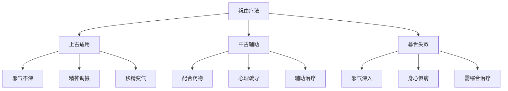

# 素问-移精变气论篇第十三

> "黄帝曰：其祝何如？岐伯曰：先巫者，因知百病之胜，先知其病之所从生者，可祝而已也。" - 岐伯

---

## 📜 原文（节选）/ Original Text (Excerpt)

黄帝问曰：余闻古之治病，惟其移精变气，可祝由而已。今世治病，毒药治其内，针石治其外，或愈或不愈，何也？

岐伯对曰：往古人居禽兽之间，动作以避寒，阴居以避暑，内无眷慕之累，外无伸宦之形，此恬憺之世，邪不能深入也。故毒药不能治其内，针石不能治其外，故可移精祝由而已。

当今之世不然，忧患缘其内，苦形伤其外，又失四时之从，逆寒暑之宜，贼风数至，虚邪朝夕，内至五脏骨髓，外伤空窍肌肤，所以小病必甚，大病必死，故祝由不能已也。

黄帝曰：善。余欲临病人，观死生，决嫌疑，欲知其要，如日月光，可得闻乎？

岐伯曰：色脉者，上帝之所贵也，先师之所传也。上古使僦贷季理色脉而通神明，合之金木水火土四时，八风六合，不离其常，然后所以移精变气，以祝由至神。故可得闻也。

夫色之变化，以应四时之脉，此上帝之所贵，以合乎神明也。所以远死而近生也，生道以长，命曰圣王。

中古之治病，至而治之，汤液十日，以去八风五痹之病。十日不已，治之草苏草荄之枝，本末为助，标本已得，邪气乃服。

暮世之治病，则不然，治不本四时，不知日月，不审逆从，病形已成，乃欲微针治其外，汤液治其内，粗工凶凶，以为可攻，故病未已，新病复起。

---

## 📖 白话文翻译（节选）/ Modern Chinese Translation (Excerpt)

黄帝问道：我听说古代治病，只是转移精神、变换气机，通过祝由就可以治愈。现在治病，用药物治疗内脏，用针石治疗外表，有的治愈了，有的没有治愈，这是为什么呢？

岐伯回答说：古代人们生活在禽兽之间，通过活动来避寒，住在阴凉处来避暑，内心没有眷恋羡慕的牵累，外表没有奔走求官的劳累，这是恬淡的时代，邪气不能深入。所以毒药不能治疗内脏的病，针石不能治疗外表的病，只需转移精神、运用祝由就可以治愈。

现在的情况不同了，内心有忧患的牵累，身体有劳苦的伤害，又不顺应四时气候，违背寒暑的适宜，贼风频繁侵袭，虚邪早晚都有，内伤五脏骨髓，外伤孔窍肌肤，所以小病一定会加重，大病一定会死亡，所以祝由不能治愈。

黄帝说：好。我想面对病人，观察生死，决断疑难，想知道其中的要领，像日月一样光明，可以听听吗？

岐伯说：气色和脉象，是上古帝王所重视的，是先师传授的。上古让僦贷季研究气色脉象而通达神明，结合金木水火土四时、八风六合，不离其常道，然后通过转移精神、变换气机，用祝由达到神妙的境界。所以可以听听。

气色的变化，对应四时的脉象，这是上帝所重视的，为了合乎神明。所以远离死亡而接近生存，生存之道得以长久，叫做圣王。

中古时代治病，病来了就治，用汤液十天，以祛除八风五痹的病。十天不好，用草药的枝叶，本末相助，标本得到，邪气就屈服了。

近世治病就不是这样，治疗不根据四时，不知道日月，不审查逆从，病形已经形成，才想用微针治疗外表，汤液治疗内脏，粗鲁的医生凶猛急躁，认为可以攻伐，所以旧病没有治愈，新病又产生了。

---

## 🔑 核心要点 / Core Concepts

### 1. 不同时代的生活与疾病 / Life and Disease in Different Eras

| 时代 | 生活特点 | 心理状态 | 疾病特点 | 治疗方法 |
|------|----------|----------|----------|----------|
| 上古 | 居禽兽间，动作避寒，阴居避暑 | 内无眷慕之累，外无伸宦之形 | 邪不能深入 | 移精变气，祝由 |
| 中古 | 生活复杂化 | 有忧患苦形 | 病来即治 | 汤液十日，草药 |
| 暮世 | 忧患缘内，苦形伤外，失四时之从 | 精神压力大 | 内至五脏骨髓，外伤空窍肌肤 | 毒药治内，针石治外 |

### 2. 祝由疗法 / Zhuyou Therapy

---

## 📚 理论解释 / Theoretical Analysis

### 移精变气理论 / Transferring Spirit and Transforming Qi Theory

> [!info] 核心概念
> 移精变气是通过转移精神、变换气机来治疗疾病的心理疗法。

#### 移精变气的机理 / Mechanism of Transferring Spirit and Transforming Qi

**1. 精神调摄 / Spiritual Regulation**
- 转移注意力，改变精神状态
- 调节情志，消除心理压力
- 恢复精神平衡，增强抗病能力

**2. 气机调畅 / Qi Mechanism Regulation**
- 调畅气机运行
- 恢复气血流通
- 祛除病邪，恢复健康

**3. 祝由仪式 / Zhuyou Ritual**
- 运用语言、符号、仪式
- 调动患者的信仰力量
- 激发自身治愈能力

### 祝由疗法的应用 / Application of Zhuyou Therapy

#### 适用条件 / Indications

**1. 上古时代 / Ancient Times**
- 邪气不深
- 心理单纯
- 信仰笃诚

**2. 现代应用 / Modern Application**
- 心身疾病
- 精神疾病
- 功能性疾病
- 配合药物治疗

#### 禁忌症 / Contraindications

**1. 邪气深入 / Deep Pathogen Invasion**
- 内至五脏骨髓
- 外伤空窍肌肤
- 病情严重

**2. 实质性病变 / Substantive Lesions**
- 器质性疾病
- 急性重症
- 感染性疾病

---

## 🏥 中医实践应用 / TCM Practice Application

### 现代心理治疗 / Modern Psychotherapy

#### 中医心理治疗方法 / TCM Psychotherapy Methods

| 方法 | 原理 | 适应症 | 操作要点 |
|------|------|----------|----------|
| 说理开导 | 讲道理，解心结 | 情志病、焦虑症 | 耐心倾听，循循善诱 |
| 顺情从欲 | 顺从患者意愿 | 抑郁症、强迫症 | 理解患者，满足合理需求 |
| 移情易性 | 转移注意力 | 痴呆症、精神分裂症 | 培养兴趣，转移注意力 |
| 暗示疗法 | 运用暗示力量 | 癔症、神经衰弱 | 建立信任，积极暗示 |
| 音乐疗法 | 音乐调畅情志 | 失眠、焦虑 | 选择适宜音乐，定时聆听 |

### 现代医学的启示 / Modern Medical Insights

**1. 心身医学 / Psychosomatic Medicine**
- 心理因素对疾病的影响
- 心理治疗的重要性
- 心身疾病的综合治疗

**2. 安慰剂效应 / Placebo Effect**
- 信仰和期望的作用
- 医患关系的重要性
- 心理暗示的治疗价值

**3. 循序渐进治疗 / Stepwise Treatment**
- 根据病情选择治疗方法
- 综合运用多种疗法
- 标本兼治

---

## 🔗 相关链接 / Related Links

- [[MOC-黄帝内经知识库]] - 主索引
- [[黄帝内经-素问索引]] - 素问索引
- [[黄帝内经-核心理论]] - 核心理论体系
- [[素问-汤液醪醴论篇第十四]] - 汤液醪醴

### 心理学关联 / Psychology Connection

- [[MOC-心理学知识库]] - 心理学索引
- [[20260201-0001 心理治疗]] - 心理治疗理论

**心理学与祝由疗法的联系:**
- 暗示疗法：现代心理暗示与祝由相通
- 心身医学：心理因素对身体健康的影响

---

## 💡 学习要点 / Learning Points

### 掌握重点 / Key Points to Master

- [ ] 理解移精变气的概念和机理
- [ ] 掌握祝由疗法的原理和适应症
- [ ] 了解不同时代治疗方法的变化
- [ ] 学会运用心理治疗方法

### 思考问题 / Questions for Reflection

1. **为什么祝由疗法在上古时代有效，现在却失效了？**
   - 上古时代邪气不深，病情简单
   - 现代时代邪气深入，病情复杂
   - 治疗方法需与时俱进

2. **现代医学如何看待祝由疗法？**
   - 视为心理治疗的一种形式
   - 研究其背后的心理机制
   - 合理运用，避免迷信

---

## 📊 学习进度 / Learning Progress

### 完成情况 / Completion Status

| 学习内容 | 状态 | 备注 |
|---------|------|------|
| 原文诵读 | 📝 进行中 | 建议每日诵读 |
| 白话文理解 | ✅ 已完成 | 理解主要含义 |
| 移精变气 | ✅ 已完成 | 掌握概念 |
| 祝由疗法 | 📝 进行中 | 需要实践体会 |
| 理论分析 | ✅ 已完成 | 理解心理治疗 |

---

## 🔄 更新日志 / Update Log

### 2026-02-03

- ✅ 创建移精变气论篇第十三笔记
- ✅ 完成原文、白话文翻译（节选）
- ✅ 整理不同时代的生活与疾病对照表
- ✅ 编写移精变气和祝由疗法理论

---

**笔记创建日期**：2026年2月3日

**最后更新**：2026年2月3日
